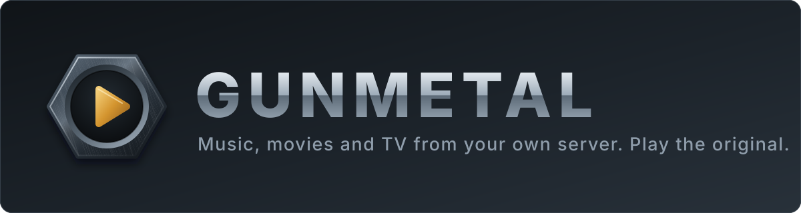
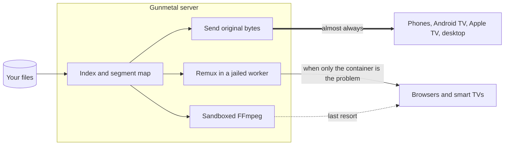

<p align="center">
  
</p>

<p align="center">
  <a href="https://git.taild1bbf.ts.net/PremierStudio/gunmetal/actions"></a>
  
  
  
  <a href="LICENSE"></a>
</p>

**Gunmetal is an open-source media server and player for music, movies and
TV.** It is built on one idea: your devices are fast enough to play your
files as they are, so the server should send the original and get out of the
way.

> [!WARNING]
> **Pre-alpha. The server cannot run your library yet.** What exists today
> is well past the first parser: the music formats are read (FLAC, MP3, MP4,
> Ogg/Opus/Vorbis, AIFF, APE), the security foundations are built (signed
> stream tokens, WebAuthn, pairing codes, the egress gate, the jailed worker
> sandbox, secrets storage), the server's session, verifier and access-policy
> layers exist, and a demo client with a working audio transport runs against
> a fake server. This README describes where the project is going; the
> [roadmap](#roadmap) shows exactly how far it has got.

## Why another media server

Media servers spend most of their effort converting your files into
something a weak player can handle. That costs a big CPU or GPU, it costs
quality, and it puts a large, privileged video toolchain in the path of every
file you own.

Gunmetal ships its own player on every platform it can, so the common case
is the cheap one: the server reads a file and sends the bytes.

| | The usual approach | Gunmetal's approach |
|---|---|---|
| **Playback** | Convert the file to suit the player | Ship a player that handles the file |
| **Server hardware** | Sized for transcoding | Sized for reading disks |
| **Untrusted media** | Parsed by a large C toolchain with the server's privileges | Parsed by memory-safe Rust; FFmpeg only for real transcodes, in a sandbox |
| **Browsing** | Every screen fetched from the server | Library synced to the device: instant, and works offline |
| **Sign-in** | Passwords, often a vendor account | Passkeys and OIDC, device keys, no central account |
| **Remote access** | Port forwarding or a vendor relay | Encrypted peer-to-peer, no open ports |
| **Music** | An add-on to a video server | A first-class player: gapless, loudness-normalised, offline |
| **Licence** | Varies | AGPL-3.0, no contributor agreement, cannot be closed later |

## How it works



1. **Index once.** At scan time the server reads each file's structure with
   its own parsers and stores where every keyframe is. Nothing is launched
   per file.
2. **Play the original.** Clients with our player (built on libmpv) take the
   file as it is. The server's job is a disk read and a network write.
3. **Remux before transcoding.** When a browser or TV can decode the video
   but not the container, a jailed worker repackages it without touching
   the picture or sound. This is cheap and lossless, and it never runs in
   the server process.
4. **Transcode as a last resort.** Only when nothing else works does FFmpeg
   run, in a sandboxed worker with no network and no access beyond the one
   file it was handed.

## What it will be made of

| Part | Built in | Job |
|---|---|---|
| **Core** | Rust crate | Container parsers, remuxer, playback decisions, protocol types. Compiled into everything below. |
| **Server** | Rust, single binary, SQLite | Indexes the library, serves bytes, remuxes in a jailed worker, supervises the transcode sandbox. |
| **Client** | React 19, TypeScript, Vite | The web app and the demo, built around a persistent player; react-native-web keeps one interface that can carry to phones and TVs. |
| **Mobile app** | React Native, TypeScript | Phones and tablets, with offline downloads and background playback. |
| **Site** | Cloudflare | Docs and landing page at [gunmetal.tv](https://gunmetal.tv). |

The reasoning behind each choice is in the
[architecture records](docs/adr).

## Roadmap

Music comes first: browsers and phones already play FLAC, MP3, AAC and Opus,
so a music library needs no remuxer and gets a usable release out soonest.

- [x] Workspace, quality gate and CI
- [x] Core: EBML primitives, the encoding underneath MKV and WebM
- [x] Core: FLAC, MP3, MP4 and Ogg metadata, artwork and loudness
- [x] Security foundations: signed stream tokens, WebAuthn, pairing codes,
      the egress address gate, the jailed worker sandbox, secrets storage
- [x] Server skeleton: sessions, the sign-in verifier, access policy,
      rate limiting, the stores
- [x] Demo client: audio transport, player interface and the declarative
      plugin model, against a fake server
- [ ] Core: Matroska and MP4 tracks, cues and the segment map
- [ ] Benchmark: scan time against Jellyfin on the same library
- [ ] Server: library scan, music model, sign-in, byte serving
- [ ] Web client: music library, queue and player
- [ ] Mobile and Android TV: direct play, offline, background audio
- [ ] Video: remuxer, sandboxed transcoding, movies and TV
- [ ] Remote access, Apple builds, Samsung and LG packaging
- [ ] Adapters so existing Jellyfin and Subsonic apps can connect
- [ ] M3U playlists and live TV

The performance claims above are design goals until that benchmark exists.
We will publish the numbers either way.

## Engineering standards

Every commit, from the first one, has to pass the same gate:

- **Test first.** The failing test is written and seen to fail before the
  code that satisfies it.
- **100% coverage** of lines, regions and functions, with no exclusions.
- **Zero surviving mutants.** The tests have to notice every change a
  mutation tool can make to the code. A mutant that hangs the tests counts
  as a failure too.
- **No panics on any input.** Malformed media comes back as a typed error
  that says what was wrong and where.
- **No `unsafe`** in the core.

The full rules are in [CONTRIBUTING.md](CONTRIBUTING.md).

## Building

You need Rust 1.85 or newer, plus
[cargo-llvm-cov](https://github.com/taiki-e/cargo-llvm-cov) and
[cargo-mutants](https://mutants.rs).

```bash
git clone https://git.taild1bbf.ts.net/PremierStudio/gunmetal.git
```

That host is on the Premier tailnet. The source of truth is Forgejo, not
GitHub, and CI runs on the project's own runners.

```bash
scripts/gate.sh
```

The gate runs the formatter, the linter, the tests with the coverage
requirement, and mutation testing. CI runs the same script. The Rust
workspace builds on Linux today: the jailed worker's sandbox uses
seccomp and landlock, which do not exist on macOS.

The clients need Node 24 and pnpm 12:

```bash
cd clients
pnpm install
pnpm demo      # the demo client, against its fake server
pnpm test      # vitest; playwright drives the e2e suite
```

## Repository layout

```
crates/                  the Rust workspace
  gunmetal-core          parsers, protocol types, domain logic (pure, no I/O)
  gunmetal-server        sessions, the sign-in verifier, access policy, routes
  gunmetal-egress        the outbound gate: address classes, grants, limits
  gunmetal-worker        the jailed worker: sandbox profile, IPC, limits
  gunmetal-secrets       AEAD, key derivation, nonces
  gunmetal-store         the SQLite catalog
  gunmetal-durable       the durable identity store
  gunmetal-http          request, routing, paging and credential plumbing
  gunmetal-fs            the SQLite pool, fingerprints, data roots
  gunmetal-wasm          plugin-component groundwork
  gunmetal-testkit       shared test helpers
  gunmetal-fuzz          fuzz targets
  xtask                  the supply-chain checks the gate runs
clients/                 the React workspace: web app, demo client, the fake
                         server it runs against, shared UI and port packages
docs/                    research, feature maps, plans, ADRs, security baseline
site/                    the gunmetal.tv pages
scripts/gate.sh          every quality gate, in one script
```

## Contributing

Read [CONTRIBUTING.md](CONTRIBUTING.md) first; the testing rules are strict
and are enforced by CI. Report security problems privately, as described in
[SECURITY.md](SECURITY.md).

## Licence

[AGPL-3.0-or-later](LICENSE). Contributions are accepted under the Developer
Certificate of Origin. There is no contributor licence agreement, so the
project cannot be relicensed or closed.
