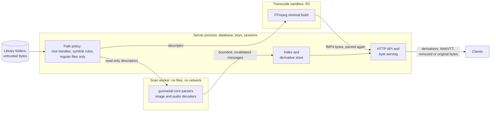

# Untrusted media and parser safety

Date: 2026-10-02
Status: proposed. Nothing here is implemented yet, except where a section
says the existing `gunmetal-core` code already does it.
Scope: every byte Gunmetal reads that someone else wrote. That covers media
files, embedded tags and pictures, sidecar files (artwork, lyrics, playlists,
CUE sheets, subtitles, NFO), uploads, provider downloads, live streams, and
the output of the transcoder. The requirements bind `gunmetal-core` (today
`crates/gunmetal-core/src/ebml.rs`), the server, the transcode sandbox and
the players inside the clients.

Standards and incidents were checked against primary sources on 2026-10-02
with web access. Anything that could not be checked is marked "(unverified)".

## Summary

A media server's scanner is an automatic indexer. It opens every file that
lands in a library, and those files often arrive through download automation
with nobody looking at them. Automatic parsing has a long record as a
zero-click attack surface: in 2016 a crafted music file exploited a GStreamer
decoder on Ubuntu when a user merely opened the folder that held it, and a
second exploit reached Fedora's Tracker indexer through a file Chrome had
downloaded on its own. Stagefright (2015) did the same to Android through MP4
sample tables. The 2026 advisories at Jellyfin and Navidrome show where
media servers fail today. The failures are mostly around the parser rather
than inside it: symlinks in a library served as tracks, names taken from
media used as filesystem paths, metadata pasted into FFmpeg command lines,
playlist entries pointing at private files, tags rendered as HTML, and
resize parameters that allocate 40 GB.

The design rests on seven decisions:

1. **The Rule of 2 holds by construction.** Chromium's rule says code may
   combine at most two of untrusted input, an unsafe implementation language
   and high privilege. Gunmetal links no C or C++ media, image, font or
   subtitle library into the server or the scan worker. FFmpeg runs only as
   an external program inside a sandbox, and a CI check enforces both rules.
2. **A strict parsing contract for `gunmetal-core`.** Every parser returns
   a typed error for malformed input and never panics, aborts or overflows
   the stack. Allocation is bounded by the bytes actually present, never by
   the size a file declares. Nesting depth, element counts and string
   lengths have fixed limits. Each parse has a deterministic work budget.
   All arithmetic on offsets and sizes is checked, and the code is correct
   on 32-bit targets. Lints, property tests, corpus replay on stable Rust
   and coverage-guided fuzzing in CI enforce all of this.
3. **Parse in a separate process from R1.** A single-threaded scan worker
   receives only open, read-only file descriptors. It runs under memory,
   CPU and time limits, and on Linux it has no filesystem or network access
   (Landlock and seccomp-bpf). If a file crashes or hangs the worker, that
   file is quarantined and the scan carries on. A file can never take the
   server down. This is the recommendation; the owner must confirm it (see
   the open decisions).
4. **The filesystem is accessed through capabilities.** All library access
   goes through handles opened once per library root, using `cap-std`,
   which uses `openat2` with `RESOLVE_BENEATH` on Linux. The rules are:
   - Only regular files are opened.
   - Files are classified by their content, not their name.
   - The server re-checks a file's identity before serving it.
   - Nothing is ever written into a library.
   - Symlinks are followed only within a root or into a target the admin
     has approved.
   - No name taken from media or from a request ever becomes a path.
5. **Clients get rebuilt data, not relayed bytes.** Clients receive
   artwork re-encoded by the server, WebVTT re-serialised from a typed cue
   model, and containers written by the remuxer. Original bytes go out only
   for direct play, with a fixed content type, `nosniff` and a sandboxing
   CSP.
6. **FFmpeg runs only in a sandbox (R2).** Its arguments come from typed
   values and its input and output are file descriptors. It runs with a
   protocol whitelist, from a minimal build. On Linux it is confined by
   seccomp, Landlock and resource limits, plus namespaces where they exist.
   If the required isolation is missing, the server fails closed and says
   so in plain words. On macOS and Windows, transcoding stays off by
   default until a platform sandbox exists.
7. **Fuzzing that fits a stable-only toolchain.** Fuzz harnesses are plain
   functions. The gate replays their corpora on stable Rust. Coverage-guided
   fuzzing with `cargo-fuzz` runs only in CI, on a pinned nightly toolchain
   inside ClusterFuzzLite: on every pull request and in nightly batches.
   `afl.rs` builds on stable for local runs. The project applies to
   OSS-Fuzz once it qualifies.

Most of this is invisible to the people using Gunmetal. It surfaces in
only three places, all for admins:

- a list of problem files, each with a plain-language reason and a retry
  button;
- a one-click prompt to let the scanner follow symlinks into a named
  folder;
- a health page that says whether the sandboxes are working.

Household members and TV users never see a security prompt. When a limit is
hit, the result is degraded rather than lost: a track keeps playing without
its 20,000-pixel cover.

This document has 82 live requirements: 55 R1, 2 R1.1, 0 R1.2, 0 R1.3, 22 R2, 2 R3 and 1 Later.

## Threats

| ID | Threat | Who (the attacker or failure) | Impact | Likelihood | Mitigated by (requirement IDs) |
|---|---|---|---|---|---|
| T-MED-01 | Memory corruption in a native media, image, font or subtitle library through a crafted file. Examples: Stagefright CVE-2015-1538, libwebp CVE-2023-4863, ImageIO CVE-2023-41064, FreeType CVE-2025-27363 and the 2016 GStreamer indexer exploits | The author of a file that reaches a library through downloads, shares or automation. Nobody has to press play, because the scanner reads every file | Code execution as the server user, which reaches the database, keys and every library, and gives a foothold on the home network | Medium | SEC-MED-018, 020, 022, 025, 026, 044, 063, 066 |
| T-MED-02 | A parser crashes, aborts, overflows the stack or hangs on malformed input, and does it again on every scan | Corrupt or truncated files (common), or a deliberate file | Server outage, a scan that never finishes, a crash loop after every restart | High | SEC-MED-001 to 008, 017, 018, 019, 021, 027 to 032, 079 |
| T-MED-03 | Allocation driven by a size or count declared in the file, such as a Vorbis comment count, MP4 sample count, ID3 tag size or EBML size | Malicious file | The process aborts on allocation failure or the kernel's OOM killer ends it | High | SEC-MED-003, 006, 010, 021 |
| T-MED-04 | Decompression and expansion bombs. Sources: zlib-compressed tag frames, PNG pixel floods, Matroska content compression, compressed MP4 headers, subtitle archives, and short files that decode to hours of audio | Malicious file or provider download | Memory, disk or CPU exhaustion | Medium | SEC-MED-007, 009, 021, 045, 055, 067 |
| T-MED-05 | A symlink or path escapes a library folder, so system files or Gunmetal's own files are served as tracks (Navidrome GHSA-r5qr-m328-qcf4, September 2026) | Anyone who can write into a library folder: a household member on an SMB share, a download client, an rsync or FTP user | Disclosure of the database, keys, configuration or other users' libraries | High | SEC-MED-012, 020, 033, 034, 036, 037, 038, 042, 043, 080 |
| T-MED-06 | A name taken from media or a request is used as a path. Examples: Matroska attachment names (CVE-2026-49246), the subtitle upload format field (CVE-2026-35031), playlist cover paths (GHSA-vwq6-xrw5-phpg) | A malicious file, or a user with upload or playlist rights | Arbitrary file write or read, chained to code execution | Medium | SEC-MED-039, 050, 051, 053, 054, 055, 061 |
| T-MED-07 | FFmpeg argument injection from file names, metadata or request parameters (CVE-2023-49096, its bypass CVE-2025-31499, CVE-2026-35033, CVE-2026-48793) | An unauthenticated or low-privilege requester, or anyone who can name a file in a library | File read through filters, file write, code execution | Medium from R2 | SEC-MED-063, 064, 065 |
| T-MED-08 | A compromised FFmpeg process reads files, opens the network, starts programs, persists, or attacks the server through its output | An attacker who has exploited an FFmpeg bug (T-MED-01) | Escape from the transcode path to the host | Medium from R2 | SEC-MED-023, 024, 066 to 070, 072, 073 |
| T-MED-09 | Media that makes the reader fetch something else. Examples: HLS playlists with the concat protocol (CVE-2016-1897), MP4 data references, Matroska linked segments and chapter codecs, ID3 picture links, playlist URLs and cover directives (GHSA-8hjf-6h34-82hr), SVG external references (Jellyfin GHSA-cf3c-8m59-2vhx) | A malicious file or playlist | SSRF into the home network, local file disclosure, memory exhaustion | Medium | SEC-MED-016, 044, 050, 056, 065, 074, 075, 076, 078 |
| T-MED-10 | Stored XSS through tags, lyrics, subtitles or comments (Navidrome CVE-2026-25578), or through a polyglot file served with a type the browser will sniff | A malicious file | Session theft and admin takeover through the web client | High | SEC-MED-013, 052, 057, 058, 059, 077 |
| T-MED-11 | Format confusion: the extension names one format and a sniffing decoder parses another (FORCEDENTRY, CVE-2021-30860) | A malicious file | Many more decoders are exposed than intended | Medium | SEC-MED-011, 044, 065 |
| T-MED-12 | Hostile subtitles and fonts reach client players ("Hacked in Translation", including CVE-2017-8310; FreeType CVE-2025-27363) | A subtitle author, or someone manipulating a provider's ranking | Code execution on viewers' devices | Medium from R2 | SEC-MED-052, 054, 055, 071, 076 |
| T-MED-13 | Original media bytes exploit a client device: direct play is the default, so the player parses the file. Another person's server can also send hostile data | A malicious file, or a hostile shared server | Phones, TVs and desktops are compromised | Medium | SEC-MED-046, 071, 076, 077 |
| T-MED-14 | Requests that amplify work: arbitrary resize sizes (Navidrome CVE-2026-25579 and its bypass GHSA-f22h-6qxh-rqq2), overlapping Range sets (CVE-2011-3192), unbounded cache growth | An authenticated user or the holder of a share link | Memory or disk exhaustion | High | SEC-MED-047, 048, 060 |
| T-MED-15 | Special files and slow storage: FIFOs, sockets or devices with media names, huge sparse files, hung network mounts | A library writer, or a flaky NAS | Scanner and stream threads block and the server stops responding | Medium | SEC-MED-010, 021, 035, 041 |
| T-MED-16 | Dangerous numeric metadata: absurd ReplayGain values, zero timescales, overflowing timestamps | A malicious or broken file | Extreme gain that can damage hearing or speakers, crashes, wrong seeks | Medium | SEC-MED-004, 014, 015, 049 |
| T-MED-17 | Log and display injection: control characters, terminal escapes, newlines or bidi overrides in names and tags | A malicious file or file name | Forged log lines and spoofed titles | Medium | SEC-MED-013, 040, 057, 062 |
| T-MED-18 | Privacy leaks through picture metadata, such as EXIF location in an uploaded or embedded photo | Unintended, or a curious user | The uploader's location is disclosed | Low | SEC-MED-046 |
| T-MED-19 | Vulnerable, unmaintained or unsafe-heavy parser dependencies, and a stale FFmpeg | Supply chain and neglect | Known exploits stay live | Medium | SEC-MED-025, 026, 070, 071 |
| T-MED-20 | The sandbox is silently missing or weakened (an old NAS kernel, container seccomp, a misconfiguration), so FFmpeg or the worker runs unconfined | The deployment environment | Every sandbox guarantee is lost and nobody knows | High | SEC-MED-024, 068, 073 |
| T-MED-21 | XML entity expansion or external entities in NFO, XSPF or XMLTV | A malicious sidecar, or a guide provider | Memory exhaustion, file disclosure, SSRF | Medium from R2 | SEC-MED-056 |
| T-MED-22 | Size truncation on 32-bit builds (the WASM web client and 32-bit ARM) | A malicious file | Wrong bounds checks and logic errors | Medium | SEC-MED-004 |
| T-MED-23 | Archive extraction from subtitle providers: zip slip, link entries, zip bombs | A provider, or someone tampering with the download | Files written outside the target, resource exhaustion | Medium from R2 | SEC-MED-055 |

## Requirements

"Limits table" below means the table in Design guidance section 3.
"Hostile test program" means a small test binary that tries forbidden
operations from inside a sandbox and reports each result.

| ID | Requirement | Standards | Release | Verified by |
|---|---|---|---|---|
| SEC-MED-001 | Every public parsing function in `gunmetal-core` must return `Ok` or a typed error for every possible input, and must not panic, abort or exhaust the stack. | OWASP Top 10:2025 A10; ASVS 5.0 16.5.3; CWE-248, CWE-617, CWE-674 | R1 | A property test per entry point over arbitrary bytes, run on a thread with a 256 KiB stack; corpus replay in `cargo test`; coverage-guided fuzzing (any crash fails CI). |
| SEC-MED-002 | Non-test code in `gunmetal-core` must compile with the Clippy lints `unwrap_used`, `expect_used`, `panic`, `unreachable`, `todo`, `unimplemented`, `indexing_slicing` and `arithmetic_side_effects` denied. The only allowed exception is an `#[expect(lint, reason = "...")]` that states the invariant, and a test must cover that invariant. | ASVS 5.0 1.4.1, 1.4.2; CWE-129, CWE-190; NIST SP 800-218 (SSDF 1.1) PW.5 | R1 | The gate's Clippy step (CI); review of every `#[expect]` in the pull request. |
| SEC-MED-003 | `gunmetal-core` must not size any allocation from a declared length or count except through one helper. The helper caps capacity at the smallest of: the declared value, the remaining input bytes divided by the minimum encoded size of one item, and the ceiling in the limits table. `Vec::with_capacity`, `Vec::reserve`, `String::with_capacity`, `Vec::resize` and `vec![x; n]` must be banned in the core, outside that helper, through Clippy `disallowed-methods` and `disallowed-macros`. | ASVS 5.0 5.2.1, 15.2.2; API4:2023; CWE-789, CWE-770, CWE-130, CWE-1284 | R1 | Clippy configuration (CI). Unit tests per format declare `u32::MAX` or `u64::MAX` counts inside inputs under 64 bytes, and assert both the exact error and a peak allocation under 1 MiB, measured by a counting allocator in tests. Fuzzing with an RSS limit. |
| SEC-MED-004 | Every offset, length and count derived from input must be combined with checked arithmetic and converted with fallible conversions (no `as` casts from `u64` to `usize`), and the core's tests must pass on a 32-bit target. | ASVS 5.0 1.4.2; CWE-190, CWE-681, CWE-197 | R1 | A CI job runs the core tests on `i686-unknown-linux-gnu` or `wasm32-wasip1`; property tests with sizes near `u64::MAX` and `usize::MAX`. |
| SEC-MED-005 | The core must count nesting depth for every nested structure and return a typed error past the maximum in the limits table: 32 for EBML master elements (including the recursive SimpleTag and ChapterAtom) and ISOBMFF boxes, 4 for ID3v2 CHAP and CTOC sub-frames, 64 for XML. It must use iteration or an explicit depth counter, never unbounded recursion. | ASVS 5.0 15.2.2; CWE-674 | R1 | Unit tests at the maximum depth (`Ok`) and at the maximum plus one (the exact error, with depth and offset); a property test that generates trees deeper than the limit on a small-stack thread. |
| SEC-MED-006 | The core must enforce the element-count, string-length, embedded-object-size and total-output limits in the limits table, and must report each breach as a typed error or as an explicit truncation flag on the result. | ASVS 5.0 2.2.1, 5.2.1; API4:2023; CWE-770, CWE-400 | R1 | Boundary unit tests at each limit and one past it. Mutation testing must kill every off-by-one mutant. |
| SEC-MED-007 | Every core parse must charge a deterministic step budget and fail with a budget error once the budget is spent. Steps must stay at or below k × input bytes + c, with k and c documented for each parser. | OWASP Top 10:2025 A10; CWE-834, CWE-835, CWE-606 | R1 | Property tests assert the step bound on arbitrary and on adversarial (highly repetitive) inputs; a unit test asserts the exact error when the budget runs out. |
| SEC-MED-008 | Every loop over elements, boxes, frames, pages or packets must strictly advance or stop. Zero-length structures and structures smaller than their own header must be errors. Every internal offset reference (SeekHead, Cues, MP4 chunk offsets) must be range-checked against the file size and followed with a visited set and a hop limit. | CWE-835, CWE-125, CWE-1284 | R1 | Unit tests for MP4 boxes of size 0, 1 and under 8, a SeekHead pointing at itself, a two-node SeekHead cycle, and out-of-range offsets; property tests with a termination ceiling (the `collect_all` pattern in `ebml.rs`). |
| SEC-MED-009 | All decompression must go through one streaming helper. That covers zlib in ID3v2 frames, PNG, Matroska ContentCompression and compressed MP4 headers. The helper must stop as soon as output exceeds the lower of the context's cap and the declared uncompressed size. Matroska bzlib and lzo1x compression must be rejected. | ASVS 5.0 5.2.3; CWE-409; RFC 9559 (ContentCompAlgo) | R1 | Unit tests with zlib bombs generated inside the test (1 KiB expanding to 1 GiB) assert the typed error and a peak allocation at most 64 KiB over the cap; a fuzz harness for the helper. |
| SEC-MED-010 | The core's sans-I/O interface must never request a read longer than 16 MiB or past the end of the file. The host reader must reject any longer request and must cap the bytes read per file for metadata at 256 MiB. | API4:2023; CWE-400, CWE-770 | R1 | Core unit tests on request sizes; an integration test with a host reader that records every request. |
| SEC-MED-011 | Formats must be detected from content signatures against a closed allowlist. The file extension may only select candidates to scan. A file whose content matches no allowlisted format must be skipped, never handed to a more general decoder. | ASVS 5.0 5.2.2; CWE-646, CWE-434 | R1 | Unit tests with mislabelled fixtures (a PNG named `.flac`, HTML named `.mp3`, a PDF named `.gif`) assert the result is unsupported; an integration test shows that a non-media file in a library is not indexed. |
| SEC-MED-012 | The server must serve bytes only for items that content detection indexed as an allowlisted media or sidecar type. | OWASP Top 10:2025 A01; ASVS 5.0 5.3.2; CWE-552 | R1 | An integration test puts a copy, a symlink and a hard link of a non-media file (configuration, database) in a library and asserts that none is indexed or streamable. This is the Navidrome GHSA-r5qr-m328-qcf4 scenario. |
| SEC-MED-013 | Text from media metadata must be decoded with invalid sequences replaced (UTF-8, UTF-16 with or without a BOM, Latin-1). C0 and C1 control characters other than tab and line feed must be removed, and the length must be capped after decoding. | ASVS 5.0 1.1.1, 1.5.3; CWE-176, CWE-150 | R1 | Property tests feed arbitrary bytes to each text decoder (no panic, output within the cap, no control characters); unit tests cover unpaired surrogates, odd-length UTF-16 and fields that hold only a BOM. |
| SEC-MED-014 | Identifiers (MusicBrainz IDs, ISRCs, barcodes) and numeric fields (sample rate, channels, timescales, durations, track numbers, ReplayGain and R128 gains and peaks) must be validated into typed values with documented ranges when parsed. Invalid values must be dropped with a recorded reason, and a zero divisor must never reach a division. | ASVS 5.0 2.2.1; CWE-20, CWE-369, CWE-1284 | R1 | Unit tests per field, including `NaN`, `inf`, `+1e308 dB`, an MBID of `../../x`, TimestampScale 0 and MP4 timescale 0. |
| SEC-MED-015 | The player must clamp gain taken from tags to the range −30 dB to +12 dB, must not apply positive gain when no valid peak value is known, and must not let applied gain push the recorded peak above full scale. | CWE-1284 | R1 | Unit tests of the core's gain decision over a grid of gain and peak values, including missing and invalid ones; a property test that the resulting peak never exceeds 1.0. |
| SEC-MED-016 | The server, scanner and sandboxes must never fetch, open or follow a URL or path found inside media or sidecar content. That includes ID3 W-frames and APIC `-->` links, playlist URLs, `#EXTALBUMARTURL` and `#EXTIMG` directives, NFO thumbnail URLs, MP4 data references and SVG references. Such values must be stored as inert text or dropped. | ASVS 5.0 1.3.6, 1.2.2; API7:2023; CWE-918, CWE-610 | R1 | An integration test scans a fixture library full of URL- and path-bearing metadata while a loopback HTTP listener and a filesystem shim count activity, and asserts zero connections and zero opens outside the scanned files. |
| SEC-MED-017 | When a limit or parse error affects an optional part of a file (artwork, lyrics, one tag, one chapter), the scanner must keep the rest of the file's metadata, must keep the file playable, and must record the skipped part with a plain-language reason that admins can see. | ASVS 5.0 16.5.2; OWASP Top 10:2025 A10 | R1 | An integration test with oversized artwork and malformed lyrics asserts the track is indexed and streamable and that the problem list shows both reasons. |
| SEC-MED-018 | Parsing of media, sidecars and artwork, image decoding and loudness analysis must run in separate worker processes, never in the server process. When a worker panics, aborts, overflows its stack, exceeds a resource limit or times out, the server must keep serving requests and finish the scan. | ASVS 5.0 15.2.5, 16.5.2; CWE-653, CWE-400 | R1 | Integration tests use test-only hooks, compiled behind a test feature, that make the worker crash, hang, over-allocate or recurse. They assert that HTTP stays responsive and that every other file is indexed. |
| SEC-MED-019 | A file that crashes or times out a worker twice in a row must be quarantined until its size or modification time changes or an admin retries it, and must appear in the admin problem list with the reason. | ASVS 5.0 16.5.2; CWE-400 | R1 | An integration test of the quarantine cycle; a component test of the problem list and its retry action. |
| SEC-MED-020 | The worker must receive input only as read-only file descriptors (handles on Windows) that the server opened under the path rules in SEC-MED-033 to 036, and must not open filesystem paths itself. | ASVS 5.0 5.3.2, 15.2.5; CWE-22, CWE-59 | R1 | An integration test asserts that every path open attempted inside the worker fails; unit tests of the descriptor-passing IPC. |
| SEC-MED-021 | Each worker must be single-threaded and must run with: a memory limit (cgroup v2 `memory.max` where delegated, otherwise `RLIMIT_AS`; default 512 MiB), `RLIMIT_CORE` 0, `RLIMIT_NOFILE` of 32 or less, a CPU-time limit, and a per-file wall-clock deadline that the server enforces (default 60 s for metadata and artwork, 300 s for loudness analysis). | ASVS 5.0 15.2.2; API4:2023; CWE-400, CWE-770 | R1 | An integration test in which a test hook reports the worker's limits and thread count, plus a test asserting that a hung worker is killed at its deadline. |
| SEC-MED-022 | On Linux the worker must, in order: set `no_new_privs`; apply a Landlock ruleset that grants no filesystem access, plus TCP and UDP restrictions and abstract-socket and signal scoping where the kernel's ABI supports them; then apply a seccomp-bpf allowlist, where the architecture supports it, whose default action kills the process and which excludes socket creation, `execve`, `clone`/`fork`, `ptrace` and `mount`. The minimum per feature is the isolation table of SEC-MED-024. | ASVS 5.0 15.2.5; CWE-250, CWE-653 | R1 | Integration tests in which a test-hook worker tries each forbidden action (opening `/etc/hostname`, connecting to a loopback listener, running `/bin/true`, forking, `ptrace`) and assert the exact outcome (`EACCES`, `EPERM` or `SIGSYS`); a CI matrix job on a kernel without Landlock asserts the reduced tier instead of skipping |
| SEC-MED-023 | The server must treat messages from workers and sandboxes as untrusted. It must cap the frame size at 32 MiB, decode with the core's limits, and revalidate every string, number and enum before storing it. | ASVS 5.0 1.5.2; CWE-502, CWE-20 | R1 | A fuzz harness for the IPC decoder; property tests. |
| SEC-MED-024 | At startup and on demand, the server must self-test each sandbox profile, show the resulting isolation tier in plain language on the admin health page and in `doctor`, and apply this table. Memory-safe core parsing (scanning, artwork re-encoding, loudness) requires process separation, rlimits and `no_new_privs`, adds seccomp, Landlock and namespaces where available, and shows a "reduced isolation" notice when any of those is missing. Native decoders and FFmpeg require the full jail and are otherwise off. No setting may run jailed work unconfined, and ARMv7 is claimed as supported only once its seccomp answer (open decision 8) is recorded. | ASVS 5.0 16.5.3; OWASP Top 10:2025 A02; CWE-1188, CWE-693 | R1 | Probe-injection integration tests per table row asserting that the feature stays on or goes off and the exact health-page text; CI matrix job on a kernel without Landlock |
| SEC-MED-025 | The server and worker binaries must not link C or C++ media, image, font or subtitle libraries: FFmpeg or libav*, libwebp, libpng, libjpeg-turbo, libtiff, libheif, dav1d, ImageMagick, GraphicsMagick, librsvg, GStreamer, TagLib, FreeType, HarfBuzz or libass. Such code may run only as an external program inside the sandbox. | Chromium Rule of 2; ASVS 5.0 15.2.5; OWASP Top 10:2025 A03; CWE-1395 | R1 | A `cargo-deny` bans list in CI covering the binding and `-sys` crates; a CI check of the release binary's dynamic dependencies (`ldd` or `otool -L`) against an allowlist. |
| SEC-MED-026 | A third-party crate that parses or decodes media must be admitted only after a recorded review. The review must show that the crate forbids `unsafe` or confines it to reviewed SIMD or FFI code, that it is fuzzed, and that it exposes resource limits, which Gunmetal must configure. The crate must be pinned in `Cargo.lock` and wrapped by a Gunmetal function that is itself fuzzed. | ASVS 5.0 15.1.4, 15.2.1; SSDF 1.1 PW.4; CWE-1104, CWE-1357 | R1 | A review record in the pull request that adds the dependency; `cargo-deny` for sources, licences and advisories in CI; fuzz harnesses for the wrappers. |
| SEC-MED-027 | Every public parsing entry point in `gunmetal-core` must have a fuzz harness whose body is a plain function callable from stable `cargo test`. The same applies to the IPC decoder, the HTTP Range parser and the lyrics, playlist and CUE parsers. CI must fail when a parser module has no registered harness. | SSDF 1.1 PW.8; CWE-20 | R1 | A CI check, or a unit test, that compares the harness registry with the parser modules. |
| SEC-MED-028 | `cargo test` on stable must replay the committed corpus of every harness and every reproducer from past findings, inside `scripts/gate.sh`. | SSDF 1.1 PW.8 | R1 | The gate run; the coverage report shows the harness code executed. |
| SEC-MED-029 | Coverage-guided fuzzing must run on every pull request that changes `gunmetal-core` (at least 10 minutes per affected harness) and every night (at least one CPU-hour per harness), with a 5 s per-input timeout and a 1 GiB RSS limit. Any crash, timeout or out-of-memory finding must fail the job. | SSDF 1.1 PW.8, RV.1; CWE-400 | R1 | Review of the CI workflow; a canary harness with a planted bug in a test-only crate proves that the job fails. |
| SEC-MED-030 | Each fuzzing finding must be fixed test-first. The minimised reproducer is committed to the corpus, and a named unit test asserting the exact typed error must be seen failing before the fix lands. | SSDF 1.1 RV.2, RV.3 | R1 | The pull request review checklist; corpus replay (SEC-MED-028). |
| SEC-MED-031 | Each container format must also be fuzzed by a structure-aware generator that emits valid framing around mutated fields: FLAC, ID3v2, MP4 audio and Ogg in R1; Matroska and MP4 video when they arrive. | SSDF 1.1 PW.8 | R1 | Entries in the harness registry; manual review of the code that fuzz coverage reports reach. |
| SEC-MED-032 | Wherever Gunmetal writes a format (remuxer output, WebVTT, IPC messages), a property test must show that parsing the output reproduces the typed model, and the writer must be fuzzed from arbitrary typed models. | SSDF 1.1 PW.8; RFC 9559 section 26 | R2 | Property tests and fuzz harnesses. |
| SEC-MED-033 | All library access must go through directory handles opened once per configured root (`cap-std` `Dir`, which uses `openat2` with `RESOLVE_BENEATH` on Linux 5.6 and later). Path-based `std::fs` functions must be banned outside the filesystem module through Clippy `disallowed-methods`. | ASVS 5.0 5.3.2; OWASP Top 10:2025 A01; CWE-22, CWE-73 | R1 | The Clippy configuration (CI); integration tests with `..`, absolute-path and escaping-symlink fixtures. |
| SEC-MED-034 | A symlink must be followed only when its whole chain resolves beneath the same library root, or beneath an extra target root the admin has approved for that library. A link into another library's root, or anywhere else, must be skipped and listed with its reason. The problem list must group skipped links by target root and offer one-click approval of that target root for the library, followed by a rescan. | ASVS 5.0 5.3.2; CWE-59, CWE-61 | R1 | Integration tests: `passwd.wav` linking to `/etc/passwd`; a link to the database; a chain whose intermediate link has an audio name; an absolute link into an approved root (followed); a link into another library (skipped); integration test of the one-click approval and rescan |
| SEC-MED-035 | The server must open files with `O_NONBLOCK`, `O_NOCTTY` and `O_CLOEXEC` (or the platform equivalents), check the file type on the open handle, and skip anything that is not a regular file. | CWE-400, CWE-67 | R1 | Integration tests with a FIFO named `track.flac` and a Unix socket named `cover.jpg`: the scan finishes and lists both as skipped. |
| SEC-MED-036 | Before serving bytes, the server must open the item beneath its root and confirm that its device and inode (the file ID on Windows), size and modification time match the index. On a mismatch it must refuse the request and queue a rescan. | ASVS 5.0 15.4.2; CWE-367 | R1 | An integration test swaps a scanned file for a different file, and for a symlink, between the scan and the request. |
| SEC-MED-037 | The server must refuse a library root that is a filesystem root or a system directory, or that equals, contains or lies inside its own data, cache, configuration or log directories. The folder picker must show the reason. | OWASP Top 10:2025 A02; CWE-552, CWE-22 | R1 | Unit tests of the path-relation function with Linux, macOS and Windows cases; an API test. |
| SEC-MED-038 | The server must open library content read-only and must not create, modify, rename or delete anything inside a library root. | OWASP Top 10:2025 A01; CWE-732 | R1 | Clippy `disallowed-methods` for write-capable open options in the filesystem module; an integration test runs a scan and playback against a library without write permission and asserts, with an inotify watch, that nothing changed. |
| SEC-MED-039 | Names from media, metadata, clients or uploads must never be used as path components. These include attachment file names, subtitle format fields, tag text, playlist titles and upload file names. Every file the server writes must be named by a content hash or random ID inside its data directory. | ASVS 5.0 5.3.2; CWE-22, CWE-73 | R1 | Unit tests of a derived-path type that can only be built from a hash or an ID; integration tests with Jellyfin-style payloads (attachment `../../etc/cron.d/x`, subtitle format `../../x`). |
| SEC-MED-040 | The server must keep file names as raw bytes for access, and must derive display names by lossy decoding with control characters escaped. | CWE-176, CWE-150 | R1 | An integration test with non-UTF-8 file names and names containing newlines and escape characters. |
| SEC-MED-041 | Blocking filesystem calls must run on a bounded pool with per-root concurrency limits, so a hung mount stalls only that root's scans and streams. After two lost workers on one root, the scan of that root must pause with a "storage not responding" status. | ASVS 5.0 15.4.4, 16.5.2; CWE-400 | R1 | An integration test against a fault-injecting filesystem (FUSE in CI) whose reads block. |
| SEC-MED-042 | The official container image and example compose file must run as a non-root user, with all capabilities dropped, `no-new-privileges` set, a read-only root filesystem, and library folders mounted read-only. | ASVS 5.0 15.2.5; OWASP Top 10:2025 A02; CWE-250 | R1 | A CI test starts the image and asserts a non-zero UID, `CapEff` of 0 and `NoNewPrivs` of 1 from `/proc/self/status`; a lint of the compose file for `:ro` on library mounts. |
| SEC-MED-043 | Windows server builds must reject alternate data stream syntax, reserved device names, and reparse points that lead out of a root, under the same tests as SEC-MED-033 to 035. This binds the first Windows server build, if that comes before R2. | CWE-67, CWE-59 | R2 | Integration tests on a Windows CI runner. |
| SEC-MED-044 | Artwork decoding must accept only JPEG, PNG, WebP and the first frame of a GIF. It must not decode SVG, TIFF, BMP, ICO, HEIC or HEIF, AVIF, JPEG XL or PDF. | ASVS 5.0 5.2.2, 1.3.4; CWE-434, CWE-646 | R1 | Unit tests per rejected format (the result is unsupported); an SVG fixture with external references causes no file or network access. |
| SEC-MED-045 | Image width and height must be read from the header and checked before any pixel buffer is allocated: at most 16,384 pixels per side, at most 64 megapixels in area, and at most 32 MiB encoded. Decoding must run with `image::Limits` set (`max_alloc` 256 MiB). | ASVS 5.0 5.2.6, 5.2.1; CWE-400, CWE-789 | R1 | Unit tests with crafted 65,535 × 65,535 PNG, JPEG and WebP headers built inside the test assert the typed error and a peak allocation under 1 MiB. |
| SEC-MED-046 | Clients must receive only derivatives the server generated: re-encoded at a fixed set of sizes, with EXIF, XMP, ICC and text chunks stripped. Original artwork bytes must never be served to clients. | ASVS 5.0 5.2.2, 3.2.1; CWE-212 | R1 | API tests decode each derivative and assert no metadata chunks and dimensions from the size set; a route-inventory test asserts that no endpoint returns original artwork. |
| SEC-MED-047 | Image endpoints must accept a size only from a fixed enumeration, and must reject any other value with 400. | ASVS 5.0 2.2.1; API4:2023; CWE-1284 | R1 | API tests with −100000, 0, 2^31, `abc`, and size and square combinations (Navidrome CVE-2026-25579 and GHSA-f22h-6qxh-rqq2). |
| SEC-MED-048 | The derivative cache must be bounded in total bytes, keyed by content hash and size, and evicted least-recently-used first. | ASVS 5.0 15.2.2; CWE-400 | R1 | An integration test that pushes the cache past its bound. |
| SEC-MED-049 | LRC, enhanced LRC, ID3 USLT and SYLT, and Vorbis LYRICS data must be parsed into a typed model within the limits table (1 MiB, 20,000 lines, 4 KiB per line, timestamps up to 24 h with checked arithmetic, the offset tag clamped to ±1 h), and must be displayed only as text. | CWE-20, CWE-190, CWE-79 | R1 | A fuzz harness; property tests; unit tests at each limit. |
| SEC-MED-050 | Entries in M3U, M3U8, PLS and CUE files found in a library must resolve only to items already indexed in the same library, by normalised relative path. URLs, absolute paths outside that library, `..` escapes and artwork directives must be dropped and reported. | ASVS 5.0 5.3.2, 1.3.6; CWE-22, CWE-918, CWE-610 | R1.1 | Integration tests with fixture playlists that reference `/etc/passwd`, `file:///`, `http://169.254.169.254/`, `../other-library/x.flac` and `#EXTALBUMARTURL` (Navidrome GHSA-vwq6-xrw5-phpg and GHSA-8hjf-6h34-82hr). |
| SEC-MED-051 | Playlist entries, lyrics and artwork must be returned only for items in libraries the requesting user can access. Access must be evaluated at request time with the requester's own permissions, including through share links. | ASVS 5.0 8.2.2, 8.3.3; API1:2023; OWASP Top 10:2025 A01; CWE-639 | R1 | Integration tests with two users and two libraries (Navidrome GHSA-pcjv-h48m-833g and GHSA-vwq6-xrw5-phpg). |
| SEC-MED-052 | SRT, WebVTT and ASS/SSA subtitles must be parsed into a typed cue model within the limits table (10 MiB, 200,000 cues, 16 KiB per cue, timestamps up to 48 h). WebVTT for browsers must be produced by re-serialising that model with only `b`, `i` and `u` markup. | ASVS 5.0 1.3.5; CWE-79, CWE-20 | R2 | A fuzz harness; a property test that serialising and re-parsing is stable; a component test that cue text containing `<script>` renders inert. |
| SEC-MED-053 | Sidecar subtitles must be discovered only as regular files in the media file's own directory under the same root, matched by base name, and never through a path taken from metadata. | ASVS 5.0 5.3.2; CWE-22, CWE-73 | R2 | Integration tests with subtitle-path tags and with sidecars that are links pointing out of the directory. |
| SEC-MED-054 | The server must never decode with native code, or write to disk, Matroska attachments. By default it must not deliver embedded fonts, and clients render ASS subtitles with a bundled, pinned font set. A library may opt in to embedded fonts; each font is then parsed and re-serialised (subset and rewrite) by a memory-safe font parser in the parse worker before delivery, never passed through. Other attachments are not delivered. | RFC 9559 section 26; ASVS 5.2.2; CWE-22, CWE-434 | R2 | Integration test with an attachment named `../../etc/cron.d/x` (Jellyfin CVE-2026-49246); corpus test that a malformed-font MKV yields no font bytes to the client by default and, with the opt-in, only bytes produced by the re-serialiser |
| SEC-MED-055 | Archives, such as subtitle zips from providers, must be read in memory with caps on entry count, per-entry size and total decompressed size. Entry names must be ignored, link entries rejected, and nothing extracted to disk. | ASVS 5.0 5.2.3, 5.2.5, 5.3.3; CWE-22, CWE-409 | R2 | Unit tests with zip slip, link-entry and zip bomb fixtures generated inside the tests. |
| SEC-MED-056 | XML inputs (NFO in R2, XSPF later, XMLTV in R3) must be parsed without DTD processing. A document containing a DOCTYPE must be rejected. Size, depth (64) and element count must be limited. | ASVS 5.0 1.5.1; CWE-611, CWE-776 | R2 | Unit tests with billion-laughs, external-entity and external-DTD fixtures; a fuzz harness. |
| SEC-MED-057 | Clients must render media-derived strings only as text nodes inside a bidirectional isolate. The web client's lint must fail on `dangerouslySetInnerHTML`, on `innerHTML`, and on WebViews that render HTML. | ASVS 5.0 3.2.2, 1.2.1; OWASP Top 10:2025 A05; CWE-79, CWE-451 | R1 | An ESLint rule (`react/no-danger`) set to error in CI; component tests with tags containing ``, `javascript:` URLs and U+202E. |
| SEC-MED-058 | A URL from metadata may be shown as a link only after it has been parsed and its scheme is `http` or `https`. The link must open with `rel="noopener noreferrer"`, and every other URL must be shown as plain text. | ASVS 5.0 1.2.2; CWE-79 | R1 | Component tests with `javascript:`, `data:`, `file:` and mixed-case scheme URLs. |
| SEC-MED-059 | Byte-serving responses must carry: a `Content-Type` taken from the format detected at scan time (from an allowlist, otherwise `application/octet-stream`); `X-Content-Type-Options: nosniff`; and `Content-Security-Policy: sandbox`. Download responses must also carry `Content-Disposition: attachment` with a server-generated filename encoded as RFC 6266 requires. | ASVS 5.0 4.1.1, 3.4.4, 3.2.1, 5.4.1, 5.4.2; RFC 6266; CWE-79, CWE-434 | R1 | API tests serve a valid MP3 with HTML appended (a polyglot) and assert the headers; a filename test with quotes, newlines and non-ASCII titles. |
| SEC-MED-060 | The Range parser must accept at most one byte range per request and serve the full representation otherwise. It must use checked arithmetic and answer an unsatisfiable range with 416. | RFC 9110 sections 14.2 and 17.15; API4:2023; CWE-400, CWE-190 | R1 | Property tests on the parser; API tests that include the overlapping-range pattern of CVE-2011-3192. |
| SEC-MED-061 | Uploaded artwork, lyrics and subtitles must be size-capped while they stream in, detected by content, parsed with the same parsers and limits, and stored by content hash in the data directory, never in a library folder. This binds from the first release that accepts uploads (avatars in R1). | ASVS 5.0 5.2.1, 5.2.2, 5.3.1, 5.3.2; CWE-434, CWE-22 | R1.1 | API tests that include a format field like the one in Jellyfin CVE-2026-35031 and a body over the limit. |
| SEC-MED-062 | Media-derived strings and paths written to logs must be escaped (control characters, ANSI escapes, newlines) and length-capped. | ASVS 5.0 16.4.1; CWE-117, CWE-150 | R1 | Unit tests of the log field formatter. |
| SEC-MED-063 | The server must not start any external program except through the sandbox launcher. `std::process::Command::new` must be banned outside the sandbox module. | ASVS 5.0 15.2.5, 1.2.5; CWE-78, CWE-653, CWE-77 | R1 | Clippy `disallowed-methods` in CI, plus a CI check that the only exception sits in the sandbox module. |
| SEC-MED-064 | FFmpeg command lines must be built only from typed values (enumerated codecs, formats and filters, integer parameters), with no string pass-through. They must contain no path, file name, URL or metadata text, and input and output must be file descriptors. | ASVS 5.0 1.2.5; OWASP Top 10:2025 A05; CWE-88 | R2 | A property test over every builder input asserts that each argument matches the allowlisted grammar; unit tests replay the patterns of CVE-2023-49096, CVE-2025-31499, CVE-2026-35033 and CVE-2026-48793. |
| SEC-MED-065 | Every FFmpeg run must set `protocol_whitelist` to `fd` and `pipe` only, name the input format explicitly from the core's detection, pass `-nostdin`, and start with an empty environment. | ASVS 5.0 1.3.6; CWE-610, CWE-918 | R2 | An integration test with an HLS playlist disguised as `.mkv` that uses concat and file references asserts no file access and no network (CVE-2016-1897). |
| SEC-MED-066 | On Linux, FFmpeg must run with `no_new_privs` and three confinement layers. Landlock must allow nothing except executing the FFmpeg binary (plus the GPU render node when that is enabled). Landlock network and scope restrictions must apply where the kernel supports them. A seccomp-bpf allowlist with a default kill action must deny socket creation, `ptrace`, `mount`, and any process creation other than threads (`clone3` answered with `ENOSYS`). | ASVS 5.0 15.2.5; CWE-250, CWE-653 | R2 | The hostile test program runs in place of FFmpeg and tries to open a file, create a socket, exec, fork, `ptrace` and write a file; each exact denial is asserted. The CI kernel's Landlock support is asserted, not assumed. |
| SEC-MED-067 | Each transcode must run with `RLIMIT_CORE` 0, `RLIMIT_FSIZE` 0, a small `RLIMIT_NOFILE`, a memory limit (cgroup v2 or `RLIMIT_AS`), a CPU-time limit, and a wall-clock watchdog that kills the whole process group. The server must reap the process. | API4:2023; CWE-400, CWE-404 | R2 | Integration tests: the hostile test program writes a file (gets `EFBIG` or `SIGXFSZ`), sleeps forever (killed at the deadline), and leaves no zombie. |
| SEC-MED-068 | When unprivileged user namespaces are available, the transcode sandbox must also use new user, network, mount, PID and IPC namespaces with an empty root. The health page must say when they are unavailable, for example inside Docker. | ASVS 5.0 15.2.5; CWE-653 | R2 | An integration test on a runner with user namespaces (no network interfaces, empty mount table), and a test with them disabled that checks the status text. |
| SEC-MED-069 | FFmpeg's output stream and log must be parsed by the core, with limits, before anything reaches a client or the log. | ASVS 5.0 1.5.2; CWE-20, CWE-117 | R2 | A fuzz harness on the input to the fragmented-MP4 segmenter; unit tests for log truncation and escaping. |
| SEC-MED-070 | The bundled FFmpeg must be built with `--disable-everything`, `--disable-network` and `--disable-autodetect` plus an explicit allowlist of components. CI must fail if the binary's demuxer, decoder, encoder, filter or protocol list differs from the committed allowlist. | ASVS 5.0 15.2.5, 15.1.5; SSDF 1.1 PW.6; CWE-1395 | R2 | A CI job that diffs `ffmpeg -hide_banner -demuxers`, `-decoders`, `-encoders`, `-filters` and `-protocols` against the allowlist. |
| SEC-MED-071 | The bundled FFmpeg and the clients' media stacks (libmpv, FFmpeg, libass, FreeType, HarfBuzz) must be updated within the documented window after any security release that affects an enabled component. | ASVS 5.0 15.1.1, 15.2.1; MASVS-CODE-3; CWE-1395 | R2 | A scheduled CI job that compares bundled versions with upstream releases and fails when the window is exceeded; the release checklist. |
| SEC-MED-072 | Hardware-accelerated transcoding must be off by default. When enabled, it must grant access only to render nodes (`/dev/dri/renderD*`) and the driver files they need, never to card or control nodes. | ASVS 5.0 15.2.5; CWE-250 | R2 | Unit tests on the generated sandbox profile; an integration test on a GPU runner, or a recorded manual test where none exists. |
| SEC-MED-073 | On macOS and Windows hosts, FFmpeg must run as a separate process under resource limits and the platform sandbox: a deny-by-default Seatbelt profile on macOS; an AppContainer or LPAC token inside a job object on Windows. Until that sandbox exists on a platform, transcoding there must be off by default, and the health page must say isolation is reduced. | ASVS 5.0 15.2.5, 16.5.3; CWE-653 | R2 | Integration tests on macOS and Windows CI runners using the hostile test program. |
| SEC-MED-074 | The remuxer must write containers from the typed model only. It must drop unknown elements and boxes, and never emit or follow external data references (MP4 `dref` entries, Matroska linked segments, chapter codecs). | RFC 9559 section 26; CWE-610 | R2 | A round-trip property test (SEC-MED-032); unit tests with `dref` and chapter-codec fixtures. |
| SEC-MED-075 | Matroska linked segments and ordered chapters must be resolved only by SegmentUUID, through the index of the same library, never by searching file names. | CWE-610, CWE-22 | R2 | An integration test with a crafted ordered-chapters file. |
| SEC-MED-076 | Native clients that embed libmpv must set: `ytdl=no`, `load-scripts=no`, `config=no`, `load-unsafe-playlists=no`, `access-references=no`, `ordered-chapters=no` and `sub-auto=no`. They must run no IPC server, and must set a demuxer protocol whitelist limited to the transport they use. | MASVS-CODE-4; CWE-610, CWE-918 | R2 | A unit test on the option map; an integration test that plays a hostile EDL or HLS fixture against a server that records requests. |
| SEC-MED-077 | Clients must apply the core's parsers and limits to everything a server sends, including a server run by someone else, and must never render server-provided text as markup. | MASVS-CODE-4; ASVS 5.0 3.2.2; CWE-20, CWE-79 | R1 | A fuzz harness on the client's sync-payload decoder; component tests. |
| SEC-MED-078 | Live TV playlists and guide data must be parsed with the same limits. Channel URLs must be fetched only by the server's SSRF-guarded fetcher, and FFmpeg must receive live streams only as piped bytes. | ASVS 5.0 1.3.6; API7:2023; CWE-918 | R3 | Integration tests with a tuner entry like the one in Jellyfin CVE-2026-35032, pointing at file paths and internal addresses. |
| SEC-MED-079 | Parsing of unknown-size or streaming containers (MPEG-TS, live Matroska) must use fixed-size buffers and a limit on resynchronisation attempts. | CWE-400, CWE-770 | R3 | A fuzz harness; property tests on resynchronisation bounds. |
| SEC-MED-080 | The server process itself must use Landlock to restrict its filesystem view to its library roots (read-only), its data directory and the system files it needs, and must re-execute itself when roots change. | ASVS 5.0 15.2.5; CWE-250 | Later | An integration test in which a test-hook endpoint tries to read a file outside those paths and fails. |
| SEC-MED-081 | The remuxer must run in a worker process under SEC-MED-018 and SEC-MED-024, streaming its output over a pipe, with the SEC-MED-007 step budget plus a per-stream memory cap and watchdog, so that remuxing a hostile file cannot stall other streams. | ASVS 15.2.5, 16.5.2; CWE-400, CWE-653 | R2 | Load test: a hostile file's remux runs alongside 10 normal streams, which keep their throughput while the hostile worker is killed |
| SEC-MED-082 | Before any macOS or Windows server build ships, its worker sandbox profiles (Seatbelt on macOS; an AppContainer with a job object on Windows) must be specified and tested against the same tier table as Linux (SEC-MED-024). | ASVS 15.2.5; CWE-653 | R2 | Integration tests on macOS and Windows CI runners using the forbidden-action hooks of SEC-MED-022 |

**Bound by requirements in [standards-coverage.md](standards-coverage.md).** SEC-STD-011 (linear-time regular expressions for smart playlists, filters and search), SEC-STD-031 (hostile SQLite files) and SEC-STD-033 (compiler and linker hardening).
The 2026-10-02 challenge review merged duplicated controls into one owner each; withdrawn rows above say where their content went, and [threat-model.md](threat-model.md#control-ownership) lists every owner.

## Design guidance

### 1. Trust boundaries



Four rules follow from the diagram:

- Only the server holds secrets, and it never parses untrusted media itself.
- Only the path policy turns a library path into an open file.
- Everything that comes back from a worker or sandbox is parsed again, as
  input from an untrusted peer.
- Anything a client renders is data, never markup.

### 2. The parsing contract for `gunmetal-core`

**Shape of the API.** The core stays pure and does no I/O, as AGENTS.md
requires. Each format exposes a sans-I/O parser. It is fed byte windows and
answers either "read `len` bytes at `offset`" (no more than 16 MiB per
request, SEC-MED-010) or a final typed result. The worker's host loop
serves those requests with `pread` on the descriptor it was given. This
keeps files with metadata at the end (MP4 `moov`, Matroska Cues) bounded
without loading the file.

**Three explicit inputs on every parse:**

- `Limits` has compiled-in defaults (section 3). The server may lower any
  limit, and may raise one only up to a compiled-in ceiling.
- `Budget` is a step counter. Every element, box, frame or text unit
  consumes steps, and running out yields `Error::BudgetExceeded { offset }`.
  The budget is deterministic, so it is testable and mutation-testable, and
  it does not depend on how fast the machine is (SEC-MED-007). Wall-clock
  deadlines live in the worker host, not in the core.
- `Depth` is passed down every time the parser descends into a child. At
  `Limits::max_depth`, descending yields `Error::TooDeep { depth, offset }`
  (SEC-MED-005).

**Allocations follow bytes, not declarations.** The classic failure is a
small file that declares four billion entries, and the parser reserves
space for all of them before reading the first. In Rust,
`Vec::with_capacity` panics above `isize::MAX` bytes. Below that, a failed
allocation makes the standard library print a message and abort the
process, or on Linux the OOM killer arrives later. Neither can be caught. So
the core has one helper, sketched here:

```rust
/// Capacity for `declared` items of at least `min_item_len` encoded octets,
/// given `remaining` input octets and a hard `ceiling`.
fn bounded_capacity(declared: u64, min_item_len: u64, remaining: u64, ceiling: u64) -> usize
```

The helper returns the smallest of the three bounds, converted with
`usize::try_from`, and saturates to the ceiling on a 32-bit target. The
`disallowed-methods` and `disallowed-macros` entries in `clippy.toml` ban
every other way to pre-size a buffer in the core (SEC-MED-003). In practice
most parsers should not allocate at all: they borrow sub-slices of the input
and yield items from iterators, as `ebml::elements` already does.

**Declared counts are checked against the bytes.** Before looping over N
fixed-size entries of an MP4 sample table, check that N × entry_size, using
`checked_mul`, fits in the box. Stagefright's CVE-2015-1538 was exactly
this multiplication left unchecked. Before reading N Vorbis comments, check
that N × 4 octets fits. Treat each length as a claim to verify, never as a
fact.

**Arithmetic.** Use `checked_add` and `checked_mul` for every offset and
size, and `usize::try_from` for every conversion from `u64`. Never use
`as`, because the web client is `wasm32` and some NAS boxes are 32-bit ARM
(SEC-MED-004). Integer division by a value from the file (sample rate,
timescale, TimestampScale) must be guarded by a typed non-zero value. Set
`overflow-checks = true` in the release profile as well, so that any
overflow the lints miss panics inside the worker instead of silently
wrapping.

**Iteration.** Every iterator either advances its offset by at least one
octet or finishes. `Elements` already sets itself to finished before
returning an error, and its tests use a ceiling (`collect_all`) to turn a
hang into a failure. Keep that pattern for every format. MP4 boxes of size
0 ("to end of file") must be handled explicitly; size 1 introduces a 64-bit
size; any other size below the header length is an error. Offset graphs
(Matroska SeekHead entries pointing at further SeekHeads, Cues, MP4 chunk
offsets) need a visited set and a hop limit (SEC-MED-008).

**Recursion.** RFC 9559 marks Matroska's SimpleTag and ChapterAtom as
recursive with no depth bound. RFC 8794 lets a schema declare any master
element recursive. ID3v2 chapter frames embed further frames. Stack
overflow in Rust aborts the process and cannot be caught. Either iterate
with an explicit stack bounded by `max_depth`, or recurse while passing
`Depth` and test at the limit on a thread with a small stack.

**Errors are data.** Every error variant carries the offset and the values
involved, as `ElementError` already does. This keeps the "assert deeply"
rule possible, and it gives admins a useful reason in the problem list.

**Partial results.** A parse that fails in an optional child (a picture, a
lyrics frame, one chapter) records the failure and continues with the next
sibling, inside the same budget. Only failures in the structure a format
needs to be playable at all fail the file (SEC-MED-017).

**Text.** Decode text lossily (`String::from_utf8_lossy`, or
`char::decode_utf16` with replacement), then strip controls, then cap the
length. Cap after decoding, because Latin-1 can double in size as UTF-8
(SEC-MED-013). Store text as data. Nothing downstream may treat it as
markup, a format string, a path, a URL to fetch, or an argument.

**Typed values.** Parse identifiers into types: a MusicBrainz ID becomes a
UUID; an ISRC is checked against its 12-character shape. Parse gain into a
finite `f32` within range, and a sample rate into a non-zero `u32` no
higher than 768,000. Only typed values may reach SQL, URLs sent to
providers, or the playback decision engine (SEC-MED-014). The gain rule in
SEC-MED-015 is a safety control: a tag claiming +60 dB must never reach the
speakers.

**Compressed data.** Route ID3v2 frame compression (zlib, signalled by the
frame's compression flag together with a data-length indicator), PNG,
Matroska ContentCompression (`ContentCompAlgo` 0, zlib) and any MP4
compressed header through one streaming inflater. It writes into a buffer
capped at the lower of the declared size and the context's ceiling, and
stops the moment either is exceeded (SEC-MED-009). RFC 9559 says
ContentCompAlgo 1 (bzlib) and 2 (lzo1x) should not be used, so reject them
and save the attack surface. Header stripping (algorithm 3) is a bounded
prefix copy and is fine.

**Lints for the core** (SEC-MED-002, 003). Add them to
`crates/gunmetal-core/Cargo.toml` under `[lints.clippy]`, set to deny:
`unwrap_used`, `expect_used`, `panic`, `unreachable`, `todo`,
`unimplemented`, `indexing_slicing`, `arithmetic_side_effects` and
`large_stack_arrays`. Add a `clippy.toml` with `disallowed-methods` for the
pre-sizing calls, and for path-based `std::fs` and
`std::process::Command::new` in the server crate. Test code may opt out
with `#[cfg(test)]` attributes, because tests are allowed to panic.

**What this means for the existing `ebml.rs`.** The code already meets most
of the contract:

- Bodies are borrowed slices, never allocations driven by a declared size.
- Sizes go through `usize::try_from`, so a 2^56-octet declaration fails
  cleanly on 32-bit targets.
- The iterator finishes after an error.
- Unknown-size elements are reported rather than guessed at.
- IDs longer than four octets are rejected.

When the lints are switched on, `&self.input[offset..]`, `&rest[header_len..]`,
`padded[8 - octets.len()..]` and `input.split_at(...)` will be flagged.
Each is safe because of an invariant established a few lines earlier. Each
should become `.get(..)` with a typed error, or `split_at_checked` (the
crate's MSRV is 1.85), or carry an `#[expect]` that names the invariant. Add
a fuzz harness and corpus for `decode_vint`, `decode_element_header` and
`elements` now, and a 32-bit CI job. Add the `Limits`, `Budget` and `Depth`
types with the first parser that descends into master elements, not before
(AGENTS.md: no code until a test needs it).

### 3. Default limits

These are the values SEC-MED-005, 006, 009, 010, 021, 045, 049, 052 and 055
refer to. The owner should confirm them (open decision 5). Admins may
lower any of them in the configuration file, and may raise one up to four
times its default. There is no UI for this, because a secure default should
not be one click from being undone.

| Limit | Default | Applies to | Notes |
|---|---|---|---|
| Nesting depth, binary containers | 32 | EBML, ISOBMFF | Real files use far fewer levels (unverified estimate) |
| Nesting depth, ID3v2 embedded frames | 4 | CHAP and CTOC | |
| Nesting depth, XML | 64 | NFO, XSPF, XMLTV | |
| Children per parent | 65,536 | All containers, except the index tables below | |
| Index entries kept per file | 1,000,000 | Cue points, keyframes for the segment map | About 10 hours of video at five keyframes a second |
| Tag fields per file | 4,096 | ID3v2, Vorbis comments, MP4 `ilst`, Matroska Tags | |
| Short text field after decoding | 4 KiB | Titles, names, album | Displayed truncated; flagged as truncated |
| Long text field after decoding | 64 KiB | Comments, descriptions | |
| Embedded picture | 32 MiB each, 16 per file | ID3 APIC, FLAC PICTURE, MP4 `covr`, Vorbis `METADATA_BLOCK_PICTURE` | The base64 form in Vorbis comments is allowed 4/3 of this |
| ID3v2 tag held in memory | 64 MiB | ID3v2 | The format allows up to 256 MB; frames past the cap are skipped |
| Decompressed output | Lower of the declared size and 32 MiB (pictures), 1 MiB (codec private data, subtitle frames) or 4 MiB (headers) | Bounded inflater | |
| Single read request | 16 MiB | Core to host | |
| Bytes read per file for metadata | 256 MiB | Worker host | |
| Image size | 16,384 px per side; 64 MP area; 32 MiB encoded; 256 MiB decode allocation | Artwork | Pillow, for comparison, warns above its pixel limit and refuses at twice it |
| Animated images | First frame only | GIF, animated WebP | |
| Lyrics | 1 MiB; 20,000 lines; 4 KiB per line; timestamps up to 24 h | LRC, USLT, SYLT, LYRICS | |
| Playlist file | 16 MiB; 100,000 entries; 8 KiB per line | M3U, M3U8, PLS | |
| CUE sheet | 1 MiB; 99 tracks; 100 indexes per track | CUE | CD limits |
| Subtitle file | 10 MiB; 200,000 cues; 16 KiB per cue; timestamps up to 48 h | SRT, WebVTT, ASS | R2 |
| XML document | 1 MiB; 64 attributes per element; 100,000 elements | NFO, XSPF | XMLTV is streamed with per-programme limits in R3 |
| Archive | 16 entries; 10 MiB per entry; 20 MiB total | Subtitle zips | R2 |
| Loudness analysis | Decoded duration up to 12 h; 300 s worker time | Audio decode | Longer files keep only their tag values |
| Worker memory | 512 MiB | Scan worker | |
| Worker per-file deadline | 60 s | Metadata and artwork | |
| IPC frame | 32 MiB | Worker to server | |
| Quarantine threshold | 2 consecutive failures | Scan | |

### 4. The scan worker

**Process model.** The worker is the server binary started with a hidden
subcommand, so only one binary ships. The server runs a small pool of them
(one per CPU core, minimum one) and reuses each worker for many files. A
worker is single-threaded (SEC-MED-021). That keeps its seccomp filter free
of `clone`, makes a kill clean, and means one bad file costs at most one
core. The worker does not wrap work in `catch_unwind`: a panic ends the
process, the server records the failure against the file, and a fresh
worker starts. Restarting is cheap, and continuing after a panic risks
running with corrupted state.

**Inputs and outputs.** The server and the worker talk over a Unix socket
pair passed as the worker's standard input and output, so no extra
descriptor inheritance (and no `unsafe` `pre_exec`) is needed. For each job
the server sends a request and passes the open file descriptors with
`SCM_RIGHTS`: the media file plus any sidecars it has already resolved
under the path policy, such as `cover.jpg` and an `.lrc`. `rustix` exposes
safe wrappers for this. Responses are length-prefixed frames of protocol
types defined in the core, capped at 32 MiB and decoded with the same
limits (SEC-MED-023). A response holds the typed metadata, the derivative
image bytes, and per-part problem reasons.

**Applying the Linux sandbox** (SEC-MED-022). Order matters:

1. Set resource limits: `RLIMIT_AS` (or rely on a cgroup v2 `memory.max`
   when the service runs under a delegated systemd unit), `RLIMIT_CPU`,
   `RLIMIT_CORE` 0 and `RLIMIT_NOFILE` 32. Also set `PR_SET_DUMPABLE` to 0,
   so no core dump of media or memory is written and same-user processes
   cannot attach.
2. Close every descriptor except the IPC socket (`close_range`).
3. Set `no_new_privs`. Landlock requires it for unprivileged processes.
4. Apply Landlock with the `landlock` crate, which is maintained under the
   Landlock project. Handle every filesystem right and add no rules, so all
   path-based access is denied. Handle TCP (ABI 4), UDP (ABI 10) and the
   abstract-socket and signal scopes (ABI 6) where available. Use the
   crate's best-effort mode, but report the status it returns (fully,
   partially or not enforced) to the server, which shows it on the health
   page (SEC-MED-024).
5. Apply seccomp last, so it can also forbid further Landlock calls. Build
   the filter with `seccompiler` (pure Rust, from the rust-vmm project,
   supporting x86_64, aarch64 and riscv64). The default action kills the
   process. Allow only: reading and writing existing descriptors, `pread64`,
   `lseek`, `recvmsg` and `sendmsg` on the socket, `fstat` and `statx` with
   `AT_EMPTY_PATH`, memory calls (`mmap`, `munmap`, `mremap`, `madvise`,
   `brk`), `futex`, `clock_gettime`, `getrandom`, `rt_sigreturn`,
   `rt_sigprocmask`, `sigaltstack`, `exit` and `exit_group`. Derive the
   final list by running the full corpus under the filter in audit mode in
   CI, then switch to kill.

None of these steps needs `unsafe` in Gunmetal's own code: `rustix`, the
`landlock` crate and `seccompiler` expose safe interfaces.

**Kernel support.** Landlock arrived in Linux 5.13, but it must also be
enabled in the kernel's list of security modules at boot, so "5.13 or
later" does not guarantee it. Docker's default seccomp profile allows the
Landlock system calls and `seccomp` itself, so both work in the official
container. Many NAS kernels are older than 5.13 (unverified for specific
models). There the worker still runs with seccomp, resource limits and
descriptor-only input, and the health page reports "reduced isolation: the
kernel has no Landlock". `seccompiler` does not support 32-bit ARM; see
open decision 8.

**macOS and Windows in R1.** Process separation, descriptor passing and
resource limits work on every platform (job objects on Windows). Syscall-level
confinement of the worker on those platforms follows the transcoder work in
R2 (section 10). In the meantime the health page says so.

**Deadlines and hung storage.** The server owns the clock: it kills a
worker that misses its deadline. A worker stuck in an uninterruptible read
on a hung NFS mount cannot be killed until the kernel returns. The server
abandons it, starts a new one, and after two lost workers on one root
pauses that root (SEC-MED-041), so a dead NAS share never takes the whole
library down.

**Quarantine.** The server records (root, file identity, size, mtime,
failure kind, count). Two consecutive crashes or timeouts quarantine the
file until it changes or an admin presses Retry (SEC-MED-019). The problem
list groups files by reason, in words such as "this file made the reader
stop responding" or "the cover art is larger than 64 megapixels". The
"Copy details" action includes the offsets from the typed error for bug
reports.

**Testing it.** Compile test hooks behind a cargo feature used only by the
integration tests. The hooks make the worker panic, abort, recurse without
bound, allocate without bound, sleep, or try each forbidden system call.
Each outcome is asserted exactly: which signal ended the worker, which
`errno` came back. Running the full suite therefore requires a Landlock-enabled
CI kernel. GitHub's Ubuntu runners are expected to have it (unverified). The
test must assert the ABI version rather than skip, because CONTRIBUTING.md
forbids skipped tests. Unit tests cover the "Landlock unavailable" code
paths by injecting the probe result, so coverage stays at 100% on any
machine.

### 5. Library paths, symlinks and storage

**Root handles.** When the server starts, it opens each configured library
root once as a `cap_std::fs::Dir`. On Linux 5.6 and later, `cap-std`
resolves every path with `openat2` and `RESOLVE_BENEATH`. That flag rejects
`..` that would leave the root, absolute paths and absolute symlinks. On
other platforms `cap-std` walks the path one component at a time. Two
caveats: `openat2` can return `EAGAIN` when it cannot rule out a race on
`..` (retry it), and `cap-std` describes itself as protection for path
handling, not as a sandbox against code that bypasses it. All path work
lives in one module, and Clippy bans path-based `std::fs` calls everywhere
else (SEC-MED-033).

**Symlink policy** (SEC-MED-034). Navidrome's September 2026 advisory
(GHSA-r5qr-m328-qcf4) is the reference failure. Its scanner judged a file
by the name of the directory entry, so `passwd.wav` pointing at
`/etc/passwd` became a playable "track" that served the target's bytes.
Its first fix then broke libraries built from symlinks, until a later
release restored them. Gunmetal's rules:

- Links whose whole chain stays inside the same root are followed. This
  is what `RESOLVE_BENEATH` gives for relative links.
- Absolute links, and links that leave the root, are resolved by hand:
  read the link text, check it lexically against the canonical path of an
  approved target root, then open the remainder with `RESOLVE_BENEATH`
  relative to that approved root's handle. The final open is still
  confined by the kernel, so a race on the link cannot redirect it.
- The approved target roots for a library start empty. When a scan finds
  links that point outside, the admin sees one grouped prompt: "1,204
  files in Music are links into /mnt/debrid. Let Gunmetal read
  /mnt/debrid for this library?" One click approves the folder. This keeps
  setups that use download-client or debrid symlinks working without
  hand-written configuration.
- A link into another library's root is skipped, because it would show
  that library's files to users of this one. Navidrome's advisory notes it
  cannot distinguish that case. The admin can approve it explicitly.
- Classification uses the content of the final target (SEC-MED-011,
  012). A link to a configuration file is never indexed whatever its name,
  because it is not FLAC.

**Hard links.** Hard links cannot be told apart from ordinary files. On
Linux, `fs.protected_hardlinks` stops a user hard-linking a file they do
not own unless they can both read and write it. Most distributions enable
it (both points unverified this session). Content classification (SEC-MED-012) means a hard link to a
secret is not media and is never served. This is the residual risk, and it
is written down here on purpose.

**Regular files only** (SEC-MED-035). Open with `O_NONBLOCK`, so a FIFO
cannot block the open. Then `fstat` the handle and drop anything that is
not a regular file. Do the type check on the handle, never on the path,
because a check on the path can race.

**Identity before serving** (SEC-MED-036). The index stores (device, inode,
size, mtime) for each item. The streaming handler opens the item through
the root handle and compares the handle's `fstat` with the stored values
before sending a byte. This closes the gap between scan and serve: a file
replaced by a link after the scan is refused and rescanned. Identity
hashes of file content (whatever the library design chooses) are not a
security boundary and must never authorise access.

**Roots that must be refused** (SEC-MED-037). On Linux: `/`, `/bin`,
`/boot`, `/dev`, `/etc`, `/lib*`, `/proc`, `/root`, `/run`, `/sbin`,
`/sys` and `/usr`. On macOS: `/`, `/System`, `/Library`, `/private` and
`/usr`. On Windows: drive roots, `%WINDIR%`, `Program Files` and
`%APPDATA%`. Also refuse any directory equal to, containing or inside
Gunmetal's own data, cache, configuration or log directories, compared by
canonical path and by device and inode. The folder picker explains the
refusal: "This folder contains Gunmetal's own database, so other people
could download it."

**No writes** (SEC-MED-038). R1 never writes to libraries. Should NFO,
tag or artwork writing come later, it must be per-library and opt-in, and
it must use the same root handles. Research question 3 in
`docs/research/library-and-metadata.md` reaches the same answer.

**Container defaults** (SEC-MED-042). The official compose file mounts
every library with `:ro`, runs as a non-root UID, sets `cap_drop: [ALL]`,
`security_opt: [no-new-privileges:true]` and `read_only: true`, and gives a
tmpfs for scratch space. The server also detects writable library roots at
startup and shows an informational hint, not an error: "Gunmetal only
needs to read this folder; mounting it read-only adds protection."

**File names** (SEC-MED-039, 040). Keep names as `OsString` or raw bytes
for access. Display names are lossy, with controls escaped. Names that
come from content are never joined into a path. Matroska attachment names,
the `Format` field of a subtitle upload and playlist titles are what
Jellyfin's CVE-2026-49246 and CVE-2026-35031 abused. Every file the server
writes lives in its data directory under a name built by a type that only
accepts a SHA-256 of the content or a random ID.

**Windows** (SEC-MED-043). Reject `:` in relative components (alternate
data streams), reserved device names (`CON`, `NUL`, `COM1` and so on, with
or without extensions), `\\?\` and UNC prefixes, and treat junctions and
other reparse points like symlinks under the policy above.

### 6. Artwork

- **Crates.** Use `image` (0.25 or later) with only the `jpeg`, `png`,
  `webp` and `gif` features. Since 0.25.0 its JPEG decoding uses
  `zune-jpeg` and its WebP support comes from the pure-Rust `image-webp`
  crate. `png` and `image-webp` both declare
  `#![forbid(unsafe_code)]`. `zune-jpeg` uses `unsafe` only for SIMD,
  which can be turned off at compile time or at run time, and its stated
  goals tolerate panics on bad input. A panic is acceptable only because
  decoding runs in the worker. Leave AVIF off: the image crate's AVIF
  decoding is a separate opt-in outside its usual support policy, and it
  relies on the C `dav1d` decoder (unverified for current releases), which
  SEC-MED-025 forbids.
- **Header first** (SEC-MED-045). Read the dimensions from the header
  before decoding, and reject images over 16,384 px per side or 64 MP in
  area. Then decode with `image::Limits` set. Its documentation says the
  `max_alloc` limit (default 512 MiB) is not strict and that some decoders
  may ignore it, and width and height are unlimited by default. So
  Gunmetal's own header check is the real control and `Limits` is the
  backstop.
- **Sniff once, from an allowlist** (SEC-MED-011, 044). Project Zero's
  analysis of FORCEDENTRY showed a file that had to end in `.gif` being
  sniffed and parsed as a PDF with JBIG2 data, which exposed more than 20
  decoders. Gunmetal checks the magic bytes against four formats and
  refuses everything else.
- **Rebuild** (SEC-MED-046). Decode, resize to a fixed ladder (for example
  64, 128, 256, 512 and 1024 px on the long side), and re-encode as JPEG,
  or as PNG when there is alpha. Write no metadata. ICC profiles are
  ignored and pixels are treated as sRGB (open decision 13). Clients never
  see the original bytes, so a libwebp-style bug in a TV's image decoder
  cannot be reached through Gunmetal artwork. Uploaded photos also lose
  their EXIF location.
- **No SVG.** SVG is never decoded or served in R1. Jellyfin's September
  2026 advisory (GHSA-cf3c-8m59-2vhx) showed an SVG renderer following
  `<image href>` references to `file:///dev/urandom` and to arbitrary
  URLs. The sibling research reports an Immich SVG upload reaching
  ImageMagick and code execution in the same month
  (`docs/research/users-sharing-and-security.md`; not re-checked here).
- **Sizes are an enum** (SEC-MED-047). Navidrome's CVE-2026-25579 let a
  `size` parameter allocate without bound, and the clamp added to fix it
  missed negative values (GHSA-f22h-6qxh-rqq2: about 40 GB from one
  request). Gunmetal accepts only the names of the ladder steps.
- **Cache** (SEC-MED-048). Derivatives are content-addressed, bounded by
  total bytes and evicted least-recently-used. Regeneration happens in the
  worker, under the same limits.

### 7. Lyrics, playlists, CUE sheets, subtitles and XML

- **Lyrics (R1).** One typed model, `Lyrics { lines: Vec<Line> }` with
  optional per-word timing. It is fed by LRC and enhanced LRC sidecars,
  ID3 USLT (unsynchronised) and SYLT (synchronised), and Vorbis `LYRICS`.
  Timestamps are parsed as checked integers of milliseconds. The `[offset:]`
  tag is clamped. Lines past the limit are dropped and the truncation is
  flagged. The client renders lines as text (SEC-MED-049, 057).
- **Playlists in a library (R1).** M3U, M3U8 and PLS files are imported as
  lists of references, never as paths to open. Each entry is normalised:
  separators unified, Unicode NFC, `.` removed, `..` resolved lexically
  within the playlist's own directory, and refused if it would leave the
  library. The result is matched against the index of the same library.
  URLs, `file://` entries, absolute paths outside the library and every
  `#EXT` directive that carries a path or URL are dropped and counted in
  the import report (SEC-MED-050). Two Navidrome advisories from September
  2026 show why: `#EXTALBUMARTURL` produced SSRF (GHSA-8hjf-6h34-82hr) and
  served files from libraries the importing user could not access
  (GHSA-vwq6-xrw5-phpg). Access is checked per entry when the playlist is
  read, with the reader's own permissions (SEC-MED-051).
- **CUE sheets (R1).** `FILE` entries resolve only to a file in the same
  directory. Times are parsed as checked minutes, seconds and frames, and
  track and index counts are capped at CD limits.
- **Subtitles (R2).** Parse SRT, WebVTT and ASS/SSA into one cue model.
  Browsers get WebVTT written from that model with `b`, `i` and `u` only:
  ASS override blocks and any HTML in SRT are reduced to text. Native
  clients with libass get the original ASS for styling fidelity, which
  means libass parses it on the device. That is why SEC-MED-071 makes
  client media-stack updates a requirement. Check Point's 2017 "Hacked in
  Translation" research found code execution through subtitle parsing in
  VLC, Kodi, Popcorn Time and Stremio, delivered by gaming the rankings of
  subtitle sites. It blamed an ecosystem of more than 25 subtitle formats,
  each parsed differently. Keep the format list short. Image-based subtitles (PGS, VobSub, DVB) are passed through
  unparsed, or burned in by the sandboxed FFmpeg.
- **Attachments and fonts (R2).** RFC 9559's security section warns that
  attachments can hold arbitrary, even executable, data under an
  inaccurate media type. Fonts are parsed by FreeType on clients, and
  FreeType's CVE-2025-27363 (an out-of-bounds write through variable-font
  data) was reported as exploited and added to CISA's catalogue in May
  2025. The server neither parses nor writes attachments; it serves them
  by UID as opaque bytes (SEC-MED-054).
- **Archives (R2).** Subtitle providers often ship zip files. Read entries
  in memory with caps, ignore their names (zip slip), and reject link
  entries (SEC-MED-055).
- **XML (R2 and R3).** Use a pull parser and reject any document that
  contains `<!DOCTYPE`. This removes entity expansion (billion laughs) and
  external entities without depending on a library's defaults
  (SEC-MED-056). Kodi-style NFO files do not normally carry a DOCTYPE
  (unverified as a universal rule). If real files turn out to, the parser
  may skip an internal DTD subset without processing it, but must never
  expand entities declared in one.

### 8. Serving bytes and rendering text

- **Content type** (SEC-MED-059). Set the type from the format detected
  at scan time: `audio/flac`, `audio/mpeg`, `audio/mp4`, `audio/ogg`,
  `video/mp4`, `video/webm`, `video/x-matroska` and the few others the
  allowlist names. Never derive it from the file name. Always send
  `X-Content-Type-Options: nosniff` and `Content-Security-Policy: sandbox`,
  so that a polyglot file opened directly in a tab cannot run script on
  Gunmetal's origin. Download names are generated ("Artist - Title.flac")
  from sanitised text and encoded with `filename*` as RFC 6266 describes.
- **Ranges** (SEC-MED-060). RFC 9110 allows a server to ignore or reject
  range sets that overlap or arrive as many small out-of-order ranges, and
  its security section names them as a denial-of-service vector. Apache's
  "Apache Killer" (CVE-2011-3192) was exploited that way in 2011. Players
  need one range at a time, so the parser accepts one and answers anything
  else with the whole representation.
- **Rendering** (SEC-MED-057, 058). Navidrome's CVE-2026-25578 was a FLAC
  comment rendered through React's `dangerouslySetInnerHTML`, with the API
  token in local storage to steal. Gunmetal's clients render
  media-derived strings as text nodes only: React DOM text, or React Native
  `<Text>`. Every such string sits in a bidi isolate (`<bdi>`, or
  `unicode-bidi: isolate`), so a U+202E in a title cannot reorder the text
  around it. ESLint's `react/no-danger` is an error in CI. URLs from tags
  become links only after `new URL()` parsing and an `http` or `https`
  scheme check.

### 9. Fuzzing

Development happens on stable Rust only (rustc 1.98.1 on the owner's
machine). Coverage-guided fuzzing still has to happen. The options:

| Tool | Toolchain | Engines | Platforms | Role in Gunmetal |
|---|---|---|---|---|
| `cargo-fuzz` with `libfuzzer-sys` | Nightly: the Rust Fuzz Book says it needs nightly for its `-Z` sanitizer flags | libFuzzer | x86-64 Linux, x86-64 and Apple Silicon macOS, Windows | The CI engine. Its layout is what OSS-Fuzz and ClusterFuzzLite build, and the nightly toolchain lives only inside their build container |
| `afl.rs` (`cargo-afl`) | Stable by default: its build sets only stable `-C passes=sancov-module` and `-C llvm-args` flags, and uses nightly only for the optional LLVM-plugin mode (read from the `cargo-afl` source) | AFL++, with CMPLOG on by default | x86-64 Linux, x86-64 and ARM64 macOS; needs a C compiler and `make` | Local, long-running fuzzing on a stable-only machine |
| `bolero` | Stable, except when sanitizers are requested (`cargo-bolero` then switches to nightly) | libFuzzer, AFL, honggfuzz, Kani | Linux mainly | A unified harness API; plain `cargo test` replays its corpus; Kani integration for proofs. An alternative if open decision 10 goes that way |
| `honggfuzz-rs` | Stable, beta or nightly | honggfuzz | Linux, macOS, FreeBSD, NetBSD, Android, WSL; needs `binutils-dev` and `libunwind-dev` | Optional second engine for diversity |
| OSS-Fuzz | Builds with `cargo-fuzz` in Google's container | libFuzzer, AFL++ and others | Linux | Free continuous fuzzing, but it admits projects with a significant user base or critical infrastructure. A pre-alpha project is unlikely to qualify, so apply after R1 has users |
| ClusterFuzzLite | The OSS-Fuzz build in a container inside CI | As OSS-Fuzz | GitHub Actions, GitLab, Cloud Build, Prow; Rust supported | PR fuzzing ("code change" mode), nightly batch fuzzing and coverage reports, from day one |

**Recommendation.**

1. Write each harness as a plain function in a `gunmetal-fuzz` workspace
   crate, for example `pub fn ebml_elements(data: &[u8])`. Each one calls
   the parser with default `Limits` and a fresh `Budget`, then asserts the
   invariants: the call terminates; it returns `Ok` or an error whose
   offset is at most the input length; the step bound holds. Keep harness
   bodies small, so that corpus replay alone kills their mutants.
2. In that crate's tests, replay every file under `corpus/<harness>/` and
   `regressions/<harness>/` on stable. This runs in `scripts/gate.sh` and
   counts toward coverage (SEC-MED-028).
3. Thin `fuzz/fuzz_targets/*.rs` files wrap the same functions for
   `cargo-fuzz`. ClusterFuzzLite builds them with its pinned nightly and
   runs them on every pull request that touches the core, and nightly in
   batch mode (SEC-MED-029). Use `--sanitizer none` for speed on the
   `forbid(unsafe)` core. Run a weekly AddressSanitizer job as well,
   because dependencies such as `zune-jpeg` contain SIMD `unsafe`.
4. For deep local runs on stable, point `cargo afl` at the same functions.
5. Structure-aware fuzzing (SEC-MED-031): implement `arbitrary::Arbitrary`
   for a small "element tree" type per container. Serialise it with a
   test-only encoder, like the reference `encode_vint` in `ebml.rs`, and
   fuzz the parser with the encoded bytes. Random bytes rarely get past a
   FLAC `fLaC` marker or an `ftyp` box; generated trees do.
6. Fuzz Gunmetal's wrappers rather than the third-party crates directly.
   The artwork harness (bytes in, derivative out) exercises `zune-jpeg`,
   `png`, `image-webp` and `gif` with Gunmetal's limits applied, which is
   the configuration that ships.
7. Later, differential fuzzing (R2): run a reference tool (`ffprobe` or
   `mkvinfo`) in a CI container over the same inputs, and flag any
   disagreement on the track list or durations. A parser difference between
   the server and a client's decoder is a security bug when it lets a file
   look like one thing to the server and another thing to the player.
8. Later, Kani proofs through `bolero-kani` or directly for small
   primitives such as `decode_vint`, proving no panics for all inputs up to
   a bounded length.

**Seeds and licences.** Seed corpora should be generated by test code,
like the `EBML_HEADER_CHILDREN` fixture, or be small files under licences
that allow committing them. Borrowed corpora need a licence check, as the
library research already notes for filename corpora.

### 10. The FFmpeg sandbox (R2)

FFmpeg is the largest piece of untrusted-input C code Gunmetal will ever
run. Its security page lists CVE fixes in every release series, up to 9.0,
the newest series it showed in October 2026. Its filters can also read
files, as Jellyfin's CVE-2026-35033 showed with `drawtext=textfile=` used to
read `/etc/shadow`.

**Never in R1 unless sandboxed** (SEC-MED-063). R1 plays original bytes
only. If the owner decides R1 transcodes audio (open decision 2), this
section moves to R1 with it.

**Launching.** The server starts its own binary with a hidden
`sandbox-exec` subcommand and a profile name, passing these descriptors:

- 0: the media file, opened under the path policy. It is seekable, so it
  is passed as `-f <format> -i fd:0`. FFmpeg's `fd` protocol supports
  seeking on regular files.
- 1: a pipe for output.
- 2: a pipe for logs.

The launcher then:

1. sets resource limits;
2. sets `PR_SET_DUMPABLE` to 0 and `no_new_privs`;
3. closes every other descriptor;
4. applies Landlock, allowing only execute and read on the FFmpeg binary
   (a static build needs nothing else);
5. applies seccomp;
6. `exec`s FFmpeg with an empty environment, because FFmpeg reads
   variables such as `FFREPORT` that can write files (unverified as a
   complete list).

Output is fragmented MP4 (`-movflags frag_keyframe+empty_moov` or the
equivalent), because the pipe protocol cannot seek and plain MOV/MP4 output
needs to. The server splits the fragments into segments with the core's
MP4 parser. That parser treats the output as untrusted, because it comes
from a process that may be compromised (SEC-MED-069).

**Arguments** (SEC-MED-064, 065). Jellyfin's history is the argument for
building argv only from types: CVE-2023-49096, then a bypass of its fix in
CVE-2025-31499, then CVE-2026-35033 through a different parameter, then
CVE-2026-48793 through a subtitle path. Each fix sanitised strings, and each
time another string got through. Gunmetal's builder takes enums (`Codec`,
`Container`, `Filter`) and integers, renders each to a fixed token, and has
no API that accepts a `String`. No path ever appears, because inputs are
descriptors. Every run includes `-nostdin`, `-protocol_whitelist fd,pipe`,
and an explicit input format from the core's detection. The explicit format
stops FFmpeg from treating a file as an HLS playlist, which is how
CVE-2016-1897 leaked the first line of local files through the concat
protocol.

**Linux confinement** (SEC-MED-066 to 068):

- **seccomp.** The default action kills the process. FFmpeg needs threads,
  so allow `clone` only when its flags include `CLONE_THREAD`, and answer
  `clone3`, whose flags sit behind a pointer that seccomp cannot inspect,
  with `ENOSYS` so the C library falls back to `clone`. Docker's default
  profile answers `clone3` with the same error. Deny `socket`, `socketpair`,
  `connect`, `bind`, `ptrace`, `process_vm_*`, `mount`, `unshare`, `setns`,
  `keyctl` and `bpf`. `execve` has to stay allowed so the launcher can
  start FFmpeg, but Landlock limits execution to the FFmpeg binary, so a
  second `execve` gains nothing.
- **Landlock.** No filesystem rights except executing FFmpeg. Network
  rights for TCP and UDP are handled and denied, and abstract-socket and
  signal scoping is set, on kernels that support them.
- **Limits.** `RLIMIT_FSIZE` 0 (pipes are unaffected), `RLIMIT_CORE` 0,
  `RLIMIT_NOFILE` around 16, memory through a cgroup v2 `memory.max` when
  the service has a delegated cgroup (otherwise `RLIMIT_AS`), and
  `RLIMIT_CPU`. The server's watchdog kills the process group at the
  wall-clock deadline and reaps it.
- **Namespaces where possible.** Outside containers, a new user namespace
  allows network, mount, PID and IPC namespaces with an empty root,
  removing even the loopback interface. Docker's default seccomp profile
  allows `unshare` and namespace `clone` flags only with `CAP_SYS_ADMIN`.
  Ubuntu 23.10 introduced AppArmor-based restrictions on unprivileged user
  namespaces (whether 24.04 enables them by default is unverified). So
  namespaces are an extra layer, never the only one, and the health page
  reports when they are missing.

**Testing.** A hostile test program, compiled as a test binary, replaces
FFmpeg in integration tests. It tries every forbidden action and reports
each `errno` or signal. Real FFmpeg runs only in the transcode integration
suite.

**macOS** (SEC-MED-073). Chromium sandboxes macOS processes with Seatbelt:
deny-by-default profiles written in Apple's sandbox profile language and
applied through the `sandbox(7)` interfaces. Apple has long marked the
public `sandbox_init` call deprecated, although it still works (unverified
for the current SDK). A Gunmetal profile would deny file reads except the
FFmpeg binary and the system libraries it needs, deny network access and
deny process creation. Calling these interfaces needs FFI (open decision
7). Until it exists, transcoding on a native macOS server is off by
default, the health page says why, and the documentation recommends the
Docker image, whose Linux VM gets the full Linux sandbox.

**Windows** (SEC-MED-073). Chromium's Windows sandbox combines several
mechanisms:

- a restricted token at untrusted integrity;
- a job object that forbids child processes and caps memory;
- an alternate desktop;
- mitigation policies such as win32k lockdown, Arbitrary Code Guard and
  Code Integrity Guard;
- AppContainer or LPAC tokens, which deny network access by default.

Gunmetal needs only a subset:

- an AppContainer or LPAC token with no capabilities;
- a job object with process-count 1, a memory limit and kill-on-close;
- the child-process creation mitigation;
- input and output as inherited handles.

The same FFI question and the same off-by-default rule apply until this is
built.

**GPU** (SEC-MED-072). VAAPI or QSV needs a render node and user-space
driver libraries that load at run time. Under Landlock that means
read-write and `IOCTL_DEV` rights (ABI 5) on `/dev/dri/renderD*`, plus read
and execute rights on the driver directories. It also exposes the kernel's
GPU driver to a compromised FFmpeg. This is a real widening of the sandbox,
so it is opt-in, explained in one sentence where it is switched on, and
never extended to `card*` nodes. NVIDIA's device files need their own
review before support is added (unverified which nodes NVENC requires).

**The build** (SEC-MED-070, 071). Commit a configure line with
`--disable-everything --disable-network --disable-autodetect --disable-doc`
and only the components the decision engine can ask for:

- demuxers for the containers Gunmetal indexes;
- decoders and encoders for the codecs it will output;
- the `scale`, `format`, `aresample` and tone-mapping filters it uses;
- the `fd` and `pipe` protocols, and nothing else.

Fewer codecs means fewer CVEs that apply. CI diffs the built binary's
component lists against the allowlist. A scheduled job watches FFmpeg's
releases and security page, and fails when an advisory for an enabled
component has been out longer than the agreed window (open decision 15).

### 11. Clients

- **Direct play means the client parses the original file.** That is the
  product's premise, so the client's media stack is part of the attack
  surface. For the web client, the browser's decoders and sandbox do the
  work. Native clients (R2) embed libmpv, and therefore FFmpeg, libass,
  FreeType and HarfBuzz, inside the app process.
- **mpv options** (SEC-MED-076). Several mpv defaults let a file open
  other files or URLs:
  - `ordered-chapters` loads segments from other files;
  - `access-references` follows references inside a file (playlists, MOV
    references, archives);
  - `ytdl` resolves URLs through a helper;
  - `sub-auto` loads nearby subtitle files;
  - `load-scripts` and `config` run user scripts and configuration.

  Gunmetal's player turns all of these off. Ordered chapters and external
  subtitles are resolved by the server instead. The player also keeps
  `load-unsafe-playlists` at its safe default of `no`.
- **Updates** (SEC-MED-071). Ship an SBOM per client build and rebuild
  within the agreed window when FFmpeg, libass, FreeType or HarfBuzz
  publish security fixes.
- **Other people's servers** (SEC-MED-077). Once a client can join a
  friend's server, that server is untrusted input too. The core runs in the
  client (UniFFI and WASM), so the same parsers and limits apply to sync
  payloads, and text is never rendered as markup.
- **Offline files** are stored in the app sandbox under generated names,
  never under names taken from tags.

### 12. Keeping the controls usable

- **Invisible by default.** Limits, sandboxes and path rules need no
  configuration. Nothing here adds a prompt for a household member or a TV
  user.
- **Degrade rather than drop.** A limit breach removes the cover, the
  lyrics or one tag, never the track (SEC-MED-017). The TV shows the
  generic artwork tile.
- **One admin list, in plain words.** Problem files, skipped links,
  quarantined files and refused roots all appear in one place. Each entry
  has a reason a non-expert can act on, and Retry or Allow where that makes
  sense.
- **One-click symlink approval** keeps symlink-heavy setups working, which
  avoids the trap Navidrome's first fix fell into.
- **The health page states the truth.** "Transcoding is off because this
  kernel cannot sandbox FFmpeg" is better than silently running it
  unconfined, and better than a cryptic failure on the TV. The TV shows "This
  video can't be converted on this server. Ask whoever runs it to check the
  server's health page."
- **No knobs in the UI for limits.** Raising a limit is a configuration
  file edit with a hard ceiling, so a frustrated user cannot turn
  protection off with one click.

## Anti-patterns

- **Linking a C media or image library into the process that holds the
  keys.** libwebp's CVE-2023-4863, ImageIO's CVE-2023-41064, Stagefright's
  CVE-2015-1538 and FreeType's CVE-2025-27363 were all memory corruption
  reached through ordinary media. Several were exploited in the wild.
  Android responded after Stagefright by splitting its media server into
  sandboxed, low-privilege processes with seccomp and integer-overflow
  sanitizers.
- **Auto-indexing untrusted files in-process.** Chris Evans' 2016 exploits
  went through GStreamer from a file manager's thumbnailer on Ubuntu and
  from Fedora's Tracker indexer. In both cases the victim only had to have
  the file on disk.
- **Sizing a buffer from a number in the file.** This is the pattern behind
  Stagefright's unchecked multiplication. In Rust it is a reliable way to
  abort the whole process.
- **Recursing on attacker-controlled nesting.** Matroska declares SimpleTag
  and ChapterAtom recursive with no bound, and Rust stack overflow cannot
  be caught.
- **Trusting the file name or extension to pick a decoder, or letting a
  decoder sniff its way to another format.** FORCEDENTRY reached JBIG2
  through a file named `.gif`.
- **Classifying a directory entry by its name instead of its target.**
  Navidrome GHSA-r5qr-m328-qcf4: `passwd.wav` pointing at `/etc/passwd`.
- **Fixing a symlink hole by breaking symlinks.** Navidrome's first fix
  skipped every file symlink, which broke symlink-based libraries until a
  later release corrected it.
- **Turning content into paths.** Jellyfin CVE-2026-49246 (MKV attachment
  names), CVE-2026-35031 (subtitle upload format, chained to code
  execution as root), Navidrome GHSA-vwq6-xrw5-phpg (playlist cover
  paths).
- **Building command lines from strings and sanitising them.** Jellyfin
  CVE-2023-49096, CVE-2025-31499, CVE-2026-35033 and CVE-2026-48793 are
  four rounds of the same bug class.
- **Letting media or playlists dereference URLs.** FFmpeg CVE-2016-1897
  (HLS and concat), Navidrome GHSA-8hjf-6h34-82hr (`#EXTALBUMARTURL`
  SSRF), Jellyfin CVE-2026-35032 (M3U tuner reading local files), Jellyfin
  GHSA-cf3c-8m59-2vhx (SVG references to `/dev/urandom`).
- **Rendering metadata as HTML.** Navidrome CVE-2026-25578 (a FLAC comment
  through `dangerouslySetInnerHTML`). Check Point's subtitle research
  showed the player-side version of the same mistake.
- **Accepting a number from the client and clamping it.** Navidrome
  CVE-2026-25579, then GHSA-f22h-6qxh-rqq2 when the clamp missed negative
  numbers. Accept an enum instead.
- **Honouring arbitrary multi-range requests.** Apache CVE-2011-3192.
- **Rasterising SVG, or handing user images to ImageMagick.** ImageTragick
  (CVE-2016-3714, added to CISA's catalogue in 2024), Jellyfin's SVG
  advisories, and the Immich SVG case in the sibling research.
- **Expanding XML entities from untrusted documents** (CWE-776, CWE-611).
- **Extracting archives to disk by entry name** (zip slip; ASVS 5.0
  5.3.3).
- **Running the transcoder when the sandbox failed to start and calling it
  a warning.** Fail-open (ASVS 5.0 16.5.3) turns every FFmpeg bug back
  into host compromise.
- **Shipping an FFmpeg with every codec ever written.** Each component
  that is enabled but unused is attack surface that buys nothing.

## Open decisions for the project owner

> **Status, 2026-10-02.** The owner decisions from every file in
> `docs/security/` are consolidated and de-duplicated in
> [README.md](README.md#open-decisions-for-the-owner). Where the baseline
> has since chosen, or where a recommendation below disagrees with the
> README, the README and the requirement tables win.

1. **Scan worker in R1 or later?** Recommendation: R1. Parsing in-process
   with the core's limits does satisfy the Rule of 2 for memory safety.
   It does not protect availability, because allocation failure and stack
   overflow abort, and it does not contain third-party decoders that have
   `unsafe` or tolerate panics. It also leaves no defence in depth if a
   logic bug opens the wrong file. Trade-off: a few weeks of IPC and
   sandbox work before the first usable release. The work is reused
   directly by the R2 transcoder.
2. **Does R1 transcode audio?** ADR 2 calls Opus transcoding for mobile
   data cheap. Encoding Opus means libopus (C) or FFmpeg, either way in the
   sandbox. Recommendation: no transcoding in R1; ship direct play, and
   bring the sandbox and Opus together in R2. If R1 must transcode,
   SEC-MED-064 to 070 move to R1.
3. **Fail closed, or allow an explicit override?** Recommendation: fail
   closed by default. Allow an admin to accept "reduced isolation" per
   feature, with a persistent banner on the health page, never as a
   default and never silently. Trade-off: some NAS users will find
   transcoding off until they read why.
4. **Symlinks leaving a root.** Recommendation: the approved-target model
   in section 5, with the one-click prompt. The alternatives are refusing
   all such links, which breaks debrid and download-client setups and
   repeats Navidrome's first fix, or following all links, which is the
   GHSA-r5qr hole.
5. **Default limits.** Recommendation: the table in section 3, with
   ceilings at four times the defaults in the configuration file and no UI
   control. Trade-off: very large scans (over 64 MP), audiobooks longer
   than 12 hours, and huge lyric or subtitle files lose those parts until
   an admin raises a limit.
6. **Native macOS and Windows servers.** Recommendation: allow them in R1
   for direct play, with transcoding off by default until the platform
   sandbox exists, and point users who need transcoding to Docker.
   Trade-off: a weaker experience on those hosts until the sandbox is
   built.
7. **`unsafe` for platform sandboxes.** The workspace forbids `unsafe`.
   Linux needs none, because the crates expose safe interfaces. macOS
   Seatbelt and Windows AppContainer need FFI. Recommendation: one small
   `gunmetal-sandbox-platform` crate as the only place `unsafe` is allowed,
   with every block reviewed, documented and covered by platform
   integration tests, recorded in an ADR. Trade-off: it is an exception to
   a headline rule. The alternative is third-party wrappers, which move the
   `unsafe` out of sight without removing it.
8. **32-bit ARM.** `seccompiler` supports x86_64, aarch64 and riscv64 only.
   The options are: use libseccomp (C, but not a media parser) on armv7;
   ship armv7 with "reduced isolation"; or drop 32-bit ARM servers.
   Recommendation: ship armv7 with reduced isolation reported on the
   health page, and revisit if users ask.
9. **Hardware transcoding.** Recommendation: off by default and opt-in,
   with render-node access only and a one-line risk note. Trade-off: 4K HDR
   tone-mapping on low-end machines needs it, and turning it on widens the
   sandbox.
10. **Fuzzing toolchain.** Recommendation: plain-function harnesses,
    `cargo-fuzz` inside ClusterFuzzLite on a pinned nightly in CI, `afl.rs`
    for local stable runs, and an OSS-Fuzz application after R1 has users.
    The alternative is `bolero` as the single harness API, which gains Kani
    proofs and plain `cargo test` corpus replay but adds a dependency and
    an extra layer between Gunmetal and OSS-Fuzz. Either way, nightly never
    builds a shipped binary.
11. **More image formats** (AVIF, HEIC, JPEG XL, SVG). Recommendation:
    none in R1. If they are added later, decode them only inside the
    transcode-class sandbox, because the mature decoders for these formats
    are C or C++ (unverified for JPEG XL).
12. **Original artwork download for admins.** Recommendation: not in R1.
    Admins can read the files on disk. If it is added, serve it as an
    attachment with `application/octet-stream`, `nosniff` and a sandboxing
    CSP.
13. **Colour profiles.** Recommendation: ignore ICC in R1. Wide-gamut
    covers will look slightly duller. A pure-Rust colour management crate
    can be evaluated later under SEC-MED-026.
14. **Writing into libraries** (NFO, tags, artwork). Recommendation: never
    by default; per-library opt-in later, through the same root handles.
    This matches research question 3 in
    `docs/research/library-and-metadata.md`.
15. **Update windows.** Recommendation: 14 days from an FFmpeg, libass,
    FreeType or HarfBuzz security release that affects an enabled
    component, and 72 hours for anything listed in CISA's Known Exploited
    Vulnerabilities catalogue. Trade-off: release work on short notice for
    a volunteer project.

When the owner accepts decisions 1, 3, 4, 7 and 10, each should become an
ADR in `docs/adr/`.

## Sources

Standards:

- OWASP ASVS 5.0.0 chapters V1, V2, V3, V4, V5, V8, V15 and V16 (source
  files at the `v5.0.0` tag): https://github.com/OWASP/ASVS/tree/v5.0.0/5.0/en
- OWASP Top 10:2025: https://top10.owasp.org/2025
- OWASP MASVS controls MASVS-CODE-3 and MASVS-CODE-4:
  https://github.com/OWASP/masvs/tree/master/controls (MASVS version 2.x;
  exact point release unverified)
- OWASP API Security Top 10 2023 (API1, API4, API7):
  https://api-security.owasp.org/editions/2023/en/0x11-t10
- NIST SP 800-218, SSDF 1.1 (final, February 2022). SP 800-218 Rev. 1
  (SSDF 1.2) was released as an initial public draft on 2025-12-17 and is
  still listed as a draft: https://csrc.nist.gov/Projects/ssdf/publications
- CWE names checked through the MITRE CWE REST API:
  https://cwe-api.mitre.org/api/v1/cwe/weakness/ (weakness pages at
  https://cwe.mitre.org/)
- RFC 8794 (EBML), section 16: https://www.rfc-editor.org/rfc/rfc8794
- RFC 9559 (Matroska), ContentCompAlgo, SimpleTag, ChapterAtom, section 26:
  https://www.rfc-editor.org/rfc/rfc9559
- RFC 9110 (HTTP semantics), sections 14.2 and 17.15:
  https://www.rfc-editor.org/rfc/rfc9110
- RFC 6266 (Content-Disposition), cited through ASVS 5.4.2:
  https://www.rfc-editor.org/rfc/rfc6266
- ID3v2.4 structure and frames (mirror):
  https://mutagen-specs.readthedocs.io/en/latest/id3/id3v2.4.0-structure.html,
  https://mutagen-specs.readthedocs.io/en/latest/id3/id3v2.4.0-frames.html
- BEP 47 (BitTorrent symlink attribute):
  https://www.bittorrent.org/beps/bep_0047.html

Sandboxing and platform:

- Chromium Rule of 2: https://chromium.googlesource.com/chromium/src/+/main/docs/security/rule-of-2.md
- Chromium sandbox design (Windows):
  https://chromium.googlesource.com/chromium/src/+/main/docs/design/sandbox.md
- Chromium macOS sandbox:
  https://chromium.googlesource.com/chromium/src/+/main/sandbox/mac/README.md
- Linux Landlock documentation: https://docs.kernel.org/userspace-api/landlock.html
- Rust `landlock` crate: https://landlock.io/rust-landlock/landlock/ and
  https://github.com/landlock-lsm/rust-landlock
- `openat2(2)`: https://man7.org/linux/man-pages/man2/openat2.2.html
- `seccompiler`: https://github.com/rust-vmm/seccompiler
- Docker (moby) default seccomp profile:
  https://raw.githubusercontent.com/moby/profiles/main/seccomp/default.json
- Ubuntu 23.10 restricted unprivileged user namespaces:
  https://ubuntu.com/blog/ubuntu-23-10-restricted-unprivileged-user-namespaces
- Android media stack hardening (2016):
  https://android-developers.googleblog.com/2016/05/hardening-media-stack.html
- `cap-std`: https://github.com/bytecodealliance/cap-std

FFmpeg, players and decoders:

- FFmpeg protocols (`fd`, `pipe`, `protocol_whitelist`):
  https://ffmpeg.org/ffmpeg-protocols.html
- FFmpeg `configure` options:
  https://github.com/FFmpeg/FFmpeg/blob/master/configure
- FFmpeg security page: https://ffmpeg.org/security.html
- mpv manual: https://mpv.io/manual/stable/
- `image` crate `Limits` (0.25.10): https://docs.rs/image/latest/image/struct.Limits.html
- `image` changelog: https://github.com/image-rs/image/blob/main/CHANGES.md
- `png` crate source: https://github.com/image-rs/image-png/blob/master/src/lib.rs
- `image-webp` source: https://github.com/image-rs/image-webp/blob/main/src/lib.rs
- `zune-jpeg`: https://github.com/etemesi254/zune-image/tree/dev/crates/zune-jpeg
- Symphonia: https://github.com/pdeljanov/Symphonia
- Pillow `Image` reference (decompression bomb behaviour):
  https://pillow.readthedocs.io/en/stable/reference/Image.html
- Rust `handle_alloc_error`:
  https://doc.rust-lang.org/std/alloc/fn.handle_alloc_error.html
- Rust `Vec` (`with_capacity`, `try_reserve`):
  https://doc.rust-lang.org/std/vec/struct.Vec.html
- Clippy lint configuration: https://doc.rust-lang.org/clippy/lint_configuration.html

Fuzzing:

- Rust Fuzz Book, `cargo-fuzz` setup:
  https://rust-fuzz.github.io/book/cargo-fuzz/setup.html
- Rust Fuzz Book, `afl.rs` setup: https://rust-fuzz.github.io/book/afl/setup.html
- `cargo-afl` source (build flags):
  https://github.com/rust-fuzz/afl.rs/blob/master/cargo-afl/src/main.rs
- `afl` crate: https://docs.rs/crate/afl/latest
- Bolero book: https://camshaft.github.io/bolero/
- `honggfuzz-rs`: https://github.com/rust-fuzz/honggfuzz-rs
- OSS-Fuzz, accepting new projects:
  https://google.github.io/oss-fuzz/getting-started/accepting-new-projects/
- ClusterFuzzLite: https://google.github.io/clusterfuzzlite/

Incidents and advisories:

- CVE-2023-4863 (libwebp): https://cveawg.mitre.org/api/cve/CVE-2023-4863
- CVE-2023-41064 (Apple ImageIO): https://cveawg.mitre.org/api/cve/CVE-2023-41064
- CVE-2021-30860 (CoreGraphics, JBIG2): https://cveawg.mitre.org/api/cve/CVE-2021-30860
- Project Zero, "A deep dive into an NSO zero-click exploit" (2021):
  https://projectzero.google/2021/12/a-deep-dive-into-nso-zero-click.html
- CVE-2015-1538 (Stagefright): https://cveawg.mitre.org/api/cve/CVE-2015-1538
- CVE-2025-27363 (FreeType): https://cveawg.mitre.org/api/cve/CVE-2025-27363
- CVE-2017-8310 (VLC subtitles): https://cveawg.mitre.org/api/cve/CVE-2017-8310
- Check Point, "Hacked in Translation" (2017):
  https://research.checkpoint.com/2017/hacked-in-translation/
- CVE-2016-3714 (ImageTragick): https://cveawg.mitre.org/api/cve/CVE-2016-3714
- CVE-2016-1897 (FFmpeg HLS and concat): https://cveawg.mitre.org/api/cve/CVE-2016-1897
- CVE-2011-3192 (Apache byterange): https://cveawg.mitre.org/api/cve/CVE-2011-3192
- Chris Evans, GStreamer NSF exploit (2016):
  https://scarybeastsecurity.blogspot.com/2016/11/0day-exploit-compromising-linux-desktop.html
- Chris Evans, Fedora Tracker and GStreamer (2016):
  https://scarybeastsecurity.blogspot.com/2016/11/0day-poc-risky-design-decisions-in.html
- Navidrome advisories (GHSA-r5qr-m328-qcf4, GHSA-vwq6-xrw5-phpg,
  GHSA-8hjf-6h34-82hr, GHSA-f22h-6qxh-rqq2, GHSA-pcjv-h48m-833g,
  GHSA-hrr4-3wgr-68x3 / CVE-2026-25579, GHSA-rh3r-8pxm-hg4w /
  CVE-2026-25578): https://github.com/navidrome/navidrome/security/advisories
- Jellyfin advisories (GHSA-cf3c-8m59-2vhx, GHSA-wwwm-px48-fpvq /
  CVE-2026-48793, GHSA-f47c-m7gr-q92j / CVE-2026-49246,
  GHSA-jh22-fw8w-2v9x / CVE-2026-35033, GHSA-8fw7-f233-ffr8 /
  CVE-2026-35032, GHSA-j2hf-x4q5-47j3 / CVE-2026-35031,
  GHSA-2c3c-r7gp-q32m / CVE-2025-31499, GHSA-866x-wj5j-2vf4 /
  CVE-2023-49096, GHSA-hw73-62vp-9gxf):
  https://github.com/jellyfin/jellyfin/security/advisories

Repository:

- `docs/adr/0001-architecture.md`, `docs/adr/0002-music-is-first-class.md`
- `docs/research/users-sharing-and-security.md` (incident log, including
  the Immich SVG case, which was not re-checked here),
  `docs/research/library-and-metadata.md`,
  `docs/research/video-playback.md`, `docs/research/live-tv-and-dvr.md`,
  `docs/research/setup-migration-and-operations.md`
- `crates/gunmetal-core/src/ebml.rs`, `CONTRIBUTING.md`, `AGENTS.md`
