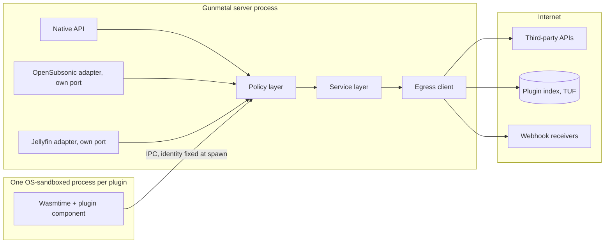

# Plugins, integrations and compatibility adapters

Status: proposed, 2026-10-02. Written with web access; every standard,
advisory and incident below was checked against the source listed under
Sources unless it is marked "(unverified)".

Standard versions used throughout: OWASP ASVS 5.0.0 (May 2025, still the
current release in October 2026), OWASP Top 10:2025, OWASP API Security Top
10 2023, OWASP MASVS v2 (exact minor version unverified), NIST SP 800-63B-4
(final, August 2025), NIST SP 800-218 SSDF v1.1 (February 2022; Revision 1,
SSDF v1.2, was still an initial public draft from December 2025 when
checked), TUF specification 1.0.36, SLSA v1.2, RFC 9700 (BCP 240, January
2025). "ASVS 1.3.6" means ASVS 5.0.0 requirement 1.3.6.

## Summary

This document covers everything that lets code or systems Gunmetal did not
write reach into the server: WebAssembly plugins (metadata providers,
scrobblers and later others), outbound webhooks, scoped API keys for
third-party tools, and the OpenSubsonic and Jellyfin compatibility adapters.
Each is a way for someone else's trust decisions to become ours, so the
design starts from one rule: **an extension gets nothing it did not declare,
the person affected did not approve, and the host cannot enforce.**

The key decisions are:

1. **One egress path for the whole server, from R1.** Every outbound request
   (the update check and OIDC discovery in R1; plugins, webhooks, artwork
   and remote playlists later) goes through one client that resolves names
   itself, checks every resolved address at connect time, refuses loopback,
   link-local, metadata and private ranges unless an admin granted that
   exact LAN destination, and follows no redirects by default. Navidrome's
   September 2026 plugin SSRF advisory, where the guard compared hostname
   text and DNS names walked straight past it, is the lesson.
2. **Plugins are WebAssembly components in a separate, OS-sandboxed process
   per plugin.** Wasmtime's sandbox is strong but not enough on its own:
   Wasmtime published a critical sandbox escape in April 2026
   (CVE-2026-34971) and another critical guest-to-host stack overflow on the
   day this was written (GHSA-32h6-97mm-8q3c). A plugin process has no
   files, no sockets and no database; it talks to the server over one IPC
   channel whose identity the server fixes at spawn. Memory is capped,
   calls have epoch deadlines and fuel budgets, and the host links only the
   narrow interfaces the plugin's world declares.
3. **Plugins are principals with scopes, not admins.** A plugin declares
   exact network hosts, the Gunmetal scopes it needs (the same scope
   vocabulary as API keys), the data it receives and its resources. Absence
   means denied. The person affected sees all of it in plain language
   before anything runs, and an update that asks for more is held until
   approved, as Chrome does for extensions.
4. **Signed, index-only distribution with TUF.** The server installs only
   packages whose signature and hash match a TUF-signed index; unsigned
   plugins need developer mode, which can be switched on only in the
   server's configuration file. A stolen admin session therefore cannot
   sideload a backdoor, which is exactly how about 1,200 Emby servers were
   backdoored in 2023.
5. **Scoped API keys from R1, with no escalation path.** Keys are 256-bit,
   prefixed, checksummed, stored only as a keyed hash, accepted only in the
   `Authorization` header, limited to an explicit scope list, intersected
   with the owner's current rights on every request, and unable to manage
   any credential, including themselves (the Immich CVE-2026-23896 lesson).
6. **Adapters never see the user's real credentials.** The OpenSubsonic
   adapter uses the `apiKeyAuthentication` extension with per-app keys and
   refuses username, password, token and salt by default. The Jellyfin
   adapter signs devices in with Quick Connect, approved in Gunmetal's own
   app, or with a generated per-device app password. Neither stores
   anything reversible except one narrowly scoped legacy option that the
   owner must approve (see Open decisions).
7. **Adapters cannot weaken the native API.** They are off by default and
   their listener does not exist until enabled; they run on their own port,
   ignore cookies, accept only their own credential kinds, call the same
   service layer and authorisation checks as the native API, expose only an
   allowlisted set of endpoints, and use Gunmetal's random IDs rather than
   Jellyfin's path-derived ones. A CI job runs the native security suite
   with adapters on and off and fails on any difference.
8. **Webhooks are signed, minimal and private by default.** Deliveries
   follow the Standard Webhooks scheme (HMAC-SHA-256 over id, timestamp and
   body). Events about what someone played go only to that person's own
   webhooks or to admin webhooks they opted into, and private listening
   never emits anything.

Release placement follows the README roadmap and the brief: the egress
client, the API key model and the credential-kind separation are R1 because
the native API, sign-in and the update check exist in R1, and R1 also gets
a guard that no third-party code may run until the sandbox requirements
pass. The plugin host and webhooks are tagged R2 (the library research says
the provider plugin system must exist before the video release), and both
adapters are tagged R2 because the roadmap places them after video and
before live TV. **If any of these is pulled into R1 (for example scrobbling,
or the OpenSubsonic adapter to cover phones before the native mobile app),
every requirement tagged for it moves to R1 with it; none may be
deferred.** The file has 76 live requirements: 8 R1, 66 R2, 1 R3 and 1 Later.

## Threats

| ID | Threat | Who (the attacker or failure) | Impact | Likelihood | Mitigated by (requirement IDs) |
|---|---|---|---|---|---|
| T-EXT-01 | A malicious plugin, or a legitimate plugin whose publisher account was phished, ships an update that exfiltrates listening history, tokens or library data | Plugin author, or an attacker holding the author's publishing credentials (Cyberhaven extension compromise, December 2024) | High: household privacy breach across every server that auto-updates | Medium | SEC-EXT-021, 025, 026, 029, 030, 035, 036, 039, 040, 041, 043 |
| T-EXT-02 | Guest code escapes the WebAssembly sandbox through a runtime or compiler bug | Malicious plugin exploiting a Wasmtime or Cranelift flaw (CVE-2023-26489, CVE-2026-34971, GHSA-32h6-97mm-8q3c) | High: code execution with the plugin host's privileges | Low to Medium | SEC-EXT-019, 020, 021, 022 |
| T-EXT-03 | A plugin loops forever, grows memory, floods logs or hammers a third-party API | Buggy or hostile plugin | Medium: server stalls, playback stutters, third-party bans the server's IP | High | SEC-EXT-023, 024, 033 |
| T-EXT-04 | A plugin with a network grant reaches the LAN, the router admin page or a cloud metadata service through DNS names, rebinding or redirects | Hostile plugin, or a plugin whose granted domain was taken over | High: internal services read or changed | Medium | SEC-EXT-002, 003, 026 |
| T-EXT-05 | The host acts on data a plugin returns with the host's own privileges: fetching artwork URLs, rendering biography HTML | Hostile plugin or a poisoned upstream metadata source (Navidrome GHSA-8hjf-6h34-82hr) | High: SSRF or stored XSS in every client | Medium | SEC-EXT-027, 028, 032 |
| T-EXT-06 | A plugin reads data beyond its purpose: other users' history, file paths, another plugin's secrets | Over-reaching or hostile plugin | High: privacy breach inside the household | Medium | SEC-EXT-021, 029, 030, 050 |
| T-EXT-07 | A stolen or forged admin session installs a backdoor plugin or adds a hostile plugin index | Remote attacker with admin access (Emby, May 2023) | High: credential theft and persistence | Medium | SEC-EXT-035, 037, 038, 044 |
| T-EXT-08 | The plugin index or a download is tampered with, rolled back to a vulnerable version, or frozen so fixes never arrive | Network attacker, compromised CDN or index host | High | Low | SEC-EXT-035, 036, 041 |
| T-EXT-09 | Users approve permissions they do not understand, or a plugin quietly gains permissions on update | Consent fatigue; permission creep by plugin authors | Medium | High | SEC-EXT-025, 039, 040 |
| T-EXT-10 | A plugin injects script or markup into the web client and steals sessions | Hostile plugin | High: account takeover | Medium | SEC-EXT-032 |
| T-EXT-11 | The account-linking callback for a third-party service (Last.fm, ListenBrainz, Trakt) is forged so the attacker's account receives a victim's history, or the reverse | Remote attacker (Navidrome's Last.fm callback flaw, fixed September 2026, per the users research) | Medium | Medium | SEC-EXT-031 |
| T-EXT-12 | Known-vulnerable runtime or plugin versions stay deployed for months | Operator inertia (Censys saw about 314,000 Plex servers still vulnerable weeks after a 2025 fix) | High | High | SEC-EXT-019, 040, 041 |
| T-EXT-13 | Third-party code is loaded in-process, or loaded before the sandbox exists | Project shortcut under schedule pressure; Plex CVE-2020-5741 (pickle in the plugin data path) was used in the 2022 LastPass breach | High: remote code execution as the server user | Medium | SEC-EXT-018, 034 |
| T-EXT-14 | A webhook URL points at an internal address and turns the server into a proxy or port scanner | Admin or user who can create webhooks, or anyone holding their session (GitLab CVE-2018-19571) | High | Medium | SEC-EXT-001, 002, 003, 047, 048 |
| T-EXT-15 | A receiver accepts forged or replayed deliveries and triggers automations (lights, downloads) | Anyone who can reach the receiver | Medium | Medium | SEC-EXT-046 |
| T-EXT-16 | Webhook payloads tell an admin's automation, or a third-party service, what a household member watched or listened to | Over-broad event design (compare Plex's 2023 "Week in Review" exposure in the users research) | High: privacy harm, loss of trust | High if unmanaged | SEC-EXT-045 |
| T-EXT-17 | Retries pile up for a dead endpoint until the queue exhausts memory or disk, or the receiver is hammered | Failure (receiver offline for days) | Medium | High | SEC-EXT-049 |
| T-EXT-18 | Integration secrets leak: webhook URLs that embed tokens (Discord, Home Assistant webhook IDs), plugin API keys, adapter keys in logs | Log readers, backup thieves, support-bundle recipients | High | Medium | SEC-EXT-016, 047, 050 |
| T-EXT-19 | A leaked API key (pasted in a forum, committed to a repo, left in shell history) grants broad, lasting access | Anyone who finds it | High | High | SEC-EXT-008, 010, 013, 014, 016 |
| T-EXT-20 | An API key raises its own scopes, or creates a more powerful key | Holder of a low-privilege key (Immich CVE-2026-23896) | High: full takeover | Medium | SEC-EXT-011, 012 |
| T-EXT-21 | Keys are guessed, enumerated, or distinguished through timing or error differences | Remote attacker | Medium | Low | SEC-EXT-008, 009, 015 |
| T-EXT-22 | Credentials in URLs end up in proxy logs, crash reports, cast-device logs and browser history | Anyone with log access (CWE-598) | High | High for adapters | SEC-EXT-006, 063, 068, 070, 074 |
| T-EXT-23 | An adapter needs the user's real password, or stores it reversibly, because the protocol hashes it with MD5 | Protocol design (Subsonic token and salt); Navidrome's default shared encryption key | High: one database leak exposes every password | High if copied | SEC-EXT-057, 058, 067, 069 |
| T-EXT-24 | Adapter authentication can be bypassed | Remote attacker (Navidrome CVE-2023-51442, CVE-2025-27112) | High | Medium | SEC-EXT-054, 064, 065 |
| T-EXT-25 | Brute force through the adapter path that the native limiter does not see, or with spoofed forwarding headers | Remote attacker (Navidrome GHSA-f295-6wp9-qqfg) | High | High | SEC-EXT-015, 064 |
| T-EXT-26 | Predictable identifiers let one user enumerate or address another user's objects | Signed-in user (Jellyfin derives item IDs from an MD5 of type name and path; Jellyfin issue 5415) | High: cross-user data access | Medium | SEC-EXT-054, 059 |
| T-EXT-27 | An adapter exposes admin, legacy or dangerous endpoints, server paths, versions or user lists | Remote attacker (Jellyfin remote-control access-control advisory GHSA-4vx8-xhc9-qg6x; public user lists) | High | Medium | SEC-EXT-055, 056, 060, 061 |
| T-EXT-28 | Turning an adapter on weakens the native API: credentials cross over, cookies or CORS leak across, or a parallel authorisation path drifts | Design failure | High | Medium | SEC-EXT-007, 052, 053, 054 |
| T-EXT-29 | A user is tricked into approving a sign-in code for an attacker's device | Remote phisher (device-code phishing such as Storm-2372, February 2025) | High: persistent access to the user's library and history | Medium | SEC-EXT-071, 072 |
| T-EXT-30 | Out-of-range adapter parameters exhaust memory or trigger costly transcodes | Any signed-in user or share holder (Navidrome GHSA-f22h-6qxh-rqq2: a negative cover size requested a canvas of about 40 GB) | Medium: outage | High | SEC-EXT-062 |
| T-EXT-31 | An adapter is left enabled, reachable from the internet over plain HTTP, and forgotten | Operator | High | High | SEC-EXT-013, 051, 066 |
| T-EXT-32 | Shares or cross-library reads through an adapter ignore the user's library restrictions | Signed-in user (Navidrome GHSA-82gh-4ggp-gfg5 trusted a client-supplied user ID; GHSA-3rwv-f797-f9p3 checked only the first resource) | High | Medium | SEC-EXT-054, 055, 056 |
| T-EXT-33 | A remote M3U or XMLTV source contains entries pointing at internal addresses or other hosts | Hostile or compromised IPTV provider (Navidrome GHSA-vwq6-xrw5-phpg, GHSA-8hjf-6h34-82hr) | High | Medium | SEC-EXT-002, 075 |
| T-EXT-34 | A new plugin capability added later is silently available to plugins installed under older grants | Project design drift | Medium | Medium | SEC-EXT-076 |

## Requirements

ID ranges: 001 to 007 egress and credential separation; 008 to 017 scoped
API keys; 018 to 034 plugin sandbox; 035 to 044 plugin signing, distribution
and consent; 045 to 050 webhooks and integration secrets; 051 to 066 adapters
in general; 067 to 069 OpenSubsonic; 070 to 074 Jellyfin; 075 remote
playlist sources; 076 future capabilities.

| ID | Requirement | Standards | Release | Verified by |
|---|---|---|---|---|
| SEC-EXT-001 | Every server-initiated outbound network connection (update check, OIDC discovery and keys, and later plugins, webhooks, artwork, remote playlists and guides) must go through the single egress client; no other module may open outbound sockets or construct an HTTP client. | ASVS 13.1.1, 13.2.4, 13.2.5; API7:2023; A01:2025; CWE-918 | R1 | CI check: `clippy.toml` `disallowed-types` and `disallowed-methods` ban HTTP client constructors and `TcpStream::connect` outside the egress crate; `cargo-deny` bans HTTP client crates as direct dependencies of any other crate; a test walks `cargo metadata` and fails on a new path. |
| SEC-EXT-002 | The egress client must resolve names itself, check every resolved address at connect time against the deny set in Design guidance (loopback, unspecified, private, shared CGNAT, link-local including 169.254.169.254, unique-local, multicast, broadcast, documentation, IPv4-mapped, NAT64 and 6to4 forms of these, and the server's own listening addresses), connect only to an address it checked, and allow a denied address only when it exactly matches an admin-granted LAN destination (host and port). | ASVS 1.3.6, 13.2.4; API7:2023; A01:2025; CWE-918, CWE-367; RFC 6890, RFC 6598, RFC 4193, RFC 6052 | R1 | Unit and property tests in the core crate for the address classifier, with generated addresses in every class and alternative encodings (IPv4-mapped IPv6, NAT64, 6to4); integration tests with a local DNS stub that returns private addresses, mixes public and private records, and rebinds between lookups, asserting refusal and that the connected peer equals the checked address. |
| SEC-EXT-003 | The egress client must not follow redirects unless the caller opts in; when it does, every hop must be re-checked against the caller's grant and SEC-EXT-002, with at most three hops. | ASVS 15.3.2, 1.3.6; API7:2023; CWE-918, CWE-601 | R1 | Integration tests against a local server that redirects to a private address, to an ungranted host, and in a loop. |
| SEC-EXT-004 | The egress client must enforce a connect timeout, a total deadline and a maximum response size on every request, allow only `https` (plain `http` only for an admin-granted LAN destination), and verify TLS certificates with no per-call way to turn verification off. | ASVS 12.2.1, 12.3.2, 13.1.3, 13.2.6; API4:2023; CWE-295, CWE-400 | R1 | Integration tests with a slow-drip server, an oversized body and a self-signed certificate; CI check that `danger_accept_invalid_certs` and equivalents appear nowhere. |
| SEC-EXT-005 | Outbound requests must carry no identifier of the server, its users or its library beyond what the destination requires and the person who granted it was shown: a generic `User-Agent`, no `Referer`, no shared cookie store between destinations. | ASVS 14.2.3; CWE-201, CWE-359 | R1 | Integration test capturing outbound requests for each R1 caller and comparing headers against a literal expected set. |
| SEC-EXT-006 | The native API must authenticate requests only from the `Authorization` header or the web client's HttpOnly session cookie, never from a query parameter other than the object-scoped, short-lived stream signature defined for signed stream URLs, and must reject with 400 any request carrying a parameter from the reserved list of credential names (case-insensitive: `api_key`, `apikey`, `access_token`, `token`, `password`). | ASVS 14.2.1, 15.3.7; RFC 6750 §5.3; RFC 9700 §4.3.2; CWE-598 | R1 | Route-table-driven integration test that sends every native route each reserved parameter with a valid credential value and asserts 400 and no side effect. |
| SEC-EXT-007 | Every credential must carry an immutable kind (web session, device key, API key, OpenSubsonic app key, Jellyfin app password, Jellyfin device token, plugin principal), and each listener must accept only its own kinds: the native API refuses adapter kinds, and adapter listeners refuse native sessions, device keys and API keys (the adapter-side checks arrive with the adapters). | ASVS 6.3.4, 8.2.1; API2:2023; CWE-863 | R1 | Integration test matrix: every credential kind against every listener, including adapter-kind records inserted directly into the database in R1, asserting the exact rejection. |
| SEC-EXT-008 | API keys must be 256-bit secrets from a CSPRNG, issued in the format `gmk_<key id>_<secret><checksum>` (see Design guidance), shown to the user exactly once, and stored only as an HMAC-SHA-256 of the secret under a server key held outside the database. | ASVS 11.5.1, 11.4.1, 13.3.1; NIST SP 800-63B-4 §3.1.1.2 (keyed hashing, by analogy); CWE-256, CWE-522 | R2 | Unit tests on generation (length, alphabet, checksum against an independent CRC32 reference); integration test against a real SQLite database asserting no column contains the secret or a reversible form; property test that two generated keys never share a secret. |
| SEC-EXT-009 | Key verification must look up by key ID, compare MACs in constant time, and return an identical response for an unknown ID, a wrong secret, an expired key and a revoked key. | ASVS 6.3.8; CWE-208, CWE-204 | R2 | Unit test that the comparison uses a constant-time primitive (`subtle`); integration test asserting byte-identical status and body for each failure kind; timing reviewed manually because statistical timing tests are flaky. |
| SEC-EXT-010 | Each API key must hold an explicit, non-empty list of scopes from a fixed enumeration with no wildcard or "all" scope, and every route must declare the one scope it needs. No key may hold an administrator, owner-only or host-equivalent scope; an administrator-capable automation credential would need its own architecture record. | ASVS 8.1.1, 8.2.1; API5:2023; CWE-269, CWE-250 | R2 | Unit and property tests on the scope parser (unknown, empty and wildcard rejected); property test that no key scope set includes an administrator capability; route-table test that host-equivalent routes reject every key kind and that every route declares a scope |
| SEC-EXT-011 | A key's effective rights on each request must be the intersection of its scopes and its owner's current permissions, evaluated at request time, so restricting, demoting or disabling the owner applies on the next request. | ASVS 8.3.2, 7.4.2; API1:2023; CWE-863 | R2 | Integration tests: create a key, then remove the owner's access to a library, demote, and disable the owner; the next request is denied each time. |
| SEC-EXT-012 | No API key may create, list, reveal, update or revoke any credential, including itself; creating a key or changing its scopes requires an interactive session with a fresh-uv check (SEC-IAM-041); and a key's scopes can never exceed the creating user's own rights. | ASVS 7.5.1, 8.2.1; API5:2023; CWE-269 (Immich CVE-2026-23896) | R2 | Integration tests: a key holding every scope calls every credential-management route and gets 403; scope widening beyond the owner is refused; property test over random scope sets that the stored result is a subset of the creator's rights. |
| SEC-EXT-013 | API keys must expire (default 365 days, owner may choose 30 to 730), must be disabled automatically after 180 days unused, and the owner must be told in the app 14 days before either happens. | ASVS 13.3.4, 6.4.5; CWE-613 | R2 | Unit tests on the expiry and idle calculations with an injected clock; integration test advancing the clock past each boundary. |
| SEC-EXT-014 | Users must be able to see every API key and adapter credential they own (label, kind, scopes, created, last used, coarse last-used address) and revoke any of them; admins must be able to revoke any user's; revocation must apply to the next request. | ASVS 6.5.6, 7.4.5, 7.5.2; OpenSubsonic apiKeyAuthentication (view and revoke); CWE-613 | R2 | Integration tests for listing, user revocation, admin revocation, and the first request after revocation. |
| SEC-EXT-015 | Failed API key and adapter authentications must count in the same limiter as interactive sign-in, per source address and per key ID or username, with the client address taken from the socket unless the request arrived through an admin-listed trusted proxy. | ASVS 6.3.1, 4.1.3, 15.3.4; NIST SP 800-63B-4 §3.2.2; CWE-307; Navidrome GHSA-f295-6wp9-qqfg | R2 | Integration tests: repeated failures are throttled; `X-Forwarded-For`, `X-Real-IP` and `True-Client-IP` from an untrusted peer are ignored; the same headers from a listed proxy are honoured. |
| SEC-EXT-016 | API key secrets, adapter credentials, webhook secrets and destination URLs, and plugin secrets must never appear in logs, traces, error messages, crash reports, metrics labels or any API response after creation; logs may carry the credential ID only. | ASVS 16.2.5, 16.5.1, 14.2.1; CWE-532, CWE-209 | R2 | Integration test with canary secrets driven through success, failure and panic paths, scanning all captured log output, responses and panic-hook output for the canary; extended to each new secret type as its feature lands. |
| SEC-EXT-017 | Every credential creation, scope change, first use from a new address, and revocation must be written to the security audit log with actor, credential ID, kind, scopes and outcome. | ASVS 16.3.1, 16.3.2, 16.3.3; A09:2025; CWE-778 | R2 | Integration tests asserting exact audit entries for each event. |
| SEC-EXT-018 | Until SEC-EXT-019 to SEC-EXT-034 are implemented and passing, the server must not load or execute any plugin or other third-party code: no dynamic libraries, no script interpreters, no WebAssembly runtime. | A08:2025; SP 800-218 PW.4; CWE-829, CWE-494 | R1 | CI check: the server's resolved dependency graph contains none of `libloading`, `wasmtime`, `wasmer`, `mlua`, `pyo3` or `deno_core` (list kept in `deny.toml`). |
| SEC-EXT-019 | Plugins must run on Wasmtime from a supported release line (an LTS line, or the current release), pinned in `Cargo.lock`, and a RustSec advisory against the pinned version must fail CI and be fixed within 7 days. | ASVS 15.1.1, 15.2.1; A03:2025; SP 800-218 RV.1, RV.2; CWE-1395 | R2 | CI check with `cargo-deny` advisories (fails the build); release checklist review of Wasmtime's advisory page. |
| SEC-EXT-020 | The Wasmtime engine must use Cranelift (not Winch), keep Spectre mitigations, signal-based traps and guard regions at their defaults, and enable only the WebAssembly proposals the plugin worlds need; memory64, threads, GC, exceptions and component-model async stay off unless an architecture record enables them. | ASVS 15.1.5, 15.2.5; CWE-1188; CVE-2026-34971, GHSA-32h6-97mm-8q3c | R2 | Unit test that builds the engine and asserts each setting; integration tests that test components using each disabled proposal fail to load with a typed error. |
| SEC-EXT-021 | Each plugin must run in its own OS process under the same OS sandbox profile as the transcode worker (no file access beyond its own read-only binary, no network sockets, no process creation, capped memory), and its only channel must be an IPC socket whose plugin identity the server fixes at spawn; on platforms without that sandbox, plugins must be unavailable. | ASVS 15.2.5, 13.2.2; CWE-250, CWE-653 | R2 | Integration tests on each supported platform: a test harness inside the sandbox attempts `open`, `socket`, `connect` and `execve` and must be refused; a message on plugin A's channel claiming plugin B is rejected; manual review of each platform profile. |
| SEC-EXT-022 | A plugin instance must have no filesystem preopens, environment variables, arguments, stdin or socket interfaces; only the host interfaces in its declared world are linked, legacy WASI preview 0 and 1 are never linked, and stdout and stderr go to a bounded per-plugin log buffer. | ASVS 15.2.5; CWE-250, CWE-276; GHSA-j366-h8gg-77pm, GHSA-gqmc-89g8-p25r | R2 | Integration tests with test components that import filesystem, sockets, environment and preview-1 interfaces (link fails) and that write unbounded output (buffer stays capped). |
| SEC-EXT-023 | Each plugin call must run under a linear-memory cap (default 64 MiB, at most 256 MiB if the manifest declares it), table and instance limits, a fuel budget, and an epoch-driven wall-clock deadline (default 5 s, at most 60 s for scheduled tasks) that also covers time spent in host calls; hitting any limit must trap, end only that call and be recorded. | ASVS 15.2.2, 2.4.1; API4:2023; CWE-400, CWE-770, CWE-835 | R2 | Integration tests with test components that loop, grow memory, recurse, and block inside a host call, each asserting the exact typed error and that a concurrent call to another plugin completes; fuel makes the loop test deterministic. |
| SEC-EXT-024 | A plugin that traps on a limit or crashes three times in 10 minutes must be suspended with exponential backoff and the admin told; no plugin failure may stall or crash the server process, the scanner or playback. | ASVS 16.5.2, 16.5.3; A10:2025; CWE-400 | R2 | Integration tests: a crashing test plugin is suspended on the third failure, a scan and a stream in progress complete, and the admin notice exists. |
| SEC-EXT-025 | The plugin manifest must have a closed schema: unknown keys, unknown permission names or an unknown world must reject the package, and an absent permission means not granted (no host list means no network). | ASVS 2.2.1, 1.5.2; CWE-276, CWE-1188 | R2 | Unit and property tests on the manifest parser with literal fixtures; fuzz target in CI (see SEC-EXT-034). |
| SEC-EXT-026 | Network grants must name exact hosts (no wildcards, no IP literals for public destinations), default to `https` on port 443, and be enforced by the egress client on every request and redirect hop; a LAN destination needs a separate per-destination admin grant. | ASVS 1.3.6, 13.2.4; API7:2023; CWE-918 | R2 | Integration tests with a test plugin requesting an undeclared host, an IP literal, a declared host that resolves to a private address, and a redirect to an undeclared host; each refused with the typed `not-granted` or `address-refused` error. |
| SEC-EXT-027 | Any URL a plugin returns (artwork, links, lyrics sources) must be fetched only by the egress client under that plugin's own grant, and dropped if outside it. | ASVS 1.3.6; API10:2023; CWE-441, CWE-918; Navidrome GHSA-8hjf-6h34-82hr | R2 | Integration test: a test provider returns artwork URLs on a granted host, an ungranted host and a private address; only the first is fetched. |
| SEC-EXT-028 | Everything a plugin returns must be validated against its world's typed schema with length, count and character limits before it is stored; clients must render plugin text as plain text; plugin images must pass the core image pipeline's size and pixel limits. | ASVS 2.2.1, 3.2.2, 5.2.6; API10:2023; CWE-20, CWE-79 | R2 | Property tests with oversized and hostile strings; client component tests that a biography containing `<script>` and `` renders literally. |
| SEC-EXT-029 | Each plugin must act as its own principal (kind `plugin`) whose host calls are authorised by the same policy layer as the native API against the scopes granted at install, and for per-user calls also against that user's current permissions. | ASVS 8.2.1, 8.2.2, 8.3.1, 8.3.3; API1:2023, API5:2023; CWE-863 | R2 | Integration tests: a plugin calling a host function outside its scopes is refused; a per-user call for a user without access to a library returns nothing from it. |
| SEC-EXT-030 | Plugins must receive only the data passed for the call they implement: the plugin world must offer no general database, library-wide, file-path or cross-user query; per-user events (plays, ratings) go only to plugins the user turned on for themselves, never for private-listening sessions; file names are passed without directories. | ASVS 8.2.3, 14.2.6, 15.3.1; API3:2023; CWE-200, CWE-359 | R2 | Integration test with two users, one opted in and one private session: the scrobbler receives exactly the opted-in, non-private events (literal expected list); test asserting the world's import list equals a reviewed literal. |
| SEC-EXT-031 | Plugins must not register HTTP routes or receive inbound requests; linking a third-party account must use a host-owned callback that binds `state` to the user's session, uses PKCE where the provider supports it, checks `iss` where provided, is single-use and expires after 10 minutes. | ASVS 10.1.2, 10.2.1, 10.2.2; RFC 7636; RFC 9700 §4.7; CWE-352 | R2 | Integration tests: callback with no state, a state from another session, a replayed state and an expired state are each refused. |
| SEC-EXT-032 | Plugins must not deliver code or markup to any client; plugin settings and UI are a typed form schema rendered by Gunmetal's own components, and the web client's Content Security Policy must not include any plugin-controlled source. | ASVS 3.4.3, 3.2.2; CWE-79, CWE-829 | R2 | Unit tests on the schema renderer; integration test asserting the exact CSP header with plugins installed. |
| SEC-EXT-033 | Each plugin must have host-enforced quotas: outbound requests per minute (default 60, plus provider-specific limits such as MusicBrainz's one per second), two concurrent calls, a 1 MiB key-value store (16 MiB maximum if declared) and a log-line rate. | ASVS 2.4.1, 15.2.2; API4:2023; CWE-770 | R2 | Integration tests driving a test plugin past each quota and asserting the typed `quota` error. |
| SEC-EXT-034 | A plugin package must be one WebAssembly component with the manifest embedded in a custom section plus a detached signature; the server must never unpack an archive for a plugin; the package, manifest and IPC message parsers must be fuzzed in CI with no panics. | ASVS 5.2.3, 5.3.3, 1.5.2; SP 800-218 PW.8; CWE-22, CWE-20 | R2 | Unit tests with literal package fixtures; `cargo-fuzz` targets run for a fixed time in CI and nightly. |
| SEC-EXT-035 | The server must install a plugin only if its signature verifies against the publisher key that a trusted index delegates for that plugin and its length, hash and version match the index's signed targets; any failure must leave the installed version untouched. | ASVS 15.2.4; SP 800-218 PS.2; A08:2025; CWE-347, CWE-494 | R2 | Integration tests with a tampered package, a wrong key, a hash mismatch, an unsigned package and a publisher signing a plugin it is not delegated for. |
| SEC-EXT-036 | Plugin index metadata must follow TUF 1.0 (root keys with a threshold, targets delegated per publisher, short-lived snapshot and timestamp), and the client must reject rollback, freeze (expired timestamp) and mix-and-match metadata. | TUF 1.0.36; A08:2025; CWE-345, CWE-353 | R2 | Integration tests with fixture repositories: expired timestamp, rolled-back snapshot, mismatched snapshot and targets, root rotation with and without threshold signatures. |
| SEC-EXT-037 | Unsigned or locally built plugins may run only when developer mode is switched on in the server's configuration file, which no API or UI can change, and every client must then show a persistent banner naming each unsigned plugin. | ASVS 13.4.2, 15.2.3; CWE-494; Emby 2023 | R2 | Integration tests: no route can enable developer mode or upload a package; with the flag set, the banner payload lists the plugin. |
| SEC-EXT-038 | Installing, updating, granting permissions to, or removing a plugin, and adding a plugin index, must be owner-only actions under the fresh-uv tag of SEC-IAM-041; adding an index also requires the owner to confirm its root key fingerprint. | ASVS 7.5.3, 8.2.1; A01:2025; CWE-862 | R2 | Integration tests for non-admin, stale-session and missing-fingerprint refusals. |
| SEC-EXT-039 | Before a plugin is installed, or a per-user plugin is turned on, the person granting it must see a plain-language screen generated from the manifest: publisher and signature status, each host with its stated reason, each kind of data it receives, what it can change, any resources above default, and what it cannot do; nothing runs until they confirm. Per-user consent happens on phone, web or desktop, never on a TV. | ASVS 14.2.3, 8.1.1; A06:2025; CWE-451 | R2 | Unit tests of the consent text generator against literal expected strings for fixture manifests; integration test that an unconfirmed plugin cannot be called. |
| SEC-EXT-040 | A plugin update must stay inactive, with the previous version still running, until the owner approves it. The owner may opt in per plugin to automatic updates that change no permission, are signed by the same publisher key and have a higher version; those install no sooner than 72 hours after the index published them. Updates that add or widen a permission always need approval, and lower versions are refused. | A03:2025; SP 800-218 RV.2; CWE-1395 | R2 | Integration tests: a same-permission update stays inactive until approved; with the opt-in, it installs only after 72 hours on an injected clock; a permission-widening update is held with the old version still serving; a lower version is refused |
| SEC-EXT-041 | If the signed index marks an installed plugin version as revoked, the server must tell the owner why and recommend disabling it, but must not disable it itself; the index must have no means to affect anything but the advice it shows. | A03:2025, A08:2025; CWE-1395 | R2 | Integration test with a fixture index revoking an installed version: the plugin keeps running and the notice is shown; test that the index schema has no other effect types |
| SEC-EXT-042 | Index refreshes must send no identifiers (no server ID, installed list, user count or cookies), must be possible to switch off, and an offline server must keep running its installed plugins. | ASVS 14.2.3; CWE-359 | R2 | Integration test capturing the refresh request and comparing it to a literal expected request; test with the index unreachable. |
| SEC-EXT-043 | First-party plugins must be built in CI with SLSA v1.2 Build Level 3 provenance and signed there; the publishing step must verify provenance before the index is updated. | SLSA v1.2 Build L3; SP 800-218 PS.2, PS.3; A03:2025 | R2 | CI check: publishing job fails without verifiable provenance. |
| SEC-EXT-044 | Plugin install, update, grant, suspension and revocation, adapter enable and disable, and webhook creation, change and auto-disable must be written to the security audit log. | ASVS 16.3.3; A09:2025; CWE-778 | R2 | Integration tests asserting exact audit entries for each event. |
| SEC-EXT-045 | Webhooks must stay off until the owner enables the feature and sets an allowlist of destination hosts; only admins may create server-wide webhooks; a user may create webhooks for their own events only to allowlisted hosts, and guests get none by default; payloads must contain only the fields listed for the event type; events about a person's playback go only to their own webhooks or to admin webhooks they opted into, and private listening emits nothing. | ASVS 8.2.2, 14.2.3, 14.2.6; API3:2023; CWE-201, CWE-359 | R2 | Integration tests with two users, opt-in on and off, and a private session, asserting the exact delivered payloads against literals; integration test that a member's webhook to an unlisted host is refused |
| SEC-EXT-046 | Each delivery must be signed per Standard Webhooks `v1`: HMAC-SHA-256 over `webhook-id`, `webhook-timestamp` and the body, with `webhook-id`, `webhook-timestamp` and `webhook-signature` headers, a 32-byte CSPRNG secret per webhook shown once, and rotation that signs with old and new secrets for 24 hours. | ASVS 4.1.5, 11.4.1, 11.5.1; RFC 2104; CWE-345, CWE-294 | R2 | Unit tests against an independent HMAC reference written for the test; property test that changing any byte of id, timestamp or body breaks verification; rotation test asserting two signatures in the header. |
| SEC-EXT-047 | Webhook destinations must pass SEC-EXT-002 to 004: `https` for public destinations, plain `http` or private addresses only for a destination the admin marked as LAN, never loopback, link-local or metadata addresses, no redirects; destination URLs are treated as secrets and shown masked after creation. | ASVS 1.3.6, 13.2.4; API7:2023; CWE-918; GitLab CVE-2018-19571 | R2 | Integration tests for each refused destination class, a redirecting receiver, and the masked URL in the API response. |
| SEC-EXT-048 | Webhook test sends and the delivery log must expose only success or failure, never status codes, latency, response headers or body; test sends are limited to 5 per minute per webhook. | ASVS 2.4.1; API7:2023; CWE-918, CWE-200 | R2 | Integration tests asserting the exact delivery-log shape and the throttle. |
| SEC-EXT-049 | Failed deliveries must be retried on the schedule in Design guidance with jitter, honouring `Retry-After` up to one hour and not retrying 4xx other than 408 and 429; each endpoint's pending queue holds at most 1,000 events (oldest dropped and counted); an endpoint failing for 72 hours is disabled and its owner told. | ASVS 13.1.3, 13.2.6, 16.5.2; API4:2023; CWE-770 | R2 | Unit tests of the schedule with an injected clock and seeded random source (literal expected delays); integration test with a failing receiver. |
| SEC-EXT-050 | Integration secrets (webhook secrets and destination URLs, plugin secrets and third-party tokens, and any legacy adapter credential under SEC-EXT-069) must be encrypted with the AEAD of SEC-OPS-017 under a nonce strategy fixed by SEC-STD-020 (XChaCha20-Poly1305 with random 192-bit nonces recommended), under a key kept outside the database, readable only by their owning component (and per-user secrets only during that user's calls), and never returned to a client after entry. | ASVS 13.3.1, 13.3.2, 11.3.2, 11.3.3, 11.3.4; CWE-312, CWE-522, CWE-323 | R2 | Integration tests: the database holds only ciphertext; plugin A cannot obtain plugin B's or another user's secret over IPC; read APIs return a masked value. |
| SEC-EXT-051 | Each compatibility adapter must be disabled on a new install, with no listener bound while disabled; enabling needs the owner under a fresh-uv check (SEC-IAM-041); each user must then create a credential per app (nobody is enrolled automatically); disabling an adapter must end all its sessions at once. | ASVS 15.2.3, 7.4.1; SP 800-218 PW.9; CWE-1188 | R2 | Integration tests: fresh install refuses connections on the adapter port; enable flow; after disable, an existing adapter token fails. |
| SEC-EXT-052 | Adapters must listen on their own port, never read or set cookies, and send CORS headers only for admin-listed origins. | ASVS 3.4.2, 3.5.4; CWE-942, CWE-352 | R2 | Integration tests: a valid native session cookie on an adapter request is ignored; no `Set-Cookie` on any adapter response; an unlisted `Origin` gets no CORS headers. |
| SEC-EXT-053 | Enabling or disabling an adapter must not change any native API response, header, CORS policy, rate limit or authentication behaviour. | ASVS 6.3.4; A06:2025; CWE-1188 | R2 | CI job runs the native API security suite with every adapter off and with every adapter on and fails on any difference. |
| SEC-EXT-054 | Adapters must be translation layers that call the same internal service API and per-object authorisation checks as the native API, with no direct database or filesystem access; every adapter route must pass a cross-user test replaying user A's identifiers with user B's credential. | ASVS 8.2.2, 8.3.1; API1:2023; A01:2025; CWE-639 | R2 | CI check on the crate graph (adapter crates may not depend on storage crates); generated integration tests from the route allowlist, one per route, asserting denial. |
| SEC-EXT-055 | Each adapter must implement only the endpoints in its reviewed allowlist file and return the protocol's not-found or not-authorised error for everything else; administrative, user-management, configuration, plugin, filesystem-browsing, log, restart, scheduled-task, remote-control, jukebox, chat and share-management endpoints must not exist. | ASVS 4.1.4, 8.2.1, 15.2.3; API5:2023, API9:2023; CWE-749 | R2 | Route-table test comparing registered routes with the allowlist file; integration tests for a literal list of dangerous paths. |
| SEC-EXT-056 | Adapter credentials must grant at most: browsing the libraries the user may see, streaming and (if the user's policy allows) downloading, playback reporting and scrobbling, and the user's own playlists, ratings and favourites; role and policy fields the protocol reports must show exactly that; history writes honour private listening; "now playing" lists show only the caller's own sessions. | ASVS 8.2.1, 8.2.3; API3:2023, API5:2023; CWE-269, CWE-359 | R2 | Integration tests: Subsonic `getUser` and Jellyfin `/Users/Me` policy fields match literals; `getNowPlaying` with two active users returns only the caller's. |
| SEC-EXT-057 | Adapters must never accept, request or store the user's Gunmetal sign-in secrets (passkey, OIDC session, device key or account password); they authenticate only with adapter credentials created in Gunmetal's own clients. | ASVS 6.3.4; NIST SP 800-63B-4 §3.1.1.2; CWE-522, CWE-257 | R2 | Integration tests: an account password (where password accounts exist) sent as Subsonic `p`, as Jellyfin `Pw`, or as an `apiKey` is refused. |
| SEC-EXT-058 | Adapter credentials, including Jellyfin device tokens, must hold at least 128 bits from a CSPRNG, use a case-insensitive alphabet suitable for typing on a remote, be shown once, and be stored as HMAC-SHA-256 (the only exception is SEC-EXT-069). | ASVS 11.5.1, 11.4.1; CWE-330, CWE-256 | R2 | Unit tests on generation and encoding; integration test inspecting the database. |
| SEC-EXT-059 | Every identifier an adapter exposes (items, users, server, playlists, devices) must come from Gunmetal's random IDs or a random per-install value, never from paths, names, content hashes or counters. | ASVS 11.5.1; API1:2023; CWE-340, CWE-639 | R2 | Property test: the same library scanned on two installs yields disjoint adapter IDs; unit test that the mapping function has no path input. |
| SEC-EXT-060 | Adapter responses must not reveal server filesystem paths, internal hostnames, the Gunmetal version or other users' names; fields the protocols require (Subsonic `path`, Jellyfin `Path` and media-source paths) must carry synthetic values. | ASVS 13.4.6, 15.3.1, 14.2.6; CWE-200, CWE-497 | R2 | Integration test that drives every allowlisted route and scans responses for the library root, the host name and the Gunmetal version string. |
| SEC-EXT-061 | Unauthenticated adapter endpoints (OpenSubsonic `getOpenSubsonicExtensions`; Jellyfin `/System/Info/Public`, `/QuickConnect/Enabled`, branding) must return only the fields clients need and the emulated protocol version, and Jellyfin's public user list must be empty. | ASVS 13.4.6, 6.3.8; CWE-200, CWE-204 | R2 | Integration tests comparing each response with a literal minimal fixture. |
| SEC-EXT-062 | Adapter numeric and list parameters must be validated against documented ranges before use (for example cover size 1 to 2048, counts up to 500, offsets of zero or more, bit rates from an allowlist), and transcodes requested through adapters must count against the same per-user stream and transcode limits as native clients. | ASVS 2.2.1, 2.4.1, 15.2.2; API4:2023; CWE-1284, CWE-400; Navidrome GHSA-f22h-6qxh-rqq2 | R2 | Property tests generating out-of-range and negative values for every numeric parameter (typed error, no allocation); integration test that adapter and native streams share the limit. |
| SEC-EXT-063 | Credentials that adapter clients send in query strings must be removed from the request line before any logging or tracing layer sees it, and replaced in logs by the credential ID. | ASVS 16.2.5, 14.2.1; CWE-598, CWE-532 | R2 | Integration test with a canary key in `apiKey`, `ApiKey` and `p` across every allowlisted route, scanning access logs and traces. |
| SEC-EXT-064 | Failed adapter sign-ins must use the SEC-EXT-015 limiter and return the protocol's one generic authentication error, whether the user is unknown, the credential wrong, expired or revoked. | ASVS 6.3.1, 6.3.8; NIST SP 800-63B-4 §3.2.2; CWE-307, CWE-204; CVE-2025-27112 | R2 | Integration tests: identical error for each failure kind; throttling after repeated failures, shared with native sign-in. |
| SEC-EXT-065 | Adapter authentication must fail closed on every error path, there must be no default or fallback key anywhere in the code, and the adapter listener must not accept connections until the credential subsystem has finished initialising. | ASVS 16.5.3, 13.2.3; A10:2025; CWE-636, CWE-798; Navidrome CVE-2023-51442 | R2 | Integration test with injected start-up delay and failures in the credential store (connections refused or auth errors, never success); mutation testing on every authentication branch; CI check forbidding key literals. |
| SEC-EXT-066 | Adapters must refuse every credential over plaintext HTTP from any non-loopback peer, with no local-network exception (SEC-NET-001), and the adapter setup screen must give apps the server's HTTPS address. | ASVS 12.2.1, 12.3.1; CWE-319 | R2 | Integration tests: plaintext HTTP from LAN and public sources refused; loopback accepted |
| SEC-EXT-067 | The OpenSubsonic adapter must advertise and accept `apiKeyAuthentication`, and by default must answer `u`, `p`, `t` or `s` sign-in with error 42, `apiKey` together with `u` with error 43, and an invalid key with error 44; `tokenInfo` must report only the key's own user. | OpenSubsonic apiKeyAuthentication v1; ASVS 6.3.4; CWE-287 | R2 | Integration tests asserting each error code and the `tokenInfo` body against literals. |
| SEC-EXT-068 | The OpenSubsonic adapter must support the `formPost` extension so that clients able to use it keep keys out of URLs. | OpenSubsonic formPost v1; ASVS 14.2.1; CWE-598 | R2 | Integration test: a request with the key in a form body succeeds and nothing of the key appears in the request line. |
| SEC-EXT-069 | Legacy sign-in for older Subsonic apps must be per credential and off by default: once the user marks one app key as legacy, that key alone may be sent as `p` (plain or `enc:`) and is verified against its stored MAC; token-and-salt (`t`, `s`, MD5) must stay refused unless the owner approves the written exception, and then only for keys separately flagged for it, whose secret is stored under SEC-EXT-050. A legacy-marked key may be used only on local-direct path classes (SEC-NET-024) and is refused on internet-posture paths; it lives at most 90 days by default; and its first use from a new address class raises an alert. | ASVS 11.4.1 (exception required for MD5), 6.3.4, 14.2.1; CWE-328, CWE-257, CWE-598 | R2 | Integration tests: legacy off gives error 42; legacy on accepts `p` only; `t` and `s` refused unless the exception flag is compiled in and set; database inspection for each mode; matrix test of the legacy flag across path classes, lifetime and alert |
| SEC-EXT-070 | The Jellyfin adapter must accept tokens only in the `Authorization: MediaBrowser … Token="…"` header, and in the `ApiKey` query parameter only on GET routes that return media bytes, images, subtitles or HLS playlists and segments; it must ignore `api_key`, `X-Emby-Token`, `X-MediaBrowser-Token`, `X-Emby-Authorization` and the `/emby/` and `/mediabrowser/` prefixes, matching Jellyfin 12, which turns legacy authorisation off by default and removed those prefixes. A key used through the `ApiKey` query parameter is subject to the same location narrowing, 90-day default lifetime and new-address-class alert as a legacy key (SEC-EXT-069). | ASVS 14.2.1, 4.1.4; RFC 9700 §4.3.2; CWE-598 | R2 | Route-table test that `ApiKey` is refused on every non-media route; integration tests for each legacy form; fuzz target for the `MediaBrowser` header parser; matrix test of `ApiKey` use across path classes |
| SEC-EXT-071 | Jellyfin sign-in must offer Quick Connect as the default path, approved only in Gunmetal's own clients after the user types the code shown on the device and sees its client name, device name and whether it is on the local network; codes must be single-use, expire within 10 minutes, be bound to the initiating request and be rate-limited; `AuthenticateByName` must accept only a Gunmetal-generated app password for that user. | ASVS 6.5.5, 6.6.2, 6.6.3; RFC 8628 §5.1, §5.4; MASVS-AUTH-3; CWE-287, CWE-307 | R2 | Integration tests for expiry, reuse, guessing (throttled), approval binding to the initiating secret; component test of the approval screen with literal text. |
| SEC-EXT-072 | Quick Connect requests started from a non-local address must be refused unless the admin has allowed remote device sign-in, and approving one must show a distinct warning. | RFC 8628 §5.4; A07:2025; CWE-451 | R2 | Integration tests from a LAN and a public source address, with the setting off and on. |
| SEC-EXT-073 | Jellyfin device tokens must be bound to the user and the client's `DeviceId`, appear in that user's device list, be revoked when the device is removed, and be replaced when the same `DeviceId` signs in again. | ASVS 7.2.4, 7.4.1, 7.5.2; CWE-613 | R2 | Integration tests: re-sign-in invalidates the old token; removing the device invalidates its token. |
| SEC-EXT-074 | Where the Jellyfin adapter returns stream URLs (`PlaybackInfo` transcoding and direct-stream URLs), it must embed Gunmetal's short-lived, object-scoped signed URLs rather than the device token. | ASVS 14.2.1; RFC 6750 §5.3; CWE-598 | R2 | Integration test asserting no device token appears anywhere in a `PlaybackInfo` response and that the URL expires. |
| SEC-EXT-075 | Remote M3U playlists, XMLTV guides and any provider login must be source integrations: each source URL is an admin grant in the egress client, entries inside a source are fetched only if their host is inside that source's grant or separately approved, and provider credentials are integration secrets. | ASVS 1.3.6, 13.2.4; API7:2023, API10:2023; CWE-918, CWE-441 | R3 | Integration tests with a playlist whose entries point at 127.0.0.1, a private address and an ungranted host; database inspection of provider credentials. |
| SEC-EXT-076 | Any new plugin capability (home rows, search providers, inbound webhooks, DLNA or others) must arrive as a new versioned interface with its own permission name and consent text through an architecture record, and no existing grant may imply it. | A06:2025; SP 800-218 PW.1; CWE-276 | Later | Manual review of the record; integration test that a plugin installed under an older grant cannot import the new interface. |

**Bound by requirements in [standards-coverage.md](standards-coverage.md).** SEC-STD-020 (AEAD nonce strategy, which SEC-EXT-050 now cites), SEC-STD-026 (no third-party OAuth server) and SEC-STD-037 (published plugin security requirements).
The 2026-10-02 challenge review merged duplicated controls into one owner each; withdrawn rows above say where their content went, and [threat-model.md](threat-model.md#control-ownership) lists every owner.

## Design guidance

### Trust zones



Only the egress client crosses into the internet. Adapters and plugins sit
outside the policy layer, exactly where the native API does; none of them
has a shortcut to storage.

### The egress client

Put it in its own crate (for example `gunmetal-egress`) with the address
classifier in `gunmetal-core`, because classification is pure logic and gets
the core's unit, property and mutation testing for free.

- **Interface.** `Egress::send(grant: &Grant, request) -> Result<Response,
  EgressError>`. `Grant` is an enum: `System(SystemPurpose)`,
  `Plugin(PluginId)`, `Webhook(WebhookId)`, `Source(SourceId)`. Each grant
  resolves to an allowed set of `(scheme, host, port)` plus any admin-granted
  LAN destinations. `EgressError` is typed: `NotGranted`, `AddressRefused`,
  `Timeout`, `TooLarge`, `Tls`, `Connect`, `Quota`, `RedirectRefused`.
- **Resolution and pinning.** Use a resolver the client controls (for
  example `hickory-resolver`), classify every A and AAAA record, refuse the
  request if any record is in the deny set (mixed answers are a rebinding
  signal), then connect to one of the checked addresses with the original
  host name for SNI and `Host`. If the HTTP library is given a custom
  resolver (reqwest supports one), the connect-time check holds for every
  hop; confirm this in a test rather than trusting it.
- **Deny set.** IPv4: 0.0.0.0/8, 10.0.0.0/8, 100.64.0.0/10 (shared address
  space, which also covers Tailscale addresses), 127.0.0.0/8,
  169.254.0.0/16, 172.16.0.0/12, 192.0.0.0/24, 192.0.2.0/24, 192.168.0.0/16,
  198.18.0.0/15, 198.51.100.0/24, 203.0.113.0/24, 224.0.0.0/4, 240.0.0.0/4,
  255.255.255.255. IPv6: ::/128, ::1/128, ::ffff:0:0/96 (classify the
  embedded IPv4), 64:ff9b::/96 (classify the embedded IPv4), 2002::/16
  (classify the embedded IPv4), fc00::/7, fe80::/10, ff00::/8, 2001:db8::/32.
  Plus every address the server itself listens on. Build test vectors from
  the IANA special-purpose registries (RFC 6890) independently of the
  implementation.
- **LAN grants.** A LAN grant is an exact `(host or address, port)` pair the
  admin typed, for example `homeassistant.local:8123`. It is never a range.
  Loopback, link-local and metadata addresses can never be granted.
- **Limits.** Defaults: connect 5 s, total 30 s, response 8 MiB (artwork may
  ask for more under its own limit), at most 3 redirects when opted in.
- **Headers.** `User-Agent: Gunmetal/<major>`; a plugin may append its own
  token when an API's terms require contact details (MusicBrainz asks for a
  meaningful one), and the consent screen shows it. No `Referer`, no cookie
  jar shared across grants.

### Credentials, keys and scopes

| Kind | Who uses it | Accepted on | Sent as | Stored as | Lifetime |
|---|---|---|---|---|---|
| Web session | Web client | Native | HttpOnly cookie | Defined in the sign-in document | Defined there |
| Device key | Native apps | Native | Signed requests | Public key | Defined there |
| API key `gmk_` | Scripts, Home Assistant, tagging tools | Native | `Authorization: Bearer` | HMAC-SHA-256 | 365 days default, 180 days idle |
| OpenSubsonic app key | Subsonic-compatible apps | OpenSubsonic port | `apiKey` (form body where supported) | HMAC-SHA-256 | 180 days idle |
| Jellyfin app password | Jellyfin apps without Quick Connect | Jellyfin port, sign-in route only | Request body | HMAC-SHA-256 | 180 days idle |
| Jellyfin device token | Jellyfin apps | Jellyfin port | `MediaBrowser` header; `ApiKey` on media GETs | HMAC-SHA-256 | 180 days idle |
| Plugin principal | Plugin host | Internal IPC only | Never sent | Not a secret | While installed |

**API key format.** `gmk_` + key ID (8 base62 characters, public, shown in
the UI and logs) + `_` + secret (43 base62 characters, 256 bits) + 6 base62
characters of CRC32 over the rest, following GitHub's token design: the
prefix and checksum let secret scanners such as gitleaks find leaked keys
with almost no false positives. Verification parses, checks the checksum
(cheap rejection), looks up the key ID, computes HMAC-SHA-256 of the secret
under the server's credential key and compares in constant time. A fast
keyed hash is enough here because the secret has 256 bits of entropy; slow
password hashing is for human-chosen secrets.

**Adapter credentials** are typed into phones and occasionally TVs or
watches, so use 26 characters of Crockford base32 (130 bits), shown in
groups of four, case-insensitive, with copy, QR and share-sheet options.

**Initial scope vocabulary** (shared by API keys, adapter credentials and
plugins; adding one needs a review):

| Scope | Allows | Who can grant |
|---|---|---|
| `library:read` | Browse metadata of libraries the owner can see | Any user |
| `media:stream` | Obtain signed stream URLs and bytes | Any user |
| `media:download` | Download originals, if the owner's policy allows | Any user |
| `history:read` | Read the owner's own history | Any user |
| `history:write` | Report progress and scrobbles for the owner | Any user |
| `playlists:write` | Change the owner's own playlists | Any user |
| `ratings:write` | Change the owner's own ratings and favourites | Any user |
| `events:self` | Receive the owner's own events (per-user plugins, webhooks) | Any user |
| `admin:library` | Start scans and refreshes | Admins only |
| `admin:status` | Read server health for monitoring | Admins only |

There is deliberately no scope for credentials, users, plugins, adapters or
server settings. Those need an interactive admin session.

**Household members.** Managed child profiles (from the users research) have
no credentials of their own and cannot create keys; a parent can create an
adapter credential for the child's profile, and SEC-EXT-011 intersects it
with the child's restrictions on every request.

### Plugin host

**Process model.** The server spawns `gunmetal-plugin-host` once per enabled
plugin, lazily on first call, and lets it exit after a period of idleness.
The process applies the transcode worker's sandbox profile before loading
anything (on Linux: a fresh mount namespace with only its own binary, no
network namespace access, seccomp allowing no `socket`, `connect` or
`execve`, and a memory limit; other platforms follow the transcode sandbox
document). The server passes one end of a socket pair at spawn and records
which plugin it belongs to; every message the server receives on it is
treated as coming from that plugin, whatever it claims. All HTTP happens in
the server's egress client on the plugin's behalf.

**Engine.** One `wasmtime::Engine` per host process with: Cranelift;
`consume_fuel(true)`; `epoch_interruption(true)` with a ticker thread every
10 ms; default Spectre and signal-trap settings; `wasm_memory64(false)`,
`wasm_threads(false)`, GC and exceptions off; component-model async off;
`max_wasm_stack` set explicitly. A `StoreLimits` built with
`memory_size(64 MiB or the declared value)`, `memories(1)`, `tables(1)`,
`instances(1)` and `trap_on_grow_failure(true)`. Wrap every call in a host
timeout (`tokio::time::timeout`) so time spent waiting on host calls counts
against the deadline; epoch interruption alone only fires while guest code
runs. Do not rely on fuel alone: a 2026 advisory showed a preview-0 WASI call
that let a guest wait without its fuel being charged.

**Pinning.** Track a Wasmtime LTS line (every twelfth release is LTS with 24
months of security fixes; 36 and 48 are current LTS lines and 49.0.2 is the
latest release as of 2 October 2026). Wasmtime published eight advisories on
2 October 2026 alone, so the advisory gate in SEC-EXT-019 will fire often;
budget for it.

**Interfaces (WIT sketch).** Prefer a narrow, buffered HTTP interface of our
own over `wasi:http` for the first release: it is easier to bound and test,
and `wasmtime-wasi-http` itself had two advisories in September and October
2026. The trade-off is that plugin authors cannot use stock `wasi:http`
libraries; revisit once the hooks (`WasiHttpHooks::send_request`) are
proven.

```wit
package gunmetal:plugin@1.0.0;
// Sketch only: supporting types (kv-error, level, album-evidence and so on) are elided.

interface egress {
  record request { method: string, url: string,
                   headers: list<tuple<string, string>>, body: option<list<u8>> }
  record response { status: u16, headers: list<tuple<string, string>>, body: list<u8> }
  enum fetch-error { not-granted, address-refused, timeout, too-large, tls, connect, quota }
  fetch: func(req: request) -> result<response, fetch-error>;
}
interface kv     { get: func(key: string) -> option<list<u8>>;
                   set: func(key: string, value: list<u8>) -> result<_, kv-error>; }
interface secrets { get: func(name: string) -> option<string>; }
interface log     { write: func(level: level, message: string); }

world music-metadata-provider {
  import egress; import kv; import secrets; import log;
  export lookup-album: func(evidence: album-evidence) -> result<list<album-candidate>, provider-error>;
}
world scrobbler {
  import egress; import kv; import secrets; import log;
  export on-play: func(event: play-event) -> result<_, scrobble-error>;
}
```

`album-evidence` carries tags, MusicBrainz IDs, track count and durations
and file base names, never directories. `play-event` is built per user and
only for users who turned the plugin on.

**Manifest example**, embedded in the component's `gunmetal-manifest`
custom section:

```toml
[plugin]
id = "org.listenbrainz.scrobbler"
name = "ListenBrainz"
version = "1.2.0"
world = "scrobbler@1"
mode = "per-user"            # each person turns it on for themselves

[[permissions.network]]
host = "api.listenbrainz.org"
why = "Send the tracks you play to your ListenBrainz account"

[permissions.gunmetal]
scopes = ["events:self"]

[[permissions.secrets]]
name = "token"
label = "Your ListenBrainz user token"
per_user = true

[resources]
memory_mib = 32
```

**Consent screen**, generated from the manifest, never from free text the
plugin supplies beyond the short `why` strings (which are length-limited and
rendered as text):

> **ListenBrainz**, published by Gunmetal (signature verified)
>
> If you turn this on, it will:
> - send the title, artist, album and time of each track **you** play to
>   api.listenbrainz.org, to send the tracks you play to your ListenBrainz
>   account
> - keep your ListenBrainz token, which only this plugin can read
>
> It cannot:
> - see what anyone else plays, read your files, or change your library
>
> Tracks you play in private listening are never sent.
>
> [Turn on] [Not now]

Usability rules that keep this from being switched off or clicked through:
admins install plugins from the web or desktop UI only; per-user plugins are
turned on from each person's own settings on phone, web or desktop; a TV
shows "Set this up on your phone" with a QR code instead of any consent
screen. Same-permission updates install silently (most updates); only
permission changes interrupt anyone, which keeps prompts rare enough to be
read.

**Signing and distribution.**

- **Package**: one `.wasm` component plus a detached signature file. Nothing
  to unpack, so no path traversal and no archive bombs.
- **Index**: a static TUF repository on gunmetal.tv. Root metadata is signed
  by a threshold of offline keys (recommendation: 2 of 3 maintainers on
  hardware tokens); `targets` delegates each plugin ID to its publisher's
  key; `snapshot` and `timestamp` are signed online with short expiry (for
  example 7 days and 1 day). The server ships the initial root metadata in
  its release and rotates through TUF's root chain.
- **Publisher keys**: first-party plugins are signed in CI with SLSA Build
  Level 3 provenance (Sigstore keyless signing from the GitHub Actions
  identity is one way to get there). Third-party publishers register an
  Ed25519 key, or a Sigstore identity bound to their public source
  repository, when first listed.
- **Install flow**: fetch timestamp, snapshot, targets, delegated targets;
  verify; download the package; check length and hash; verify the publisher
  signature; show the consent screen; record the granted permission set
  with the version; spawn.
- **Update flow**: compare the new manifest's permissions with the granted
  set. Equal or narrower: install, keep the old binary until the new one
  passes a health call, then swap. Wider: hold, notify the admin (or the
  user for per-user grants), keep running the old version.
- **Revocation**: the index's targets for a plugin may carry
  `revoked: [versions]` and a short reason. The server disables matching
  installed versions, shows the reason, and logs it. This is the only
  remote effect the project has on a server; it cannot stop the server.
- **Developer mode**: `plugins.developer_mode = true` in the configuration
  file. It allows loading a local component from a configured directory
  and shows a persistent banner in every client. There is no route that
  sets it.

**Third-party account linking.** The host owns
`/integrations/<plugin-id>/callback` on the native API. The plugin asks the
host to start a link; the host creates `state` (bound to the session, 10
minutes, single use) and a PKCE verifier where the provider supports it,
redirects the user, and on callback hands the plugin only the resulting
token, stored under SEC-EXT-050 per user. Providers that use their own
schemes (Last.fm's signed calls, ListenBrainz's pasted user token) go
through the same secret store.

### Webhooks

- **Event catalogue**, each with a fixed field list: `library.scan.completed`
  (library ID, counts), `library.item.added` (item ID, type, title),
  `server.update.available` (version, advisory flag), `playback.started` and
  `playback.stopped` (user's own webhooks only, or admin webhooks for users
  who opted in: item ID, title, device name), `credential.created` (own
  only). No file paths, no IP addresses, no other users' names.
- **Delivery headers** per Standard Webhooks: `webhook-id: msg_<random>`,
  `webhook-timestamp: <unix seconds>`, `webhook-signature: v1,<base64
  HMAC-SHA-256 of "id.timestamp.body">`, space-separated when rotating.
  Secret: 32 random bytes shown once as `whsec_<base64>`. Document the
  receiver check (constant-time comparison, five-minute timestamp
  tolerance, `webhook-id` as the idempotency key) with a copyable snippet.
- **Retry schedule**: attempt, then 30 s, 2 min, 10 min, 30 min, 2 h, 6 h
  and 12 h after the previous attempt, each multiplied by a random factor
  between 0.5 and 1.5. After the last retry the event is marked failed.
  Timeouts: 10 s connect, 30 s total. Response bodies are read up to 64 KiB
  and discarded.
- **Privacy defaults**: per-user playback events are off for admin webhooks
  until each user opts in from their privacy page ("Let the server owner's
  automations know when I start playing something"). This matches the
  users research's promise that the product surfaces nothing about a
  person's listening that they did not choose to share.
- **Home Assistant and other LAN receivers** are the common case, so the
  "This destination is on my home network" toggle is part of the creation
  form (admin only), with the exact `host:port` shown back.

### Adapters

**Common architecture.** Each adapter is a crate that owns a listener, a
request parser for its protocol, a route allowlist file (for example
`adapters/opensubsonic/routes.allow`, reviewed in every change), and a
translation from protocol requests to calls on the same internal service
API that the native handlers use. Middleware order on the adapter listener:
connection limits, then query-credential extraction and redaction (the
request line is rewritten before any logging layer), then authentication
(adapter credential kinds only), then the shared rate limiter, then the
policy layer, then the translation. Cookies are stripped on entry.

**Turning an adapter on.** Admin settings shows "Compatibility" with one
switch per adapter and a short explanation: what it is for, that it opens a
second port, and that each person still needs to connect each app. Then each
user's "Connect an app" page offers:

- *Subsonic-compatible music app*: "Copy this key into your app's API key
  field." If the user ticks "My app only has a password field", the key is
  marked legacy (SEC-EXT-069) and the page explains in one sentence that
  anyone who can see this app's traffic could reuse the key, and that the
  key can only play music. In legacy mode the username field takes their
  Gunmetal username; with an API key no username is sent.
- *Jellyfin-compatible app or TV*: "On your TV, choose Quick Connect, then
  type the code here." The approval screen shows the code being approved,
  the app and device names, and "on your home network" or a red "not on
  your home network" line. For apps without Quick Connect, a generated app
  password is offered instead.

**Plain HTTP on the LAN.** Many people point phone apps at
`http://192.168.x.x`. Recommendation: off by default with a one-click
enable that says "Apps on your home network will send their keys
unencrypted. Anyone on your Wi-Fi could copy them. Keys can only play
music and video, and you can revoke them here." Never allowed from public
addresses (SEC-EXT-066).

**OpenSubsonic route allowlist (starting point; exact client needs
unverified until client conformance tests exist).** Allowed: `ping`,
`getLicense`, `getOpenSubsonicExtensions` (public, as the specification
requires), `tokenInfo`, `getMusicFolders`, `getIndexes`, `getArtists`,
`getArtist`, `getAlbum`, `getSong`, `getAlbumList2`, `getRandomSongs`,
`search3`, `getPlaylists`, `getPlaylist`, `createPlaylist`,
`updatePlaylist`, `deletePlaylist` (own only), `stream`, `download` (per
policy), `getCoverArt`, `getLyricsBySongId`, `scrobble`, `star`, `unstar`,
`setRating`, `getStarred2`, `getPlayQueue`, `savePlayQueue`, `getUser`
(self only), `getNowPlaying` (own sessions only). Not implemented:
`createUser`, `updateUser`, `deleteUser`, `changePassword`, `getUsers`,
`getShares`, `createShare`, `updateShare`, `deleteShare`, `jukeboxControl`,
`startScan`, `getScanStatus`, chat, internet radio management and podcast
management. LMS removed the user-management endpoints when it introduced
API keys, which suggests clients cope (unverified).

**OpenSubsonic error mapping.** 40 wrong credentials (generic, SEC-EXT-064),
42 mechanism not supported, 43 conflicting mechanisms, 44 invalid API key,
50 not authorised for the operation, 70 not found. `getUser` for another
name returns 50.

**Why not token and salt.** The token is MD5 of password plus salt. It
proves nothing beyond possession of a replayable value: a captured `t` and
`s` pair works for any request until the password changes, so it is no
safer in transit than sending the password, and the server must hold the
password in recoverable form to check it. Navidrome documents that its
default encryption key is there "just for the sake of obfuscation". The
OpenSubsonic specification itself recommends that servers offering API
keys "no longer support salt/token-based authentication". Legacy `p`
sign-in is the lesser evil: it is equally exposed in transit, but the
server can verify it against a keyed hash and store nothing recoverable.
Some older clients may only use token and salt (unverified per client);
that is the owner decision below.

**Jellyfin route allowlist (starting point; unverified against each
client).** Allowed: `/System/Info/Public`, `/System/Info`, `/System/Ping`,
`/QuickConnect/Enabled`, `/QuickConnect/Initiate`, `/QuickConnect/Connect`,
`/Users/AuthenticateByName`, `/Users/AuthenticateWithQuickConnect`,
`/Users/Me`, `/Users/{self}`, `/UserViews`, `/Items`, `/Items/{id}`,
`/Items/{id}/PlaybackInfo`, `/Items/{id}/Images/{type}`, `/Shows/NextUp`,
`/Shows/{id}/Seasons`, `/Shows/{id}/Episodes`, `/Audio/{id}/universal`,
`/Videos/{id}/stream`, HLS playlist and segment routes,
`/Sessions/Playing`, `/Sessions/Playing/Progress`,
`/Sessions/Playing/Stopped`, `/Sessions/Logout`, favourite and played
markers for the caller, and `/Users/Public` (always an empty list). Not
implemented: `/Startup/*`, `/Users` listing, `/Users/New`, user policy and
password routes, `/Auth/Keys`, `/Plugins/*`, `/Packages/*`,
`/Repositories`, `/System/Configuration*`, `/System/Logs*`,
`/System/Restart`, `/System/Shutdown`, `/Environment/*` (server directory
browsing), `/Library/VirtualFolders*`, `/Library/Refresh`,
`/ScheduledTasks*`, `/Devices` for other users, `/Sessions/{id}/Command*`
and other remote control, `/SyncPlay/*`, `/ClientLog/Document`, and any
WebSocket command channel. Jellyfin's own advisories in 2026 hit several of
these (remote control, client log upload, virtual folders, plugins), which
is why they are absent rather than guarded.

**Jellyfin identifiers.** Jellyfin computes item IDs as an MD5 of the item
type's name and its path, which anyone who knows a file's location can
predict. The adapter instead formats Gunmetal's random 128-bit IDs as the
32-hex GUIDs Jellyfin clients expect, and generates a random server ID and
random user IDs per install. Jellyfin access tokens are 32 hex characters
in Jellyfin itself (unverified); if any client validates token shape, issue
128-bit random tokens in that shape.

**Version reporting.** `/System/Info/Public` reports the Jellyfin API
version the adapter emulates (clients gate features on it) and a random
server ID, never the Gunmetal version or host name.

**Streaming URLs.** Many Jellyfin and Subsonic clients build media URLs
themselves with the token in the query string and hand them to players and
cast devices, so the long-lived credential will appear in some URLs no
matter what. The mitigations are layered: the credential can only read and
play; it is redacted from Gunmetal's own logs; it is per app and revocable
with last-used shown; it expires when idle; and wherever the server rather
than the client builds the URL (Jellyfin `PlaybackInfo`), it substitutes a
short-lived signed URL.

### How the requirements become tests

- **Core crate, unit and property tests, mutation-tested**: address
  classifier, scope algebra (intersection, subset, parsing), API key and
  adapter credential encoding and checksum, manifest parser, consent text
  generator, retry schedule, webhook signature, adapter ID mapping, numeric
  parameter ranges. All pure functions with literal expected values.
- **Server integration tests against a real SQLite database**: credential
  storage and lifecycle, rate limiting, audit entries, every adapter route
  (generated cross-user tests from the allowlist files), egress behaviour
  against local HTTP servers and a stub DNS server.
- **Sandbox integration tests**: a `tests/plugins/` workspace of small Rust
  components built for the component target, each exercising one limit or
  one forbidden import.
- **Fuzzing**: manifest, package, IPC messages, the Jellyfin `MediaBrowser`
  header parser and the Subsonic parameter parser.
- **CI checks**: `clippy.toml` disallowed types and methods, `cargo-deny`
  bans and advisories, the route allowlist diff, the adapters-on versus
  adapters-off native suite diff, the log canary scan.

## Anti-patterns

- **Plugins as code inside the server process.** Emby's 2023 compromise
  ended with a credential-stealing plugin DLL running inside about 1,200
  servers; Jellyfin and Emby plugins are .NET assemblies with the server's
  full rights. Plex CVE-2020-5741 let an admin-level attacker plant a
  pickled file in the plugin data path and run Python as the server user,
  and it was the way into a LastPass engineer's home machine in 2022.
  Never run extension code with server privileges.
- **Treating WebAssembly as the only wall.** Cranelift miscompilations
  gave guests reads and writes outside their memory on x86-64 in 2023
  (CVE-2023-26489, CVSS 9.9) and on aarch64 in April 2026 (CVE-2026-34971),
  and the component-model async validation bug published on 2 October 2026
  let a guest write about 16 KiB onto the host's native stack. Keep the OS
  sandbox underneath and turn off proposals nobody needs.
- **SSRF checks on hostname text.** Navidrome's plugin guard compared host
  strings and passed every DNS name, including ones that resolve to
  127.0.0.1 or the cloud metadata address (GHSA-pr2j-mfc8-qjcc, fixed in
  0.64.0 by checking the resolved address at dial time). Check addresses,
  at connect time.
- **Fetching what a plugin points at with the host's rights.** Navidrome
  fetched artwork URLs returned by agents and plugins without the plugin's
  HTTP permission, and could read internal endpoints as cover images
  (GHSA-8hjf-6h34-82hr). The plugin's grant goes with its URLs.
- **"Missing" meaning "everything".** In Extism manifests an empty host
  list means no hosts but a null one means "all hosts are allowed". A
  permission that is absent must be denied.
- **Fallback keys and start-up races.** Navidrome's Subsonic endpoint
  accepted tokens signed with a hard-coded fallback key because
  authentication initialised before the random key loaded
  (CVE-2023-51442). No default keys, and no listening before
  initialisation finishes.
- **Keeping passwords recoverable for protocol compatibility.** Subsonic's
  token scheme forces it, and Navidrome's default key is in its source.
  Never hold the user's real password for an adapter.
- **MD5 in authentication.** ASVS 11.4.1 forbids MD5 for any cryptographic
  purpose; the Subsonic token is MD5. It is allowed only under a written
  exception for a narrowly scoped legacy key, if at all.
- **Tokens in query strings.** RFC 6750 says not to, RFC 9700 says clients
  must not, and Jellyfin 12 turned off its legacy `api_key` form by
  default. Accept query tokens only where a media player gives no choice.
- **Identifiers derived from paths.** Jellyfin's MD5-of-path item IDs mean
  an ID is guessable from a file name. Random IDs only.
- **Keys that can edit themselves.** Immich API keys could raise their own
  permissions to full admin through the update endpoint until 2.5.0
  (CVE-2026-23896).
- **Trusting forwarding headers by default.** Navidrome's login limiter
  could be bypassed with spoofed `X-Forwarded-For` (GHSA-f295-6wp9-qqfg),
  and Emby's 2023 compromise began with a proxy-header flaw
  (CVE-2023-33193).
- **A second authorisation path in the adapter.** Navidrome's Subsonic
  share creation trusted a client-supplied user ID and checked only the
  first resource ID (GHSA-82gh-4ggp-gfg5, GHSA-3rwv-f797-f9p3); its
  Subsonic sign-in accepted any non-existent username with a hash of an
  empty password (CVE-2025-27112). Adapters translate; they do not decide.
- **Unvalidated sizes and counts.** A negative `size` on Navidrome's
  `getCoverArt` asked for a 100,000-pixel-square canvas
  (GHSA-f22h-6qxh-rqq2).
- **Plugins that change the web client.** Several popular Jellyfin plugins
  work by injecting script into the web UI (unverified in detail). In
  Gunmetal that would hand every plugin the user's session. Plugins
  describe forms; clients render them.
- **Silent updates with new powers.** The Cyberhaven Chrome extension
  compromise of December 2024 pushed a malicious version through a
  phished publisher account to every user automatically. Signed index,
  publisher delegation, and a held update when permissions grow; Chrome
  itself keeps an extension "disabled until the user accepts the new
  permission".
- **A remote off switch for whole servers.** In 2023 Emby pushed an update
  that stopped compromised servers from starting. The index may revoke a
  plugin version; it must never be able to stop a server.
- **Device sign-in codes without context.** Storm-2372 tricked people into
  approving attacker-generated device codes for months. Show what is
  being approved and where it is, and refuse remote initiation by default.
- **Unsigned, unfiltered webhooks.** GitLab's webhooks could be aimed at
  internal addresses (CVE-2018-19571). Sign every delivery and send it
  through the egress rules.
- **Public user lists.** Jellyfin's public user endpoint can list accounts
  for a sign-in picker to anyone who reaches the server (which accounts it
  shows by default is unverified), and issue 5415 listed user endpoints
  reachable without authentication. The adapter returns an empty list.

## Open decisions for the project owner

> **Status, 2026-10-02.** The owner decisions from every file in
> `docs/security/` are consolidated and de-duplicated in
> [README.md](README.md#open-decisions-for-the-owner). Where the baseline
> has since chosen, or where a recommendation below disagrees with the
> README, the README and the requirement tables win.

1. **Does any plugin ship in R1?** Scrobbling and MusicBrainz lookups are
   plugins under record 2. *Recommendation:* no plugin host in R1; ship R1
   tag-only, like Navidrome's default, and build the host for R2 where
   posters make it mandatory. *Trade-off:* music users expect scrobbling;
   if it must be in R1, SEC-EXT-019 to 044 move to R1, adding several weeks
   and an OS sandbox on every R1 platform.
2. **Does the OpenSubsonic adapter ship in R1?** Native mobile apps are R2,
   so without the adapter R1 has no phone app. *Recommendation:* keep it in
   R2 as the roadmap says, unless phones are judged essential for R1; if
   pulled forward, SEC-EXT-007 (adapter side) and 051 to 069 move with it.
   *Trade-off:* a much better R1 for listeners against a doubled
   authorisation surface (Navidrome's 2026 advisories) in the first release.
3. **Legacy Subsonic sign-in.** Options: API key only; plus per-key legacy
   `p`; plus per-key token and salt with an MD5 exception and encrypted
   storage. *Recommendation:* API key plus per-key legacy `p`; refuse token
   and salt until a client survey shows an important app that cannot work
   otherwise. *Trade-off:* some older apps will not connect.
4. **Plain HTTP for adapters on the LAN.** *Recommendation:* off by default,
   one-click on with the warning above, never from public addresses.
   *Trade-off:* friction for the common `http://192.168.x.x` setup versus
   keys readable by anyone on the Wi-Fi.
5. **Who runs the plugin index and holds its keys, and are third-party
   indexes allowed?** *Recommendation:* the project runs a static TUF
   repository on gunmetal.tv with 2-of-3 offline root keys on hardware
   tokens; admins may add third-party indexes after confirming a
   fingerprint. *Trade-off:* a curated index is a soft central dependency
   and needs reviewers; refusing third-party indexes would be safer but
   would push people towards developer mode.
6. **May the index revoke plugin versions remotely?** *Recommendation:*
   yes, limited to disabling listed plugin versions, with the reason shown
   and logged. *Trade-off:* the project gains a lever over installed
   servers, which record 1's "no central account" spirit is wary of; without
   it, a known-malicious plugin keeps running until each admin notices.
7. **Automatic plugin updates by default.** *Recommendation:* yes for
   updates that change no permission. *Trade-off:* a compromised publisher
   key can push code (bounded by the existing grant) versus servers sitting
   on vulnerable versions for months.
8. **Plugin process model and platforms.** *Recommendation:* one sandboxed
   process per plugin, and plugins unavailable on platforms without an OS
   sandbox until one is built (Linux and Docker first). *Trade-off:* memory
   per plugin and no plugins on Windows or macOS servers at first.
9. **Plugin HTTP interface.** *Recommendation:* our own narrow `egress`
   interface for R2, `wasi:http` later. *Trade-off:* safer and simpler to
   bound, but plugin authors cannot reuse standard HTTP libraries.
10. **Webhooks: release and who can create them.** *Recommendation:* R2;
    users may create webhooks for their own events to public HTTPS
    destinations, admins may also target LAN destinations and server-wide
    events. *Trade-off:* per-user webhooks are another egress path to
    police; admin-only would be simpler but blocks personal automations.
11. **API keys in R1 at all.** *Recommendation:* yes. *Trade-off:* more R1
    surface, but without them people script with session cookies, which is
    worse.
12. **Third-party publisher policy.** *Recommendation:* a publisher must
    have a public source repository, sign with a registered key or a
    Sigstore identity tied to that repository, and pass a manual review on
    first listing and on any permission increase that touches per-user
    data. *Trade-off:* reviewer time versus a catalogue as open, and as
    risky, as Jellyfin's repository model.

## Sources

Gunmetal records and research read first:

- README.md, CONTRIBUTING.md, AGENTS.md, SECURITY.md
- docs/adr/0001-architecture.md, docs/adr/0002-music-is-first-class.md
- docs/research/users-sharing-and-security.md (Plex, Emby, Navidrome and
  Immich incidents and adapter credential ideas)
- docs/research/library-and-metadata.md (provider plugins and their terms)
- docs/research/clients-platforms-and-offline.md (adapter roles and drift)

Standards:

- OWASP ASVS 5.0.0 source chapters:
  https://github.com/OWASP/ASVS/tree/v5.0.0/5.0/en (release list:
  https://github.com/OWASP/ASVS/releases)
- OWASP Top 10:2025: https://top10.owasp.org/2025 and
  https://top10.owasp.org/2025/A01_2025-Broken_Access_Control/
- OWASP API Security Top 10 2023:
  https://api-security.owasp.org/editions/2023/en/0x11-t10
- OWASP MASVS controls: https://mas.owasp.org/MASVS/ and
  https://github.com/OWASP/masvs/blob/master/controls/MASVS-AUTH-3.md
- OWASP SSRF Prevention Cheat Sheet:
  https://cheatsheetseries.owasp.org/cheatsheets/Server_Side_Request_Forgery_Prevention_Cheat_Sheet.html
- NIST SP 800-63B-4: https://pages.nist.gov/800-63-4/sp800-63b.html
- NIST SP 800-218 v1.1: https://csrc.nist.gov/pubs/sp/800/218/final;
  Revision 1 draft: https://csrc.nist.gov/pubs/sp/800/218/r1/ipd
- RFC 9700: https://www.rfc-editor.org/rfc/rfc9700.html
- RFC 6750: https://www.rfc-editor.org/rfc/rfc6750.html
- RFC 8628: https://www.rfc-editor.org/rfc/rfc8628.html
- TUF specification 1.0.36:
  https://theupdateframework.github.io/specification/latest/
- SLSA v1.2: https://slsa.dev/spec/
- Sigstore overview: https://docs.sigstore.dev/about/overview/
- Standard Webhooks:
  https://github.com/standard-webhooks/standard-webhooks/blob/main/spec/standard-webhooks.md

Protocols and runtimes:

- Subsonic API: https://www.subsonic.org/pages/api.jsp
- OpenSubsonic API key extension:
  https://opensubsonic.netlify.app/docs/extensions/apikeyauth/
- OpenSubsonic tokenInfo:
  https://opensubsonic.netlify.app/docs/endpoints/tokeninfo/
- OpenSubsonic formPost:
  https://opensubsonic.netlify.app/docs/extensions/formpost/
- OpenSubsonic getOpenSubsonicExtensions:
  https://opensubsonic.netlify.app/docs/endpoints/getopensubsonicextensions/
- OpenSubsonic API reference: https://opensubsonic.netlify.app/docs/api-reference/
- LMS v3.61.0 release notes (API keys, removed user endpoints):
  https://newreleases.io/project/github/epoupon/lms/release/v3.61.0
- Navidrome security and password storage:
  https://www.navidrome.org/docs/usage/admin/security/
- Navidrome plugins: https://navidrome.org/docs/usage/features/plugins/
- Extism manifest: https://extism.org/docs/concepts/manifest
- Jellyfin token extraction:
  https://raw.githubusercontent.com/jellyfin/jellyfin/master/Jellyfin.Server.Implementations/Security/AuthorizationContext.cs
- Jellyfin item ID generation:
  https://raw.githubusercontent.com/jellyfin/jellyfin/master/Emby.Server.Implementations/Library/LibraryManager.cs
- Jellyfin Quick Connect: https://jellyfin.org/docs/general/server/quick-connect
- Jellyfin 12.0 changes:
  https://www.helpnetsecurity.com/2026/09/08/jellyfin-12-0-security-fixes/
- Wasmtime releases: https://github.com/bytecodealliance/wasmtime/releases
- Wasmtime release and LTS policy: https://docs.wasmtime.dev/stability-release.html
- Wasmtime security model: https://docs.wasmtime.dev/security.html
- Wasmtime interruption (fuel and epochs):
  https://docs.wasmtime.dev/examples-interrupting-wasm.html
- Wasmtime `StoreLimitsBuilder`:
  https://docs.rs/wasmtime/latest/wasmtime/struct.StoreLimitsBuilder.html
- `wasmtime-wasi-http` hooks:
  https://docs.rs/wasmtime-wasi-http/latest/wasmtime_wasi_http/trait.WasiHttpHooks.html
- WASI releases: https://wasi.dev/releases
- Chrome extension permission warnings:
  https://developer.chrome.com/docs/extensions/develop/concepts/permission-warnings
- GitHub token format:
  https://github.blog/engineering/platform-security/behind-githubs-new-authentication-token-formats/

Advisories and incidents:

- Wasmtime advisories:
  https://github.com/bytecodealliance/wasmtime/security/advisories
- CVE-2026-34971 (GHSA-jhxm-h53p-jm7w):
  https://github.com/bytecodealliance/wasmtime/security/advisories/GHSA-jhxm-h53p-jm7w
- GHSA-32h6-97mm-8q3c:
  https://github.com/bytecodealliance/wasmtime/security/advisories/GHSA-32h6-97mm-8q3c
- CVE-2023-26489 (GHSA-ff4p-7xrq-q5r8):
  https://github.com/bytecodealliance/wasmtime/security/advisories/GHSA-ff4p-7xrq-q5r8
- Navidrome advisories: https://github.com/navidrome/navidrome/security/advisories
- GHSA-pr2j-mfc8-qjcc:
  https://github.com/navidrome/navidrome/security/advisories/GHSA-pr2j-mfc8-qjcc
- GHSA-8hjf-6h34-82hr:
  https://github.com/navidrome/navidrome/security/advisories/GHSA-8hjf-6h34-82hr
- GHSA-f22h-6qxh-rqq2:
  https://github.com/navidrome/navidrome/security/advisories/GHSA-f22h-6qxh-rqq2
- CVE-2023-51442: https://github.com/advisories/GHSA-wq59-4q6r-635r
- CVE-2025-27112: https://cveawg.mitre.org/api/cve/CVE-2025-27112
- Jellyfin advisories: https://github.com/jellyfin/jellyfin/security/advisories
- CVE-2026-23896 (Immich): https://osv.dev/vulnerability/CVE-2026-23896
- CVE-2020-5741 (Plex): https://cveawg.mitre.org/api/cve/CVE-2020-5741 and
  https://www.tenable.com/security/research/tra-2020-32
- LastPass and Plex:
  https://thehackernews.com/2023/03/lastpass-hack-engineers-failure-to.html
- Emby 2023: https://www.bleepingcomputer.com/news/security/emby-shuts-down-user-media-servers-hacked-in-recent-attack/
- CVE-2018-19571 (GitLab webhooks): https://cveawg.mitre.org/api/cve/CVE-2018-19571
- Cyberhaven extension compromise:
  https://rhisac.org/threat-intelligence/cyberhaven-extension-compromise-part-of-broader-campaign-affecting-multiple-chrome-extensions/
- Storm-2372 device code phishing:
  https://www.microsoft.com/en-us/security/blog/2025/02/13/storm-2372-conducts-device-code-phishing-campaign
