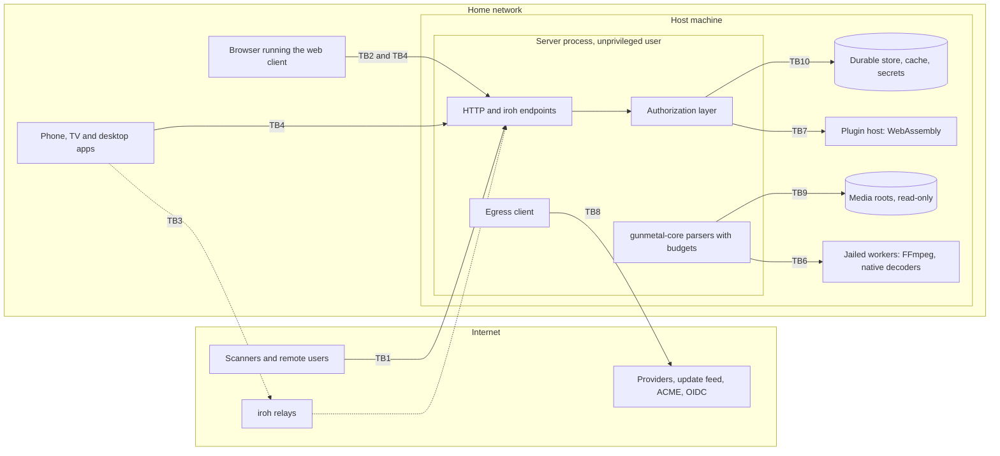

# Threat model

Date: 2026-10-02. Status: proposed.
Last reviewed: 2026-10-02 (baseline, before R1).

Web tools were available and used. Standards were checked against their
primary sources (the OWASP ASVS 5.0.0 chapter files, the OWASP Top 10:2025
and API Security Top 10 2023 sites, NIST CSRC, the RFC Editor, kernel.org)
and incidents against advisories, CVE records and vendor or researcher
write-ups. Anything not confirmed is marked "(unverified)". Facts about
rival products that come from the project's own research files are cited to
those files.

## Summary

This file models the whole of Gunmetal as records 1 and 2 describe it: a
Rust server with SQLite, a shared Rust core compiled into every client, React
Native clients for browsers, phones, TVs and desktop, a sandboxed FFmpeg for
the rare transcode, plugins with network grants, and remote access over
iroh. It names what we protect, who attacks it and where, and sets the
cross-cutting requirements that no single area owns. Area files refine these:
[supply chain and release](supply-chain-and-release.md) (SEC-SUP-*) owns the
build, release, disclosure and update feed, and this file cites it instead of
repeating it. The accounts feature map
([docs/features/accounts.md](../features/accounts.md), ACC-*) owns what users
see.

On accounts, which the owner asked about: record 1 has already decided that
there is **no central account**, and that sign-in uses passkeys, OIDC and
device-bound keys. What it has not decided is the shape of identity on a
server. The accounts map now proposes local accounts per server, households,
profiles separate from credentials, managed child profiles with no
credentials. It also proposed a password fallback; the baseline decides
against it (SEC-IAM-025, SEC-STD-006), and a person whose browser cannot use
a passkey pairs it from a signed-in device instead (SEC-IAM-108). The
recommended account model is set out in [the security README](README.md).
This threat model assumes that shape,
assumes R1 has several people per server, and treats identity data as
irreplaceable. That needs a new architecture record before any server code
stores a user (open decision 1).

The key decisions:

1. **Assume every server is on the internet from R1.** In R1, remote use
   means the owner's own port forward or reverse proxy. Rivals' servers are
   found and mass-exploited within days: about 300,000 Plex servers were
   still on a CVSS-10 version weeks after the fix. So nothing is designed on
   the hope that the server sits safely on a LAN, and location never proves
   identity.
2. **Three tiers of privilege, enforced by processes, not conventions.** The
   server runs unprivileged and touches untrusted bytes only through
   `gunmetal-core`, which is memory-safe and enforces resource budgets.
   Anything native that touches untrusted bytes (FFmpeg, C decoders, and the
   plugin runtime) runs in a separate jailed process with no network and no
   file system. The host is reachable from neither, and media is read-only.
   If the jail cannot be built on a platform, the feature is off; there is
   no unsandboxed fallback.
3. **Deny by default, proven by a cross-user matrix.** Every route declares a
   policy or the build fails. Every object read goes through one
   authorization layer. A generated integration test replays one user's IDs
   as every other kind of caller, on every route, adapters and share links
   included. Most 2026 advisories at Jellyfin and Navidrome were exactly
   these mistakes.
4. **Nothing untrusted becomes a path, a command line, SQL, a URL, a log
   format or HTML.** This is enforced by types. Artwork is decoded and
   re-encoded by the server, so clients, and especially smart TVs running
   unpatched browser engines, never decode an attacker's image bytes.
5. **Zero egress by default, one door when it is opened.** An R1 server makes
   no outbound connection unless the owner enables something (ACME for the
   owner's own domain, the update check); from R2, also the naming purpose
   when the install chose the project name service (D-07), which is then
   disclosed on the console. Each purpose is listed in the egress inventory
   below. Every outbound call goes through one egress client that checks the resolved
   address, refuses private and metadata ranges unless granted, refuses
   cross-host redirects and always verifies TLS.
6. **Revocation is immediate and visible.** Sessions are opaque and checked
   on every request. Capability URLs are re-checked on every use. Everyone
   can see and end their own sessions. Nobody, the project included, can
   switch a server off remotely.
7. **History is sensitive personal data.** By default no telemetry is sent,
   admins see only live sessions and totals, each person has a page showing
   what the admin can see, and private listening exists. Backups that leave
   the machine are encrypted.
8. **Every requirement is a test.** Policies and parsers are proven by unit
   and property tests with zero surviving mutants, routes by integration
   tests against a real SQLite file, parsers by continuous fuzzing, and
   processes by jail and egress tests in Linux namespaces. Manual review
   appears only where nothing can be automated, and it is named.

The biggest R1 residual risk is a household that cannot get HTTPS.
Browsers allow passkeys only in a secure context, and Chrome (since M110) and
Firefox refuse WebAuthn on pages with certificate errors. The baseline does
not answer that with a cleartext password: over plain HTTP, every peer but
loopback gets only a help page (SEC-NET-001). In R1, HTTPS comes through the
owner's own domain with automatic certificates (ACME), a tailnet, or the
same machine (localhost) (SEC-NET-013; owner answer to D-07, 2026-10-02).
The per-server name service, with its narrow pre-claim exception
(SEC-OPS-007), is R2. A household that has none of these cannot use
passkeys in R1 until it sets one up.

There are 60 live requirements: 48 R1, 0 R1.1, 1 R1.2, 0 R1.3, 10 R2, 1 R3 and 0 Later, plus 15 withdrawn rows kept so their IDs stay stable.

## Threats

### Scope and assumptions

In scope: the server, `gunmetal-core`, the web client served by the server,
the native clients (R2), the transcode jail, plugins, metadata and other
outbound services, iroh relays, the file system and database on the host, and
the project's release and update path (detailed in the supply-chain file).

Assumptions:

- The host OS is maintained by its owner, and someone with root on the host
  or physical access to it already owns everything; recovery deliberately
  relies on host access.
- The owner is trusted with the host. Admins and other users are not, and the
  owner is not trusted to read other people's history without them knowing.
- R1 is multi-user (household plus friends), serves the web client over HTTPS
  (or to loopback), and may be exposed to the internet by the owner's port forward or
  reverse proxy. Native apps, iroh, plugins, adapters and FFmpeg arrive in R2.
- If a feature moves to another release, its requirements move with it.

Out of scope: DRM and copy protection (Gunmetal ships none); hardware side
channels; a targeted attacker with the owner's unlocked device in hand; legal
questions about content.

### Assets

| ID | Asset | Why it matters | Where it lives |
|---|---|---|---|
| AS-1 | Media files and library structure | The owner's collection; file paths reveal names and folder habits | Media roots on the host; the index in the cache |
| AS-2 | Listening and watch history, queues, ratings, playlists, preferences | Sensitive personal data: it can reveal sexuality, religion, politics, health and children's routines. The only irreplaceable data in record 1 | Durable log on the server; synced copies on devices |
| AS-3 | Accounts and credentials: passkey public keys, paired-browser public keys, sessions, invitations, share links, app keys | Taking these over means acting as a person | Durable identity store; session cache |
| AS-4 | Device keys, offline grants, downloaded media and synced libraries on clients | A lost phone or a resold TV carries them away | Platform keystore and app storage on each device |
| AS-5 | Server secrets: session and capability keys, iroh secret key, TLS private keys, backup key, provider and OIDC credentials, IPTV logins | One leak forges every capability or impersonates the server | Secrets files in the data directory |
| AS-6 | The host machine and the home network behind it | The real prize: a NAS with family photos, inside the house's network | The machine the server runs on |
| AS-7 | Household structure and policies: who is a child, restrictions, grants | Wrong policies expose children to content and adults to each other | Durable identity store |
| AS-8 | Availability and integrity of the server, durable store and backups | Music stops; history or grants are lost or corrupted | Data directory and backups |
| AS-9 | The project's release path, signing keys, update feed and website | One compromise reaches every install | GitHub, registries, Cloudflare, hardware keys (see SEC-SUP-*) |

### Adversaries

| ID | Adversary | Starting position and capability | Typical goal |
|---|---|---|---|
| ADV-1 | Internet scanner or opportunistic attacker | Finds exposed servers through Shodan or Censys and runs known exploits, credential stuffing and fuzzing at scale | Take over servers in bulk, steal credentials, mine or pivot into the home network |
| ADV-2 | Malicious or curious shared user | Holds a legitimate account or profile: a friend, a teenager, an ex-partner whose access was never removed | Read others' history and libraries, escape restrictions, gain admin |
| ADV-3 | Curious or overreaching admin | Holds admin rights legitimately | See what others play beyond what they expect |
| ADV-4 | Author of a malicious media file or sidecar | Gets a crafted file, tag, subtitle, playlist, lyric or artwork into a library (downloads, rips, shared folders) | Code execution or file access on the server or on the viewer's device |
| ADV-5 | Compromised metadata provider, or an on-path attacker on outbound traffic | Controls responses to the server's outbound requests | Inject hostile data, steer the server to internal addresses, learn what the household owns |
| ADV-6 | Malicious plugin or plugin publisher | Code the owner installed, or an update to it | Steal credentials and history, persist, reach the LAN |
| ADV-7 | Thief or next owner of a lost, stolen or resold device | Holds the device, perhaps unlocked | Use the session, read downloads and cached history |
| ADV-8 | Compromised dependency, build or project account | Can change what the project ships | Run code on every install |
| ADV-9 | Attacker on the LAN, including a malicious website open in a household browser | Shares the network, or runs script in a browser that does | Sniff cleartext, rebind DNS, forge requests, impersonate the server |
| ADV-10 | Hostile relay operator | Carries iroh traffic it cannot decrypt | Learn who talks to whom and when; disrupt; try to impersonate |
| ADV-11 | Hostile server, as seen by a client | A server the user joined, run by someone else | Attack the client, or reach data from the user's other servers |
| ADV-12 | Phisher targeting household members | Sends invites, pairing codes or lookalike pages | Get a victim to approve the attacker's device or join a fake server |
| F | Failure (no adversary) | Bugs, misconfiguration, missing kernel features, offline storage | Fail open, lose data, run unsandboxed |

### Trust boundaries

| ID | Boundary | What crosses it | First release |
|---|---|---|---|
| TB1 | Internet to server | HTTP from port forwards and reverse proxies; later iroh connections | R1 |
| TB2 | LAN to server | Cleartext or TLS HTTP from browsers on the home network; discovery (R2) | R1 |
| TB3 | Relay | iroh traffic relayed when hole-punching fails, and all browser iroh traffic | R2 |
| TB4 | Client to server | Requests, sync payloads, events and uploads from the web client, native apps and third-party apps via adapters | R1 |
| TB5 | Device to person | Local storage, keystore, shared and lost devices, profile switching | R1 |
| TB6 | Server to jail | Media bytes by descriptor in; decoded or transcoded output back | R1 (framework), R2 (FFmpeg) |
| TB7 | Server to plugins | Host-function calls, granted data, plugin output | R2 |
| TB8 | Server to outbound hosts | Update feed, ACME, OIDC discovery and tokens, metadata providers, plugins' grants, live TV sources | R1 |
| TB9 | Server to file system | Media roots, sidecars, playlists, symlinks, network mounts, the data directory | R1 |
| TB10 | Server to storage | SQLite cache, durable identity and history store, secrets files, backups, logs | R1 |
| TB11 | User plane to admin plane to host-equivalent actions | Privilege changes inside the server | R1 |
| TB12 | Project to installs | Releases, container images, update and advisory feed, website, docs | R1 |

### STRIDE per boundary

Cells name the threat; Tnn means TM-Tnn in the threat register below.

| Boundary | Spoofing | Tampering | Repudiation | Information disclosure | Denial of service | Elevation of privilege |
|---|---|---|---|---|---|---|
| TB1 Internet | Forged forwarding headers, credential stuffing (T04, T05) | Request and field tampering, mass assignment (T14) | No record of sign-ins and admin acts (T61) | Unauthenticated routes, verbose errors, cleartext (T02, T10, T11) | Expensive endpoints and floods (T09) | Pre-auth bug, unclaimed setup (T03, T06) |
| TB2 LAN | DNS rebinding as a Host spoof, rogue server (T08, T47) | Active tampering with cleartext (T46) | (none specific) | Sniffing cleartext; discovery leaks (T46, T48) | LAN floods (T09) | "Local means trusted" shortcuts (T48) |
| TB3 Relay | Relay impersonates server (T50) | Drops or alters frames, detected by encryption (T50) | (none specific) | Who, when and how much (T49) | Drop or throttle (T50) | Node ID treated as a secret (T51) |
| TB4 Client to server | Stolen session via script, pairing phishing (T07, T64) | Client-side enforcement trusted (T15) | User denies an action (T61) | Object-level access, filter bypass (T12, T15) | Payload and sync bombs (T09, T62) | Function-level access; hostile server attacks client (T13, T62) |
| TB5 Device to person | Thief uses the session; profile switching on a shared TV (T38, T19) | Tampered offline grants (T39) | (none specific) | Offline data on lost or resold devices (T39, T40) | (none specific) | Child switches into adult profile (T19) |
| TB6 Server to jail | Worker output trusted as fact (T21) | Worker writes files (T56) | (none specific) | Worker follows references to files or network (T24) | Worker hangs (T20) | Escape, or jail silently absent (T52, T53, T21) |
| TB7 Server to plugins | Plugin claims another publisher (T34) | Plugin alters library or history (T34) | (none specific) | Exfiltration, grant bypass to LAN (T34, T36) | Plugin loops or eats memory (T09) | WebAssembly escape, UI injection (T35, T37) |
| TB8 Outbound | On-path provider (T32) | Hostile responses (T31) | (none specific) | Lookups reveal the household; SSRF reads internal services (T33, T30) | Slow or huge responses (T31) | SSRF reaches admin interfaces (T30) |
| TB9 File system | Symlink targets (T25) | Writes into media roots (T56) | (none specific) | Paths from metadata read outside roots (T22) | Offline roots delete data; huge files (T56, T20) | Path write to code execution (T22, T54) |
| TB10 Storage | (none specific) | SQL injection; backup tampering (T58, T59) | Log tampering (T61) | Secrets in database, logs or backups (T57, T59) | Corruption; slow rebuild (T60) | Rebuild drops restrictions, fails open (T60) |
| TB11 Planes | Missing step-up (T13) | Grants changed silently (T61) | Admin denies a change (T61) | Admin reads history (T18) | (none specific) | Owner to host (T55); plugin install (T34) |
| TB12 Project | Forged release or update (T43) | Dependency or CI compromise (T41, T42) | Unprovable provenance (T43) | Phone-home (T33, T44) | Kill switch (T44) | Malicious update reaches every host (T41 to T44, T70) |

### Attack trees

Leaves name the requirements that cut them. Numbers alone mean SEC-TM-nnn.

**1. Take over a server from the internet.** Goal: run code on the host, or
act as the owner.

```
Take over a server from the internet [OR]
├─ 1. Exploit an unauthenticated surface [OR]
│  ├─ 1a. Memory or logic bug in HTTP, sign-in, invite or share-page handling
│  │      → 004, 032, 033, 034; damage bounded by 041, 042, 044
│  └─ 1b. Known vulnerability on a server that was never updated
│         → 003; SEC-SUP-009, SEC-SUP-023, SEC-SUP-050; banner ACC-127
├─ 2. Become a user without their credential [OR]
│  ├─ 2a. Forge X-Forwarded-For to look local or dodge the limiter (Emby 2023)  → 008, 014
│  ├─ 2b. Claim a fresh server before its owner                                 → 011, 012
│  ├─ 2c. Guess a PIN, pairing code, claim code or share password               → 014; SEC-API-056, SEC-IAM-007
│  ├─ 2d. Steal a session through script in metadata or a redirect              → 031, 036, 037, 015, 022
│  ├─ 2e. Abuse account recovery                                                → 018
│  ├─ 2f. Phish a pairing approval or forward an invite                         → 019, 021, 016
│  └─ 2g. Sniff a cleartext session (needs a LAN foothold)                      → 010; SEC-NET-001
├─ 3. From any account, become owner [AND: hold an account; find an escalation] [OR]
│  ├─ 3a. Call an owner function without the right policy                       → 005, 024, 025
│  ├─ 3b. Mass-assign a role or widen a key (Immich CVE-2026-23896)             → 027
│  └─ 3c. A delegated right reaches the file system by name (CVE-2026-35031)    → 043, 042, 035
├─ 4. From owner, reach the host [OR]
│  ├─ 4a. Point an "FFmpeg path" setting at a payload (CVE-2023-48702)          → 046
│  ├─ 4b. Install a backdoored plugin (Emby 2023)                               → 065, 066, 017
│  ├─ 4c. Add "/" or the data directory as a media root, read the secrets       → 042, 017, 049
│  └─ 4d. Write a file the root user loads (ld.so.preload)                      → 041, 042
├─ 5. Drive the server through a household browser [AND: victim opens a page; server lacks checks]
│      → 009, 037, 017
└─ 6. Ship malicious code to every install                                      → SEC-SUP-* (all)
```

Residual risk: a novel pre-auth bug in a dependency we did not write (hyper,
rustls, the WebAuthn library). Fuzzing, small unauthenticated surface,
unprivileged operation and fast advisories limit it; they do not remove it.

**2. Read another user's data.** Goal: user B learns what user A listens to,
or opens A's private libraries, playlists or shares.

```
Read another user's data [OR]
├─ 1. Ask for A's object directly by ID or by a user ID in the body (BOLA)      → 023, 024, 025, 027
├─ 2. Use a path that skips the filter: search, artwork, lyrics, now playing,
│     events, sync payload, adapter, export                                    → 026, 025, 051
├─ 3. Use a stale capability: deleted share, old stream URL, revoked session,
│     ex-partner's old device                                                   → 028, 029, 030, 016
├─ 4. Be, or become, an admin [OR]
│  ├─ 4a. Read per-user history from admin views                                → 054
│  └─ 4b. Escalate first (tree 1, branch 3)                                     → see tree 1
├─ 5. Use a shared device: switch to A's profile on the living-room TV          → 020, 017
├─ 6. Take A's device: offline downloads, cached library and history            → 059, 060, 058
├─ 7. Read logs, backups or a diagnostics bundle                                → 057, 049, 052, 050
├─ 8. Through a plugin that holds everyone's data or tokens                     → 065
├─ 9. As a hostile server, read A's other servers through a shared client       → 061
└─ 10. Through a chat preview or forwarded share link                           → 030
```

Residual risk: the owner controls the host and can read the database
directly. The product promises what it surfaces and tells each person so
(SEC-TM-054); it cannot promise more.

**3. Escape from a crafted media file to the host.** Goal: code execution,
file read or file write on the host, starting from a file, tag, sidecar,
playlist, lyric, artwork or provider response.

```
Escape from a crafted media file to the host [OR]
├─ 1. Corrupt memory in the server process [AND: bug reachable; memory-unsafe code]
│     → 034 (no unsafe decoding in-process), 032 (budgets), 033 (fuzzing)
├─ 2. Corrupt memory in a native decoder [AND: decoder bug; escape the jail]
│  ├─ 2a. Decoder bug in FFmpeg, an image or font library                       → 044, 047
│  └─ 2b. Jail escape: kernel bug, over-broad syscalls or devices,
│         or the jail silently missing                                          → 044, 045, 047, 041
├─ 3. Make the server act on a name inside the file [OR]
│  ├─ 3a. Path from CUE, M3U, NFO, attachment or subtitle name                  → 043, 031
│  ├─ 3b. Argument injection into FFmpeg                                        → 031, 046, 047
│  ├─ 3c. Demuxer follows a reference to a local file or URL (CVE-2016-1897)    → 047, 044, 048
│  ├─ 3d. URL that the server fetches (SSRF)                                    → 048
│  └─ 3e. XML entities in TTML, NFO or XMLTV                                    → 038
├─ 4. Exhaust resources: decompression or pixel bombs, deep nesting             → 032, 035, 068
├─ 5. Persist by writing into media roots or the data directory                 → 042, 043, 044
├─ 6. Inject escape sequences into an admin's terminal through logs             → 057
└─ 7. (Not the host, but the viewer) attack a TV or phone decoder               → 035, 036, 062
```

Residual risk: a kernel exploit from inside the jail. Seccomp narrows the
reachable kernel surface and an unprivileged host user limits the prize, but
the kernel remains shared.

### Threat register

Likelihood: High means seen repeatedly against rivals or trivially
automated; Medium needs a specific setup or an account; Low needs a chain of
failures or rare capability. In the last column, a bare number such as 004
means SEC-TM-004; supply-chain controls are cited as SEC-SUP-nnn.

| ID | Threat | Who (the attacker or failure) | Impact | Likelihood | Mitigated by (requirement IDs) |
|---|---|---|---|---|---|
| TM-T01 | A published vulnerability is mass-exploited on exposed servers that were never updated (Plex CVE-2025-34158) | ADV-1 | Critical: server and host compromise across many installs | High | 003, 004, 033, 041; SEC-SUP-009, SEC-SUP-023, SEC-SUP-049, SEC-SUP-050 |
| TM-T02 | An unauthenticated route returns streams, images, user lists, system details or the owner's account (Jellyfin #5415; Plex CVE-2025-34158) | ADV-1 | High: data exposure and reconnaissance | High | 004, 005, 025, 040 |
| TM-T03 | A memory-safety or logic bug in pre-auth handling (HTTP, sign-in ceremony, invite or share page) gives code execution | ADV-1 | Critical | Low | 004, 032, 033, 034, 041 |
| TM-T04 | Guessing on any sign-in path: passwords, PINs, pairing codes, claim codes, invite or share passwords, adapters (Navidrome Subsonic brute force, Sept 2026) | ADV-1, ADV-2 | High: account takeover | High | 011, 013, 014, 019, 020, 021, 030, 070 |
| TM-T05 | Forged forwarding headers make a remote request look local or dodge rate limits (Emby CVE-2023-33193; Navidrome, Sept 2026) | ADV-1 | Critical: passwordless admin at Emby | Medium | 008, 014, 056 |
| TM-T06 | Someone claims a fresh server before its owner (Jellyfin 12.0 fixed a wizard re-run) | ADV-1, ADV-9 | Critical: full ownership | Medium | 007, 011, 012 |
| TM-T07 | Script injected through tags, lyrics, filenames, provider text, plugin output or a sign-in redirect steals a session (Immich one-click takeover, June 2026) | ADV-4, ADV-5, ADV-6 | Critical: account takeover | Medium | 015, 022, 031, 036, 037, 058 |
| TM-T08 | Cross-site requests or DNS rebinding drive the server through a household browser (Transmission CVE-2018-5702) | ADV-9 | High: actions as the victim, up to host-equivalent ones | Medium | 009, 017, 037 |
| TM-T09 | Resource exhaustion through expensive endpoints, uploads, parsing, streams or decode jobs (Navidrome negative artwork size, Sept 2026) | ADV-1, ADV-2, ADV-4 | Medium: music stops for the household | High | 032, 035, 044, 068 |
| TM-T10 | Errors, version strings, timing or the sign-in page reveal accounts, paths and versions | ADV-1 | Medium: targeting aid | High | 004, 006, 014, 040 |
| TM-T11 | Credentials or tokens cross the internet in cleartext through a port-forwarded HTTP listener | ADV-1, on-path | High | Medium | 007, 010, 037 |
| TM-T12 | Broken object-level authorization: B reads or edits A's objects by ID, or by a user ID in the request body (Jellyfin playlist IDOR and Navidrome share userId, Sept 2026) | ADV-2 | High: privacy breach | High | 023, 024, 025, 027 |
| TM-T13 | Function-level escalation, including a delegated right that reaches the file system by name (Jellyfin CVE-2026-35031, subtitle upload to root RCE) | ADV-2 | Critical | Medium | 005, 017, 024, 025, 042, 043 |
| TM-T14 | Mass assignment or a key that widens itself (Immich CVE-2026-23896) | ADV-2 | High | Medium | 025, 027 |
| TM-T15 | A restriction is skipped on a secondary path (search, artwork, lyrics, now playing, events, sync, adapters, folder view), so a child sees adult content (Navidrome library filter, Sept 2026) | ADV-2 | High: child safety and privacy | High | 020, 025, 026, 051 |
| TM-T16 | Revocation does not bite: deleted shares, old stream URLs, disabled users' sessions keep working (Navidrome GHSA-wp9c-pw66-c6j2) | ADV-2 | High | High | 015, 016, 028, 029, 030 |
| TM-T17 | One user controls another's player or queue (Jellyfin session remote-control advisory, Sept 2026) | ADV-2 | Medium | Medium | 024, 025 |
| TM-T18 | History is disclosed to admins or co-users beyond expectation, or by social features (Plex "Week in Review", 2023) | ADV-3, ADV-2 | High: trust and privacy | Medium | 050, 053, 054, 055, 057 |
| TM-T19 | A child, guest or housemate switches into another profile on a shared TV | ADV-2 | Medium | High | 017, 020 |
| TM-T20 | A crafted file makes a parser panic, hang or allocate without bound, stalling scans or the server | ADV-4 | Medium: availability | High | 032, 033, 068 |
| TM-T21 | Memory corruption in a native decoder on the server gives code execution | ADV-4 | Critical | Medium | 034, 041, 044, 045, 047 |
| TM-T22 | A path named inside media or a sidecar (CUE FILE, M3U entry, NFO, MKV attachment name) reads or writes outside the roots (Jellyfin MKV attachment advisory; Navidrome M3U cover read, 2026) | ADV-4 | High to Critical | Medium | 031, 042, 043 |
| TM-T23 | Metadata or a path injects arguments into FFmpeg or another process (Jellyfin CVE-2023-49096 and a June 2026 advisory) | ADV-4, ADV-2 | Critical | Medium | 031, 046, 047 |
| TM-T24 | A demuxer follows references inside a file to local files or the network (FFmpeg CVE-2016-1897) | ADV-4 | High: file disclosure, SSRF | Medium | 044, 047, 048 |
| TM-T25 | Symbolic links or junctions in a media root point outside it (Navidrome GHSA-r5qr-m328-qcf4) | ADV-2, ADV-9 | High: host file read | Medium | 043 |
| TM-T26 | XML entity expansion or external entities in TTML lyrics, NFO or XMLTV | ADV-4, ADV-5 | Medium to High | Medium | 032, 038 |
| TM-T27 | Untrusted text injects line breaks or terminal escape sequences into logs, or is interpolated | ADV-4 | Medium | Medium | 031, 057 |
| TM-T28 | Hostile images, fonts or subtitles exploit client decoders, especially on unpatched smart TVs (libwebp CVE-2023-4863; FreeType CVE-2025-27363; "Hacked in Translation") | ADV-4, ADV-5 | Critical on the client | Medium | 035, 036, 062 |
| TM-T29 | Decompression or pixel-flood bombs | ADV-4, ADV-5 | Medium | High | 032, 035 |
| TM-T30 | Server-side request forgery through provider artwork URLs, OIDC profile pictures, playlist entries or live TV sources (Navidrome and Immich, 2026) | ADV-5, ADV-2 | High: reaches the LAN and router | Medium | 022, 031, 048, 071 |
| TM-T31 | A compromised provider returns oversized, malformed or script-bearing data | ADV-5 | High | Low | 031, 032, 035, 036, 048 |
| TM-T32 | TLS verification is disabled or downgraded on an outbound call (Immich OIDC, July 2026) | ADV-5 | High | Low | 010, 022, 048 |
| TM-T33 | Lookups and plugins tell third parties what the household owns and plays | ADV-5 | Medium: privacy | High once enabled | 048, 053, 065 |
| TM-T34 | A malicious plugin harvests credentials and history or persists (Emby 2023 credential-stealing plugin) | ADV-6 | Critical | Medium | 017, 056, 065, 066; SEC-SUP-066 |
| TM-T35 | A plugin escapes the WebAssembly sandbox (Wasmtime CVE-2023-26489) | ADV-6 | Critical | Low | 041, 065 |
| TM-T36 | A plugin's network grant is bypassed to reach the LAN through DNS names or redirects (Navidrome, Sept 2026) | ADV-6 | High | Medium | 048, 065 |
| TM-T37 | A plugin injects script or markup into the clients | ADV-6 | High | Medium | 036, 065 |
| TM-T38 | A thief uses a lost device's session or key | ADV-7 | High | Medium | 015, 016, 059, 060 |
| TM-T39 | A thief reads offline downloads, the synced library or cached history | ADV-7 | Medium | Medium | 058, 059, 060 |
| TM-T40 | A resold TV or a shared browser is still signed in | ADV-7 | Medium | Medium | 015, 016, 058 |
| TM-T41 | A malicious or compromised dependency ships in a release (xz CVE-2024-3094; Shai-Hulud; faster_log and async_println) | ADV-8 | Critical: every install | Medium | 034; SEC-SUP-020, SEC-SUP-021, SEC-SUP-024, SEC-SUP-026, SEC-SUP-027, SEC-SUP-033, SEC-SUP-034, SEC-SUP-039 |
| TM-T42 | CI is compromised through fork code with secrets or rewritten action tags (Jellyfin CVE-2026-31852; tj-actions CVE-2025-30066) | ADV-8 | Critical | Medium | SEC-SUP-010, SEC-SUP-012, SEC-SUP-013, SEC-SUP-014, SEC-SUP-015, SEC-SUP-016, SEC-SUP-017, SEC-SUP-018 |
| TM-T43 | A forged, rolled-back or frozen update is accepted, or a signing key is stolen | ADV-8 | Critical | Low | SEC-SUP-041, SEC-SUP-042, SEC-SUP-043, SEC-SUP-049, SEC-SUP-050, SEC-SUP-064 |
| TM-T44 | The project's own channel to servers is used against them (a kill switch, as Emby used in 2023, if compromised or coerced) | ADV-8 | Critical | Low | 048, 067; SEC-SUP-051 |
| TM-T45 | A bundled native component (FFmpeg, libmpv, libass, SQLite) stays vulnerable after an upstream fix | ADV-8, F | High | High | 034, 062; SEC-SUP-023, SEC-SUP-044, SEC-SUP-048, SEC-SUP-061 |
| TM-T46 | Cleartext LAN sessions are sniffed or tampered with | ADV-9 | High: password and session theft | Medium | 007, 010, 013, 017 |
| TM-T47 | A rogue server, a lookalike invite or a spoofed discovery reply captures a sign-in or an approval | ADV-9, ADV-12 | High | Medium | 019, 021, 036, 063 |
| TM-T48 | A compromised LAN device abuses "local is trusted" conveniences or unauthenticated discovery and DLNA | ADV-9 | High | Medium | 006, 008 |
| TM-T49 | A relay observes who connects, when, and how much | ADV-10 | Medium: privacy | High by design | 064 |
| TM-T50 | A relay tries to impersonate a server, or drops traffic | ADV-10 | High, or Medium for denial | Low | 063, 064 |
| TM-T51 | A node ID is treated as a secret, so anyone who learns it reaches unauthenticated functions | ADV-1 | High | Medium | 004, 063 |
| TM-T52 | The jail is escaped through a kernel bug or an over-broad policy (GPU device nodes, inherited descriptors) | ADV-4 | Critical | Low | 041, 044, 047 |
| TM-T53 | The jail silently does not apply on an old kernel or an unsupported OS | F | Critical | Medium | 045 |
| TM-T54 | The server runs as root or with broad rights, so any bug becomes host takeover (CVE-2026-35031 reached root through ld.so.preload) | F | Critical | High in containers | 041, 042; SEC-SUP-045, SEC-SUP-046, SEC-SUP-047 |
| TM-T55 | Admin-settable executables, command templates or hooks turn owner access into host code execution (Jellyfin CVE-2023-48702) | ADV-2 with owner rights, ADV-1 after takeover | Critical | Medium | 017, 046 |
| TM-T56 | The server writes into or deletes from media roots, through a bug, an attacker, or a root that went offline | F, ADV-2 | High: the owner's collection | Medium | 042, 069 |
| TM-T57 | Secrets sit in plaintext in SQLite, logs, backups or diagnostics (Navidrome JWT secret, 2024, per the research file) | Any reader | High | Medium | 049, 052, 057 |
| TM-T58 | SQL injection (Navidrome, Sept 2026, High) | ADV-2, ADV-4 | Critical | Medium | 039 |
| TM-T59 | Backups leak history and identity data when copied off the machine | Holder of a backup | High | Medium | 050, 052 |
| TM-T60 | A cache rebuild or migration loses restrictions or grants and fails open | F | High | Medium | 045, 051 |
| TM-T61 | There is no trustworthy record of sign-ins, grants and host-equivalent actions, or an attacker erases it | Any | Medium | High | 056, 057 |
| TM-T62 | A hostile server attacks a client that holds several memberships | ADV-11 | High | Low | 032, 036, 061, 063 |
| TM-T63 | A recovery or reset path bypasses authentication | ADV-1, ADV-2 | Critical | Medium | 014, 018 |
| TM-T64 | Device-code style phishing gets a victim to approve the attacker's device (Storm-2372, Feb 2025) | ADV-12 | High | Medium | 016, 021 |
| TM-T65 | An invite link is intercepted or forwarded and a stranger joins with its grants | ADV-12 | High | Medium | 016, 019, 056 |
| TM-T66 | A compatibility adapter bypasses native controls through weaker sign-in or unchecked filters (Navidrome Subsonic advisories) | ADV-1, ADV-2 | High | Medium | 014, 025, 070 |
| TM-T67 | A share link leaks through chat previews, forwarding, Referer or logs | ADV-2, third parties | Medium | Medium | 029, 030, 057 |
| TM-T68 | Live TV provider credentials reach clients, or M3U entries cause SSRF and file reads (Jellyfin M3U tuner, April 2026, per the research file) | ADV-2, ADV-5 | High | Medium | 048, 071 |
| TM-T69 | A new feature adds an entry point, boundary or third party that nobody threat-modelled | F | High | High | 001, 002, 003 |
| TM-T70 | The project website or domain is compromised and serves malicious downloads or harvests invite secrets | ADV-8 | High | Low | 019; SEC-SUP-001, SEC-SUP-042 |

## Requirements

Release is the first release in which the protected feature exists; if the
feature moves, the requirement moves with it. "Integration test" means a test
against the real server binary and a real SQLite file in a temporary data
directory, never a mocked repository. Policy, parser and token logic is
proven at the lowest layer that can observe it (unit and property tests in
`gunmetal-core`, zero surviving mutants), and end-to-end tests are used only
for behaviour that only a real browser or device shows. OWASP ASVS numbers
are from 5.0.0; "Top 10" is OWASP Top 10:2025; "API" is the OWASP API
Security Top 10 2023; MASVS is v2.1.0; SP 800-63B-4 is the final of July
2025; SSDF is NIST SP 800-218 v1.1 (v1.2 is still a draft).

| ID | Requirement | Standards | Release | Verified by |
|---|---|---|---|---|
| SEC-TM-001 | Every feature file in docs/features and every work package in docs/plan must name the trust boundaries it crosses and the TM-T threats it touches, and must not merge with that list empty. | SSDF PW.1.1; ASVS 15.1.5; Top 10 A06 | R1 | CI check: a docs lint fails when a feature or work-package entry has no TB and TM-T IDs, or names IDs that do not exist in this file |
| SEC-TM-002 | This threat model must be reviewed before each release tag and whenever an entry point, trust boundary, adversary or third-party service is added, and its "Last reviewed" line must name the release being tagged. | SSDF PW.1.1; Top 10 A06 | R1 | CI check in the release workflow: the tag fails unless the "Last reviewed" line names it; manual review of the diff |
| SEC-TM-003 | Every fixed vulnerability must land with a regression test, named after its advisory ID, that fails on the vulnerable revision; the advisory must not be published before that test is in the gate. | SSDF RV.2, RV.3; Top 10 A06 | R1 | CI check that each published GHSA ID maps to a test name; the fix pull request records the test failing on the parent commit (manual review) |
| SEC-TM-004 | The server must reject every request that lacks a valid session or capability, except on an explicit allowlist (sign-in ceremony, first-run claim, invite redemption, pairing request, share landing page, static web-client assets, a health check without version), and must answer every rejection with the same generic error. | ASVS 8.2.1, 8.3.1, 13.4.5, 13.4.6; Top 10 A01, A07; API2, API5, API9; CWE-306, CWE-862 | R1 | Integration test that enumerates the route table, sends an anonymous request to every route and asserts the full error body; it fails if the allowlist changes without a matching test change |
| SEC-TM-005 | Every route, WebSocket message type and adapter endpoint must be registered with an explicit authorization policy; registration without one must not compile, and an unknown action must evaluate to deny. | ASVS 8.1.1, 8.2.1, 8.3.1; Top 10 A01; API5; CWE-862, CWE-1188 | R1 | Compile-fail test (trybuild) for a route without a policy; unit and property tests of the policy evaluator with zero surviving mutants |
| SEC-TM-006 | The server must never ask a router to open ports (UPnP IGD, NAT-PMP or PCP), must listen only on the sockets in a published network inventory, and must not reveal user names, library contents or versions to any discovery protocol. | ASVS 13.1.1, 13.4.6; SSDF PW.9; Top 10 A02; CWE-1125, CWE-200 | R1 | CI check (cargo-deny ban list) that no UPnP, NAT-PMP or PCP crate is linked; integration test listing the process's sockets after start against the inventory; integration test of any discovery response body |
| SEC-TM-007 | **Withdrawn 2026-10-02: merged into SEC-NET-001.** The cleartext rule has one owner. The carve-out that served the application over plain HTTP to RFC 1918, link-local and on-link peers is deleted (resolves the SEC-STD-007 conflict). | ASVS 12.2.1, 12.3.1, 4.1.2; Top 10 A04; CWE-319 | Withdrawn | Proved by the tests of SEC-NET-001 |
| SEC-TM-008 | **Withdrawn 2026-10-02: merged into SEC-IAM-013, SEC-NET-016.** Location never authorizes (SEC-IAM-013); forwarding headers and the right-most-untrusted rule (SEC-NET-016). | ASVS 4.1.3, 15.3.4, 8.3.3; RFC 7239; Top 10 A01, A07; CWE-290, CWE-348 | Withdrawn | Proved by the tests of SEC-IAM-013, SEC-NET-016 |
| SEC-TM-009 | The HTTP listener must reject a Host that is not localhost, an address of the server's interfaces or a configured server name; state-changing requests and WebSocket upgrades must carry the server's own Origin; and the server must not emit CORS headers for any other origin unless the owner allowlists it, never with a wildcard. | ASVS 3.4.2, 3.5.1, 3.5.2, 3.5.3, 4.4.2; Top 10 A01, A02; CWE-346, CWE-352, CWE-942, CWE-1385 | R1 | Integration tests replaying a DNS-rebinding Host, a cross-origin POST and a cross-origin WebSocket upgrade, asserting rejection and an unchanged database |
| SEC-TM-010 | When the server terminates TLS it must allow only TLS 1.3 and 1.2 with forward-secret suites and never answer cleartext on the TLS port; when it obtains certificates itself (ACME) it must renew them automatically early enough that 47-day certificates work. | ASVS 12.1.1, 12.1.2, 12.2.1, 12.2.2; RFC 8446; RFC 8555; CA/Browser Forum ballot SC-081v3; CWE-319, CWE-326 | R1 | Unit tests of the TLS configuration builder; integration test against a local ACME test server (Pebble) with an injected clock asserting renewal at two-thirds of lifetime; integration test that cleartext on the TLS port gets no data |
| SEC-TM-011 | **Withdrawn 2026-10-02: merged into SEC-IAM-007, SEC-IAM-008.** The claim code is 128 bits and is never rotated by failed attempts, so a hostile LAN source cannot keep the owner from claiming. | ASVS 6.3.2, 6.4.1, 6.6.3; SP 800-63B-4 §3.2.2; Top 10 A07; CWE-1188, CWE-306 | Withdrawn | Proved by the tests of SEC-IAM-007, SEC-IAM-008 |
| SEC-TM-012 | Shipped binaries, images and packages must contain no default account, password, key or shared secret, and every server secret must be generated at first start from the OS CSPRNG with at least 256 bits. | ASVS 6.3.2, 11.5.1, 13.3.1; Top 10 A04, A07; CWE-798, CWE-321, CWE-1392 | R1 | Integration test that two fresh data directories get different secrets of the right length; CI secret scan of release artifacts (with SEC-SUP-006) |
| SEC-TM-013 | **Withdrawn 2026-10-02: merged into SEC-IAM-025, SEC-IAM-018, SEC-IAM-019, SEC-IAM-020, SEC-IAM-108.** No account passwords or TOTP (decided under SEC-STD-006); passkey ceremonies are SEC-IAM-018 to 020; the no-passkey path is browser pairing (SEC-IAM-108). | SP 800-63B-4 §3.1.1.2, §3.2.5; W3C WebAuthn Level 3; ASVS 6.2.1, 6.2.4, 6.2.12, 6.3.3, 6.7.2, 11.4.2; Top 10 A07; CWE-1390, CWE-916, CWE-521 | Withdrawn | Proved by the tests of SEC-IAM-025, SEC-IAM-018, SEC-IAM-019, SEC-IAM-020, SEC-IAM-108 |
| SEC-TM-014 | Every authentication pathway (web sign-in, OIDC, browser and device pairing, invite redemption, profile PIN, share-link password, adapters, recovery) must be listed in one inventory and apply the same per-account and per-source rate limits, and none may reveal whether an account exists through content, status or timing. | ASVS 6.1.1, 6.1.3, 6.3.1, 6.3.4, 6.3.8, 2.4.1; SP 800-63B-4 §3.2.2; Top 10 A07; API2; CWE-307, CWE-204, CWE-208 | R1 | Integration test that iterates the inventory and drives each pathway past its limit, asserting the limiter response and audit records; it fails if a pathway exists outside the inventory; unit tests of the limiter with an injected clock |
| SEC-TM-015 | **Withdrawn 2026-10-02: merged into SEC-IAM-037, SEC-IAM-041.** Session tokens are 256 bits (SEC-IAM-037); lifetimes are in the parameters table and SEC-IAM-041. | ASVS 7.1.1, 7.2.1, 7.2.2, 7.2.3, 7.2.4, 7.4.1; SP 800-63B-4 §5; Top 10 A07; CWE-384, CWE-613, CWE-330 | Withdrawn | Proved by the tests of SEC-IAM-037, SEC-IAM-041 |
| SEC-TM-016 | **Withdrawn 2026-10-02: merged into SEC-IAM-042, SEC-IAM-098, SEC-OPS-032.** Listing and revoking (SEC-IAM-042); notices to the account's devices, which no longer fire on routine re-sign-in (SEC-IAM-098); owner alerts (SEC-OPS-032). | ASVS 6.3.5, 6.3.7, 6.5.6, 7.4.3, 7.4.5, 7.5.2; Top 10 A07; CWE-613 | Withdrawn | Proved by the tests of SEC-IAM-042, SEC-IAM-098, SEC-OPS-032 |
| SEC-TM-017 | Host-equivalent actions must carry the fresh-uv tag of SEC-IAM-041, must be audit-logged and announced to all admins, and must never be satisfied by an OIDC sign-in alone (SEC-IAM-107). Trusted proxies, posture and remote administration, TLS and naming settings, plugin installs and grants, network grants, backup download and restore, and owner transfer must be owner-only; administrators may add or remove library roots and browse the file system under the same fresh-uv tag. | ASVS 7.5.1, 7.5.3, 8.2.1, 8.4.2; Top 10 A01; API5; CWE-269, CWE-306 | R1 | Integration test generated from the host-equivalent action list: each action without a fresh user-verified assertion, by an admin on an owner-only action, or with an OIDC-only sign-in is refused with no state change; with fresh verification by the right role it succeeds and writes exactly one audit record |
| SEC-TM-018 | **Withdrawn 2026-10-02: merged into SEC-IAM-092, SEC-IAM-089, SEC-IAM-090, SEC-IAM-091, SEC-IAM-106.** Host-only recovery now applies to the owner alone (SEC-IAM-092). Everyone else recovers through recovery codes or an admin-issued link, both of which start a recovery hold (SEC-IAM-106). The route-table test asserts that owner recovery is the only recovery absent from the network. | ASVS 6.4.3, 6.4.4, 7.4.3; Top 10 A07; CWE-640, CWE-288 | Withdrawn | Proved by the tests of SEC-IAM-092, SEC-IAM-089, SEC-IAM-090, SEC-IAM-091, SEC-IAM-106 |
| SEC-TM-019 | **Withdrawn 2026-10-02: merged into SEC-IAM-078, SEC-IAM-079.** Including redemption only in a native app or secure context, the script-free landing page, and the pending state for member-level invitations. | ASVS 6.4.1, 7.2.3, 14.2.1; Top 10 A01, A07; CWE-598, CWE-613, CWE-285 | Withdrawn | Proved by the tests of SEC-IAM-078, SEC-IAM-079 |
| SEC-TM-020 | **Withdrawn 2026-10-02: merged into SEC-IAM-062.** One PIN rule, scoped to the pair (household device, profile). | ASVS 6.3.1, 8.2.1, 8.3.1; SP 800-63B-4 §3.2.2; CWE-307, CWE-602 | Withdrawn | Proved by the tests of SEC-IAM-062 |
| SEC-TM-021 | **Withdrawn 2026-10-02: merged into SEC-IAM-056, SEC-IAM-058, SEC-IAM-060, SEC-IAM-108.** One pairing specification for browsers (R1) and devices (R2). | RFC 8628 §5.1, §5.4; ASVS 6.5.1, 6.5.5, 6.6.2, 6.6.3; Top 10 A07; CWE-290, CWE-1390 | Withdrawn | Proved by the tests of SEC-IAM-056, SEC-IAM-058, SEC-IAM-060, SEC-IAM-108 |
| SEC-TM-022 | OIDC sign-in must use the authorization code flow with PKCE, exact redirect URIs, state and nonce, issuer and audience checks, and TLS through the egress client; it must never fetch URLs supplied in claims (such as pictures), must namespace identities by issuer, and must redirect after sign-in only to same-origin relative paths. | ASVS 10.1.2, 10.2.1, 10.2.2, 10.5.1, 10.5.2, 10.5.3, 10.5.4, 6.8.1, 6.8.2, 3.7.2; RFC 9700; RFC 7636; Top 10 A07; CWE-601, CWE-918, CWE-295 | R1.2 | Integration tests against a local test identity provider: wrong issuer, wrong audience, replayed nonce, missing PKCE, mix-up, external redirect target and picture URL are each refused with the exact error |
| SEC-TM-023 | **Withdrawn 2026-10-02: merged into SEC-API-023.** External identifiers carry at least 128 random bits; a version-4 UUID does not qualify. | ASVS 8.2.2, 11.5.1; RFC 9562; API1; CWE-639, CWE-340 | Withdrawn | Proved by the tests of SEC-API-023 |
| SEC-TM-024 | Every read and write of a user-visible object must pass through one authorization layer that takes the subject (account, profile, device, session scope), the action and the object and applies ownership, library grants, profile restrictions and share scope; handlers must not reach storage any other way. | ASVS 8.2.2, 8.2.3, 8.3.1, 8.4.1; Top 10 A01; API1, API3, API5; CWE-639, CWE-863 | R1 | Unit and property tests of the policy function in gunmetal-core with zero surviving mutants; architecture test proving storage functions are not visible outside the authorization layer |
| SEC-TM-025 | For every route, WebSocket message, sync endpoint and adapter endpoint, an integration test must replay one user's object IDs as a second user, a restricted profile, a revoked session and an anonymous caller, and assert each is refused with a response identical in status and body to one for a non-existent object. | ASVS 8.2.2, 8.4.1, 6.3.8; Top 10 A01; API1, API5; CWE-639, CWE-204 | R1 | Generated integration test suite (the cross-user matrix); CI check that fails when a route is missing from the matrix |
| SEC-TM-026 | Library grants, rating and explicit-content limits and profile restrictions must be applied by the server when building every response, including search, artwork, lyrics, now playing, queues, events, sync payloads, exports and adapter responses; hiding in the client must never be the control. | ASVS 8.2.2, 8.3.1, 2.2.2, 15.3.1; Top 10 A01; CWE-863, CWE-602 | R1 | Property test that the sync payload for a generated restricted subject is a subset of what the policy allows; integration tests per output path with a restricted fixture library |
| SEC-TM-027 | Write endpoints must bind only an allowlist of fields for the caller's role, and no change to a user, role, grant, device or key may give the target more rights than the caller holds. | ASVS 15.3.3, 8.2.3; API3; Top 10 A01; CWE-915, CWE-269 | R1 | Property tests sending generated extra fields to every write endpoint and asserting unchanged state; unit tests of the no-escalation rule with zero surviving mutants |
| SEC-TM-028 | Disabling a user, revoking a session or device, deleting a share or narrowing a grant must take effect on the next request, including stream, artwork and range requests, and must close the affected open streams and event connections within 5 seconds. | ASVS 7.4.1, 7.4.2, 8.3.2; Top 10 A01; CWE-613 | R1 | Integration test: open a stream and an event subscription, revoke, assert the next range request is refused and both connections close within 5 seconds |
| SEC-TM-029 | **Withdrawn 2026-10-02: merged into SEC-API-026, SEC-API-027, SEC-API-028, SEC-API-029.** Capability URLs, with one lifetime table in SEC-API-027. | ASVS 9.1.1, 9.1.2, 9.2.1, 9.2.2, 9.2.4, 3.4.5, 14.2.1 (documented exception); Top 10 A01; CWE-598, CWE-532, CWE-345 | Withdrawn | Proved by the tests of SEC-API-026, SEC-API-027, SEC-API-028, SEC-API-029 |
| SEC-TM-030 | **Withdrawn 2026-10-02: merged into SEC-API-097.** Public share links are R1 for music, with per-link consumption limits. | ASVS 7.2.3, 8.2.2, 14.2.1, 14.2.3; Top 10 A01; CWE-639, CWE-613, CWE-200 | Withdrawn | Proved by the tests of SEC-API-097 |
| SEC-TM-031 | Data from media files, sidecars, playlists, tags, provider responses, plugin output and client requests must enter as an untrusted type and be converted to validated domain types in gunmetal-core before use; untrusted strings must never reach file paths, process arguments, SQL, outbound URLs, log format strings or HTML. | ASVS 1.1.1, 1.2.4, 1.2.5, 1.3.10, 2.2.1, 2.2.2; Top 10 A05; API10; CWE-20, CWE-22, CWE-78, CWE-88, CWE-89, CWE-918 | R1 | Compile-fail tests proving the untrusted type has no path, argument or display conversion; clippy disallowed-methods and disallowed-types rules enforced by the gate; manual review of every new sink |
| SEC-TM-032 | Every parser of untrusted input must enforce budgets for element size, nesting depth, element count, total allocation and work, must check a declared length against the budget and the remaining input before allocating, and must return a typed error, never a panic or a hang, when a budget is exceeded. | ASVS 15.1.3, 15.2.2, 5.2.1, 1.4.2; Top 10 A10; API4; CWE-400, CWE-770, CWE-789, CWE-674, CWE-835, CWE-190 | R1 | Property tests whose generators force oversized lengths, deep nesting and truncation, asserting the exact error variant and fields; termination assertions in the style of collect_all; zero surviving mutants |
| SEC-TM-033 | Every parser and decoder entry point (containers, tags, lyrics, playlists, CUE, image sniffing, protocol and sync messages, jail replies) must have a fuzz target run in CI on each change to it and nightly over the whole corpus with memory and time limits, and each crashing input must become a committed regression case. | SSDF PW.8; ASVS 15.2.2; Top 10 A10; CWE-20 | R1 | CI fuzz job (cargo-fuzz on a nightly toolchain) with RSS and per-input time limits; CI check that every parser module has a matching fuzz target |
| SEC-TM-034 | The server process must not decode untrusted images, fonts, subtitles, audio or video with memory-unsafe code; every native or unsafe-using component linked into the server must be on a justified allowlist, and anything that decodes untrusted media natively must run in the jail. | ASVS 15.1.4, 15.1.5, 15.2.5, 1.4.1; Top 10 A06; CWE-787, CWE-416, CWE-1357, CWE-120, CWE-121, CWE-122, CWE-125, CWE-476 | R1 | CI check of -sys and unsafe-using crates against the allowlist (with SEC-SUP-021); workspace lint unsafe_code = forbid; manual review of allowlist changes |
| SEC-TM-035 | The server must never send attacker-supplied image bytes to clients: embedded and fetched artwork must be decoded within pixel and byte limits by a memory-safe decoder or in the jail, re-encoded by the server to a fixed set of formats and sizes, and stored under content-hash names; SVG and other scriptable formats must never be accepted as artwork. | ASVS 5.2.1, 5.2.2, 5.2.6, 5.3.2, 1.3.4; Top 10 A05, A06; CWE-434, CWE-409, CWE-79 | R1 | Integration tests with a corpus of crafted images (polyglots, pixel floods, truncated files, SVG) asserting rejection, or that served bytes come from the server's encoder; fuzz target on the decode and re-encode wrapper |
| SEC-TM-036 | Clients must render untrusted text (tags, lyrics, filenames, descriptions, plugin text, server and device names) as plain text: no HTML or Markdown rendering and no WebView for it, links only for http and https after parsing with the host shown, and bidirectional and control characters neutralised wherever an identity is displayed. | ASVS 3.2.1, 3.2.2, 1.2.2, 1.3.1; MASVS-PLATFORM-2, MASVS-CODE-4; Top 10 A05; CWE-79, CWE-451 | R1 | CI lint (ESLint rules banning dangerouslySetInnerHTML, HTML-rendering libraries and unvalidated Linking.openURL); component tests with an XSS and spoofing payload corpus asserting the rendered text equals the input |
| SEC-TM-037 | **Withdrawn 2026-10-02: merged into SEC-API-032, SEC-API-038, SEC-API-044, SEC-API-053.** Session cookie (SEC-API-032), HSTS (SEC-API-038), Content Security Policy (SEC-API-044) and the other headers (SEC-API-053). | ASVS 3.3.1, 3.3.2, 3.3.3, 3.3.4, 3.4.1, 3.4.3, 3.4.4, 3.4.5, 3.4.6, 3.4.8, 4.1.1, 14.3.2; Top 10 A02; CWE-79, CWE-1021, CWE-1004, CWE-614, CWE-1275, CWE-524 | Withdrawn | Proved by the tests of SEC-API-032, SEC-API-038, SEC-API-044, SEC-API-053 |
| SEC-TM-038 | Every XML parser (TTML lyrics, NFO, XMLTV, manifests) must have DTD processing and external entity resolution disabled and must enforce the SEC-TM-032 budgets. | ASVS 1.5.1, 1.5.2; Top 10 A05; CWE-611, CWE-776 | R1 | Unit tests with external-entity and entity-expansion samples asserting the typed error; a fuzz target per XML-based format |
| SEC-TM-039 | All SQL must be fixed statements with bound parameters, and variable sort orders and filters must be chosen from enumerations, never built from request text. | ASVS 1.2.4; Top 10 A05; CWE-89 | R1 | CI check (compile-time checked queries and a clippy rule against building query strings); property tests of the filter builder with hostile input |
| SEC-TM-040 | Errors returned to clients must be generic typed codes with no stack traces, file paths, SQL, library names or versions; detail goes only to the server log, and every unhandled failure must be caught, logged and answered with the generic error. | ASVS 16.5.1, 16.5.4, 13.4.2, 13.4.6; Top 10 A10, A02; CWE-209, CWE-497 | R1 | Integration test forcing a failure on each route class and asserting the full error body; property test that serialised errors never contain a path, an SQL keyword or the build's dependency versions |
| SEC-TM-041 | Published service units, container images and NAS templates (Unraid, TrueNAS, Synology) must run the server as a dedicated unprivileged user with no added capabilities and must set the ownership of its data directory; the server itself refuses to start as root, with no override (SEC-OPS-053). | ASVS 13.2.2, 15.2.5; SSDF PW.9; Top 10 A02; CWE-250, CWE-269 | R1 | CI check of the systemd unit with systemd-analyze security against an agreed exposure score; template tests asserting the user, group and directory ownership they set; the start-as-root tests of SEC-OPS-053 |
| SEC-TM-042 | The server must never create, modify, rename or delete anything under a media root, must open roots read-only, must keep all its own state in the data directory, and must refuse a media root that contains the data directory or a system directory. | ASVS 5.3.2, 8.2.1; Top 10 A01; CWE-73, CWE-732 | R1 | Integration test running scan, play, playlist, lyrics, share and artwork flows against read-only roots and asserting success and an unchanged tree checksum; integration test that the forbidden roots are refused |
| SEC-TM-043 | Every file access must be resolved beneath a configured root through descriptor-relative opens that cannot escape it (openat2 with RESOLVE_BENEATH and RESOLVE_NO_MAGICLINKS on Linux, a capability-based equivalent elsewhere); links and junctions leaving the root must be refused by default, and paths named inside media or sidecars must be resolved the same way or ignored. | ASVS 5.3.2, 5.3.3, 15.4.2; Top 10 A01; CWE-22, CWE-23, CWE-36, CWE-59, CWE-61, CWE-367 | R1 | Property test of the root-relative path type over generated hostile paths (.., absolute, UNC, device names, NUL, mixed separators); integration tests with symlink farms, a playlist pointing outside the root, and a root swapped mid-scan |
| SEC-TM-044 | Any native decoder, encoder or analyser of untrusted content must run in a separate jailed process with no network, no file-system view beyond the descriptors it is handed, a system-call allowlist, no_new_privs, and CPU, memory, file-size and process limits, and must be killed when its budget expires; its replies are untrusted input. | ASVS 15.2.5, 15.1.5, 15.2.2; Top 10 A06; CWE-653, CWE-250, CWE-400 | R1 | Integration tests with a hostile test worker that tries to open files, create sockets, exec, fork, signal the parent and exhaust memory, asserting each is denied or killed and reported; unit tests of the supervisor's budgets with an injected clock |
| SEC-TM-045 | Features that need isolation must follow the isolation table of SEC-MED-024: native decoders and FFmpeg are off unless the full jail is available; memory-safe core parsing runs at the documented floor with a visible reduced-isolation notice; every gap is reported by `gunmetal doctor` and the admin dashboard; and no setting may run jailed work unconfined. | ASVS 16.5.3; Top 10 A10, A02; CWE-636 | R1 | Integration test with the capability probe forced to fail per isolation control, asserting which features stay on, which go off, and the exact doctor report; configuration-schema test that no key disables confinement |
| SEC-TM-046 | No API, setting or plugin may set an executable path, command template, script hook or shell command; external programs may be located only from installation-time configuration owned by root and must be checked (version and digest) before first use. | ASVS 1.2.5, 13.2.2, 15.2.5; Top 10 A05; CWE-15, CWE-78, CWE-114, CWE-426 | R1 | Configuration-schema test that no field accepts an executable or command; integration test that a changed binary digest disables the feature with a doctor warning |
| SEC-TM-047 | FFmpeg must run only in the jail, with input and output as descriptors (never file names), arguments built from a typed enumeration (never from strings), protocols limited to pipe and fd, reference-following demuxers (concat, playlist-style and image-sequence inputs) disabled, never through a shell or a Windows batch file; GPU access, when the owner enables it, must be limited to render nodes. | ASVS 1.2.5, 15.2.5; Top 10 A05; CWE-78, CWE-88, CWE-610, CWE-918 | R2 | Integration tests with crafted HLS-concat and reference-following files asserting no file or network access was attempted (jail audit log empty); property test that generated metadata never changes the shape of the argument vector; integration test of the device allowlist |
| SEC-TM-048 | The server must make no outbound connection that is not in the egress inventory in this file for its configuration (in R1, none by default; ACME only when the owner configured an own domain; from R2, also the naming purpose when the install chose the project name service, D-07), and every outbound connection must go through one egress client (SEC-EXT-001, SEC-API-077) that enforces a per-purpose host allowlist, checks the resolved address at connect time against loopback, private, link-local, multicast and cloud-metadata ranges unless granted, refuses cross-host redirects, always verifies TLS, and caps time and response size. | ASVS 1.3.6, 12.3.1, 12.3.2, 13.1.1, 13.2.4, 13.2.5, 15.3.2; Top 10 A01; API7, API10; CWE-918, CWE-295, CWE-441 | R1 | Integration test in a network namespace with a test DNS server that maps allowed names to private and metadata addresses and serves redirects, asserting each disallowed connection is refused and audit-logged; integration test that a scan and playback session opens no outbound socket; CI check that HTTP clients are built only in the egress module |
| SEC-TM-049 | Server signing and root keys must live only in key files under SEC-OPS-012, and replayed third-party secrets only under SEC-OPS-017; every secret must be held in memory in wrappers that cannot be printed and are zeroed on drop (extended to every decrypted secret by SEC-STD-023), be excluded from diagnostics bundles and exports, and be rotatable without data loss. | ASVS 11.1.1, 11.1.2, 13.1.4, 13.3.1, 13.3.2, 13.3.4; Top 10 A04; CWE-312, CWE-522, CWE-732 | R1 | Integration tests of file modes, of a byte scan of the SQLite files and a diagnostics bundle finding no secret, and of rotation keeping data readable while old capabilities fail; compile-fail test that a secret cannot be formatted |
| SEC-TM-050 | Every stored field and every log and event field must carry a data classification (public, internal, personal, sensitive personal, secret) in the schema, and that classification must decide logging, backup encryption, export and admin visibility. | ASVS 14.1.1, 14.1.2, 16.2.5; Top 10 A04; CWE-359 | R1 | CI schema lint that fails on an unclassified field; unit tests that the logging and export layers drop or mask each class as specified |
| SEC-TM-051 | Accounts, credential public keys, devices, roles, grants, restrictions, invitations and shares must live in the durable, backed-up store and not the rebuildable cache, and while the cache is rebuilt any item whose restriction status is unknown must be hidden from restricted profiles. | ASVS 16.5.3, 8.2.2; Top 10 A06, A10; CWE-636, CWE-1188 | R1 | Integration test that deletes the cache, rebuilds it and samples a restricted profile's view during and after the rebuild, asserting it never sees an item outside its policy |
| SEC-TM-052 | Backups containing identity data, history or secrets must be encrypted with an authenticated cipher under a key stored apart from the backup before they leave the data directory, and a restore must verify integrity and version before changing anything. | ASVS 11.3.2, 11.3.3, 14.2.4; Top 10 A04, A08; CWE-311, CWE-312, CWE-345 | R1 | Unit tests that tampered, truncated and wrong-key backups are refused with typed errors; integration test of a full backup and restore round trip |
| SEC-TM-053 | The server and clients must send no telemetry, analytics or crash reports by default, and any opt-in diagnostic must show the user its exact payload before sending. | ASVS 14.2.3; MASVS-PRIVACY-1, MASVS-PRIVACY-3; CWE-359 | R1 | Integration test (SEC-TM-048 namespace) that a fresh server opens no outbound socket over a full session; client end-to-end run behind a deny-all proxy asserting no request to any host but the server |
| SEC-TM-054 | By default admins must see only live sessions (without titles, SEC-PRV-025) and totals for other adults, never their per-user history; each person must have a page showing exactly what admins can see about them, and a private listening mode that writes nothing to history or recommendations. | ASVS 14.2.6, 14.1.2, 8.2.2; MASVS-PRIVACY-3, MASVS-PRIVACY-4; CWE-359 | R1 | Integration tests that admin endpoints return no adult per-user history by default and that a private session appends no history event; component test of the transparency page against the live policy |
| SEC-TM-055 | History and audit logs must have documented retention with automatic deletion, and each person must be able to export their own data and delete their account and its history. | ASVS 14.2.7, 14.1.2; MASVS-PRIVACY-4; CWE-359 | R1 | Integration tests of retention expiry with an injected clock, of export completeness against a fixture, and that deletion leaves no rows for the account outside the audit log |
| SEC-TM-056 | **Withdrawn 2026-10-02: merged into SEC-OPS-020, SEC-OPS-027.** The audit log (SEC-OPS-020) and who may read which fields of it (SEC-OPS-027). | ASVS 16.1.1, 16.2.1, 16.2.2, 16.3.1, 16.3.2, 16.3.3, 16.3.4, 16.4.2; Top 10 A09; CWE-778, CWE-223 | Withdrawn | Proved by the tests of SEC-OPS-020, SEC-OPS-027 |
| SEC-TM-057 | Logs must make secrets unrepresentable, escape control characters (CR, LF and ANSI escape sequences) in every untrusted field, never interpolate or evaluate logged values, and not record capability URLs, invite secrets or titles of what people play at the default level. | ASVS 16.2.5, 16.4.1; Top 10 A09; CWE-117, CWE-150, CWE-532 | R1 | Unit tests of the log formatter with an injection corpus asserting exact escaped output; compile-fail test for logging a secret; integration test that default-level logs from a scripted session hold no capability, invite secret or title |
| SEC-TM-058 | The web client must hold its session only in an HttpOnly cookie, must not persist history or any credential in browser storage, and must clear all cached server data on sign-out and when its session is revoked. | ASVS 14.3.1, 14.3.3, 3.3.4; Top 10 A07; CWE-922, CWE-312 | R1 | Browser end-to-end journey (sign in, play, sign out) asserting localStorage, sessionStorage, IndexedDB and Cache Storage hold nothing from the server; component tests that the storage layer refuses history and credential records |
| SEC-TM-059 | Native clients must create device keys in the platform keystore as non-exportable keys, hardware-backed where offered and never synced or backed up, and must keep any session secret there, never in plain files, preferences or JavaScript-readable storage. | MASVS-STORAGE-1, MASVS-STORAGE-2, MASVS-CRYPTO-2, MASVS-AUTH-1; ASVS 11.6.1; CWE-922, CWE-312, CWE-321 | R2 | Native-module integration tests on device or emulator asserting key attributes (non-exportable, this device only); static check that secrets are written only by the keystore module; manual review per platform following MASTG |
| SEC-TM-060 | Offline playback grants must be signed by the server, bound to a device key and expire, and must be revoked on the device's next contact; downloads and the synced library must sit in app-private storage and be deleted when the device is revoked or signed out. | MASVS-STORAGE-1, MASVS-AUTH-1; ASVS 6.5.6, 7.4.1; CWE-613, CWE-922 | R2 | Unit and property tests of grant verification and expiry in gunmetal-core; device integration test: revoke on the server, reconnect, assert grants and files are gone |
| SEC-TM-061 | A client holding several server memberships must keep each server's keys, tokens, database and caches separate, never send one server's data or identifiers to another, and parse every server's payloads under the SEC-TM-032 budgets. | ASVS 8.4.1; MASVS-STORAGE-2; CWE-668, CWE-200 | R2 | Integration test in the client core with two servers, one hostile, asserting no cross-server reads and typed errors for hostile payloads; fuzz target on the sync decoder |
| SEC-TM-062 | Client-side decoders of untrusted media (libmpv and its FFmpeg, libass, FreeType and bundled image stacks) must be updated within the SEC-SUP-023 timeframes after an upstream security release; embedded fonts follow SEC-MED-054 (not delivered by default, and re-serialised by a memory-safe parser when a library opts in); images follow SEC-TM-035. | ASVS 3.7.1, 15.1.1, 15.2.1; MASVS-CODE-3; Top 10 A03; CWE-1104, CWE-1395 | R2 | CI check comparing bundled native library versions with OSV advisories that fails past the timeframe; the font corpus tests of SEC-MED-054 |
| SEC-TM-063 | Over iroh, a client must pin the server's node ID from an authenticated invite or pairing and never from discovery alone, and the server must require an application session after the encrypted handshake and treat node IDs as public identifiers that grant nothing. | ASVS 6.7.1, 12.3.5; MASVS-NETWORK-1, MASVS-NETWORK-2; CWE-295, CWE-940 | R2 | Integration tests with an impostor node presenting another key (refused) and with a client that knows the node ID but has no session (only the sign-in ceremony answers) |
| SEC-TM-064 | Servers and clients must use only relays the owner has chosen (with the default documented), send relays nothing beyond what the transport requires, and the documentation must say that a relay sees addresses, timing and volume but not content. | ASVS 13.1.1, 14.2.3; MASVS-PRIVACY-1; CWE-359 | R2 | Integration test with a recording test relay asserting it receives only encrypted frames and the minimum handshake fields; manual review of the documentation |
| SEC-TM-065 | Plugins must run only as WebAssembly in a separate OS process with memory and fuel or epoch limits and no ambient file-system or socket access; every capability must be a host function checked against owner-approved grants; plugins must never receive credentials, session tokens or another person's data unless a grant names that person and that data class, and must never inject code or markup into clients. | ASVS 15.2.5, 8.2.1, 13.2.4, 3.2.2; Top 10 A08, A01; CWE-829, CWE-653, CWE-94, CWE-79 | R2 | Integration tests with hostile test plugins (memory bomb, infinite loop, egress to a private address by DNS and by redirect, reading another person's history, markup in settings) asserting containment and audit records; unit tests of grant checks with zero surviving mutants |
| SEC-TM-066 | Installing a plugin must show the verified publisher and every requested grant in plain words and require step-up; an update that asks for new grants must stay inactive until the owner approves them; distribution signing follows SEC-SUP-066. | ASVS 15.2.4; SSDF PS.2; Top 10 A08, A03; CWE-494, CWE-347 | R2 | Integration tests that unsigned, wrongly signed and grant-expanding packages are refused or held; component test of the consent screen |
| SEC-TM-067 | Neither the project nor any third party may be able to disable, reconfigure, collect data from or push code to a running server: there must be no kill switch, remote configuration or remote code fetch, and the update feed may only inform. | ASVS 13.1.1, 14.2.3; Top 10 A08; CWE-912 | R1 | Network-inventory integration tests (SEC-TM-048, SEC-TM-053); manual review of every outbound purpose added to the egress allowlist |
| SEC-TM-068 | The server must enforce per-user and global limits on concurrent streams, decode and transcode jobs, scans, searches, request, upload and header sizes, WebSocket connections and queued work, and must answer an over-limit request with a typed "too many" error rather than degrading for everyone. | ASVS 2.4.1, 4.2.5, 13.1.2, 15.1.3, 15.2.2; API4, API6; Top 10 A06; CWE-770, CWE-400 | R1 | Integration load tests per limit asserting the exact error and that other users' requests still succeed; unit tests of the limiter |
| SEC-TM-069 | A media root that is missing, unmounted or unreadable must be marked offline and must never cause deletion of items, history, playlists, shares or grants. | ASVS 16.5.2, 16.5.3; Top 10 A10; CWE-754 | R1 | Integration test that removes a root mid-scan and after a scan and asserts no deletion event reaches the durable store |
| SEC-TM-070 | Compatibility adapters (OpenSubsonic, Jellyfin) must be off by default, authenticate only with per-app keys the user can list and revoke, never accept or store the account's primary credential or a reversible copy of it, and sit behind the same authorization layer, limiter and cross-user matrix as the native API. | ASVS 6.3.4, 8.2.2, 11.4.2; API2, API9; Top 10 A07; CWE-257, CWE-288, CWE-639 | R2 | Cross-user matrix and pathway-inventory tests extended to adapter routes; configuration test of the default; integration test that token-and-salt sign-in with the primary credential is refused |
| SEC-TM-071 | Live TV sources (M3U, XMLTV, HLS, tuners) must be fetched only through the egress client with per-source host grants, provider credentials must be stored as secrets and never sent to clients, and stream and guide data must be parsed in gunmetal-core under the SEC-TM-032 budgets. | ASVS 1.3.6, 13.3.1, 14.2.1; API7, API10; Top 10 A01; CWE-918, CWE-522, CWE-611 | R3 | Integration tests that a playlist entry pointing at a private address or a file URL is refused and that client responses never contain provider hosts or credentials; fuzz targets for the MPEG-TS, HLS and XMLTV parsers |
| SEC-TM-072 | One security-parameters table in this file must hold every numeric and boolean security choice (lengths, lifetimes, limits, attribute values, the cleartext scope); other requirements must cite it by key or by the owning requirement, and a docs lint must fail when a live requirement states a value that differs from the table. | SSDF PW.1.2, PO.4.1; ASVS 7.1.1; A06:2025 | R1 | CI docs lint with fixture requirements that restate a different SameSite value and a wider cleartext scope, each of which must fail |
| SEC-TM-073 | Each security control must have exactly one owning requirement in the control-ownership table in this file; a requirement merged into its owner must be marked Withdrawn with a pointer to the owner, and a docs lint must fail when a live row restates an owned control with a different literal value (header, cookie attribute, CSP directive, lifetime) or cites a withdrawn ID other than as a redirect. | SSDF PW.1.2, PO.4.1; A06:2025 | R1 | CI docs lint with fixtures: a conflicting CSP img-src, a conflicting cookie attribute, and a live citation of a withdrawn ID, each of which must fail |
| SEC-TM-074 | The release-scope table in this file must be the single source for which surfaces exist in each release; every requirement row's Release must be exactly one of R1, R2, R3, Later or Withdrawn, and must be neither earlier nor later than the first release in which the surface it protects exists. | SSDF PW.1.2; A06:2025 | R1 | CI docs lint that rejects any other Release value and maps surface keywords from the table (iroh, device key, PIN, plugin, adapter, FFmpeg, M3U) to their release, with fixtures; manual review at each release tag (SEC-TM-002) |
| SEC-TM-075 | The egress inventory in this file must list every outbound purpose with its default, destination, data sent, release and owning requirement; the network-namespace egress tests (SEC-PRV-007, SEC-OPS-007, SEC-NET-032) must assert exactly the inventory rows for each configuration, and a docs lint must fail when any file states a different default. | ASVS 13.1.1, 14.2.3; SSDF PW.9.1; CWE-359 | R1 | CI check that generates each configuration's expected allowlist from the inventory and compares it with the recorded egress; docs lint with a fixture stating a different default |

**Bound by requirements in [standards-coverage.md](standards-coverage.md).** SEC-STD-001 to SEC-STD-004 (pinned standards, coverage register, version watch, requirement-to-test traceability), SEC-STD-010 (technologies kept out), SEC-STD-019, SEC-STD-021 and SEC-STD-022 (crypto implementations, failures and randomness), SEC-STD-023 (no core dumps of secrets), SEC-STD-030 (limits register) and SEC-STD-034 (independent review before R1, external assessment before R2).
The 2026-10-02 challenge review merged duplicated controls into one owner each; withdrawn rows above say where their content went, and [threat-model.md](threat-model.md#control-ownership) lists every owner.

Count: 60 live requirements: 48 R1, 0 R1.1, 1 R1.2, 0 R1.3, 10 R2, 1 R3 and 0 Later, plus 15 withdrawn rows kept so their IDs stay stable.

Release values are exactly R1, R1.1, R1.2, R1.3, R2, R3, Later or
Withdrawn in every file. R1.1, R1.2 and R1.3 are the point releases after
R1 that the owner adopted on 2026-10-02 (decision D-10); a requirement
whose only surface moved to one of them is mandatory in that release, and
that release cannot ship without it (SEC-STD-004). A
withdrawn row keeps its ID and points to the requirement that now owns its
content; citations of a withdrawn ID resolve to that owner (SEC-TM-073).

### Release scope

This table is the single source for which surfaces exist in each release
(SEC-TM-074). A security requirement takes the release of the first surface
it protects; anything that exists in R1 is R1 even if it grows later.

| Release | Surfaces that exist from this release |
|---|---|
| R1 Music | Linux server builds; the scan worker (memory-safe core parsing in a separate process); the web client, over HTTPS or to loopback; music library, queue and player; local accounts with passkeys; browser pairing for browsers without a passkey; invitations; recovery codes, admin recovery links and host-only owner recovery; in-app owner alerts; the audit log; encrypted backups and restore-at-setup; the update and advisory feed; HTTPS through the owner's own domain with ACME, a tailnet (Tailscale Serve) or the same machine (D-07); remote use only through the owner's reverse proxy or tailnet, with reverse-proxy and Tailscale Serve recipes; embedded and folder artwork |
| R1.1 | Playlist files (M3U, M3U8, PLS) imported or found in libraries; built-in metadata providers (MusicBrainz, Cover Art Archive) through the egress client, off until the owner turns one on; avatar and other image uploads |
| R1.2 | OIDC sign-in; music share links; diagnostic bundles |
| R1.3 | Smart playlists and the rule language; library radio; measured loudness; folder view; 32-bit ARM server builds |
| R2 Video | The project-run per-server name service, its naming client and its Certificate Transparency monitoring (D-07); the remuxer and sandboxed FFmpeg; native Android, iOS, Android TV and tvOS apps; device keys and TV device authorisation; households, profiles, PINs and managed profiles; offline downloads; iroh remote access, relays and the browser edge; plugins; the Jellyfin and OpenSubsonic adapters with app and API keys; webhooks; video share links (off by default); macOS or Windows server builds, if they ship |
| R3 Live | M3U and XMLTV sources, HLS and tuners, guide data |
| Later | Samsung and LG web-build TVs; the desktop shell; cast credentials; books and documents; automatic updates; email alerts; importers for rival databases; Device Bound Session Credentials; any delegated third-party access |

### Control ownership

Each control has one owning requirement (SEC-TM-073). Rows listed in the
last column were withdrawn into the owner, or now cite it instead of
restating it.

| Control | Owner | Withdrawn into it, or citing it |
|---|---|---|
| Cleartext HTTP | SEC-NET-001 | SEC-TM-007, SEC-IAM-011, SEC-API-037, SEC-CLI-008, SEC-STD-007; SEC-EXT-066 cites it |
| Forwarding headers and the client address | SEC-NET-016 | SEC-TM-008, SEC-IAM-012, SEC-API-074, SEC-HIS-002 |
| Untrusted proxies, overlays and gateway peers | SEC-NET-017, SEC-NET-019, SEC-NET-068 | |
| Location and context never widen access | SEC-IAM-013 | SEC-TM-008, SEC-NET-026, SEC-STD-028 |
| Claim code and the setup path | SEC-IAM-007, SEC-IAM-008 | SEC-TM-011, SEC-NET-029, SEC-API-006, SEC-HIS-008, SEC-OPS-002; SEC-OPS-003 cites them |
| No passwords and no TOTP | SEC-IAM-025 | SEC-TM-013, SEC-HIS-045, SEC-STD-009 |
| Session tokens | SEC-IAM-037 | SEC-TM-015 |
| Session cookie | SEC-API-032 | SEC-IAM-039, SEC-NET-008, SEC-CLI-006, SEC-HIS-029, SEC-TM-037 |
| Session lifetimes, admin session and route tags | SEC-IAM-041 | SEC-NET-044, SEC-CLI-014, SEC-API-021, SEC-OPS-058; SEC-TM-017, SEC-EXT-012, SEC-EXT-038 and SEC-EXT-051 cite it |
| Native access tokens | SEC-IAM-050 | SEC-CLI-034 |
| Session and device lists | SEC-IAM-042 | SEC-TM-016, SEC-CLI-022, SEC-HIS-050 |
| Notices to an account's own devices | SEC-IAM-098 | SEC-TM-016, SEC-CLI-023 |
| Owner alerts and their deduplication | SEC-OPS-032, SEC-OPS-034 | SEC-TM-016, SEC-CLI-023 |
| Pairing codes, approval screen, local or remote | SEC-IAM-056, SEC-IAM-058, SEC-IAM-060 | SEC-TM-021, SEC-API-059, SEC-CLI-038 |
| Delays and lockout for guessable secrets | SEC-API-056 | SEC-HIS-048; SEC-IAM-008 and SEC-IAM-062 cite it |
| Profile PINs | SEC-IAM-062 | SEC-TM-020, SEC-CLI-029; SEC-PRV-028 cites it |
| Recovery | SEC-IAM-089 to SEC-IAM-092, SEC-IAM-106 | SEC-TM-018, SEC-HIS-049 |
| Invitations | SEC-IAM-078, SEC-IAM-079 | SEC-TM-019 |
| Share links | SEC-API-097 | SEC-TM-030, SEC-IAM-082 |
| Capability URLs and their lifetimes | SEC-API-026 to SEC-API-029 (lifetimes: SEC-API-027) | SEC-TM-029, SEC-IAM-045; SEC-NET-064 and SEC-CLI-071 cite them |
| External identifiers | SEC-API-023 | SEC-TM-023 |
| Content Security Policy | SEC-API-044 | SEC-CLI-003, SEC-NET-007, SEC-TM-037; SEC-PRV-018 cites it |
| HSTS | SEC-API-038 (project domains: SEC-STD-016) | SEC-NET-007, SEC-TM-037 |
| Other response headers | SEC-API-053 | SEC-NET-007, SEC-TM-037 |
| Audit log | SEC-OPS-020 (readers: SEC-OPS-027; integrity: SEC-OPS-023, SEC-IAM-094, SEC-OPS-075) | SEC-IAM-093, SEC-TM-056, SEC-HIS-062 |
| Retention | SEC-PRV-005 | SEC-PRV-003, SEC-PRV-045 and SEC-OPS-026 cite it |
| Secrets at rest | SEC-OPS-012 (key files), SEC-OPS-017 (replayed secrets) | SEC-PRV-037, SEC-IAM-100; SEC-TM-049 and SEC-PRV-038 cite them |
| Running as root | SEC-OPS-053 | SEC-SUP-047; SEC-TM-041 cites it |
| Update and advisory check | SEC-OPS-047 (verification: SEC-SUP-050; request form: SEC-SUP-051) | SEC-PRV-011, SEC-HIS-054 |
| Egress | SEC-TM-048 and the egress inventory (SEC-TM-075); mechanism SEC-EXT-001, SEC-API-077, SEC-EXT-002 | SEC-NET-032, SEC-PRV-007 and SEC-OPS-007 cite it |
| Isolation tiers | SEC-MED-024 | SEC-TM-045 and SEC-MED-022 cite it |
| Cryptographic implementations and discipline | SEC-STD-018 to SEC-STD-024 | SEC-EXT-050 cites SEC-STD-020 |
| Single-use secrets under concurrency | SEC-STD-029 | SEC-IAM-009 cites it |
| Requirement-to-test traceability | SEC-STD-004 | |
| Business limits and validation rules | SEC-STD-030 | SEC-TM-068 and SEC-IAM-102 cite it |

### Security parameters

The single source for numeric and boolean choices (SEC-TM-072). A
requirement that needs one of these values cites its owner.

| Key | Value | Owner |
|---|---|---|
| cleartext.scope | Loopback only; every other plaintext peer gets a static redirect or help page | SEC-NET-001 |
| claim_code | 128 bits; 24 hours; single use; never rotated by failures; per-source delays; loopback or a secure context only | SEC-IAM-007, SEC-IAM-008 |
| session.browser | 7 days idle, 30 days absolute; opaque 256-bit token stored hashed | SEC-IAM-041, SEC-IAM-037 |
| session.paired_browser | As session.browser; limited class; renewed by a Web Crypto key signature | SEC-IAM-108 |
| session.admin | Separate `__Host-` cookie, SameSite=Strict; 15 minutes idle, 1 hour absolute | SEC-IAM-041 |
| step_up.fresh_uv | User verification within 5 minutes; route tags none, elevated, fresh-uv | SEC-IAM-041 |
| token.native_access | 10 minutes, sender-constrained, no refresh tokens | SEC-IAM-050 |
| cookie.session | `__Host-gm_session`; Secure, HttpOnly, SameSite=Lax, Path=/, no Domain | SEC-API-032 |
| identifier.bits | At least 128 random bits (a version-4 UUID does not qualify) | SEC-API-023 |
| capability.stream | Item duration plus 10 minutes, 4 hours at most, refreshed transparently | SEC-API-027 |
| capability.artwork | 1 hour, aligned to a time bucket | SEC-API-027 |
| pairing.code | 8 characters, base-20; 10 minutes; single use; dies after 5 wrong guesses | SEC-IAM-056 |
| guessable_secret.delay | 30 s, 1 min, 5 min, then 15 min; never permanent; one alert after 10 failures, in the daily summary | SEC-API-056 |
| invitation | 128 bits in the fragment; 7 days; 1 use; member-level invitations pending until the inviter confirms | SEC-IAM-078, SEC-IAM-079 |
| recovery.codes | 10 codes of 80 bits; offered at enrolment to owners and administrators | SEC-IAM-089 |
| recovery.hold | 72 hours by default (24 to 72) | SEC-IAM-106 |
| share_link | 128 bits; 30 days; listen-only; 2 concurrent streams; distinct-address suspension | SEC-API-097 |
| household_device | Home network only; dormant after 30 days unused; deleted after 365 days dormant | SEC-IAM-109 |
| offline_grant | 30 days by default (1 to 90); monotonic elapsed time; 24 hours of clock-back tolerance | SEC-CLI-036 |
| api_key | From R2; 365 days by default; never an administrator scope; legacy URL-auth keys 90 days and local paths only | SEC-EXT-010, SEC-EXT-013, SEC-EXT-069 |
| retention | Security events 365 days; addresses coarsened after 30 days and removed at 90; diagnostic logs 14 days or 100 MB | SEC-PRV-005 |
| audit.address_visibility | Full to the subject; /24, /48 or country to the owner | SEC-OPS-027 |
| secrets.location | Signing and root keys in 0600 files in a 0700 directory; replayed secrets in the database under AEAD | SEC-OPS-012, SEC-OPS-017 |
| process.root | Refuse to start as root or with capabilities; no override | SEC-OPS-053 |
| update_check.default | Required first-run question; no preselection | SEC-OPS-047 |
| tls | TLS 1.3 and 1.2 with forward secrecy; renew at two-thirds of lifetime | SEC-TM-010 |
| hsts | At least 1 year; project domains 2 years with includeSubDomains and preload | SEC-API-038, SEC-STD-016 |
| rate_limit.ipv6 | /64, /56 and /48 counters, each with its own ceiling | SEC-NET-052 |
| address.rfc6598 | Local only when a server interface holds an address in the same prefix | SEC-NET-024 |

### Egress inventory

Every outbound purpose, with its default (SEC-TM-075). Scanning, browsing,
searching and playing contact nothing.

| Purpose | Default | Destination | Data sent | Release | Owner |
|---|---|---|---|---|---|
| Naming: label registration and DNS-01 updates | On when the install chose the project name service (recommended, OD-1); allowed before the claim | The project name service | Random label, public key, TXT value, signature | R2 | SEC-NET-010, SEC-OPS-007 |
| ACME certificate issuance | On with project or own-domain naming; allowed before the claim | The configured CA | Certificate request; ACME account key | R1 | SEC-TM-010 |
| Certificate Transparency monitoring | On with project naming, from the claim | Two independent CT monitors | The server's own name | R2 | SEC-NET-069 |
| Update and advisory feed | The owner's first-run answer | The project feed (static files) | A plain GET with no identifiers | R1 | SEC-OPS-047, SEC-SUP-051 |
| OIDC discovery, keys and tokens | When the owner configures a provider | The configured issuer | Standard OIDC requests | R1.2 | SEC-TM-022 |
| Metadata, artwork and lyrics providers | Off until the owner turns one on in the required setup step | The provider | The fields the setup screen lists | R1.1 | SEC-PRV-013 |
| Relays, address lookup and the browser edge | Off until the owner turns on remote access | Configured relays and edge | As SEC-NET-037 to SEC-NET-039 state | R2 | SEC-NET-037 |
| Plugins and webhooks | Off; per grant or allowlisted host | Granted hosts | Per grant | R2 | SEC-EXT-001, SEC-EXT-045 |
| Live TV sources | Off; per source | The source | Per source | R3 | SEC-TM-071 |

## Design guidance

### 1. Shape of the system



Build three tiers and keep them honest:

- **The server process** runs as a dedicated unprivileged user. It owns the
  data directory, reads media read-only and handles untrusted bytes only
  through `gunmetal-core`, which has no I/O, no `unsafe` and no panics
  (AGENTS.md). It never links a C decoder for untrusted media.
- **The jail** is a separate process for anything native that touches
  untrusted bytes, and for the plugin runtime. It has no network and no file
  system; it gets descriptors and a budget.
- **The host** is reachable from neither tier except through the data
  directory, which holds nothing executable.

Inside the server, keep three planes separate in code: the user plane, the
admin plane and the host-equivalent plane. The host-equivalent list
(SEC-TM-017) is one constant that the step-up test iterates, so adding an
action without step-up fails the build. When the first test needs them, give
security-relevant code its own module or crate so visibility enforces the
rules: `authz` (the only path to storage), `egress` (the only HTTP client),
`jail` (the only `Command`), `fsroot` (the only file opener), `secrets`.
AGENTS.md says not to add crates before a test needs them; these boundaries
are a good reason when that test arrives.

Use `clippy.toml` to make the boundaries mechanical: `disallowed-methods` and
`disallowed-types` for `std::process::Command::new`, `std::fs::File::open`,
`std::fs::read*`, HTTP client builders, `danger_accept_invalid_certs` and
raw query construction, each allowed only in its owning module through a
narrowly scoped `#[allow]` that review can see.

### 2. Identity, accounts and sessions

**Model.** Follow the accounts map: server, accounts (people), profiles
(including managed child profiles with no credential), credentials
(passkeys, device keys, paired-browser keys, OIDC links, app keys for
adapters from R2; no password and no TOTP), devices and sessions. Roles: exactly one owner
(host-equivalent), admins (people, libraries and policies, not
host-equivalent actions), members, restricted profiles, and holders of share
or guest capabilities. Store all of it in the durable store (SEC-TM-051) and
write the architecture record before the first table exists.

**The secure-context problem.** WebAuthn and the browser's WebCrypto API
work only in secure contexts. A relying-party ID must be a domain, not an IP
address. Chrome since M110, and Firefox, refuse WebAuthn on pages with
certificate errors, so a self-signed certificate does not enable passkeys
even after the user clicks through. In R1 that leaves three cases:

| How the browser reaches the server | Passkeys | What the server does |
|---|---|---|
| `http://localhost` | Yes (localhost is a secure context) | Full function |
| HTTPS with a publicly trusted certificate (project name service, owner's domain, reverse proxy, tailnet name) | Yes | Full function; plaintext HTTP becomes redirect-only (SEC-NET-001) |
| Plain HTTP on a LAN address, or HTTPS with a certificate error | No | A static help page only: no sign-in, no cookie, no API (SEC-NET-001), explaining how to reach the secure address |

**Session lifetimes**, documented as ASVS 7.1.1 asks:

| Client | Lifetime | Re-authentication |
|---|---|---|
| Browser over HTTPS | 30 days absolute, 7 days idle | Passkey touch, or pairing from a signed-in device (SEC-IAM-108) |
| Admin session | Separate cookie; 15 minutes idle, 1 hour absolute (SEC-IAM-041) | Passkey or device-key user verification |
| Native app (R2) | Enrolment until revoked; access token of 10 minutes, renewed by signing a server challenge (SEC-IAM-050) | None while the key is present; household devices go dormant after 30 days unused (SEC-IAM-109) |
| Step-up for host-equivalent actions | 5 minutes | Passkey or device-key user verification |
| Capability URLs | Stream: item duration plus 10 minutes, 4 hours at most; artwork: 1 hour (SEC-API-027) | Re-checked on every use |

SP 800-63B-4 §2.3.2 suggests reauthentication at AAL2 within 24 hours overall
and 1 hour of inactivity. The table deliberately relaxes that for playback,
which is what a household expects of a TV, and keeps strict re-verification
for the actions that matter. Record that as an accepted risk (open
decision 8).

**Tokens.** A session token is 32 random bytes in base64url; the server
stores its SHA-256 hash and a per-account session epoch (the accounts map's
mechanism for "sign out everywhere"). A capability is a version, purpose,
object ID, action, binding ID (session or share), epoch and expiry, with an
HMAC-SHA-256 under a key derived per purpose with HKDF (RFC 5869) and a key
ID for rotation. Verify the MAC in constant time, then check the binding and
the epoch against a small in-memory cache that revocation invalidates, so
the per-request check costs microseconds.

**Rate limiting.** Use one limiter for every pathway, keyed by account and by
source (the socket peer, or the resolved client address behind a trusted
proxy; IPv6 grouped by /64). Use cooldowns with growing delays, never a
permanent lockout: a permanent lockout lets anyone lock the owner out, and
recovery from the host exists anyway.

**Pairing.** To keep device-code phishing (RFC 8628 §5.4, Storm-2372) out,
the approving screen must say what is being approved, where it is, and
whether it is remote. QR codes carry the request ID, so the user never types
a code. Typed codes are the fallback for TVs without a camera path, and are required, with a matching code, whenever the approval is not proven local (SEC-IAM-060).

**OIDC.** Follow RFC 9700: authorization code with PKCE, exact redirect URIs,
issuer checks against mix-up, nonce. Native apps (R2) use the system browser
(RFC 8252). Never fetch a picture URL from claims; ask the person to upload
an avatar, which goes through SEC-TM-035.

### 3. Authorization

- Write the policy as a pure function in `gunmetal-core`:
  `decide(subject, action, facts) -> Decision`, with exhaustive matches over
  enums so a new action cannot compile without a decision. Hold it to zero
  surviving mutants.
- Storage functions take a `Permit` value that only the policy can
  construct. A handler that has not asked the policy cannot call storage.
- Answer "not yours" and "does not exist" identically (SEC-TM-025).
- Register routes as `route(method, path, Policy::...)`. Public routes use
  `Policy::Public(reason)` so the allowlist is visible in one place.
- The cross-user matrix is generated. A fixture world has an owner, members
  A and B, a restricted profile K under A, a revoked session R and an
  anonymous caller. Each route declares where its object IDs sit (path,
  query or body). The generator seeds A's objects and calls the route as B,
  K, R and anonymous, comparing whole responses with the not-found response.
- Build sync payloads by running the same policy over the change log. The
  property "payload is a subset of the allowed set" is cheap to state and
  catches the Plex folder-view class of bug.

### 4. Untrusted input

- Wrap bytes and strings from outside in `Untrusted<T>`. Convert them in
  `gunmetal-core` into domain types such as `TagText`, `RootRelativePath`
  and `ProviderUrl`. `TagText` has no conversion to `Path`, `OsStr`, a
  process argument or a log format string.
- Pass every parser a `Budget` (maximum element size, depth, element count,
  allocation, work units) and check declared lengths against both the budget
  and the bytes remaining before allocating. The EBML code's termination
  assertions (`collect_all`) are the pattern.
- **Artwork:** sniff magic bytes and accept only JPEG, PNG and WebP (decide
  on GIF and BMP explicitly). Decode with a pure-Rust decoder with pixel and
  allocation limits; if the chosen crate uses `unsafe`, list it under
  SEC-TM-034 or run it in the jail. Re-encode to a fixed set of sizes (for
  example 96, 300, 600 and 1200 pixels) as JPEG, or PNG where alpha matters.
  Store the result by SHA-256 of the output and serve it with the encoder's
  Content-Type and nosniff. This is content disarm and reconstruction: an
  unpatched TV browser never sees attacker bytes. Keeping originals for
  download is an owner option, served only as an attachment.
- **Lyrics:** parse LRC and TTML into one timed-line structure in the core,
  with DTDs off for TTML, and render it as text.
- **Playlists and CUE sheets:** resolve every entry through `fsroot`
  relative to the playlist's root. In R1, ignore URL entries (there is no
  egress for them) and list absolute paths outside a root in the library
  health view instead of opening them.

### 5. File system

- At startup, open each root as a directory descriptor. On Linux, open
  everything through `openat2` with RESOLVE_BENEATH and
  RESOLVE_NO_MAGICLINKS, plus RESOLVE_NO_SYMLINKS unless the owner allows
  links that stay inside the root. Elsewhere, use a capability-style library
  such as cap-std, which resolves one component at a time (check its
  behaviour on each OS when implementing). On Windows, also handle junctions,
  UNC paths, device names (CON, NUL) and alternate data streams in the path
  type.
- Create the data directory with mode 0700 and files with 0600 and
  `O_EXCL`; refuse to start if it is world-writable or on a network file
  system (the operations research's OPS-8).
- Treat "root missing" and "file deleted" as different events (SEC-TM-069).
  Nothing is removed while a root is offline.

### 6. The jail

On Linux, the worker is the server binary re-executed in worker mode:

1. The supervisor creates a socketpair and pipes, then spawns the worker with
   only those descriptors inherited.
2. Before reading any input, the worker enters new user, mount, network,
   PID and IPC namespaces where available, mounts an empty tmpfs as root,
   sets `no_new_privs`, applies a Landlock ruleset that grants no file-system
   access and (ABI 4 and later) no TCP bind or connect, sets rlimits
   (address space, CPU, file size 0, a small descriptor count, no new
   processes) and loads a seccomp allowlist that covers only reading,
   writing, memory management, futexes, clocks and exit.
3. Input arrives as a stream on a pipe that the server fills from a file it
   opened through `fsroot`; output leaves on another pipe. The worker never
   sees a path.
4. The supervisor enforces wall-clock time, kills the process group on
   expiry, and parses replies with budgets.

Use maintained crates for the system calls (for example rustix, landlock and
seccompiler) so the workspace keeps `unsafe_code = "forbid"`; list them under
SEC-TM-034. On Windows, use an AppContainer or low-privilege token with a Job
object (kill on close, memory limit, no network capability), and never start
`.bat` or `.cmd` files (Rust CVE-2024-24576). On macOS and FreeBSD, use the
platform sandbox and Capsicum respectively; the exact profiles need
verification when implemented. Probe each control at startup, report the
result in `gunmetal doctor`, and switch features off when one is missing
(SEC-TM-045).

Some distributions restrict unprivileged user namespaces, which can affect
both NAS installs and CI runners (unverified for specific versions). Seccomp
and rlimits are almost universal, so the design must hold with namespaces
missing, using Landlock and seccomp alone for file and network denial, and
say so in the doctor report.

R1 needs this framework only if an R1 feature decodes untrusted media
natively (for example, Opus transcoding through libopus, or a C image
decoder). If R1 sticks to pure-Rust decoding, the jail lands with R2 and
SEC-TM-044 moves with it.

### 7. Egress

`Egress::for_purpose(Purpose::UpdateFeed)` returns a client for one purpose
with its own host allowlist. A custom resolver resolves the name, rejects any
address in 0.0.0.0/8, 10/8, 100.64/10, 127/8, 169.254/16, 172.16/12,
192.168/16, 224/4, 240/4, ::1, fc00::/7, fe80::/10, IPv4-mapped and
NAT64-mapped forms of those, unless the purpose's grant names them, and then
connects to the address it checked. Resolving once and connecting to the
checked address closes the DNS-rebinding gap that let Navidrome plugins
bypass their guard. Redirects are off, or followed only to the same host
after re-checking. TLS uses rustls with a fixed root store, and
`danger_accept_invalid_certs` is banned by clippy. Every call has a connect
and total timeout and a maximum body size, and each denial writes an audit
record. Purposes in R1: update feed (if enabled), ACME (if enabled), OIDC
(if configured). Nothing else.

### 8. Secrets, data and backups

- Layout: `data/` (0700) holds `secrets/` (0700, one 0600 file per secret,
  each with a key ID), `durable/` (identity and the history log), `cache/`
  (rebuildable index) and `tmp/`.
- In memory, wrap secrets in a type with no `Debug` or `Display` that is
  zeroed on drop (the secrecy and zeroize crates do this).
- Back up with an established authenticated format, such as age with a
  passphrase or recipient key the owner holds, and never store the key next
  to the backup. A backup that stays inside the data directory for rollback
  can rely on file permissions; one that leaves must be encrypted.
- Carry the classification (SEC-TM-050) in the schema definitions so
  logging, export and admin views read it rather than guess.

### 9. Logging and audit

- Use `tracing` with a formatter that escapes control characters in every
  field value and never interprets values. Auth failures go out on a single
  line in a fixed format that fail2ban can match.
- Keep the audit log in the durable store as an append-only table, with
  triggers that reject UPDATE and DELETE and each row carrying the hash of
  the previous one, so tampering is evident. Each person sees their own
  sign-in history (ACC-078).

### 10. Clients

- **Web:** everything is served from the server's own origin (SEC-SUP-037)
  under the CSP in SEC-TM-037, with Trusted Types where the browser supports
  them. The library cache may sit in IndexedDB because the library is not
  secret, but history and credentials never do, and everything is cleared on
  sign-out. Chromium's Local Network Access prompt (Chrome 142 and later)
  will interfere with any public page that tries to talk to a LAN server;
  invites therefore point at the server's own address in R1.
- **Native (R2):** generate device keys in the keystore. On iOS, use a
  this-device-only accessibility class that still allows background audio;
  on Android, use Keystore with StrongBox where present and exclude key and
  session stores from backup. A TV web build (Tizen, webOS) is treated as a
  browser.
- **Players:** keep libmpv from loading anything a media file references
  beyond the stream the server sent (mpv has options for unsafe playlists and
  external files; exact defaults need verification). Keep embedded fonts in
  the native player, never in a WebView.
- **Several servers:** keep a separate keystore alias, database file and
  cache directory per server, keyed by the pinned node ID.

### 11. Remote access and relays (R2)

A node ID is an address, not a password. Pin it from the invite, then
require a normal session. Relays carry ciphertext but see metadata, so the
owner chooses them and the documentation says what they see. Browsers over
iroh are relay-only (from the research), so music in a browser away from home
is affordable and video is not. Remote access is a per-invite policy, decided
by the transport (LAN or iroh), never by headers (ACC-103).

### 12. Plugins (R2)

Run WebAssembly (Wasmtime, or Extism on top of it as Navidrome does) inside
a separate OS process as well, because runtimes have had escapes
(CVE-2023-26489). Give no WASI file system or sockets; expose host functions
for each grant and check the grant on every call. Bound memory and execution
with fuel or epoch interruption. Store per-person plugin secrets encrypted so
that admins cannot read them (ACC-119). Render settings from a JSON schema in
the client; plugins never ship HTML or script.

### 13. Supply chain and releases

The supply-chain file owns this, and its decisions (SLSA Build Level 3,
reproducible Linux builds, TUF with offline keys, seven-day dependency
cooldowns, hardened containers) are stricter than most projects manage. Two
points of contact with this file:

- SEC-SUP-047 allows `--allow-root`. This file requires that the override
  only permits starting as root and dropping privileges (SEC-TM-041), never
  operating as root, because CVE-2026-35031 shows what root turns a file
  write into.
- The update check is off until enabled at first run (SEC-SUP-050). The
  threat register rates unpatched servers as the most likely internet threat,
  so the first-run screen should make enabling it the obvious choice (open
  decision 5).

### 14. Keeping controls usable

A control that annoys people gets switched off, so each one has a cheap path:

- **TVs:** sign in by scanning a QR code and approving on a phone with a
  fingerprint or face. Nothing is typed with a remote except an optional
  4-digit profile PIN.
- **Children:** managed profiles have no credentials to lose. Leaving one
  takes the PIN or a tap on a parent's phone.
- **Step-up:** one biometric touch, at most every 5 minutes, and only for
  the rare host-equivalent actions.
- **Lost phone:** "Sign out everywhere" and "Remove this device" from any
  other device, with no admin needed.
- **HTTPS:** automatic where the server can do it; otherwise the client
  explains in one screen what is not encrypted and how to fix it.
- **Sandbox missing:** the dashboard says why transcoding is off and what
  would turn it on, rather than offering a "disable sandbox" switch.
- **Read-only media:** the published compose files already mount media
  read-only, so nobody has to know about it.
- **Rate limits:** cooldowns, never permanent lockouts; the owner always has
  the host command.
- **Privacy:** each person sees, in one page, what the admin can see.

The rule behind all of these: never ship a "turn security off" switch; ship
the safer path instead.

### 15. How the requirements become tests

| Kind of requirement | Layer | Tooling |
|---|---|---|
| Policy decisions, token sign and verify, path normalisation, address classification, budgets | Unit and property in `gunmetal-core` | proptest, cargo-mutants (zero survivors) |
| "Cannot be done" rules (no policy, secret formatting, ID conversion) | Compile-fail | trybuild |
| Route enforcement, cross-user matrix, headers, revocation, audit records | Integration against the real binary and a real SQLite file | Generated suites from the route table |
| Jail and egress | Integration in Linux namespaces | A hostile test worker, a test DNS server, a recording relay |
| Parsers and decoders | Fuzzing | cargo-fuzz (nightly) with RSS and time limits; crashes become proptest regressions |
| Browser-only behaviour (CSP enforcement, storage clearing) | One end-to-end journey each | Playwright |
| Documentation and process | CI lint | xtask checks (as the supply-chain file proposes) |

Keep a `tests/security/` corpus of hostile inputs: polyglot images, pixel
floods, deep nesting, oversized declared lengths, traversal names, ANSI
escapes, bidirectional strings, XSS payloads in tags, SVG, XXE TTML and an
HLS concat file. Generate them with checked-in scripts, so they are
licence-clean and reproducible (SEC-SUP-030, SEC-SUP-032).

## Anti-patterns

| Never | What taught us |
|---|---|
| Treat the local network as proof of identity, or trust forwarding headers by default | Emby CVE-2023-33193: spoofed proxy headers made remote attackers look local, and about 1,200 servers were backdoored. Navidrome's login limiter was bypassed the same way in September 2026 |
| Leave stream, image, user or system endpoints unauthenticated | Jellyfin issue #5415 (2021); Plex CVE-2025-34158, where an exposed endpoint leaked owner account details |
| Build a command line from metadata or paths | Jellyfin CVE-2023-49096 and a June 2026 advisory: FFmpeg argument injection through codec parameters and subtitle paths |
| Let FFmpeg follow references inside a file | CVE-2016-1897: a crafted HLS playlist made FFmpeg read local files and send them out; merely generating a thumbnail was enough |
| Let an admin setting choose an executable | Jellyfin CVE-2023-48702: the encoder-path endpoint ran any binary, including one on a network share |
| Let client input decide a file name or format on disk | Jellyfin CVE-2026-35031 (CVSS 9.9): an unvalidated subtitle format became arbitrary file write and then root code execution through ld.so.preload |
| Run the server as root | The same CVE: root turned a file write into full host control |
| Use names found inside media as file names | Jellyfin's June 2026 advisory on MKV attachment file names leading to traversal |
| Follow symlinks or playlist entries out of a library | Navidrome, September 2026: arbitrary file read through library symlinks, and cross-library reads through M3U playlist covers |
| Hand user images to a large C toolkit, or rasterise SVG | Immich, September 2026: SVG upload reached ImageMagick and gave remote code execution; Jellyfin, September 2026: SVG memory exhaustion and SSRF |
| Pass attacker images, fonts or subtitles straight through to clients | libwebp CVE-2023-4863 and FreeType CVE-2025-27363 were both exploited in the wild; Check Point's "Hacked in Translation" (2017) took over VLC, Kodi, Popcorn Time and Stremio through subtitles |
| Trust a user ID supplied by the client | Navidrome, September 2026: share creation trusted a client-supplied userId and exposed other users' libraries |
| Issue signed URLs that never re-check the grant | Navidrome GHSA-wp9c-pw66-c6j2: shared stream URLs kept working after the share was deleted |
| Let a scoped key edit its own scope | Immich CVE-2026-23896: an API key could raise itself to full access |
| Check hostnames instead of resolved addresses for SSRF, or follow redirects blindly | Navidrome, September 2026: the plugin SSRF guard was bypassed through DNS names; Immich, July 2026: SSRF through the OAuth profile picture URL |
| Switch off TLS verification "temporarily" | Immich, July 2026: OIDC discovery, token and JWKS fetches ran with certificate verification disabled |
| Redirect to a URL taken from a parameter | Immich, June 2026: one-click account takeover through XSS in the sign-in redirect |
| Keep secrets in the database in plaintext | Navidrome, December 2024: JWT secret stored in plain text (per the research file) |
| Build SQL from strings | Navidrome: SQL injection through the artist role parameter (High, September 2026), and earlier ones in 2024 and 2025 |
| Load plugins in-process with full rights, installable by any admin | Emby, 2023: attackers with admin access installed a plugin that harvested every user's password |
| Keep a vendor kill switch | Emby, 2023: the vendor stopped compromised servers from starting. Well meant, but proof that the channel exists |
| Ship social features that reveal history by default | Plex "Week in Review", November 2023 |
| Hold everyone's credentials in one central store | plex.tv breaches in 2022 and 2025 forced password resets for every user |
| Open router ports automatically | UPnP turns a LAN service into an internet service without the owner deciding; ACC-106 already rules it out |
| Run fork code with secrets in CI, or trust mutable action tags | Jellyfin iOS CVE-2026-31852 (fork pull requests could take over the repository); tj-actions CVE-2025-30066 (rewritten tags leaked secrets) |
| Add dependencies without review, or run install scripts | xz CVE-2024-3094; the Shai-Hulud npm worm (September 2025); the faster_log and async_println typosquats on crates.io (September 2025) |
| Pass untrusted arguments to a Windows batch file | Rust CVE-2024-24576: the standard library's escaping for `.bat` and `.cmd` could be bypassed |
| Let anyone send a sign-in code to be approved | Storm-2372 (Microsoft, February 2025) phished device codes at scale |
| Serve a LAN HTTP API without Host and Origin checks | Transmission CVE-2018-5702: DNS rebinding let any website drive the client and write files |
| Offer self-signed TLS as the normal path for browsers | It trains people to click through warnings, and Chrome (M110 and later) and Firefox refuse WebAuthn on such pages anyway |
| Treat admin-only flaws as harmless | Plex CVE-2020-5741 (admin-only) is in CISA's Known Exploited Vulnerabilities catalogue and was widely linked to the LastPass breach (link unverified) |

## Open decisions for the project owner

> **Status, 2026-10-02.** The owner decisions from every file in
> `docs/security/` are consolidated and de-duplicated in
> [README.md](README.md#open-decisions-for-the-owner). Where the baseline
> has since chosen, or where a recommendation below disagrees with the
> README, the README and the requirement tables win.

1. **Write the identity architecture record now.** It should fix accounts,
   profiles, roles, the host-equivalent action list, the durable store and
   the session model before any server code stores a user. *Recommendation:*
   yes, as record 3, adopting the accounts map's model. *Trade-off:* a few
   days of writing before code, against retrofitting authorization later,
   which is how Jellyfin got issue #5415.
2. **How ordinary households get HTTPS in R1.** The accounts map recommends
   owner-supplied or self-signed certificates and reverse proxies in R1,
   passwords as a fallback, and no project-run name service yet.
   *Recommendation:* agree, with two changes. Pull automatic certificates
   for an owner's own domain (ACC-099, now Later) into R1, because it is the
   only route to real HTTPS that needs no project service. And treat
   self-signed certificates as "encrypted but unverified" in the UI, since
   passkeys will not work on them. Revisit a plex.direct-style name service
   with R2. *Trade-off:* households with no domain stay on cleartext LAN
   passwords in R1 (TM-T46). A name service would fix that, but it is a
   central dependency: Plex's version breaks behind routers with
   DNS-rebinding protection, and every certificate shows up in public
   Certificate Transparency logs. Certificate rate limits for a shared
   project domain would also need solving (unverified).
3. **Passwords.** *Recommendation:* allow them as the accounts map proposes,
   but require a passkey or TOTP for the owner and admins by default
   (ACC-054 on for admins), and prompt every password user to add a passkey
   the first time they use HTTPS. *Trade-off:* friction for admins on a LAN
   without HTTPS, who must use TOTP.
4. **What `--allow-root` means (SEC-SUP-047).** *Recommendation:* it may
   only start the process as root and must drop privileges before touching
   media, storage or sockets (SEC-TM-041). *Trade-off:* a few container
   setups with odd volume ownership need a documented `user:` line instead
   of a flag.
5. **Update and advisory check at first run.** SEC-SUP-050 keeps it off
   until the admin enables it at setup. *Recommendation:* make enabling it
   the pre-selected choice on that screen, with a one-line explanation that
   it is a plain download of a signed file and sends no identifiers.
   *Trade-off:* the CDN sees the server's IP address and the time of the
   check; the alternative is servers that never learn they are vulnerable.
6. **What admins see.** *Recommendation:* as the accounts map proposes:
   live sessions and totals for adults, full history for managed child
   profiles to their guardians only, and adults can opt in.
   *Trade-off:* harder troubleshooting for admins, and parents of teenagers
   with full accounts see less.
7. **Artwork originals.** *Recommendation:* always re-encode for clients
   (SEC-TM-035). The owner may keep originals for download as attachments.
   *Trade-off:* scan-time CPU and slightly lossy thumbnails, against never
   shipping an attacker's image bytes to a TV that has not been patched in
   years.
8. **Accept the session-lifetime deviation.** *Recommendation:* accept long
   playback sessions on devices, with strict step-up for host-equivalent
   actions, as an accepted risk against SP 800-63B-4's reauthentication
   guidance. *Trade-off:* a stolen, unlocked device stays signed in until it
   is revoked.
9. **Does R1 decode media natively at all?** *Recommendation:* keep R1 to
   pure-Rust parsing and image decoding. If cellular Opus transcoding is
   wanted in R1, use a pure-Rust decoder with libopus encoding in the jail,
   which pulls SEC-TM-044 and SEC-TM-045 work into R1. *Trade-off:* R1
   scope against a native encoder in the server process, which this model
   rules out.
10. **Platforms without a full jail.** *Recommendation:* support them, with
    jailed features switched off and explained; never run them unconfined.
    *Trade-off:* some NAS owners on old kernels get no transcoding (common
    NAS kernel versions unverified).
11. **GPU access for transcoding (R2).** *Recommendation:* off by default,
    owner-enabled per device, render nodes only, documented as widening the
    attack surface. *Trade-off:* software transcoding is slow on weak
    hardware.
12. **Default relays (R2).** *Recommendation:* as the accounts map proposes,
    self-hosted relays first, a project relay only if funded, with a
    published retention policy of no per-connection logs beyond abuse
    handling. *Trade-off:* cost and a soft central dependency, against
    remote access for people who cannot run a relay.
13. **Offline grants and downloads (R2).** *Recommendation:* renew on
    contact, expire after 30 days without contact; keep downloads in
    app-private storage and rely on the OS's storage encryption rather than
    our own. *Trade-off:* a lost phone keeps playing for up to 30 days
    offline, and people cannot copy files out of the app.
14. **Plugin trust (R2).** *Recommendation:* first-party signed plugins only
    until delegated signing (SEC-SUP-066) exists, with third-party plugins
    behind an explicit per-plugin override and a warning. *Trade-off:* a
    slower ecosystem, against the Emby pattern of a backdoor installed as a
    plugin.
15. **Writing to media folders.** *Recommendation:* never in R1 or R2: no
    NFO writing, tag editing or "delete from library". Revisit later as a
    per-root write grant with a trash. *Trade-off:* features some Plex and
    Jellyfin users rely on.
16. **Share-link defaults.** *Recommendation:* on by default for music,
    each link expiring after 7 days unless the sharer chooses otherwise, no
    chat previews, with the owner able to switch sharing off.
    *Trade-off:* links that die when people expect them to last.

## Sources

Project files:

- docs/adr/0001-architecture.md; docs/adr/0002-music-is-first-class.md
- docs/research/users-sharing-and-security.md (rival incidents and advisory
  summaries cited "per the research file")
- docs/research/setup-migration-and-operations.md;
  docs/research/library-and-metadata.md;
  docs/research/clients-platforms-and-offline.md;
  docs/research/video-playback.md; docs/research/live-tv-and-dvr.md;
  docs/research/ecosystem-and-integrations.md;
  docs/research/music-library-and-playback.md;
  docs/research/discovery-home-and-search.md
- docs/features/accounts.md (ACC-*); docs/security/supply-chain-and-release.md
  (SEC-SUP-*)

Standards:

- OWASP ASVS 5.0.0 chapter files:
  https://github.com/OWASP/ASVS/tree/master/5.0/en (V1, V2, V3, V4, V5, V6,
  V7, V8, V9, V10, V11, V12, V13, V14, V15, V16 read from
  https://raw.githubusercontent.com/OWASP/ASVS/master/5.0/en/)
- OWASP Top 10:2025: https://top10.owasp.org/2025
- OWASP API Security Top 10 2023:
  https://api-security.owasp.org/editions/2023/en/0x11-t10
- OWASP MASVS v2.1.0: https://github.com/OWASP/masvs/releases;
  https://mas.owasp.org/MASVS/
- NIST SP 800-63B-4: https://csrc.nist.gov/pubs/sp/800/63/b/4/final;
  https://pages.nist.gov/800-63-4/sp800-63b.html
- NIST SP 800-218 status: https://csrc.nist.gov/Projects/ssdf/publications
- SLSA v1.2: https://slsa.dev/blog/2025/11/announce-slsa-v1.2
- The Update Framework: https://theupdateframework.io/specification
- RFC 9700: https://www.rfc-editor.org/rfc/rfc9700.html
- RFC 8628: https://www.rfc-editor.org/rfc/rfc8628.html
- W3C WebAuthn Level 3 Recommendation:
  https://fidoalliance.org/webauthn-level-3-is-now-a-w3c-recommendation/
- Chrome and WebAuthn on broken certificates:
  https://lists.w3.org/Archives/Public/public-webauthn/2022Nov/0135.html
- Landlock ABI versions: https://docs.kernel.org/userspace-api/landlock.html
- CA/Browser Forum SC-081v3 schedule (secondary):
  https://www.ssl.com/article/ssl-certificate-validity-changes-what-you-need-to-know/
- Chrome Local Network Access (secondary):
  https://blog.openreplay.com/chrome-local-network-access-lna-permission/
- iroh encryption and relays: https://docs.iroh.computer/about/faq
- EU Cyber Resilience Act reporting from 11 September 2026:
  https://digital-strategy.ec.europa.eu/en/policies/cra-reporting

Incidents and advisories:

- Jellyfin advisories: https://github.com/jellyfin/jellyfin/security/advisories
- CVE-2026-35031: https://osv.dev/vulnerability/CVE-2026-35031
- CVE-2023-48702: https://osv.dev/vulnerability/CVE-2023-48702
- CVE-2023-49096: https://nvd.nist.gov/vuln/detail/CVE-2023-49096
- CVE-2026-31852: https://nvd.nist.gov/vuln/detail/CVE-2026-31852
- Navidrome advisories:
  https://github.com/navidrome/navidrome/security/advisories and
  https://github.com/navidrome/navidrome/security/advisories?page=2
- Immich advisories: https://github.com/immich-app/immich/security/advisories
- Emby: https://emby.media/support/articles/advisory-23-05.html;
  https://nvd.nist.gov/vuln/detail/CVE-2023-33193
- Plex CVE-2025-34158:
  https://www.helpnetsecurity.com/2025/08/27/plex-media-server-cve-2025-34158-attack/
- Plex CVE-2020-5741 and CISA KEV:
  https://www.securityweek.com/cisa-warns-of-plex-vulnerability-linked-to-lastpass-hack/
- plex.direct and DNS-rebinding protection:
  https://support.plex.tv/articles/215741688-can-i-airplay-if-i-require-secure-connections-and-have-dns-rebinding-protection/
- Check Point, "Hacked in Translation":
  https://research.checkpoint.com/2017/hacked-in-translation/
- libwebp CVE-2023-4863:
  https://www.wiz.io/blog/cve-2023-4863-and-cve-2023-5217-exploited-in-the-wild
- FreeType CVE-2025-27363:
  https://thehackernews.com/2025/03/meta-warns-of-freetype-vulnerability.html
- FFmpeg CVE-2016-1897: https://security-tracker.debian.org/tracker/CVE-2016-1897
- Rust CVE-2024-24576:
  https://www.theregister.com/2024/04/10/rust_critical_vulnerability_windows/
- Wasmtime CVE-2023-26489: https://osv.dev/vulnerability/CVE-2023-26489
- xz CVE-2024-3094: https://snyk.io/blog/the-xz-backdoor-cve-2024-3094/
- tj-actions CVE-2025-30066:
  https://threats.wiz.io/all-incidents/tj-actionschanged-files-supply-chain-attack
- Shai-Hulud: https://cyberscoop.com/supply-chain-attack-shai-hulud-npm/
- crates.io malicious crates:
  https://blog.rust-lang.org/2025/09/24/crates.io-malicious-crates-fasterlog-and-asyncprintln
- Transmission CVE-2018-5702:
  https://www.openwall.com/lists/oss-security/2018/01/15/1
- Storm-2372 device code phishing:
  https://www.microsoft.com/en-us/security/blog/2025/02/13/storm-2372-conducts-device-code-phishing-campaign
