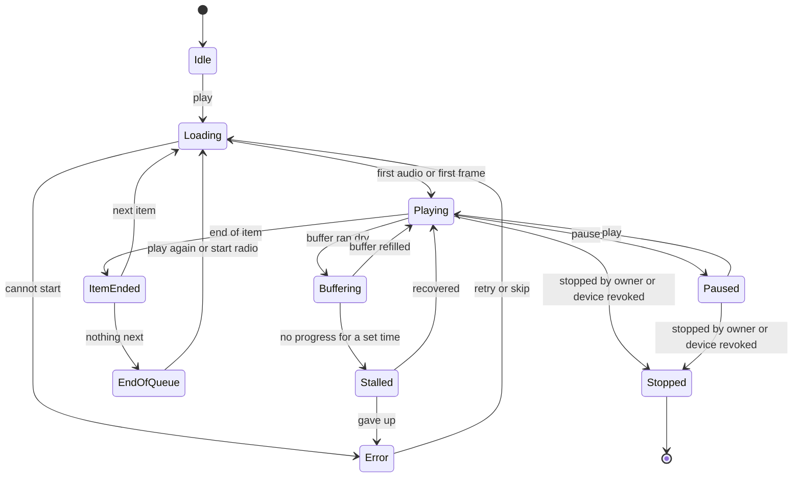

# Player

Status: draft for review, written 2026-10-02.

This document specifies the player, which is the part of Gunmetal people
touch most. For music it covers the persistent now-playing bar, the
full-screen player, the queue, lyrics, the sound path as the listener sees
it, handing playback to another device and controlling it from there, the
mini player, and the lock-screen and system integrations. For video it
covers the on-screen controls, audio and subtitle choices, scrub previews,
skip controls, the next episode and autoplay, playback statistics, casting, and how
the player behaves on a TV, both under the TV's own remote and when a phone
drives it. For every surface it lists the controls, the feature rows each
control serves, the states the surface can be in, and how each control is
reached from a keyboard, a TV remote, a touch screen and the operating
system's media controls.

The feature map in [docs/features](../features/README.md) is the source of
truth. Every control here names its feature rows by ID, and every release
placement comes from those rows; where this document and the feature map
README disagree about a release, the README wins and this document is the
bug. The design choices lean on two research files,
[music-ux.md](../research/music-ux.md) and
[video-playback.md](../research/video-playback.md). Where this document
makes a choice that no feature row settles, it is marked **Proposal**, and
the proposals that need the project owner are collected at the end under
[Open questions](#open-questions-for-the-project-owner).

The security baseline in [docs/security](../security/README.md) sits above
both. Where a feature row or a proposal here would break a security
requirement, this document follows the requirement, names its ID
(SEC-*AREA*-*NNN*), and says what changed. The rules that apply to every
player surface are collected under
[Security rules for every surface](#security-rules-for-every-surface).
Changes that touch one of the owner's open security decisions are marked
"owner to confirm" and listed in the open questions at the end.

Contents:

1. [Releases and platforms](#releases-and-platforms)
2. [What the player commits to](#what-the-player-commits-to)
3. [What we take from the best players, and what we do differently](#what-we-take-from-the-best-players-and-what-we-do-differently)
4. [Foundations shared by every surface](#foundations-shared-by-every-surface)
5. [Music player](#music-player)
6. [Video player](#video-player)
7. [Live TV and radio in the same player](#live-tv-and-radio-in-the-same-player)
8. [States](#states)
9. [Input mappings](#input-mappings)
10. [Accessibility](#accessibility)
11. [What the player needs from the server and the core](#what-the-player-needs-from-the-server-and-the-core)
12. [How the player is tested](#how-the-player-is-tested)
13. [Deliberately not in the player](#deliberately-not-in-the-player)
14. [Open questions for the project owner](#open-questions-for-the-project-owner)

## Releases and platforms

The release values are those of the feature map README: R1, the point
releases R1.1, R1.2 and R1.3, then R2, R3, Later and No. The owner adopted
the smaller R1 and its point releases on 2026-10-02 (D-10 in the
[decision register](../decisions.md#r1-scope)); a row that left R1 for a
point release ships there with every security requirement that protects
it.

| Release | What the player gains | Where it runs |
|---|---|---|
| **R1** (music) | The music player: the bar, the full-screen player, the queue with its Up next and From lanes, lyrics from the files, gapless playback and loudness levelling from tags in the browser, the honest quality badge and unplayable state, a minimal track details view (MUS-236), browser media controls, private listening, and stream-limit notices. Two of a profile's sessions share one queue, and the last Play wins. | The web client only (CLI-001), in a wide three-pane layout (CLI-060) and a phone-width layout (CLI-149), over HTTPS through the owner's own domain, a tailnet, or on the server's own machine; away from home through the owner's reverse proxy or a tailnet, because built-in remote access is R2. |
| **R1.1** (bring your music in) | "Continue on this device"; the sleep timer and fades; the track info sheet with the gain applied; lyrics that stay open and word-by-word lyrics; ratings; save the queue as a playlist, reorder while shuffled, shuffle by album and reshuffle the rest; multi-select and drag to the queue; mono and channel balance; fetch-ahead on a patchy link; the app that opens without the server. | As R1, plus the installable web app (CLI-003). |
| **R1.2** (the household and the admin) | Music share links and the public share page; the admin's live view of sessions and their playback decisions, with each person's choice to show titles; stopping a session with a message; the readable diagnostic report. | As R1.1. |
| **R1.3** (discovery and analysis) | Library radio, the Continue with lane and its reason labels; loudness measured for untagged files. | As R1.1. |
| **R2** (video) | The video player. Native music modules (background audio, lock screen, interruptions, gapless through libmpv). The device picker, handoff, remote control and casting. Offline downloads under device-bound grants. Music on the TV. Lyrics extras, queue undo and history. | Android phones and tablets, Android TV, Google TV and Fire OS, and the web client. |
| **R3** (live) | Live TV inside the video player (channel keys, mini guide, time-shift, record) and internet radio stations inside the music player. | As R2. |
| **Later** | Apple platforms ("R2 if the App Store licence decision allows", feature map README open decision 3), the desktop shell with its mini player, system media panels and global hotkeys, watch and listen together, multi-room, headless players, the visualiser, A-B loop, bookmarks, widgets and voice. | |
| **No** | Listed under [Deliberately not in the player](#deliberately-not-in-the-player). | |

**Desktop shell moved to Later (owner to confirm).** The first draft of
the feature map put the desktop shell in R2. The security baseline's
release-scope table, which is the single source for which surfaces exist
(SEC-TM-074), lists the desktop shell as Later, and the shell's own
controls (bundled content only, context isolation, no Node in the
renderer, validated IPC) are SEC-CLI-069, also Later. Shipping the shell in
R2 would ship it without those controls, so the feature map now places the
shell and its rows in Later too (CLI-014, CLI-063, CLI-064, CLI-065,
MUS-081, MUS-082, MUS-102), and so do this document and the other
interface documents. The mini player window, desktop media panels and
global hotkeys are Later, and until then desktops use the web client and
the installable web app. Bringing them back to R2 needs SEC-CLI-069 and the
desktop player sandbox moved to R2 with them (open question 11).

A feature placed in R1 or one of its point releases reaches the native
apps when they ship in R2, as the feature map README says. This matters
most for the player: the R1 web client must get the layout, the queue rules
and the states right, because every later client inherits them.

## What the player commits to

1. **Controls stay where people left them.** The bar, the scrubber, queue
   access, lyrics access and the device picker keep their positions across
   releases, enforced by tests (MUS-113, CLI-031). Every product in the
   music research broke a habit its users relied on, and Plex's rollback
   vote (504) and Spotify's heart-button idea (5,769 votes) show the cost.
2. **The player says what it is doing and why.** The quality badge, the
   unplayable state, the video statistics overlay and every error card show
   the core decision engine's own reason (MUS-099, MUS-229, VID-168,
   VID-169).
3. **One queue, one set of rules, on every device.** The queue is a
   versioned server object whose rules live in the shared Rust core
   (MUS-116, MUS-122), so the web client, the phone, the TV and a remote
   all behave the same and the rules are mutation-tested once.
4. **Nothing at play time is paid for.** Lyrics, queue editing, the sleep
   timer, playback speed, skip markers, downloads and handoff are in the
   AGPL build. Plex Pass, Emby Premiere and Spotify Premium each gate some
   of these today (music.md and video.md, "Deliberately not doing").
5. **Every control works with a keyboard, a remote and a screen reader**
   from the first release (MUS-227, VID-140, CLI-135, CLI-136, CLI-138).
6. **Its own look.** The player takes cues from the best streaming apps but
   copies no assets, colours, shapes or product names (ADR 2, decision 7).
7. **It keeps the household's secrets.** Media and artwork reach it only
   through short-lived capability URLs that are re-checked on every request
   (SEC-API-026 to SEC-API-029); everything a file, a provider or another
   device says is drawn as text (SEC-API-046); errors tell the person what
   to do without describing how the server is built (SEC-API-072); and
   nothing it shows on a shared screen, a lock screen or an admin's
   session list reveals what someone listened to without their choice
   (SEC-PRV-022, SEC-PRV-025).

## What we take from the best players, and what we do differently

The rivals are good at a great deal. This table records what each does
well according to the research, what Gunmetal adopts, and where it
deliberately departs.

| Product | Where it is genuinely good | What we take | What we do differently |
|---|---|---|---|
| **Spotify** | A stable, quiet persistent bar; the three-pane desktop layout others copy; a "Playing from" label; the same context menu everywhere; since May 2025 it shows Premium users autoplay suggestions before they play. | The bar's fixed position and calm behaviour (MUS-108); three panes (CLI-060); "Playing from" (MUS-123); one menu everywhere (DIS-111); a visible suggestions lane (MUS-129, R1.3). | Queue editing is free, where Spotify gates it behind Premium. The queue can grow to full height with durations and album names, which Spotify's 2024 desktop change removed (MUS-119). Love stays a heart, not the plus that replaced it in 2023 (MUS-109). Nothing is ever mixed into a person's own playlist (MUS-130 is No). No green, no round green play button, no names such as Connect, Jam, Canvas or Daylist. |
| **Apple Music** | Separate Play Next and Play Last verbs; word-by-word lyrics; a landscape player for docked phones (iOS 27); clear lossless badges. | Both verbs (MUS-118); word timing (MUS-156, R1.1); the landscape layout on native phones (MUS-112, R2) and wide web layouts in R1. | "Play next" keeps the order chosen; Apple plays several picks in reverse, a complaint for years (MUS-117). The bar does not float, jump on scroll or scroll its title: NN/g said the iOS 26 title "ticks along like a stock-market ticker". |
| **Plexamp** | The strongest self-hosted player: artwork-led backgrounds, gapless, loudness levelling including on-device analysis, smooth transitions (Sweet Fades; whether they skip fades inside albums is unverified), headless players. | Artwork-led colour, computed at scan and synced so it draws at once (MUS-110); levelling with an Auto mode, which follows Roon (MUS-087); album-aware fades (MUS-092, R2); headless players (CLI-104, Later). | Lyrics, radio, the equaliser and downloads are free; Plex Pass gates them. Gapless and levelling work in a plain browser tab (MUS-067), where Plexamp does this only in its own apps. Handoff needs no plex.tv (CLI-101). Honest gap: Plexamp's sound-based radio is better than our tag-based radio until similarity data exists (MUS-165, R1.3). |
| **Finamp** | A "Next Up" section that shuffle and repeat leave alone; four documented queue verbs; it says when the server is transcoding; a choice of what the player shows. | Lane separation (MUS-116); documented verbs (MUS-118); the truthful badge (MUS-099); a display preference (MUS-115, Later). | Dragging works while shuffled, which Finamp's beta could not do (MUS-120, R1.1). |
| **Tidal's 2026 redesign and YouTube Music's April 2026 redesign** | Lessons, not models. Tidal hid the scrubber behind a tap, removed "Playing from" and shipped a mini player without skip buttons; YouTube Music put the full queue behind a double swipe. | Nothing. | The scrubber is always visible, "Playing from" stays, the bar keeps a skip button, and the queue is one action away, all pinned by the layout contract (MUS-113). |
| **Symfonium and Roon** | Symfonium's per-speaker volume and several saved queues; Roon's signal path and Auto loudness mode. | Remote volume (CLI-102, R2); several queues (MUS-131, R2); the signal path (MUS-103, R2). | Good defaults before settings. Symfonium's users asked for a search box in its settings page, a sign of sprawl. |
| **Infuse** | The reference Apple video player: a real-time information HUD, hold for 2x with haptics, auto-skip, aspect modes, spoiler-free continuous play. | All five (VID-168, VID-132, VID-114, VID-137, VID-128). | Free, and on Android TV and the desktop as well. Honest gap: on Apple TV with a Dolby Vision display, Infuse is ahead until Apple builds and VID-178 exist (Later). |
| **mpv** | A statistics page (`i` shows it, `I` pins it), frame stepping in both directions, on-demand scrub previews through the thumbfast script, pitch-corrected speed in fine steps, subtitle dimming on HDR. | All of them, through libmpv (VID-168, VID-103, VID-098, VID-131, VID-047). | A remote-friendly interface and one input map over the same engine. |
| **The Apple TV app** | Restyling subtitles during playback with a live preview (tvOS 26.4); showing subtitles when muted or after a skip back (tvOS 18); Enhance Dialogue. | VID-092, VID-093, VID-059. | On every client, built from libmpv's filters, with no server work. |
| **Netflix** | A dialogue-only subtitle track beside CC on new originals since April 2025. The research also names Netflix as the reference for skip intro and recap buttons, the countdown during the credits and "still watching?", all (unverified). | VID-114, VID-123, VID-082, VID-125. | The countdown starts at the credits marker rather than a fixed time before the end (VID-123), and autoplay never runs into a title the viewer did not queue. |
| **Emby** | The clearest three-way skip setting (skip, show a button, ignore); a subtitle dialog docked so the subtitles stay visible while you restyle them. | VID-114; the docked style sheet (VID-092). | Free; Emby gates intro skipping behind Premiere. |
| **Plex** | Its older apps and the polish of its skip markers set a high bar, and Plex is good at markers out of the box. | Marker polish as the target for VID-110 to VID-114. | Plex's rebuilt iOS preview shipped without a playback information overlay, scrub thumbnails, 10 and 30 second skips, picture-in-picture, subtitle search, pre-play track choice and a sleep timer, and its new Apple TV app buried the subtitle offset. Each of these is an R2 row here (VID-168, VID-098, VID-101, VID-134, VID-087, VID-053, VID-126, VID-083), and the overlay and pre-play track choice are in the proposed R2 must-ship set (video.md, open decision 14). |
| **Jellyfin** | Free; chapter names on the seek bar and comma and full-stop frame stepping in 12.0; ASS and PGS rendered in the web client. | VID-096, VID-103, VID-069, VID-070. | Subtitles that stay in sync after seek and resume, where drift is Jellyfin's most-reacted open server issue (VID-071); player controls that work with a screen reader, where Jellyfin's web player controls do not (VID-140, MUS-227). |

## Foundations shared by every surface

### One playback model

Every player surface on every client is a view of three things the core
owns:

- **The queue**: a versioned, per-profile server object with three lanes,
  edited by small operations that clients apply optimistically and the
  server orders (MUS-116, MUS-122). It carries named listening contexts from
  its first version (LAT-009), so video (VID-181) and later audiobooks
  (LAT-039) reuse it without a protocol break.
- **The playback decision**: the core's verdict for this item on this
  device, with a structured reason list (MUS-099, VID-002, VID-169,
  ADM-100, INT-134).
- **The player state**: what the player is doing right now.

**Proposal.** The player state is a protocol type in the core, like the
queue, so the bar, the full player, the lock screen and a phone acting as a
remote all derive from one value, and every transition below is a unit
test. The admin session list (ADM-099, R1.2) does not receive that value.
It gets its own admin response type built from it, which carries user,
device, bitrate and playback method, and the title only when that person
has opted in to showing titles and is not in a private session
(SEC-PRV-024, SEC-PRV-025, SEC-API-068). The earlier draft fed the admin
list the same value; that would have put every title in front of
administrators (owner to confirm, owner decision 5).

Two notes on the model. Between gapless tracks the move from ItemEnded to
Loading is never visible, because the next item's opening bytes are already
fetched (MUS-067, MUS-070). Stopped covers the owner stopping a session
with a message (ADM-102, R1.2) and a device being removed or signed out
(ACC-065, ACC-069), which in R1 includes an administrator ending a
person's sessions from Admin > Users (ACC-006, SEC-IAM-044); all of them
cut in-flight responses through the ACC-122 mechanism, so playback
really ends: the next range request fails and open connections close
within 5 seconds (SEC-IAM-043, SEC-API-028).

### One action list

Every action the player offers (play next, love, open lyrics, skip intro,
start radio, set a subtitle track) has one identifier, and that identifier
is what menus, keyboard shortcuts, remote keys, the command palette, the
operating system's media handlers and remote-control commands all call
(DIS-111, CLI-039, CLI-061). Three things follow. The same action has the
same name everywhere. The keyboard help card (VID-105) is generated from the
list rather than written by hand. Remote-control commands are a closed set
with no free-text payloads, which the security baseline requires
(SEC-HIS-014 in
[rival-security-history.md](../security/rival-security-history.md)).

### The layout contract

These positions are part of the contract (MUS-113, CLI-031). Each is pinned
by a visual regression test, and a change ships first as an opt-in preview
for at least one release, with a way back under Settings > Preview features
and before-and-after screenshots in the release notes.

- The now-playing bar's position, and the order of the controls inside it.
- The scrubber, always visible in the full-screen player.
- Queue access, lyrics access and the device control, in the same places in
  the bar and the full player. The device control's place is kept from R1,
  where it is empty; from R1.1 it holds only the "Continue on this device"
  prompt (CLI-103), and the Devices button fills it from R2 (CLI-101).
- The video transport bar and the order of its action row.
- On TV, the left navigation rail (CLI-035) and the player's action row.

### Look and motion

- Dark-first, with light, high-contrast and OLED-black themes that follow
  the system by default (CLI-141, ADR 2 decision 7). Spotify's light-mode
  idea has 7,031 votes, so "dark-first" does not mean dark-only.
- The full-screen music player takes its colours from a palette computed at
  scan time and synced with the library (MUS-110), so it draws at once with
  no image work on the device. Text is drawn over a palette colour only
  when the pair passes the contrast check; otherwise the player falls back
  to a neutral surface. The high-contrast theme drops the artwork wash.
- No scrolling tickers, no bars that move on scroll, and motion defined as
  tokens with a reduced set (MUS-108, CLI-140).

### Security rules for every surface

These rules come from the security baseline and apply to every surface in
this document. Later sections repeat a rule where it changes what a
control does; this subsection is the player's full statement of them.

**Where the player runs.** The web player runs only over HTTPS or on the
server's own machine at `http://localhost`. Over plain HTTP every other
peer gets a redirect to the server's HTTPS address when one exists, or
otherwise a static help page, and never the web client; without a valid
certificate the server does not serve the client at all (SEC-NET-001,
SEC-NET-005, SUR-109 in [surfaces.md](surfaces.md)). There is no reduced
player for an insecure address.

**Stream and artwork URLs.**

- Audio, video, artwork, lyrics files and subtitles come only from
  capability URLs whose path, never the query string, carries a token bound
  to the item, the representation and the playing session (SEC-API-026).
  The web player fetches media this way too, never with its cookie
  (SEC-API-029).
- Lifetimes are those of SEC-API-027: a stream URL lives for the item's
  duration plus 10 minutes and at most 4 hours; an artwork URL lives for
  1 hour, aligned to a time bucket so a scrolling grid reuses it. The
  player refreshes an expired URL by itself and resumes at the same
  position with no visible error, and asks for the URLs of upcoming queue
  items in the background.
- Every request re-checks the session and the item grant, so revoking a
  device, ending a session or withdrawing a library stops playback at the
  next range request (SEC-API-028, SEC-IAM-046).
- A capability URL never leaves the player that asked for it. It is not
  kept by the service worker or Cache Storage (SEC-API-029), not handed to
  the operating system's media controls (see
  [Lock screen and system integrations](#lock-screen-and-system-integrations)),
  not written to a log or a diagnostic report (SEC-IAM-047), and not passed
  to another device during handoff or remote control: the target asks the
  server for its own URLs under its own session.
- Artwork is always a server-made JPEG, PNG or WebP derivative in one of a
  fixed set of sizes (SEC-CLI-005, SEC-MED-046, SEC-MED-047). The player
  never asks for an arbitrary size and never shows a file's own image
  bytes.

**Untrusted text.** Titles, artists, tags, lyrics, chapter names, device
names, playlist names, an administrator's stop message and anything else
that came from a file, a provider, a plugin or another person are drawn as
plain text inside a bidirectional isolate, never as HTML or Markdown
(SEC-API-046, SEC-CLI-001, SEC-MED-057). Device names are the names devices
gave themselves and are never presented as verified. A URL from metadata
becomes a link only if it is `https`, and opens only after a sheet that
shows the destination host, or as a QR code on a TV (SEC-CLI-002,
SEC-STD-015). The [design language](design-language.md) sets out how
these look.

**Errors.** Every error the server returns is a type from a closed
catalogue with a request identifier, and nothing that describes the server
(SEC-API-072, SEC-TM-040). The player maps the type to a sentence and an
action. "Details" shows the type and the request identifier, which the
owner can look up in the server log; it never shows a file path, server
address, version or stack trace. File paths and server addresses appear
only in admin screens, built from admin response types (SEC-API-068).

**Shared screens and lock screens.** A household TV, a family computer and
a phone's lock screen are seen by other people.

- What is playing now may show on that device's lock screen and media
  controls, because the person chose to play it there. When the person
  signs out or is signed out, the player clears its media session with the
  rest of the account's data, so no title lingers in the system's media
  panel (SEC-CLI-009). After playback ends, a last-played card stays only
  where the profile opted in to media resumption (SEC-CLI-061).
- Nothing else shows titles on a lock screen: notifications other than
  active media controls say only that something happened (SEC-CLI-062), and
  push payloads carry an opaque ID (SEC-PRV-056).
- Publishing to system-wide surfaces (Android TV's Play Next row, Top
  Shelf, Spotlight, assistant suggestions, and media resumption after
  playback ends) is off unless the profile opts in. On a TV it is asked
  once at pairing and is on by default only when the TV has a single
  profile; restricted and PIN-protected profiles never publish
  (SEC-CLI-061). A private session donates nothing (SEC-PRV-058).
- On a household device (R2), an adult profile's restored queue,
  "Continue" prompts, history and private playlists stay hidden until a
  PIN or an approval from that adult's phone unlocks the profile for the
  session, while browsing and playing stay one tap (SEC-IAM-110). Until
  then the queue shows only what was queued on that device in that session.
- Another person's players, and what they play, are never shown
  (SEC-PRV-022, SEC-API-068). A household TV that someone else is using
  appears only as "In use".
- On a computer marked as shared at sign-in, the player keeps the queue
  copy, plays waiting to upload and artwork in memory only, writes none of
  them to browser storage, and the session ends after 30 minutes idle
  (SEC-CLI-010, SEC-PRV-019).

**Private listening.** The private session (ACC-117) is at most two
interactions away from the full player on every client, from the bar on
wide layouts, and from the TV player (SEC-PRV-024). While it is on, no
history, recommendation signal or scrobble is recorded, any session view
shown to an administrator omits the title, the bar and the full player
show the private indicator, and nothing is donated to the operating system
(SEC-PRV-024, SEC-PRV-058). It stays on until the person turns it off or
until a period without playback that they choose (6 hours by default, as
the [privacy baseline](../security/privacy-and-data-protection.md) sets
out in its design guidance), so nobody stays private for weeks by
accident.

**Downloads (R2).** Downloaded files live only in the app's private
storage, excluded from cloud backup, device transfer and the system media
index, and never on shared or removable storage (SEC-CLI-033, SEC-CLI-035,
SEC-PRV-057); an encrypted format for removable storage is Later
(SEC-CLI-072). They play offline under a server-signed grant bound to the
device key, 30 days by default (SEC-CLI-036, SEC-IAM-054). Expiry never
stops a track or queue already playing, never deletes files, and reads
"Connect to your server once to keep listening offline", not as an error
(SEC-CLI-036). When the server reports the device revoked, or the person
removes the account from the device, the app deletes the credentials, the
library copy, the artwork cache and every download before it draws any
other screen (SEC-CLI-037). Each profile's downloads sit in that profile's
partition (SEC-CLI-063). The grant is honest policy, not DRM: it does not
stop someone with root access from reading files already on the device.

### Surfaces and where they ship

| Surface | Purpose | R1 to R1.3 | R2 | Main IDs |
|---|---|---|---|---|
| Now-playing bar | Playback visible and controllable on every screen | Web, both layouts | All clients | MUS-108, MUS-109, MUS-099 |
| Full-screen music player | Artwork, scrubber, transport, lyrics and queue access | Web | Native phone and tablet; landscape (desktop shell Later) | MUS-110, MUS-112 |
| Queue panel | See and edit what plays next | Web (full height on wide layouts) | All clients | MUS-116 to MUS-129, CLI-060 |
| Lyrics view | Read along | Web, inside the player | Full-screen lyrics with tap to seek | MUS-154 to MUS-159 |
| Track details | Title, credits, album, file format, and how the track is played and why | Web | Replaced by the track info sheet | MUS-236, MUS-099 |
| Track info sheet | How the file was read and played | Web, from R1.1, extending track details | Signal path added | MUS-114, MUS-090, MUS-103 |
| Device sheet | Move or control playback elsewhere | None; from R1.1 the bar's "Continue on this device" prompt only | Full picker, remote mode, cast | CLI-103, CLI-101, CLI-102, CLI-106 |
| Mini player | Small always-on-top window | None | None; desktop shell, Later (see [Releases](#releases-and-platforms)) | CLI-065 |
| System media controls | Lock screen, notification, media keys | Browser Media Session | Native modules, car, watch; desktop panels Later | CLI-070, CLI-069, CLI-063, CLI-116 |
| TV Now Playing | Music on the big screen with ambient mode | None | Android TV family | CLI-041 |
| Pre-play sheet | Version, tracks, resume and warnings before a film | None | All clients | VID-013, VID-015, VID-024, VID-053 |
| Video player | On-screen controls over the picture | None | All clients | VID-101 to VID-143 |
| Audio and subtitles sheet | Track choice, timing and style | None | All clients | VID-051 to VID-094 |
| Statistics overlay | Codecs, figures and decision reasons | None | All clients | VID-168, VID-169 |
| Post-play screen and countdown card | What happens when an episode ends | None | All clients | VID-122 to VID-128 |

## Music player

### The persistent now-playing bar

The bar sits at the bottom of every screen once the profile has a queue
(MUS-108), and because the queue persists (MUS-122), that is from the first
play onwards. It is the persistent player ADR 2 (decision 7) asks for.

| Element | Wide layout (CLI-060) | Phone-width layout (CLI-149) | Feature IDs |
|---|---|---|---|
| Artwork thumbnail | Left; selecting it opens the full player | Left; tapping anywhere on the bar outside a button opens the full player | MUS-108 |
| Title and artist | Two lines; the title links to the album and the artist to the artist page; truncated with an ellipsis, never scrolling | Two lines, truncated, never scrolling | MUS-108 |
| Love | A heart toggle beside the title | A heart toggle | MUS-109, MUS-180 |
| Transport | Previous, play or pause, next, centred | Play or pause and next, on the right | MUS-108 |
| Shuffle and repeat | Either side of the transport | In the full player only | MUS-126, MUS-077 |
| Position | A draggable scrubber with elapsed and total time | A thin progress line along the bar's top edge; scrubbing happens in the full player | MUS-071 |
| Quality badge | The compact badge: "Original" when the original file plays directly, "Converted" from R2 when it does not; the full sentence on hover or focus | The same compact badge, at the end of the artist line | MUS-099 |
| Lyrics and queue toggles | Right-hand group | In the full player only | MUS-113, MUS-154, MUS-119 |
| Options | Right-hand group, before the device slot; opens the player's options menu with Private session first, so private listening is two interactions from the bar | In the full player only (two interactions from there) | ACC-117, SEC-PRV-024 |
| Device slot | Right-hand group, at the end. R1: empty, its place kept. R1.1: the "Continue on this device" prompt when another of the profile's sessions last played the queue, otherwise empty. R2: the Devices button | A line under the artist, with the same R1, R1.1 and R2 contents | CLI-103 (R1.1), CLI-101 (R2) |
| Volume | A slider in the right-hand group, before the device slot | None; the hardware buttons set system volume (whether a web page may set its own volume on iPhone is unverified) | |
| Indicators | The private session icon beside the title, and from R1.1 the sleep timer icon | The same | ACC-117, MUS-076 (R1.1) |

Behaviour:

- The bar never floats, shrinks, moves on scroll or merges into the
  navigation, the behaviours criticised in Apple Music's iOS 26 bar.
- On phones, swiping the bar left or right goes to the next or previous
  item. The next button is the visible equivalent, as every gesture must
  have one (CLI-142). Swiping up opens the full player.
- On load, the bar shows the restored queue, paused at its saved position,
  and never starts sound by itself. From R1.1, when the queue was last
  played on another device, the device slot offers to continue (CLI-103),
  for example "Continue on this device: Teardrop, 2:13".
- The bar shows music. A video appears in it only while it plays in
  listen-only mode (VID-065). Starting a film pauses the music context
  rather than replacing it (LAT-009); leaving the video player pauses the
  film, saves its resume point (VID-118) and returns the bar to the paused
  music context, one tap from resuming, unless picture-in-picture or
  listen-only is on. The film resumes from its title page, Continue
  Watching or the queue switcher (MUS-131). This is the model in
  [surfaces.md](surfaces.md) (How music and video coexist); the earlier
  draft kept the paused film in the bar, which left the bar unable to show
  the music context it promised to return to.
- **The device slot in R1 and R1.1.** Neither has a control channel, so
  neither can move or control playback elsewhere. Two of a profile's
  sessions (two tabs, or a laptop and a phone) share one queue, and the
  last Play wins: a play or resume is an ordinary operation on the
  versioned queue (MUS-122), and the queue records which of the profile's
  sessions issued it, by an opaque identifier that is not a credential.
  Any other session that sees, on its next sync, that a different session
  started playback pauses at its current point, and pressing Play there
  takes the queue back with the same operation. In R1 the slot stays
  empty; from R1.1 it shows the "Continue on this device" prompt
  (CLI-103), which does the same. Only the profile's own sessions can
  write its queue (SEC-HIS-014), and queue events reach only that
  profile's sessions (SEC-API-016). The prompt names no device. Otherwise
  the slot is empty. It sits at the end of its row, so its contents never
  shift other controls. How quickly a device notices depends on how often
  it syncs (unverified until the sync design exists). From R2 the slot
  holds the Devices button (CLI-101).

### The full-screen player

On a phone the full player covers the screen and opens from the bar. On a
wide layout it is the Now Playing view in the content pane, with lyrics or
the queue beside the artwork, which gives wide web layouts the side-by-side
arrangement that MUS-112 brings to native phones in R2.

Regions, top to bottom, on a phone:

1. **Header.** A collapse control (swiping down does the same), the
   "Playing from" label linking to the album, playlist or radio seed
   (MUS-123), and the options menu.
2. **Artwork**, which can be swiped left or right to skip (MUS-110). When
   lyrics are open they take this region (MUS-154).
3. **Title, artist and love** (MUS-109). The title and artist link to their
   pages.
4. **The scrubber, always visible** (MUS-110, MUS-071), with elapsed time on
   the left and remaining time on the right, and the quality badge under it
   (MUS-099). Selecting the badge opens track details (MUS-236), and from
   R1.1 the full track info sheet (MUS-114).
5. **Transport**: shuffle, previous, play or pause, next, repeat (MUS-126,
   MUS-077).
6. **Bottom row**, in fixed places: the device control on the left (empty
   in R1; from R1.1 only the "Continue on this device" prompt, CLI-103,
   otherwise empty; the Devices button from R2, CLI-101), lyrics in the
   centre (MUS-154), the queue on the right (MUS-119).

The options menu holds, in this order:

| Item | What it does | IDs | Release |
|---|---|---|---|
| Private session | Turns private listening on or off; a persistent indicator shows while it is on; it ends when turned off or after the person's chosen period without playback | ACC-117, MUS-185, SEC-PRV-024 | R1 |
| Sleep timer | In a set number of minutes, at the end of this track, at the end of this album, or at the end of the queue, with a gentle fade | MUS-076, MUS-077 | R1.1 |
| Add to playlist | The add-to-playlist sheet, with a duplicate warning from R1.1 | MUS-133, MUS-134 | R1 (duplicate warning R1.1) |
| Go to album, Go to artist | Navigation | MUS-123 | R1 |
| Start radio | Library radio seeded by this track, labelled as radio | MUS-165, DIS-067 | R1.3 |
| Rate | Star rating, shown only when ratings are switched on (feature map README open decision 12) | MUS-181 | R1.1 |
| Track info | Track details: title, credits, album, file format, and the playback decision with its reason; from R1.1 the full track info sheet | MUS-236, MUS-114 | R1 (full sheet R1.1) |
| Playback settings | Levelling mode, and fades from R1.1 | MUS-087, MUS-072 | R1 (fades R1.1) |
| Equaliser | A quick toggle for the active preset | MUS-094 | R2 |
| Signal path | Every stage that changed the audio | MUS-103 | R2 |

The private session sits first because SEC-PRV-024 requires it within two
interactions of the player on every client, and the privacy baseline
places it in the now-playing overflow menu on web and phone and as the
first item of the player's options on TV, two D-pad presses from playback
([privacy-and-data-protection.md](../security/privacy-and-data-protection.md),
design guidance section 4). The test counts the interactions on the web in
R1 and with a D-pad on TV in R2. On wide layouts the bar's Options button
opens this same menu; the earlier draft had the menu only in the full
player, which made private listening three interactions from the bar.

**R2 additions.** Scrolling down from the player reveals info cards with a
lyrics preview, credits and album details (MUS-111); native phones get the
landscape layout (MUS-112, CLI-054) and a large-text layout for car mounts
(MUS-228). **Later:** the visualiser (MUS-083) and a choice of what the
player shows (MUS-115).

### The queue

The queue panel is a full-height pane on wide layouts (CLI-060, MUS-119), a
sheet on phones (CLI-149), and a rail on the TV (CLI-041). It shows every
upcoming item with its artwork, title, artist, album and duration, and the
time left in the queue as a whole. Nothing in it is paywalled.

It has three lanes, always in this order (MUS-116):

| Lane | What it holds | Notes |
|---|---|---|
| **Up next** | The person's own picks | Shuffle and repeat-all never reorder it. Its header has "Clear". |
| **From** *source name* | The album, playlist, artist or radio being played, from the current item onwards | The header links to the source. Shuffle applies only here (MUS-128). |
| **Continue with** | Suggestions from library radio, each with a short reason label | From R1.3, with library radio (MUS-165); the lane is part of the queue object from R1 (MUS-116), but until R1.3 the panel ends with the From lane and has no switch. Off by default (MUS-129, DIS-070). When off, the panel ends with a switch reading "Continue with suggestions when the queue ends". When on, the suggestions are listed before they play, labelled (DIS-062), and never written into a playlist. |

The queue verbs and their exact effects (MUS-117, MUS-118):

| Verb | Effect |
|---|---|
| **Play** | Replaces the From lane with the item's context (its album, playlist or artist list) and starts at that item. Up next is kept. **Proposal:** picks survive a new Play, because losing hand-picked tracks to a tap elsewhere is the failure the lane exists to prevent; "Clear" on the Up next header removes them. |
| **Play next** | Inserts the item into Up next at the insertion cursor. Three "play next" picks play in the order they were chosen. The cursor sits after the last "play next" added since the current item started, and resets to the top of Up next when the current item changes. |
| **Add to queue** | Appends to the end of Up next. |
| **Play last** | Appends after the From lane, at the very end before Continue with. |
| **Start radio** | From R1.3. Replaces the From lane with library radio from the seed; the lane header and the "Playing from" label say "Radio from *seed*" (MUS-165). |
| **Shuffle play** | Play with shuffle on. |

Editing (MUS-119, MUS-120, CLI-062, DIS-110):

- Rows reorder by dragging a handle, or with the keyboard through "Move up"
  and "Move down" in the row menu, so dragging is never the only way.
  From R1.1, dragging works with shuffle on, because shuffle is stored as
  an explicit order and a drag is an ordinary move (MUS-120); in R1, rows
  reorder only while shuffle is off.
- Moving an item between Up next and From changes which lane it belongs
  to; the item keeps its own "Playing from" source, shown on the row when
  it differs from the lane's source (MUS-123).
- Rows are removed by a remove button that appears on hover or focus (and
  is always shown on touch screens), or from the row menu. From R1.1,
  multi-select removes several at once (DIS-110). Swiping a row to remove
  it arrives in R2 with swipe actions on rows (MUS-065).
- From R1.1, on wide layouts, dragging tracks from any list onto the queue
  shows two drop zones, "Play next" and "Play last", and dropping between
  rows inserts at that point (CLI-062).
- Queue undo is R2 (MUS-121). Until then, removing one row acts at once
  with no prompt, and the actions that remove many items at once ("Clear
  Up next", "Clear queue" and, from R1.1, removing a multi-selection) ask
  first and say how many items will go, because nothing can bring them
  back. From R2 all of them
  act at once and offer Undo, which replaces the confirmation, as the
  [design language](design-language.md) (section 11, rule 6) sets out.
- Items the device cannot play are dimmed, with the reason on the row
  (MUS-229).

Shuffle (MUS-126, MUS-127, MUS-128):

- The shuffle button toggles shuffle in the chosen mode. Its menu, opened
  by a long press or from the queue menu, chooses between "Spread out"
  (the same artist or album never bunches, and recent plays come later),
  "Random" and, from R1.1, "By album" (random albums, each played in
  order, MUS-127).
  **Proposal:** "Spread out" is the default, as the Spotify engineering
  post found true randomness feels patterned to people.
- The shuffled order is seeded in the core, so it is the same on every
  device, and it is shown in the queue before it plays.
- From R1.1, "Reshuffle the rest" re-seeds only the From lane (MUS-128).
- Turning shuffle off returns the From lane to its source order from the
  current item onwards.

The queue menu holds the shuffle modes, "Clear Up next" and "Clear
queue" from R1. "Save as playlist" (MUS-125), "Reshuffle the rest" and
"Sleep timer" (MUS-076, the same action as in the options menu, because the
feature row names both menus) join them in R1.1, and the Continue with
switch in R1.3.

The end of the queue is a visible marker. When Continue with is off and
repeat is off, playback stops there; see [States](#states).

**R2 additions.** Undo (MUS-121); queue history above the current item
(MUS-124); several saved queues with a queue switcher (MUS-131).
**Later:** a context switcher so a book never hijacks the music queue
(LAT-039), and a Guest DJ that writes only to Continue with (MUS-174).

### Lyrics

Lyrics open in the full player's artwork region on phones and beside the
artwork on wide layouts (MUS-154). From R1.1 the lyrics view stays open
from track to track, and a setting opens the player on lyrics (MUS-158).
Lyrics come from the file: embedded tags (MUS-154), `.lrc` sidecars
(MUS-155) and, from R1.1, Enhanced LRC word timings (MUS-156), parsed at
scan and carried in the synced
library, so they are free and instant. The core parses them into its
timed-line model within the limits of SEC-MED-049 and SEC-API-090, so the
client never receives the original file, and the view draws every line as
plain text: plain lyrics keep their line breaks through pre-wrapped text
and synced lines are text spans, never inserted markup (SEC-API-046,
SEC-CLI-001).

| Lyrics state | What the view shows | IDs |
|---|---|---|
| None in the file | The lyrics control stays in its place but is shown as unavailable, with the text "This file has no lyrics." It is not removed, because the layout contract pins it. In R2, if the owner has enabled the lyrics lookup plugin, a "Find lyrics on *provider*" action appears here. It names the provider, runs only when pressed, and its result is parsed like file lyrics; opening the lyrics view never contacts a provider by itself (SEC-PRV-015). | MUS-113, MUS-162 (R2), SEC-PRV-015 |
| Plain, unsynced | Scrollable text with no highlight and no automatic scrolling. | MUS-154 |
| Line-synced | The current line is highlighted and kept about a third of the way down the view. Scrolling by hand pauses automatic scrolling, and a "Back to current line" button returns to it. | MUS-155 |
| Word-synced | From R1.1: as line-synced, with the current word highlighted. | MUS-156 |
| Malformed file | The core returns a typed error. The view falls back to whatever is readable, or to "None", and the problem appears in the owner's library health report instead of failing silently. | MUS-155 |

The view says where the words came from ("From the file's tags", "From
an .lrc file"; in R2, "From LRCLIB, through a plugin"), so a person can tell
their own lyrics from a lookup.

**R2 additions.** Full-screen lyrics with tap to seek (MUS-159);
multi-voice TTML lyrics (MUS-157); lyrics guaranteed offline with downloads
(MUS-160, CLI-098); search by lyric (MUS-161); the lookup plugin, off by
default (MUS-162). **Later:** translation and pronunciation through a
plugin (MUS-163).

### Sound: gapless, levelling and the quality badge

Most of the audio path is invisible when it works. The player's job is to
make it checkable.

- **Gapless** in the browser (MUS-067) rests on trim values read at scan
  (MUS-069) and the light audio packager (MUS-230), whose per-browser
  support is unverified. The listener sees nothing; track details say
  whether a track joins the next without a gap (MUS-236), and from R1.1
  the track info sheet shows "Gapless: yes" and the trim applied. Native apps get
  libmpv's gapless path in R2 (MUS-068).
- **The next item is fetched early** (MUS-070), and from R1.1 further ahead
  on a patchy link (CLI-099), so a slow link does not stall between
  tracks. The scrubber shows the buffered range.
- **Fades** on pause, skip and resume avoid pops, from R1.1 (MUS-072).
- **Levelling** uses ReplayGain and R128 tags (MUS-084, MUS-085), a fixed
  fallback for unmeasured tracks (MUS-089) and, from R1.3, scan-time
  measurement where the decoder ADR allows it (MUS-086). Auto mode
  applies album gain to consecutive tracks from one album in the From lane
  and track gain to everything else (MUS-087). The music map recommends
  Auto as the default
  (music.md, open decision 2). Positive gain never exceeds a track's
  true-peak headroom (MUS-088).
- **Where the gain came from** is shown in track details in R1 (tags, or
  "estimated" for the fallback; MUS-236), and **the gain applied** in the
  track info sheet from R1.1: its source (tag, measured, or "estimated")
  and the decibels applied (MUS-090).
- **Mono and channel balance** are in Settings > Accessibility, through Web
  Audio in R1.1 (CLI-151).
- **Damaged files** flagged at scan are skipped with a notice, and the
  player keeps a true-peak ceiling so a corrupt file cannot blast noise
  (MUS-079).

The quality badge (MUS-099) says exactly what the decision engine decided:

| Situation | Badge text (examples) | Release |
|---|---|---|
| The original, played as it is | "Original FLAC, 24-bit, 96 kHz, played directly" (compact: "Original") | R1 |
| The browser cannot decode the file | "Can't play in this browser: ALAC" | R1 |
| Converted for mobile data or a cap | "Opus 160 kbps, converted for mobile data" (compact: "Converted") | R2 (MUS-106, ACC-107) |
| Bit-perfect output | A separate "Bit-perfect" mark, shown only when no stage changed the samples; levelling or the equaliser removes it | R2 (MUS-101, MUS-103) |

### Device handoff and remote control

**R1 and R1.1: one queue, and continue on this device.** The queue and
its position are in every device's synced copy (MUS-122), so opening
Gunmetal on another browser shows the queue paused at the saved position,
and pressing Play starts this device from there. From R1.1 the bar also
offers to continue where the person left off (CLI-103). The last Play
wins, as the bar section describes, so the first device pauses on its next
sync instead of fighting over the position.

**R2: the device sheet** (CLI-101, MUS-197). The Devices button in the bar
and the full player opens one sheet:

| Section | Contents | IDs |
|---|---|---|
| This device | Its name, and on native clients (and the desktop shell, Later) the output picker (speakers, headphones, a DAC), kept per device | CLI-067, MUS-200 |
| Your Gunmetal players | Every player signed in to this profile, with what it is playing, its volume and whether it is reachable; unreachable ones are greyed with "last seen" | CLI-101, CLI-102 |
| Cast | Chromecast and Google TV receivers on the network | CLI-106, MUS-203 |
| In use | Household devices this profile may use that another profile is using now, greyed, not selectable, and labelled only "In use": no profile name, no title. Other people's own players never appear; controlling another person's player needs their grant and is Later | ACC-047, SEC-PRV-022, SEC-API-068 |

The earlier draft listed every player signed in as someone else. That
would tell one member which devices another member owns and when they are
playing, which is Activity data the baseline keeps between the person and
the server (SEC-PRV-022), and other users' devices may appear only in admin
response types (SEC-API-068). The server's session events are filtered per
recipient (SEC-API-016), so the sheet can show only what this profile may
see.

Choosing a player moves playback there: the lanes, the position, the
shuffle order and the repeat mode go with it (MUS-122, MUS-077), the target
fetches the original file itself, and this device stops. The handoff
carries item IDs and the position, never a stream URL or a token: the
target asks the server for its own capability URLs under its own session
(SEC-API-026). Only one device plays a profile's queue at a time, so there
is never a question of which queue a command applies to.

While another device is playing, this device is in **remote mode**:

- The bar and the full player keep their layout (the layout contract
  applies) but carry a strip in the accent colour reading "Playing on
  Living room TV".
- Every control acts on the target. The volume control sets the target's
  volume (CLI-102). Whether it sets the player's own gain or the device's
  system volume depends on what the target reports (unverified per
  platform).
- The scrubber shows the target's reported position and moves smoothly
  between reports. If reports stop, it freezes and reads "Waiting for
  Living room TV".
- If contact is lost, the bar reads "Lost contact with Living room TV" and
  offers "Try again" and "Play here", which takes over from the last known
  position.

A handoff in progress shows "Moving to Living room TV" in the bar. If the
target does not accept within a set time, the bar reads "Living room TV did
not respond" and playback continues here. The rules for two devices editing
one queue, and for a device that was offline, are the music map's merge
rules (MUS-122, CLI-094), which must be written and tested before the
device sheet promises seamless handoff (music.md, "Dependencies and
risks").

**Later:** headless and dedicated players appear in the same sheet
(CLI-104, MUS-199); multi-room grouping (CLI-105, MUS-201); AirPlay
(CLI-109); Sonos and UPnP renderers (CLI-113, MUS-205).

### Mini player

On phones and narrow web layouts the bar is the mini player. On the desktop
shell (Later, see [Releases](#releases-and-platforms)), the mini player is a
second, always-on-top window over the same queue state (CLI-065, MUS-082),
in two sizes:

- **Compact:** artwork, title and artist, previous, play or pause, next,
  love, and a thin progress line.
- **Expanded:** adds the scrubber, the quality badge and the next three
  items of the queue.

Closing it returns to the main window. It responds to the same keys as the
main window while it has focus. For video, the equivalent is the system's
picture-in-picture window (VID-134).

### Lock screen and system integrations

| Integration | Release | Behaviour | IDs |
|---|---|---|---|
| Browser media controls | R1 | The Media Session API supplies title, artist, album and artwork, and handles play, pause, stop, previous track, next track, seek to, seek backward and seek forward. Position comes from the audio clock and is pushed on every play, pause, seek, rate change and queue edit, so the lock screen does not drift as Navidrome's does. iPhone background limits are stated plainly in the installed web app (R1.1, CLI-003). The player runs only over HTTPS or on loopback (SEC-NET-001), so there is no plain-HTTP case; the earlier draft allowed for one. On sign-out or revocation the metadata is cleared with the rest of the account's data (SEC-CLI-009). | CLI-070, MUS-073, CLI-150, SEC-NET-001 |
| Background audio and lock screen on phones | R2 | The native module's notification and lock-screen controls: previous, play or pause, next, and love as a custom action. Bluetooth displays get title and artist. When playback stops the notification goes; the system's media resumption card, which keeps the last item after playback ends, is published only if the profile opted in (SEC-CLI-061). | CLI-069, MUS-074, SEC-CLI-061 |
| Interruptions | R2 | A call pauses and resumes after; a navigation prompt lowers the music; unplugging headphones pauses; resume fades in, reusing the fades that ship on the web in R1.1 (MUS-072). | CLI-071, MUS-075 |
| Desktop media panels | Later | MPRIS on Linux, Windows media controls and macOS Now Playing, answering only while Gunmetal is the active player. Gunmetal never launches itself on a play key or a headphone connection unless the person asks for that. Later with the desktop shell (SEC-TM-074, SEC-CLI-069). | CLI-063, MUS-081, CLI-068 |
| Global hotkeys | Later | Optional system-wide shortcuts mapped to the same action list. Later with the desktop shell. | CLI-064 |
| Watch | R2 | Pause and skip through the system's own now-playing app. | CLI-127 |
| Android Auto | R2 | The platform draws media apps from a browse tree, not the app's own screens. The car's now-playing screen shows shuffle, repeat and the queue. The browse tree is returned only to callers on an allow-list verified by package signature (system UI, Android Auto, named wearables); any other app gets an empty root (SEC-CLI-055). | CLI-116, CLI-122, MUS-219, SEC-CLI-055 |
| TV launcher rows | R2 | Continue items on Android TV's Play Next row, filled from the local log, only when the profile opted in: asked once at TV pairing, on by default only for a single-profile TV, never for restricted or PIN-protected profiles, and never for plays in a private session (SEC-CLI-061, SEC-PRV-058). The earlier draft filled the row for everyone. | CLI-049, SEC-CLI-061 |
| Widgets, voice, NFC, CarPlay, AirPlay | Later | | CLI-073, CLI-074, CLI-075, CLI-117, CLI-109 |

Privacy rules that apply to all of these:

- Lock-screen controls show the current track, because the person chose to
  play it. A private session donates nothing to OS history features: no
  Siri or Spotlight suggestions, no Play Next row, no recents lists
  (SEC-PRV-058 in
  [privacy-and-data-protection.md](../security/privacy-and-data-protection.md)).
- Notifications other than active media controls show no titles on the
  lock screen (SEC-CLI-062 in
  [client-and-device-security.md](../security/client-and-device-security.md)).
- Publishing to every other system-wide surface follows the opt-in rule
  under [Shared screens and lock screens](#security-rules-for-every-surface)
  (SEC-CLI-061).
- The artwork handed to the operating system comes from the bytes the
  player already holds, as a local object URL, never as a capability URL,
  so no signed URL lands in an OS cache or history (ACC-123, SEC-API-029,
  SEC-IAM-047). On a shared computer those bytes are in memory only
  (SEC-CLI-010). Whether every browser accepts local object URLs for Media
  Session artwork is unverified; where one does not, that browser's media
  controls show no artwork rather than a capability URL.

### Listening through a share link

From R1.2, a music share link lets someone without an account listen to
one track, album or playlist (ACC-086 to ACC-089, MUS-151, SEC-API-097).
The owner placed music share links in R1.2 when adopting the smaller R1
(D-10 in the [decision register](../decisions.md#r1-scope)); SEC-API-097
and SEC-STD-008 move with them and are mandatory for R1.2. The page that
holds a link is the public share page, SUR-059 in
[surfaces.md](surfaces.md), which ships with them. The player there is the
bar and a track list, with these differences:

- It shows what the link covers and nothing else of the server: no
  sharer's name, no other people, no library size (SEC-PRV-031). There is
  no queue sync, history, love, device slot or options menu, because the
  listener has no account.
- Media and artwork come through capability URLs bound to the share
  instead of a session, and the share is re-checked on every request, so
  revoking it stops playback at the next range request (SEC-API-028).
  Download appears only when the owner allows downloads server-wide
  (SEC-API-097).
- A link with a password asks for it in a field that allows paste and
  password managers (SEC-CLI-028). Wrong guesses meet growing delays and
  never disable the link (SEC-API-056).
- "Too many people are listening through this link right now. Try again
  in a few minutes." when the link's concurrent-stream limit is reached,
  and "This link no longer works." when it has expired, been revoked or
  been suspended for spreading widely; the sharer is told about a
  suspension, the listener is not told which case applies (SEC-API-097,
  SEC-API-057).

### Music on a TV

Music on the big screen is R2, on the Android TV family (CLI-041, MUS-223,
DIS-167). The TV joins the same queue as every other device, so it can take
over playback or be driven from a phone.

- **Layout.** Artwork on the left; title, artist, album, the scrubber and
  the transport row on the right; a rail of the next five or so queue items
  below. Lyrics replace the rail when opened.
- **How it is reached.** TV Now Playing is the fixed first entry of the
  TV rail, present whether or not anything is playing, so no other rail
  entry moves when playback starts or stops (CLI-035, the layout contract).
  With nothing queued it shows the empty-queue state with recently played
  items to start from.
- **Focus.** Focus starts on play or pause. Left and right move along the
  transport row, down moves to the queue rail, and Back closes the topmost
  sheet, otherwise returns to the screen and card the person came from
  (the rail's Now Playing entry when it was opened from the rail), with
  playback continuing (DIS-112, CLI-036).
- **Ambient mode.** After a period with no input, the screen dims to the
  artwork, the title and a thin progress line. The content drifts slowly to
  protect OLED panels, as the library screensaver does (CLI-042). Any key
  wakes it. Only the dedicated play or pause key also acts, pausing or
  playing with the brief symbol, because that key controls playback on
  every screen (CLI-045); every other key only wakes the screen.
- **A household TV.** Until an adult's profile is unlocked for the session,
  the queue rail shows only what was queued on the TV in that session, and
  no "Continue" prompt or recent item appears (SEC-IAM-110). Ambient mode
  shows only what is playing in the room.
- **Remote keys** are in [TV remote](#tv-remote).

## Video player

Everything in this section is R2 unless a row says otherwise. Several
mechanisms arrive earlier with music and are reused here: the user log,
signed stream URLs, settings sync, the sleep timer, the persistent queue
and the decision reason type (video.md, "Dependencies").

### Starting playback and the pre-play sheet

**Proposal.** The Play button on a title page plays at once, using the
remembered version, tracks and resume rule. The pre-play sheet opens from a
second "Options" button, or by itself only when the viewer has to decide
something: the link is too slow for the file, or the remembered version no
longer exists. One press to play is what people expect from a streaming
app.

The pre-play sheet holds:

| Section | Contents | IDs |
|---|---|---|
| Version | Each version with resolution, codec, HDR format, audio and size, and a "Plays directly here" badge computed on the device from the synced stream index | VID-013, VID-014, VID-015 |
| Audio and subtitles | The same choices as the in-player sheet, available offline | VID-053, VID-054 |
| Resume | "Resume from 42:10" or "Start over", with the small rewind on resume | VID-118, VID-119, VID-120 |
| Connection | When the measured link cannot carry this file: play the original with a bigger buffer, play another version, convert the audio only, or download for later; the choice is remembered per device | VID-024 |
| Private viewing | The private session switch, applied to this title | VID-130, ACC-117 |
| Smaller copy | "Make a smaller copy" when the owner allows it | VID-026 |

### On-screen controls

The controls are real views laid over the libmpv surface, so they carry
roles, labels and states for screen readers (VID-140). They have three
layers.

| Layer | Contents | IDs |
|---|---|---|
| **Top bar** | Back; the title (for episodes, "S2 E5" and the episode title); on the right, the device and cast control and the statistics toggle | VID-144, CLI-106, VID-168 |
| **Transport bar** | The seek bar with chapter ticks and chapter names in the preview bubble; elapsed time on the left; on the right, remaining time or "Ends at 22:41" (selecting it switches between them, and the clock accounts for speed); a speed chip such as "1.5x" whenever speed is not 1x | VID-096, VID-098, VID-106, VID-133 |
| **Action row** | Audio and subtitles, Quality, Speed, Chapters, Queue, More, always in this order | VID-053, VID-025, VID-131, VID-095, VID-181 |

The Queue action opens the shared queue panel, with the same lanes as
music: Up next (the viewer's own picks), then From *season or
collection*, and no Continue with lane. The feature map calls this surface
"Player > Up next" (VID-181); on screen it is labelled "Queue", as the
music queue is, so the words "Up next" name only the lane of a person's own
picks everywhere in the interface.

**More** holds, in order: Private session (first, as on music), Sleep timer
(VID-126, shared with music), Listen only (VID-065), Picture-in-picture
(VID-134), Zoom and aspect (VID-137), Audio quick settings (VID-059 to
VID-061), "Marker is wrong" for people with that right (VID-116), and
Playback information (VID-168).

Platform variations:

- **Touch (phones and tablets).** A tap shows the controls with large
  back, play or pause and forward buttons in the centre, each labelled with
  its interval ("10"), as Plex's iOS preview was criticised for dropping
  (VID-101). Gestures are listed under [Touch](#touch).
- **Web and desktop.** Moving the pointer shows the controls. The action
  row also appears as icon buttons with text labels on hover and focus.
- **TV.** The controls appear on any key and focus lands on play or pause;
  see [TV remote](#tv-remote).

Auto-hide rules:

- During playback the controls hide after a few seconds without input (the
  delay to be set in testing).
- They never hide while paused, while a sheet is open, while focus is on
  the seek bar, or while a screen reader or switch access is running.
- Hiding never moves focus to a place the viewer cannot see; when the
  controls return, focus is where it was, or on play or pause.

### Audio and subtitles

One sheet holds both, as two columns on wide screens and TVs and two tabs
on phones. Like Emby's dialog, the sheet docks to one side so the picture
and the subtitles stay visible while the viewer changes them (VID-092).

**Audio column.**

- Tracks grouped by language, each labelled from the track name and flags
  read at scan: "English, 5.1, E-AC3 with Atmos", "English, Director's
  commentary", "English, Audio description" (VID-054, VID-055). Plex's
  request to show track names in every app has 417 votes.
- A converted track is marked "Converted for this device" (VID-004).
- External audio files beside the video appear as ordinary tracks
  (VID-063).
- "Use for this series" remembers the choice for the whole show, as a user
  log event (VID-052).
- Switching track is instant on direct play and continues from the current
  position on the remux path (VID-064).

**Subtitles column.**

- "Off", then tracks grouped by language with labels for Forced, SDH and
  Dialogue only (VID-079, VID-081, VID-082), the format shown quietly
  (ASS, PGS), and sidecar files alongside embedded tracks (VID-072,
  VID-073).
- A secondary subtitle, for language learners (VID-074).
- **Timing.** Earlier and later buttons whose step grows with repeated
  presses, so a three-second error takes a few presses (VID-083); "Save for
  this file" and "Save for this series" (VID-084); "Sync to embedded track"
  when the file has a correctly timed text track to align against
  (VID-085).
- **Style.** Size, font, colour, background, outline and position, starting
  from the operating system's caption settings, with the picture as the
  live preview (VID-091, VID-092, CLI-143). Subtitles on HDR content are
  dimmer by default (VID-047). Placement in the picture or the black bars
  (VID-094). The fonts offered are the bundled, pinned subtitle font set.
  Fonts embedded in a file reach the player only for a library whose owner
  opted in, and then only after the server's parse worker has parsed and
  rewritten them (SEC-MED-054; owner to confirm, owner decision 12).
- "Add file", for people with the upload right (VID-075), and "Search",
  which runs the subtitle plugin after a grant prompt that says plainly a
  third party will learn what is being watched (VID-087, VID-088). Search
  runs only when pressed and names the provider (SEC-PRV-015). Uploaded and
  found subtitles are parsed by the core and re-served as WebVTT under a
  server-chosen name (SEC-API-089), and the web player draws them only
  through the browser's text-track pipeline or a renderer in a worker,
  never as page text (SEC-CLI-053).
- When a new subtitle arrives mid-film (for example from Bazarr), a notice
  reads "New subtitle available" and the track appears in the list without
  a restart (VID-076, INT-122).

**Audio quick settings**, reached from More and from the audio column:
dialogue lift and night mode (VID-059), volume boost (VID-060), and audio
delay with growing steps (VID-061). The delay control says where it is
saved, "Saved for this TV's audio output", because a soundbar's lag belongs
to the soundbar (VID-062). The video map's recommendation for where
settings live is followed throughout: subtitle style, languages, skip
policy and speed per person; quality and Dolby Vision preference per
device; audio delay, passthrough and core-only audio per audio output
(video.md, open decision 9).

Settings > Subtitles also offers "Show subtitles when muted or after a skip
back" (VID-093) and a "Prefer SDH" default (VID-082, CLI-144).

### Scrubbing, chapters and previews

- **Seeking** feels like direct play on every path, because the segment map
  gives exact keyframe boundaries (VID-008), and subtitles stay in sync
  after a seek or resume (VID-071).
- **Preview bubble.** While scrubbing, a bubble above the seek bar shows
  the time, the chapter name (VID-096) and, where the device can decode a
  second stream fast enough, a picture (VID-098). The picture is one
  keyframe cut by the server's remuxer and decoded on the device, with
  nothing generated in advance or stored. It arrives through a capability
  URL for that item and session, like the stream (SEC-API-026), and
  reaches the decoder the same way the stream does (SEC-CLI-047). The
  client limits how often it asks while scrubbing, and the server limits
  it as an expensive operation (SEC-NET-053). On devices that fail the decoder probe, the bubble
  shows time and chapter only; pre-generated previews for those devices
  are Later (VID-099), and blurred spoiler-safe previews are Later
  (VID-100). The feature row warns that R2 TV clients may therefore ship
  without pictures in the bubble.
- **Chapters panel.** A list of chapters with names and thumbnails from the
  same single-keyframe path (VID-095, VID-097). Selecting one jumps there.
- **Frame stepping** while paused, in both directions (VID-103).

### Skip controls

Skip markers cover intros, recaps, previews, credits and, in R3,
commercials (VID-110, VID-117). They come from chapter titles at no cost
(VID-111) and from season-wide intro detection (VID-112); credits detection
from the picture is Later (VID-113).

- **The skip button** reads "Skip intro", "Skip recap", "Skip preview" or
  "Skip credits". It appears above the right end of the seek bar for the
  length of the segment. When the other controls are hidden, it appears
  alone and takes focus on TV, so OK presses it. Back dismisses it.
- **Policy per segment type** (VID-114), in Settings > Playback > Skipping:
  "Skip automatically", "Show a button" or "Do nothing". **Proposal:**
  "Show a button" is the default for every type.
- **"Ask before skipping."** When a type is set to skip automatically, a
  short prompt reads "Skipping intro" with a "Watch it" button that has
  focus; pressing it cancels the skip. Nobody offers this today, and
  Jellyfin's request for it has 30 votes (VID-114).
- **Fixing a marker.** "Marker is wrong" in More lets people with the right
  move it; the edit is a user log event, so it survives a rebuild
  (VID-116).

### Next episode, autoplay and the post-play screen

- **The countdown card** appears when the credits marker begins, or a set
  time before the end when there is no marker (VID-123). It shows the next
  episode's artwork and title, unless spoiler-free play is on (VID-128),
  with "Play now" focused and "Keep watching" beside it. "Keep watching"
  matters for mid-credits and post-credits scenes, which Gunmetal cannot
  detect until VID-113 (Later).
- The next file's first segments are fetched during the credits, so there
  is no spinner between episodes (VID-124).
- A gap in the season is flagged before autoplay jumps it ("Episode 5 is
  missing") (VID-127).
- **"Are you still watching?"** pauses and asks after a set number of
  episodes or a set time without input (VID-125).
- Reaching the credits marker counts as finished (VID-122).
- **The post-play screen** appears when autoplay is off or cancelled: next
  episode, replay, and back to the show. At the end of a series it offers
  replay and back to the show only. Autoplay never runs into a title the
  viewer did not queue. Moving on to the next film in a collection is Later
  (VID-129).

### Quality and remote links

- First-party clients start with the original and never silently drop to a
  low default (VID-023). Plex's request for exactly this default has 1,289
  votes.
- **The quality sheet** lists only real options, starting with the
  original and its true figures ("Original, 4K HEVC HDR10, 58 Mbps peak"),
  then other versions, then transcode tiers when the owner allows them
  (VID-025, VID-010). There is no "Auto" until an adaptive ladder exists
  (VID-027, Later).
- When a per-person cap applies, a notice says so and the sheet shows what
  the cap picked; a cap never quietly starts a transcode (VID-028,
  ACC-108).
- A slow link is handled by the choice in the pre-play sheet (VID-024),
  and by the stall state described under [States](#states).

### Playback statistics

The statistics overlay (VID-168) is a panel in a corner of the picture,
toggled from the top bar, from More, or with a key. It ships on every
client in the first video release rather than later, the gap Plex's
rebuilt apps and Jellyfin's Android TV app both show.

| Section | Contents |
|---|---|
| Delivery | The decision and its reason as one sentence, for example "Remuxing because this browser cannot open MKV; picture and sound untouched" (VID-169) |
| Video | Codec, profile, resolution, frame rate, HDR format and any fallback, decoder, hardware or software decoding |
| Audio | Codec, channels, sample rate, passthrough or decoded, any conversion |
| Subtitles | Format and renderer |
| Network | Current bitrate against the file's peak, buffer ahead in seconds, connection path (home network, remote direct or remote through a relay) |
| Display | Output mode, refresh rate, dropped frames |

Everyone sees codecs, figures and reasons. File paths, server addresses and
other people's sessions are shown only to admins, following the video map's
recommendation (video.md, open decision 11), which the baseline now
requires: they exist only in admin response types (SEC-API-068). Even an
admin sees other people's sessions without titles unless each person opted
in (SEC-PRV-025). A "Copy report" action builds the playback diagnostic
bundle on the device, shows it in full for review, and saves it as a file
the person chooses to send (VID-174, CLI-033). The report never contains a
capability URL, token or signature (SEC-IAM-047), and it replaces titles,
file paths, user names and addresses with per-report pseudonyms, the rule
SEC-PRV-046 sets for the server's own diagnostic bundles. The owner's view
of the same session is ADM-100.

For music, the equivalent is the track info sheet (MUS-114, R1.1): file
path (admins only, by the same rule), format, size, tags as read, gain
applied, gapless trim and the identity used, from the same inspect API as
the owner's file inspector (ADM-125, R1.2). Tags as read are shown as
plain text in bidirectional isolates, exactly as stored, so a hostile tag
is visible as text rather than acted on (SEC-MED-057).

### Picture-in-picture, background audio and listen-only

- **Picture-in-picture** uses the system window, on Android first (VID-134,
  CLI-056). Leaving the player on a phone with PiP on keeps the film
  playing in the window.
- **Background audio** for video is a per-person choice: the sound carries
  on with the screen off, with lock-screen controls from the music module
  (VID-135, CLI-072).
- **Listen only** hands the session to the music player's bar and lock
  screen; when remote, the server sends only the audio track (VID-065).
- **Leaving the video player** on every client pauses the film and saves
  its resume point (VID-118), unless picture-in-picture or listen-only is
  on. The bar returns to the paused music context, one tap from resuming
  it, and never holds the paused film; the film resumes from its title
  page, Continue Watching or the queue switcher (MUS-131). The earlier
  proposal kept the paused film in the bar on web and desktop, which
  [surfaces.md](surfaces.md) contradicted.

### Casting

Casting is R2 from Android and the web (CLI-106). Cast receivers appear in
the device sheet's Cast section, and while casting the player is in remote
mode with the same controls. Subtitles go to the receiver as a side track
(CLI-108). When the receiver cannot decode a file, the player remuxes or,
as a last resort, transcodes, and the cast information says why (CLI-111).
Cast controls appear in the notification (CLI-112). Away from home, the
phone relays for the receiver (CLI-110).

The receiver gets capability URLs scoped to the one item being cast and to
the cast session the sender started, and nothing else: no session token,
account token, device token or refresh credential (SEC-NET-064). The
sender mints them and refreshes them before they expire, under the stream
lifetimes of SEC-API-027, which stay inside SEC-NET-064's bound of the
item's duration plus at most an hour; only the representations a receiver
needs may be read cross-origin (SEC-API-098). Ending the sender's session
or revoking its device ends the cast session, which stops the cast at the
next range request (SEC-API-028). A credential that lets a receiver
refresh on its own is a cast credential, which the baseline places Later
(SEC-TM-074, SEC-CLI-071). The earlier draft cited only SEC-CLI-071, a
Later requirement, for this R2 surface, and described the URLs differently
from [flows.md](flows.md) (F08).

### Remote control and handoff on a TV

Two kinds of remote control meet on a TV: the TV's own remote, covered
under [TV remote](#tv-remote), and a phone or laptop driving the TV.

- **Handing a film to the TV** (VID-144). The phone's device sheet lists
  the TV. Choosing it sends the position, the chosen audio and subtitle
  tracks, the subtitle offset and the speed; the TV fetches the original
  itself, so nothing is re-encoded, and the phone becomes the remote.
- **The accept prompt.** The TV shows "Play *title* from Sam's phone?"
  with Accept focused. **Proposal:** the prompt is on by default, and a
  per-TV setting, "Let my devices start playback here without asking",
  removes it for the person's own devices. A film starting by surprise in a
  shared room is worse than one extra press.
- **The phone as remote** (VID-145, CLI-102). The phone's player shows the
  TV's state and drives play, pause, seek, tracks, subtitles, speed, skip
  and volume. Control needs the same profile or an explicit grant, checked
  for every command; controlling another person's session is Later
  (ACC-047, SEC-HIS-014). A command arriving from another device shows a
  small, non-blocking chip on the TV, "Controlled from Sam's phone", for a
  few seconds. The phone's name is the name it gave itself, drawn as text
  (SEC-API-046).
- **Conflicts.** Commands from the TV's remote and from the phone are
  applied in the order the server receives them, and both screens show the
  result. Neither device locks the other out.
- **A TV in use by another profile** appears greyed in the device sheet as
  "In use", with no profile name or title, and only if it is a household
  device this profile may use (CLI-050, ACC-047, SEC-PRV-022).

## Live TV and radio in the same player

In R3 the video player gains what live TV needs, rather than a separate
player:

- Channel up, channel down, last channel and number entry (LIV-081,
  CLI-132), and a mini guide over the picture (LIV-082).
- A timeline over the rolling buffer with pause and skip back (LIV-095),
  "Start over" (LIV-097) and "Go to live" (LIV-098).
- A record button that keeps the part already watched (LIV-088), and a
  sheet of choices when every tuner is busy (LIV-087).
- Captions and broadcast subtitles in the same subtitles column (LIV-083),
  and alternate audio in the audio column (LIV-084).
- Statistics with the tuner, the source and continuity errors (LIV-086).
- The shared sleep timer (LIV-092) and picture-in-picture (LIV-089).
- Skip buttons over commercial markers in recordings (VID-117).

Internet radio stations from an M3U play in the music player with the
normal bar (MUS-177, R3). A station has no scrubber position, so the bar
shows a "Live" label where the progress would be, and the layout does not
otherwise change.

## States

Every state below is a fixture in the component tests (see
[How the player is tested](#how-the-player-is-tested)). The copy is an
example of the tone: say what happened, why, and what the person can do.

| State | Trigger | Music presentation | Video presentation | IDs | Release |
|---|---|---|---|---|---|
| **No queue yet** | A new profile that has never played anything | No bar; home's empty states guide the person | Not applicable | DIS-004 | R1 |
| **Restored** | The app opens with a saved queue | The bar shows the item paused at its saved position, and from R1.1 "Continue on this device" when another session last played it; on a household TV, only once the adult's profile is unlocked for the session | The resume prompt on the title, under the same household rule | MUS-122, CLI-103, VID-118, SEC-IAM-110 | R1 (music; the prompt R1.1), R2 (video) |
| **Loading** | Play pressed | The bar and player switch to the new item at once from the synced library; a progress ring on the play button appears only if sound has not started after a short delay | The title and backdrop show at once; a progress indicator appears only after a short delay | VID-012 | R1, R2 |
| **Buffering** | The buffer ran dry mid-play | The play button shows a progress ring; the scrubber shows the buffered range | A spinner over the frame after a short delay, with "Buffering" for screen readers | MUS-070, CLI-099 | R1; R1.1 (fetch ahead, CLI-099); R2 |
| **Slow link** | Buffering keeps recurring, or the measured link is below the file's peak | "Your connection is slower than this file" with "Keep trying"; in R2, the Opus option where allowed | "This connection is slower than this film", with the VID-024 choices | VID-024, MUS-106 | R1, R2 |
| **Cannot play here** | The decision engine knows before play that this device cannot decode the item | The row is dimmed with the reason, "Can't play in this browser: ALAC"; the queue skips it with one grouped notice, "Skipped 2 tracks this browser can't play (ALAC)" | The pre-play sheet shows the reason and the alternatives (another version, a download, a conversion if allowed) | MUS-229, VID-010, VID-015 | R1, R2 |
| **Damaged file** | The health report flagged the file at scan | Skipped with a notice; admins also get a link to Library health | As music | MUS-079, LIB-193 | R1 |
| **Playback error** | An unexpected failure during play | A notice with the reason sentence, "Try again", "Skip" and "Details"; Details shows only the error type and the request identifier, never a path, address, version or stack trace | An error card with the reason, "Try again", "Back", and "Copy report" | VID-169, VID-174, CLI-033, SEC-API-072, SEC-TM-040 | R1; R1.2 (readable diagnostics, CLI-033); R2 |
| **Stream URL expired** | A long pause outlived the short-lived URL | Nothing visible: the player gets a fresh URL when play is pressed and resumes at the same position | As music; long films refresh during play | ACC-122, VID-011, SEC-API-027 | R1, R2 |
| **Server unreachable** | The server or network went away | A quiet banner; the current item plays out what is buffered; plays are kept and uploaded on reconnect (in memory only on a computer marked as shared); from R1.1, later items are dimmed and the app also opens while the server is down | The same banner; the film stops when its buffer runs out, with "Try again" | CLI-093, SEC-PRV-019, CLI-025 and CLI-026 (R1.1) | R1 (music; dimming and opening without the server R1.1), R2 (video) |
| **Offline with downloads** | No server, native app with downloads | The same screens with a "Downloaded" filter; the queue plays downloaded items and dims the rest as "Not downloaded" | Downloaded films keep markers, chapters, subtitles and previews | MUS-209, CLI-026, VID-175, SEC-CLI-035 | R2 |
| **Offline grant expired** | The device has not reached the server for the grant period (30 days by default) | The track or queue already playing finishes; the next play shows "Connect to your server once to keep listening offline" in neutral colours, not as an error; nothing is deleted | As music | SEC-CLI-036, SEC-IAM-054 | R2 |
| **End of item** | A video item reached its end | Not applicable (music moves on gaplessly) | The countdown card or the post-play screen | VID-122, VID-123 | R2 |
| **End of queue** | Nothing left, Continue with off, repeat off | Playback stops; the bar shows the last item at its end, and Play restarts the From lane from its first item; from R1.3 the queue's end marker offers "Start radio from what you just played" and the Continue with switch | The post-play screen with replay and back to the show | MUS-129, DIS-070 | R1 (radio and the switch R1.3), R2 |
| **Sleep timer ended** | The timer ran out | The music fades and pauses; the bar reads "Sleep timer ended"; the position is kept | As music | MUS-076, VID-126 | R1.1, R2 |
| **Private session on** | The person switched it on | A persistent indicator in the bar and player | The same indicator in the top bar | ACC-117, SEC-PRV-024 | R1, R2 |
| **Playing elsewhere** | Another of the profile's sessions started playback | R1: this device pauses at its current point on its next sync, and Play takes the queue back (last Play wins); from R1.1 the device slot also offers "Continue on this device"; R2: remote mode | Remote mode | MUS-122, CLI-103, CLI-101 | R1 (the prompt R1.1), R2 |
| **Handoff in progress** | A device was chosen in the device sheet | "Moving to Living room TV"; on timeout, "Living room TV did not respond" and play continues here | As music | CLI-101, VID-144 | R2 |
| **Lost contact** | The controlled device stopped reporting | "Lost contact with Living room TV", with "Try again" and "Play here" | As music | CLI-102 | R2 |
| **Stopped by the owner** | The owner stopped the session | Playback stops; a card shows "The server owner stopped this session" and the owner's message as plain text, normalised and length-capped like any other untrusted string | As music | ADM-102, SEC-API-046, SEC-API-048 | R1.2 |
| **Signed out** | The device was removed, the session was ended (including by an administrator from Admin > Users, SEC-IAM-044), or a credential changed | Playback ends at the next range request. The client first deletes the account's data and clears the media session, then shows the sign-in screen with one sentence, "This device was signed out", and no titles | As music; native apps also delete downloads before drawing any screen | ACC-065, ACC-069, SEC-IAM-043, SEC-CLI-009, SEC-CLI-037 | R1 (web), R2 (native) |
| **Not allowed** | A policy refuses the stream: a concurrent stream limit (per guest, per share link from R1.2, or server-wide), or in R2 a playback-mode right | "Too many streams are playing on this server right now" or "Your account can play on N devices at once", with what to do; never a silent failure | A card with the reason and the alternatives the policy allows | SEC-TM-068, SEC-API-031, VID-010, VID-173 | R1 (stream limits), R2 |
| **Transcoding unavailable** | The sandbox self-test failed | Not applicable | Items that need a transcode say so before play; the owner sees a banner saying what would turn it on, and there is no way to run the transcoder unconfined | VID-009, SEC-MED-024 | R2 |
| **Update needed** | The server's protocol moved past this native client | A notice saying which update is needed; what still works keeps working. The web client never meets this state, because a tab always reloads to the server's own build | As music | CLI-032 | R2 |

**Stream limits are R1.** The earlier draft made "Not allowed" R2 only,
following VID-173. The baseline requires per-user and global stream limits
from R1, answered with a typed "too many" error (SEC-TM-068, SEC-API-031),
and share links carry their own limit from R1.2 (SEC-API-097), so the
music player must explain the refusal in R1. The default values are the
owner's (owner decision 25, device and stream limits). The next item's
opening bytes, fetched early for gapless playback, belong to the same
playback and must not count as a second stream, or gapless playback would
hit the limit.

## Input mappings

### Keyboard

**Release.** Full keyboard operation of every control is R1 (CLI-138,
MUS-227). Shortcuts and the command palette are R2 (CLI-061, MUS-080,
VID-105). An open question below proposes bringing a handful of player
shortcuts into R1.

**Standard keys, R1.** These follow the usual patterns for each kind of
control and need no learning:

| Key | Effect |
|---|---|
| Tab and Shift+Tab | Move focus between controls, with a clearly visible focus ring |
| Enter or Space | Activate the focused button, link or menu item |
| Arrow keys on a focused scrubber or volume slider | Step back or forward (the scrubber steps by the skip interval) |
| Page Up and Page Down on a focused slider | A larger step |
| Home and End on a focused slider | The start or the end |
| Arrow keys in a list or menu | Move within it; the queue's "Move up" and "Move down" are in each row's menu |
| Escape | Close the topmost sheet or menu; then leave the full-screen music player; it never stops playback |
| Hardware media keys | Play, pause, next and previous through the browser's media session (CLI-070) |

**Shortcuts anywhere in the web client, R2, and the desktop shell, Later.**
They work on any screen when focus is not in a text field. Space is ignored when focus is
on a control that Space already activates.

| Key | Action | IDs |
|---|---|---|
| Space | Play or pause | MUS-108, CLI-061 |
| Shift+Right, Shift+Left | Forward or back by the skip interval | MUS-071, VID-101 |
| Shift+N, Shift+P | Next item, previous item | MUS-108 |
| Shift+Up, Shift+Down | Volume up, volume down | |
| M | Mute or unmute | |
| Shift+L | Love the current item | MUS-109 |
| Shift+Q | Open or close the queue | MUS-119 |
| Shift+Y | Open or close lyrics | MUS-158 |
| / | Go to search | DIS-083 |
| Ctrl+K or Cmd+K | Command palette | CLI-061 |
| ? | Keyboard help card | VID-105 |

**Inside the video player, R2.** The film fills the page and there are no
lists to navigate, so plain keys act on playback.

| Key | Action | IDs |
|---|---|---|
| Space or K | Play or pause | VID-105 |
| Left, Right | Back or forward by the short skip interval; holding repeats | VID-101 |
| J, L | Back or forward by the long skip interval | VID-101 |
| Up, Down | Volume | |
| Comma, full stop | One frame back or forward, while paused | VID-103 |
| [ and ] | Slower or faster by one step; = returns to 1x | VID-131 |
| C | Subtitles on or off (back to the last track used) | VID-079 |
| T | Open the audio and subtitles sheet | VID-053 |
| Z, X | Subtitles earlier or later, with steps that grow on repeated presses | VID-083 |
| Shift+Z, Shift+X | Audio earlier or later | VID-061 |
| S | Press the visible skip button, or "Watch it" while an automatic skip is pending | VID-114 |
| I | Statistics overlay | VID-168 |
| F | Full screen on or off | |
| M | Mute or unmute | |
| Shift+N, Shift+P | Next or previous item | VID-181 |
| Escape | Close the topmost sheet; then leave full screen; it never stops playback | |
| ? | Keyboard help card | VID-105 |

Rules for every shortcut:

- Every single-key and Shift+letter shortcut can be turned off or remapped
  in Settings > Accessibility > Keyboard, as WCAG 2.2 success criterion
  2.1.4 requires for character-key shortcuts, so speech-input and
  screen-reader users are not ambushed by stray keystrokes.
- The previous action restarts the current item when more than a few
  seconds have played, and otherwise goes to the previous item.
  **Proposal:** a threshold of about three seconds, to be tested.
- Next skips even when repeat-one is on.
- The final bindings are checked against each supported browser's and
  operating system's reserved keys (CLI-002 is the test matrix); which keys
  each browser lets a page capture is unverified, so bindings may move
  before R2.

### TV remote

**Release.** R2, on Android TV, Google TV and Fire OS (CLI-045, VID-105).
Apple TV and the Siri Remote are Later. Remotes differ: every remote has a
D-pad, OK and Back, while play or pause, rewind, fast-forward, next and
previous keys exist only on some (CLI-045). Every action reachable by a
dedicated key is also reachable with the D-pad and OK.

The design rule is that **one press never changes playback without showing
what happened**.

| Key | Video, controls hidden | Video, controls shown | Music Now Playing |
|---|---|---|---|
| OK | Show the controls with focus on play or pause; playback does not change (**Proposal**) | Activate the focused control | Activate the focused control (focus starts on play or pause) |
| Play or pause key | Play or pause, with a brief play or pause symbol | Play or pause | Play or pause |
| Left, Right | Show the transport and go back or forward by the short skip interval; holding scrubs continuously with accelerating steps and preview pictures where the device supports them | Move focus | Move focus along the transport row; on the focused scrubber, seek |
| Up, Down | Show the controls | Move between the top bar, the seek bar and the action row | Move between the transport row, the queue rail and lyrics |
| Back | Leave the player; the film pauses and its position is saved | Close the topmost sheet, otherwise hide the controls | Close the topmost sheet, otherwise return to the screen and card the person came from, with playback continuing |
| Rewind or fast-forward, tapped | Back or forward by the short skip interval | The same | Back or forward by the music skip interval |
| Rewind, held | Scrub back continuously | The same | Scrub back continuously |
| Fast-forward, held | Play at 2x while held, then return to normal speed (VID-132) | The same | Scrub forward continuously |
| Next or previous key | Next or previous chapter; a long press goes to the next or previous item (**Proposal**) | The same | Next or previous track |
| Long press on OK | The options sheet, with Private session first | The options sheet | The options sheet |
| Menu or settings key, where present | The options sheet | The options sheet | The options sheet |
| Captions key, where present (unverified which remotes have one) | Subtitles on or off | The same | Not used |
| Channel keys and number keys | Live TV only, R3 (LIV-081, CLI-132) | | Not used |

Rules on TV:

- **The skip button** takes focus when it appears over hidden controls, so
  OK skips; Left and Right still seek, and Back dismisses the button.
- **The countdown card** takes focus on "Play now"; Back cancels autoplay
  and stays on the post-play screen.
- **The accept prompt** for a handoff takes focus on Accept and declines
  itself after a set time.
- **Focus memory.** Leaving the player and coming back lands on the same
  title, row and tile (CLI-036, DIS-112).
- **Game controllers** map A to OK, B to Back, the D-pad and left stick to
  the D-pad, and the shoulder buttons to rewind and fast-forward
  (**Proposal**, CLI-045).
- **Frame-rate and dynamic-range matching** switch the display without
  breaking audio passthrough, and the switch itself shows nothing beyond
  the TV's own blank moment (VID-045, CLI-046).

### Touch

Every gesture has a visible button that does the same thing (CLI-142).
Choosing which gesture does what is Later (CLI-153).

| Gesture | Where | Action | IDs | Release |
|---|---|---|---|---|
| Tap the bar | Music, phone | Open the full player | MUS-108 | R1 |
| Swipe up on the bar | Music, phone | Open the full player | MUS-108 | R1 |
| Swipe the bar left or right | Music, phone | Next or previous item | MUS-108 | R1 |
| Swipe the artwork left or right | Full music player | Next or previous item | MUS-110 | R1 |
| Swipe down | Full music player | Collapse to the bar | MUS-110 | R1 |
| Long press on a row | Lists and queue | The item menu | DIS-111 | R1 |
| Swipe a queue row | Queue | Remove it | MUS-065 | R2 |
| Drag a row's handle | Queue, playlists | Reorder | MUS-119, MUS-120 | R1 (while shuffled, R1.1) |
| Tap | Video | Show or hide the controls | VID-102 | R2 |
| Double tap on the left or right third | Video | Back or forward by the skip interval; further taps add to it | VID-102 | R2 |
| Horizontal swipe | Video | Scrub | VID-102 | R2 |
| Press and hold | Video | 2x while held | VID-132 | R2 |
| Pinch | Video | Zoom and fill | VID-137 | R2 |
| Vertical swipe on the left or right side | Video | Brightness or volume | VID-138 | R2 |

**Proposal.** Brightness and volume swipes start a little inside the screen
edge, so the system's back gesture on Android still works.

### Operating-system media controls

| System action | Music | Video |
|---|---|---|
| Play, pause, stop | Play, pause, stop | Play, pause, stop |
| Next track, previous track | Next item, previous item (with the restart rule) | Next item, previous item in the queue |
| Seek forward, seek backward | By the skip interval | By the skip interval |
| Seek to | The chosen position | The chosen position |
| Love (custom action, Android notification) | Love the current item | Not offered |

On a TV remote, next and previous mean chapters, but on a lock screen or a
headset they mean items, because that is what the system's own buttons
mean everywhere else.

## Accessibility

The player is where the rivals fall short: Jellyfin has open issues about
inaccessible player controls dating from 2019 and 2023 (VID-140), Plexamp was
reported unusable with VoiceOver in 2025 (MUS-227), and Plex's new Apple TV
app regressed hover text in September 2026. Accessibility checks gate CI
like tests (CLI-136), and the clients map recommends WCAG 2.2 AA for the
web build (clients.md, open decision 9).

- **Names, roles and states.** The play button's label switches between
  "Play" and "Pause". Shuffle, repeat, love, lyrics and the private session
  are toggle buttons that report whether they are on, and repeat reports
  its mode ("Repeat: all"). The love button names its item ("Love
  Teardrop").
- **The scrubber** is a slider whose spoken value is in words ("2 minutes
  13 seconds of 4 minutes 5 seconds"). Its value updates continuously
  without being announced every second.
- **Announcements.** A change of track is announced once, politely ("Now
  playing Teardrop by Massive Attack"), and can be switched off. Notices
  such as "Skipped 2 tracks" are announced politely; errors are announced
  assertively.
- **Lyrics** are a readable text region. The synced highlight is not
  announced line by line.
- **Video controls** are real views over the libmpv surface, which has no
  accessibility tree of its own (VID-140, CLI-135). They never auto-hide
  while a screen reader or switch access is running, and on TV focus and
  screen-reader order come from one model and are tested together
  (CLI-137).
- **Targets and gestures.** WCAG 2.2 AA asks for targets of at least 24 by
  24 CSS pixels; **Proposal:** primary player controls on touch screens are
  at least 44 pixels. No action can only be reached by a gesture (CLI-142,
  VID-141).
- **Reduced motion** (CLI-140, VID-141). The artwork colour changes
  instantly instead of fading between tracks, synced lyrics jump instead of
  scrolling smoothly, and swipe animations are shortened. Nothing in the
  player scrolls by itself.
- **Text size** (CLI-139, CLI-043). The bar grows taller rather than
  truncating titles to nothing, and at the largest sizes it wraps onto two
  rows. Layouts are tested at the largest system sizes.
- **Contrast and themes** (CLI-141). Text over artwork colours is checked,
  with a neutral fallback; the high-contrast theme removes the artwork
  wash.
- **Hearing.** Mono and balance (CLI-151, R1.1). Subtitles follow the system
  caption settings with no size cap (CLI-143), SDH and audio description
  can be preferred automatically (CLI-144), and dialogue lift is one menu
  away (VID-059), all R2.

## What the player needs from the server and the core

This is the player's view of the backend work that follows this document.
Each item names the feature row that owns it.

| The player needs | Provided by | Release |
|---|---|---|
| A versioned queue with three lanes, named contexts, an insertion cursor, a seeded shuffle order, repeat and stop-after modes, and an operation endpoint with server-ordered versions | MUS-116, MUS-117, MUS-122, MUS-126, MUS-077, LAT-009 | R1 |
| Play and resume as ordinary queue operations that record which of the profile's sessions issued them, by an opaque identifier that is not a credential, so the last Play wins and other sessions pause on their next sync; no separate active-device record and no device name | MUS-122, CLI-103, SEC-HIS-014, SEC-API-016 | R1 |
| The playback decision with a structured reason list, before play and per session | MUS-099, MUS-229, VID-002, VID-169, ADM-100, INT-134 | R1 (music; the per-session view for admins and the API, ADM-100 and INT-134, R1.2), R2 (video) |
| Per-file codec, container, trim, gain, true peak and seek index in the synced library | MUS-021, MUS-069, MUS-071, MUS-084, MUS-088 | R1 |
| An album palette in the synced library | MUS-110 | R1 |
| Lyrics (plain, line and word timed) in the synced library | MUS-154, MUS-155, MUS-156 | R1 (word timing R1.1) |
| Capability URLs for streams, artwork, lyrics files and subtitles, with the token in the path, bound to the item, the representation and the session, lifetimes from SEC-API-027, silent refresh, re-checks on every request, and cut-off of in-flight responses on revocation | ACC-122, VID-011, SEC-API-026 to SEC-API-029, SEC-IAM-043, SEC-IAM-046 | R1 (music), R2 (video) |
| A typed "too many streams" error, with per-user, per-share and global limits, that counts a queue's early fetch of the next item as the same playback | SEC-TM-068, SEC-API-031, SEC-API-097 | R1 (per-share limits R1.2, with share links) |
| Errors as problem types from a closed catalogue with a request identifier, which the client maps to sentences | SEC-API-072, SEC-TM-040 | R1 |
| A private-session flag that keeps plays out of history, recommendations and plugins, and titles out of admin views | ACC-117, SEC-PRV-024, SEC-PRV-025 | R1 |
| An admin session-list response type, separate from the player state, with no title unless the person opted in | ADM-099, SEC-PRV-025, SEC-API-068 | R1 (the person's sessions under Admin > Users, SEC-IAM-044), R1.2 (the live view, ADM-099) |
| Stop a session with a message, delivered to the client | ADM-102 | R1.2 |
| Play events with real timestamps, queued offline and merged | CLI-093 | R1 |
| Library radio with reason labels for the Continue with lane | DIS-067, DIS-062, MUS-165 | R1.3 |
| A session registry and a control channel with a closed command set, including volume, whose events are filtered per recipient so no one sees another person's players | CLI-101, CLI-102, SEC-HIS-014, SEC-API-016, SEC-PRV-022 | R2 |
| Offline grants signed by the server and bound to the device key, with silent renewal and withdrawal at the next contact after revocation | SEC-CLI-036, SEC-IAM-054 | R2 |
| A single-keyframe endpoint for previews and chapter thumbnails, behind a capability URL and the expensive-operation limits | VID-097, VID-098, SEC-API-026, SEC-NET-053 | R2 |
| Chapters, track names and flags and cue counts in the stream index; font attachments only for libraries that opted in, after the parse worker rewrites them (owner to confirm, owner decision 12) | VID-054, VID-081, VID-095, VID-069, SEC-MED-054 | R2 |
| Skip segments as log events, and a skip policy in synced settings | VID-110, VID-114, VID-116 | R2 |
| An item-changed event to live sessions | VID-076, INT-122 | R2 |
| Settings split by person, device and audio output | ACC-012, CLI-030, VID-142 | R1 (per person, ACC-012), R1.1 (per device, CLI-030), R2 (video settings) |

## How the player is tested

The project's engineering rules are test first, full coverage and no
surviving mutants (README, "Engineering standards"). The player divides cleanly along that line.

- **Rules in the core, mutation-tested once.** The queue verbs and the
  insertion cursor, lane membership on a move, the seeded shuffle modes,
  Auto levelling's choice of album or track gain, repeat and stop-after,
  the sleep timer's end-of-album boundary, the previous-restarts rule, the
  skip policy and its cancel window, when the countdown starts, and the
  player state transitions in the diagram above.
- **Every state in the States table is a component test fixture**, on the
  web build from R1 (each state from the release that ships it) and on
  each native client in R2.
- **The layout contract is visual regression tests** over the bar, the full
  player, the queue panel, the video transport and the TV action row
  (MUS-113, CLI-031).
- **Focus maps on TV.** Tests drive the D-pad through the player and its
  sheets and assert where focus lands, including the skip button, the
  countdown card and the accept prompt (CLI-036).
- **Media Session and system panels.** Tests assert that the state the
  operating system receives matches the player after every play, pause,
  seek and queue edit (CLI-070, CLI-063).
- **Gapless joins** are checked with sample-accurate fixtures for each
  format and browser in the support list (MUS-067, CLI-002).
- **Accessibility** runs axe checks on the web build, accessibility
  snapshots on native, and a written VoiceOver and TalkBack script before
  each release (CLI-136).
- **Security tests carry their requirement IDs** (SEC-STD-004):
  - the hostile-metadata fixture library (every tag, lyric and name holds
    script and bidirectional-text payloads) is played through every player
    surface, asserting the literal text appears and nothing runs
    (SEC-CLI-001, SEC-API-046, SEC-MED-057);
  - every player state is visited in Chromium, Firefox and WebKit with the
    production policy, failing on any content security policy violation
    (SEC-API-044);
  - an injected clock pauses past a stream URL's expiry and resumes with no
    visible error (SEC-API-027);
  - revoking the session mid-track stops playback at the next range
    request and the client wipes before showing anything (SEC-IAM-043,
    SEC-CLI-009);
  - a network and storage capture asserts that no capability URL reaches
    Cache Storage, the Media Session, the diagnostic report or a log
    (SEC-API-029, SEC-IAM-047);
  - the private session is reached in two interactions from the full
    player and the wide bar, and records nothing (SEC-PRV-024);
  - on the TV build, unlocked and locked household profiles, OS-surface
    publication and the "In use" device entry show exactly the expected
    strings (SEC-IAM-110, SEC-CLI-061, SEC-PRV-022).

## Deliberately not in the player

These are the feature map's **No** rows that touch the player, with the
reason given there, plus two design refusals.

- **Beat-matched DJ transitions** (MUS-093): hard to do well, not table
  stakes, and album-aware fades cover what most listeners want.
- **Karaoke vocal reduction** (MUS-164): it needs source-separation models,
  against the low-hardware goal.
- **Suggestions mixed into a person's own playlists** (MUS-130): a playlist
  changes only when its owner changes it.
- **A friends' listening feed** (MUS-191).
- **Full Blu-ray and DVD menus** (VID-021), **composing the Dolby Vision
  profile 7 enhancement layer** (VID-042), **clipping and sharing scenes**
  (VID-109) and **"who is on screen"** (VID-167).
- **Video in the car** (CLI-126).
- **Burning subtitles into the picture for first-party clients.** Our
  players render every format; burn-in exists only for adapter clients
  (VID-077, Later).
- **A low default quality.** The default is the original, never a silent
  720p.
- **Paid tiers for any player feature.**
- **Security refusals:** no player on a plain-HTTP address other than
  loopback (SEC-NET-001); no "play anyway" past a server whose identity
  cannot be confirmed (SEC-CLI-043); no capability URL handed to the
  operating system, a log or a report (SEC-IAM-047); no titles in
  notifications on a lock screen other than active media controls
  (SEC-CLI-062); and no view of what another person is playing
  (SEC-PRV-022).
- **Design refusals:** no scrolling titles anywhere, and no player redesign
  that ships without an opt-in preview and a way back.

## Open questions for the project owner

1. **A few player shortcuts in R1.** The R1 cut moved shortcuts and the
   palette (CLI-061) to R2, but a web music player without Space for play
   and pause will feel broken to keyboard users. *Recommendation:* ship
   Space, Shift+Left and Shift+Right, Shift+N and Shift+P, and M in R1 as
   part of MUS-227's keyboard promise, with the off switch WCAG requires;
   keep the palette and the rest in R2. Until the owner decides, no
   shortcut ships in R1, including "/" for search, which stays in R2 with
   DIS-090 and CLI-061; [surfaces.md](surfaces.md) (SUR-032) now says the
   same.
2. **One player per queue in R1.** *Decided in the interface review (see
   [README](README.md), decision 9; owner to confirm).* The last Play wins:
   play and resume are ordinary operations on the versioned MUS-122 queue,
   which records the issuing session, and any other session pauses on its
   next sync and, from R1.1, offers "Continue on this device" (CLI-103).
   The earlier recommendation of a separate active-device field and a
   "Playing on *device*" slot is withdrawn, because the queue versions
   already carry what is needed and the prompt needs no device name.
3. **Do new plays keep the person's picks?** *Recommendation:* yes; Play
   replaces only the From lane, and "Clear" on Up next is one press away.
4. **OK on a TV remote with the controls hidden.** *Recommendation:* show
   the controls without pausing, so no press changes playback invisibly;
   confirm in a hallway test with people who use other TV apps.
5. **Next and previous keys during video.** *Recommendation:* chapters on a
   TV remote, with a long press for the next item; items on lock screens
   and headsets.
6. **The accept prompt for handoff to a TV.** *Recommendation:* on by
   default, with a per-TV setting to let the person's own devices skip it.
7. **Default skip policy.** *Recommendation:* "Show a button" for every
   segment type, with automatic skipping and "ask before skipping" as
   opt-ins.
8. **Default shuffle mode.** *Recommendation:* "Spread out" by default,
   with "Random" and "By album" one menu away.
9. **What non-admins see in the statistics overlay and track info sheet.**
   *Recommendation:* adopt video.md's open decision 11: codecs, figures and
   reasons for everyone; file paths, server addresses and other people's
   sessions for admins only. Apply the same rule to the music track info
   sheet. The baseline now settles the paths and addresses part
   (SEC-API-068), and admins see other people's sessions without titles
   unless each person opted in (SEC-PRV-025).
10. **Leaving the video player.** *Decided in the interface review (see
    [README](README.md), decision 1; owner to confirm).* On every client,
    leaving the video player pauses the film and saves its resume point
    unless picture-in-picture or listen-only is on; the bar returns to the
    paused music context and never holds the paused film. The earlier
    recommendation to keep the film in the bar is withdrawn.
11. **The desktop shell's release (owner to confirm).** The first draft of
    the feature map put it in R2; the security release-scope table
    (SEC-TM-074) and SEC-CLI-069 put it Later, and the feature map now
    follows them. *Recommendation:* keep it Later, so the mini player,
    desktop media panels and global hotkeys are Later; if the owner wants
    them in R2, move SEC-CLI-069 and the desktop player sandbox to R2 with
    them and pick the shell technology (client open decision 12) first.
12. **Embedded subtitle fonts (owner to confirm, owner decision 12).**
    *Recommendation:* the baseline's: off by default, with a per-library
    opt-in that has the parse worker rewrite each font (SEC-MED-054);
    otherwise the player uses its bundled, pinned font set.
13. **Admin session list and titles (owner to confirm, owner decision 5).**
    *Recommendation:* the admin list gets its own response type with no
    title unless the person opted in, and never in a private session
    (SEC-PRV-025), rather than the player state itself.
14. **No plain-HTTP player (owner to confirm, owner decision 2).**
    *Recommendation:* the web player runs only over HTTPS or on loopback
    (SEC-NET-001), which removes CLI-150's idea of a reduced player on an
    insecure address; the server's static help page explains how to reach
    the secure address instead.
